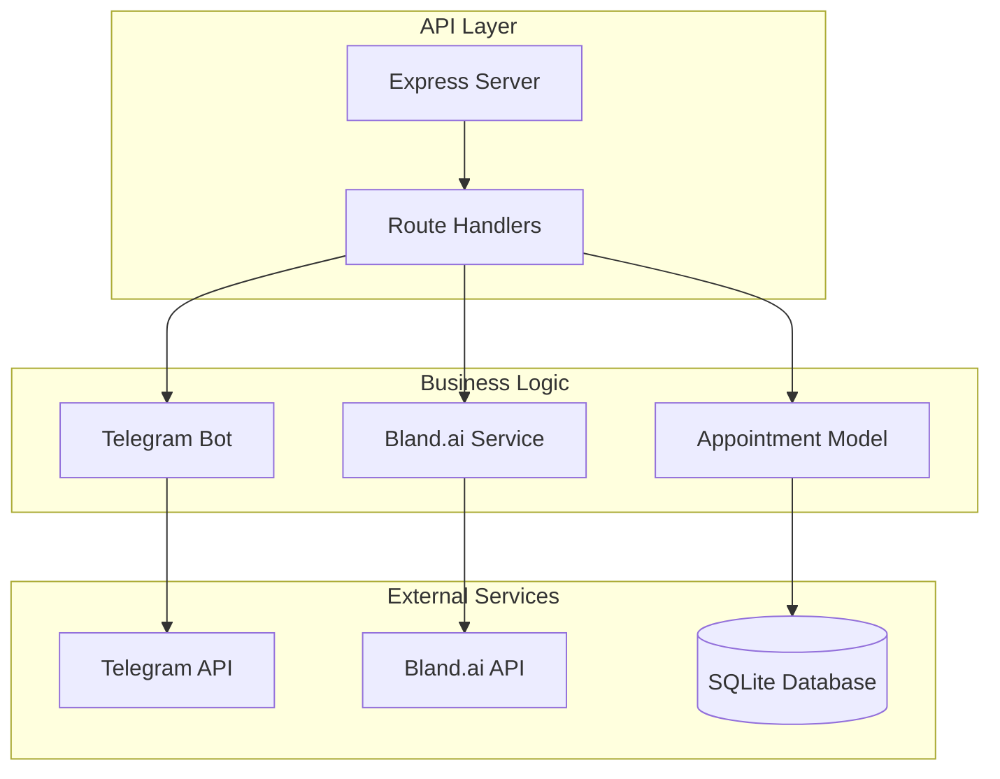
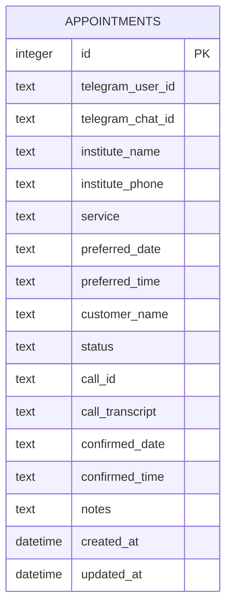
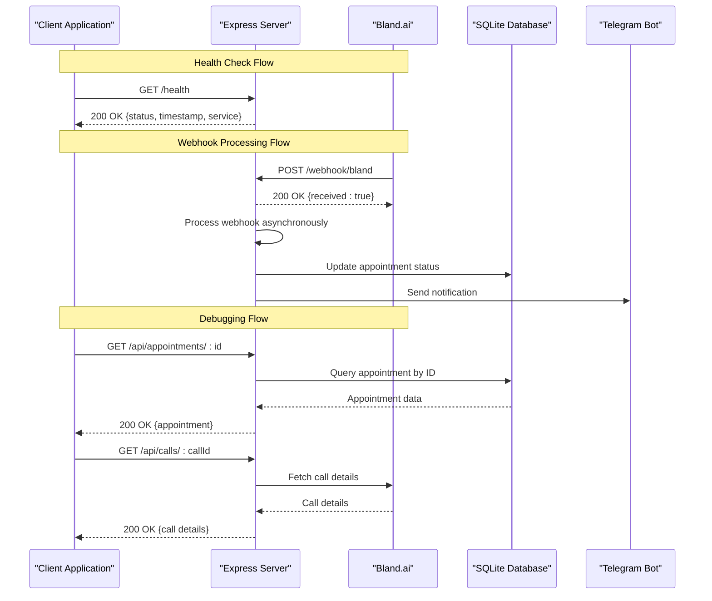
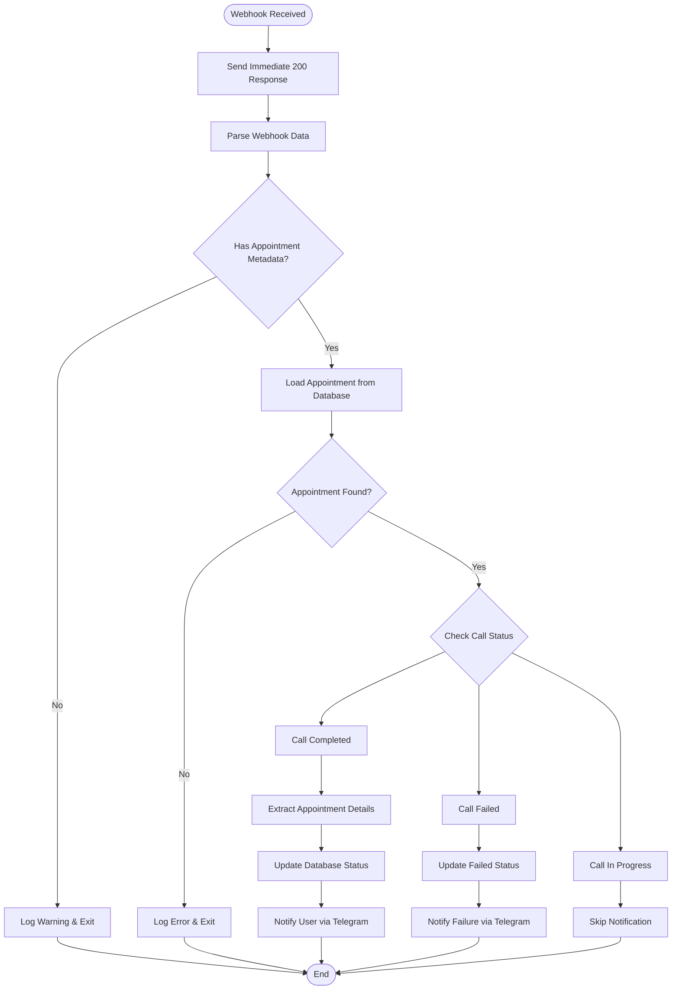
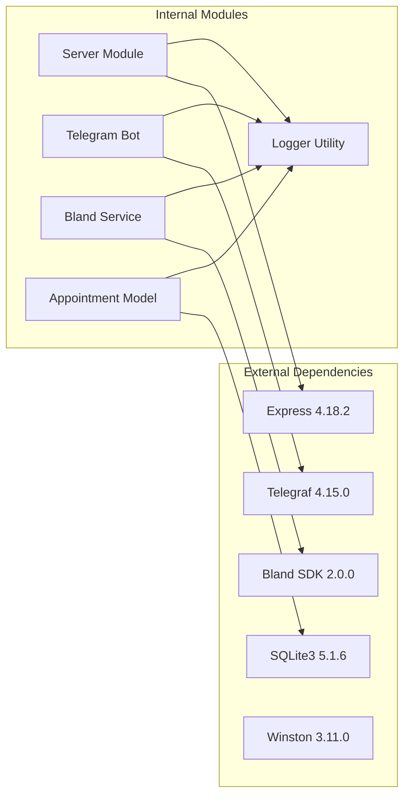

# API Reference

<cite>
**Referenced Files in This Document**
- [src/server.js](file://src/server.js)
- [src/models/appointment.js](file://src/models/appointment.js)
- [src/voice/bland.js](file://src/voice/bland.js)
- [src/bot/telegram.js](file://src/bot/telegram.js)
- [src/index.js](file://src/index.js)
- [package.json](file://package.json)
- [README.md](file://README.md)
</cite>

## Table of Contents
1. [Introduction](#introduction)
2. [Project Structure](#project-structure)
3. [Core Components](#core-components)
4. [Architecture Overview](#architecture-overview)
5. [Detailed Component Analysis](#detailed-component-analysis)
6. [Dependency Analysis](#dependency-analysis)
7. [Performance Considerations](#performance-considerations)
8. [Troubleshooting Guide](#troubleshooting-guide)
9. [Conclusion](#conclusion)

## Introduction
The Appointment Voice Agent is an AI-powered voice assistant that automates appointment scheduling through natural language conversations on Telegram and automated phone calls via Bland.ai. This API enables external systems to monitor call status, debug appointment data, and integrate with the voice agent infrastructure.

The system provides three primary REST endpoints for monitoring and debugging purposes:
- Health check endpoint for service monitoring
- Bland.ai webhook receiver for call status updates
- Debug endpoints for retrieving appointment and call details

## Project Structure
The API is built with Node.js and Express, organized into modular components:



**Diagram sources**
- [src/server.js:1-266](file://src/server.js#L1-L266)
- [src/bot/telegram.js:1-461](file://src/bot/telegram.js#L1-L461)
- [src/voice/bland.js:1-235](file://src/voice/bland.js#L1-L235)
- [src/models/appointment.js:1-238](file://src/models/appointment.js#L1-L238)

**Section sources**
- [src/server.js:1-266](file://src/server.js#L1-L266)
- [src/index.js:1-91](file://src/index.js#L1-L91)
- [package.json:1-35](file://package.json#L1-L35)

## Core Components

### Server Configuration
The Express server provides the foundation for all API endpoints with comprehensive middleware support:

- **JSON Body Parsing**: Automatic parsing of JSON request bodies
- **URL Encoding**: Support for form-encoded data
- **Request Logging**: Structured logging with IP addresses and user agents
- **Error Handling**: Centralized error handling with appropriate HTTP status codes

### Database Schema
The SQLite database stores appointment information with comprehensive tracking:



**Diagram sources**
- [src/models/appointment.js:27-47](file://src/models/appointment.js#L27-L47)

**Section sources**
- [src/server.js:16-31](file://src/server.js#L16-L31)
- [src/models/appointment.js:12-60](file://src/models/appointment.js#L12-L60)

## Architecture Overview



**Diagram sources**
- [src/server.js:34-123](file://src/server.js#L34-L123)
- [src/models/appointment.js:149-162](file://src/models/appointment.js#L149-L162)
- [src/voice/bland.js:107-116](file://src/voice/bland.js#L107-L116)

## Detailed Component Analysis

### Health Check Endpoint

**Endpoint**: `GET /health`

**Purpose**: Provides service health monitoring for uptime checks and load balancer health probes.

**Response Format**:
```json
{
  "status": "ok",
  "timestamp": "2024-01-01T00:00:00.000Z",
  "service": "appointment-voice-agent"
}
```

**HTTP Status Codes**:
- 200: Service is healthy and operational

**Implementation Details**:
- Lightweight endpoint with minimal resource usage
- Returns static JSON response without database or external service calls
- Ideal for monitoring tools and Kubernetes health checks

**Section sources**
- [src/server.js:34-41](file://src/server.js#L34-L41)

### Bland.ai Webhook Receiver

**Endpoint**: `POST /webhook/bland`

**Purpose**: Receives real-time call status updates from Bland.ai for call completion, failure, and progress notifications.

**Request Format**:
```json
{
  "call_id": "string",
  "status": "completed|failed|error|in_progress",
  "transcript": "string",
  "recording_url": "string",
  "summary": "string",
  "metadata": {
    "appointment_id": "string",
    "telegram_user_id": "string",
    "telegram_chat_id": "string"
  }
}
```

**Response Format**:
```json
{
  "received": true
}
```

**Processing Logic**:



**Diagram sources**
- [src/server.js:77-123](file://src/server.js#L77-L123)
- [src/server.js:125-229](file://src/server.js#L125-L229)

**Error Handling**:
- Immediate 200 acknowledgment prevents webhook retries
- Asynchronous processing continues even after acknowledgment
- Comprehensive error logging for debugging
- Graceful degradation for missing appointment data

**Section sources**
- [src/server.js:43-44](file://src/server.js#L43-L44)
- [src/server.js:77-123](file://src/server.js#L77-L123)

### Appointment Retrieval Endpoint

**Endpoint**: `GET /api/appointments/:id`

**Purpose**: Retrieves complete appointment details for debugging and monitoring purposes.

**Path Parameters**:
- `id`: Integer appointment identifier (auto-incremented primary key)

**Response Format**:
```json
{
  "id": 1,
  "telegram_user_id": "string",
  "telegram_chat_id": "string",
  "institute_name": "string",
  "institute_phone": "string",
  "service": "string",
  "preferred_date": "string",
  "preferred_time": "string",
  "customer_name": "string",
  "status": "pending|calling|confirmed|failed|cancelled",
  "call_id": "string",
  "call_transcript": "string",
  "confirmed_date": "string",
  "confirmed_time": "string",
  "notes": "string",
  "created_at": "datetime",
  "updated_at": "datetime"
}
```

**HTTP Status Codes**:
- 200: Appointment found and returned
- 404: Appointment not found
- 500: Internal server error

**Section sources**
- [src/server.js:46-58](file://src/server.js#L46-L58)
- [src/models/appointment.js:149-162](file://src/models/appointment.js#L149-L162)

### Call Details Endpoint

**Endpoint**: `GET /api/calls/:callId`

**Purpose**: Retrieves detailed call information from Bland.ai for debugging and monitoring.

**Path Parameters**:
- `callId`: String Bland.ai call identifier

**Response Format**:
```json
{
  "call_id": "string",
  "status": "string",
  "duration": "number",
  "recording_url": "string",
  "transcript": "string",
  "summary": "string",
  "started_at": "datetime",
  "ended_at": "datetime"
}
```

**HTTP Status Codes**:
- 200: Call details found and returned
- 500: Failed to fetch call details

**Section sources**
- [src/server.js:60-69](file://src/server.js#L60-L69)
- [src/voice/bland.js:107-116](file://src/voice/bland.js#L107-L116)

## Dependency Analysis



**Diagram sources**
- [package.json:20-27](file://package.json#L20-L27)
- [src/server.js:1-6](file://src/server.js#L1-L6)

**Section sources**
- [package.json:20-27](file://package.json#L20-L27)
- [src/server.js:1-6](file://src/server.js#L1-L6)

## Performance Considerations

### Rate Limiting
- **No Built-in Rate Limiting**: The current implementation does not include rate limiting mechanisms
- **Recommendation**: Implement rate limiting for webhook endpoints to prevent abuse
- **Monitoring**: Use the health endpoint for basic performance monitoring

### Response Optimization
- **Immediate Acknowledgment**: Webhook endpoints respond immediately to prevent timeouts
- **Asynchronous Processing**: Heavy operations continue after HTTP acknowledgment
- **Minimal Database Queries**: Optimized queries with appropriate indexing

### Scalability
- **Stateless Design**: API endpoints are stateless and horizontally scalable
- **External Dependencies**: Relies on Bland.ai and Telegram APIs for heavy lifting
- **Database Efficiency**: SQLite optimized for read-heavy operations

## Troubleshooting Guide

### Common Issues and Solutions

**Health Check Failures**:
- Verify server is running on configured port
- Check application logs for startup errors
- Ensure environment variables are properly configured

**Webhook Delivery Problems**:
- Confirm webhook URL is publicly accessible
- Verify Bland.ai webhook settings match configured URL
- Check server logs for incoming webhook requests
- Ensure proper SSL certificate for production deployments

**Appointment Data Retrieval Issues**:
- Verify appointment ID exists in database
- Check database connectivity and permissions
- Review database migration status

**Call Details Fetch Failures**:
- Verify Bland.ai API key is valid
- Check network connectivity to Bland.ai
- Review Bland.ai service status

### Error Response Patterns

**Generic Error Response**:
```json
{
  "error": "string",
  "message": "string"  // Only in development mode
}
```

**Environment-Specific Behavior**:
- Development mode includes detailed error messages
- Production mode provides generic error responses
- All errors are logged with timestamps and context

**Section sources**
- [src/server.js:231-240](file://src/server.js#L231-L240)
- [src/server.js:119-122](file://src/server.js#L119-L122)
- [README.md:212-228](file://README.md#L212-L228)

## Conclusion

The Appointment Voice Agent API provides a focused set of endpoints designed for monitoring, debugging, and integration with the voice scheduling system. The implementation emphasizes reliability through immediate webhook acknowledgments, comprehensive error handling, and structured logging.

Key strengths include:
- **Reliable Webhook Processing**: Immediate acknowledgment prevents delivery failures
- **Comprehensive Monitoring**: Health check endpoint for uptime monitoring
- **Debug-Friendly Design**: Direct access to appointment and call data
- **Production Ready**: Proper error handling and logging infrastructure

Future enhancements could include API versioning, rate limiting, and expanded authentication mechanisms for production deployments requiring stricter security controls.