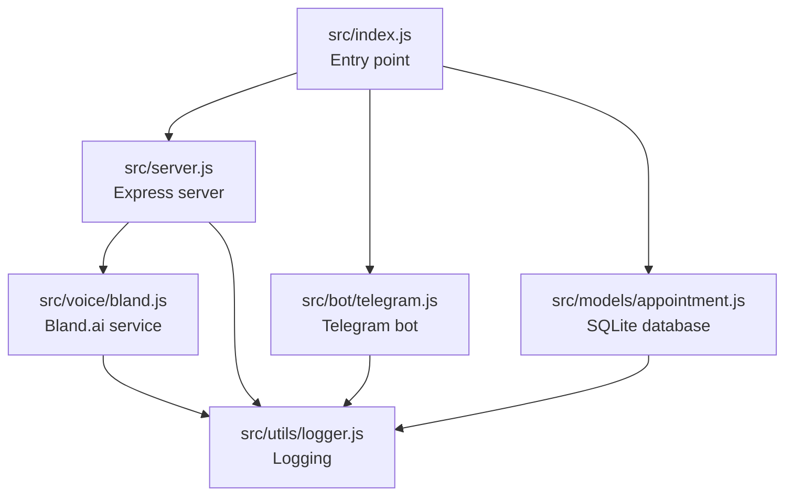
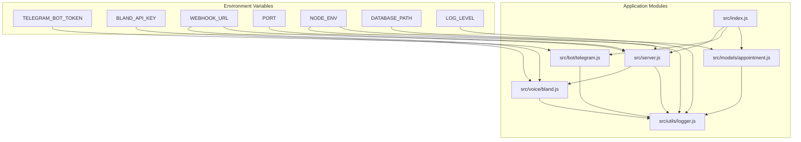
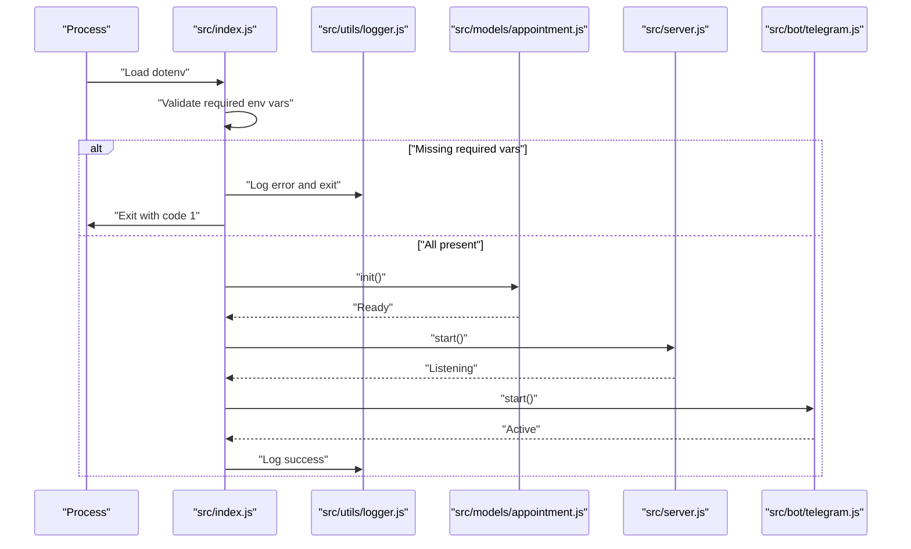
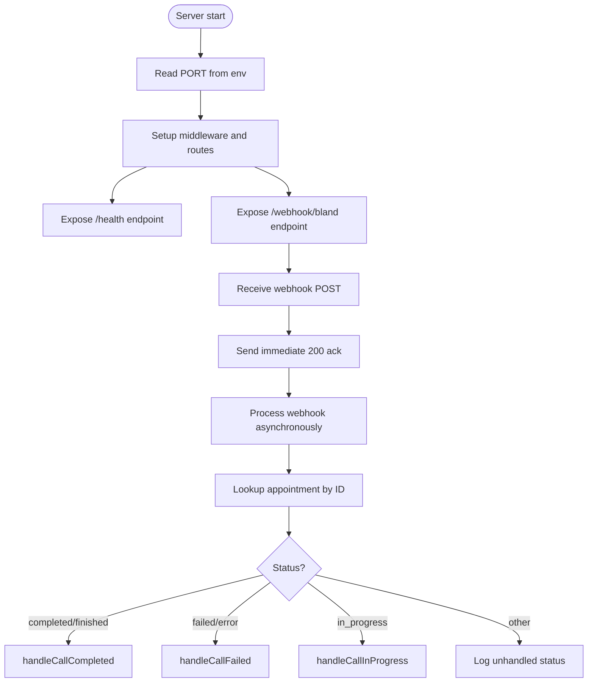
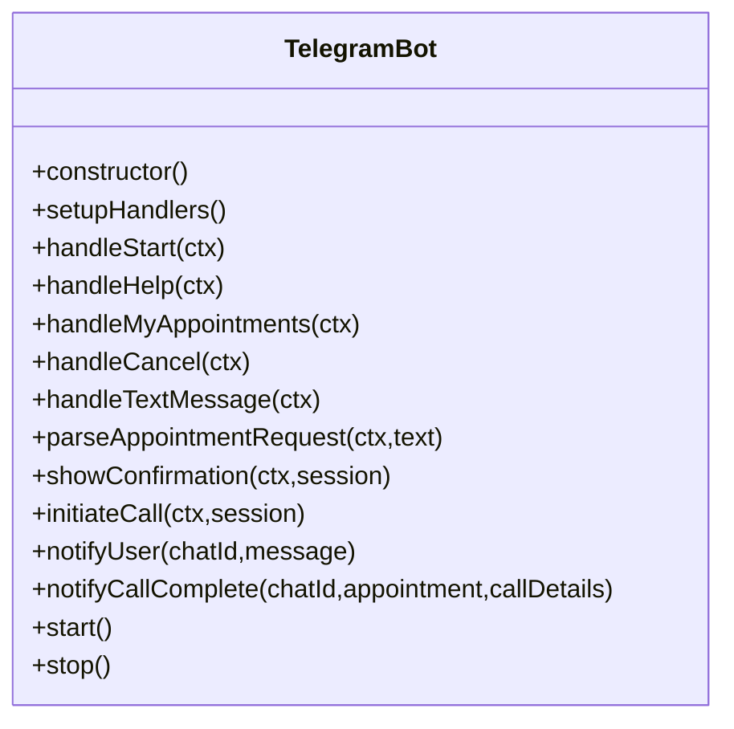
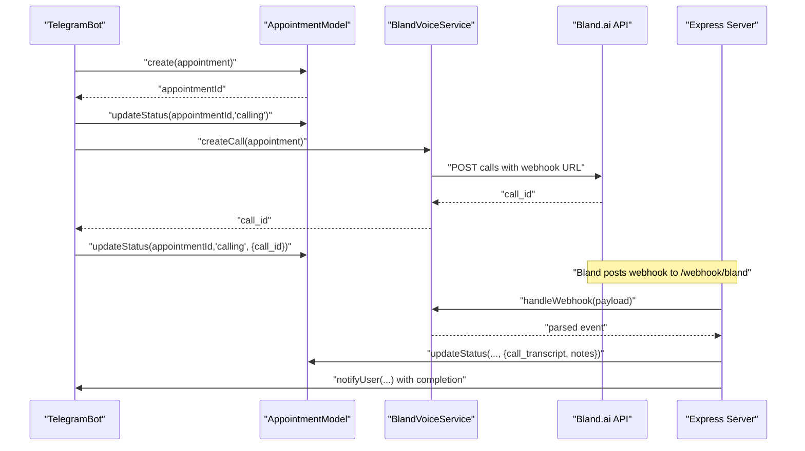
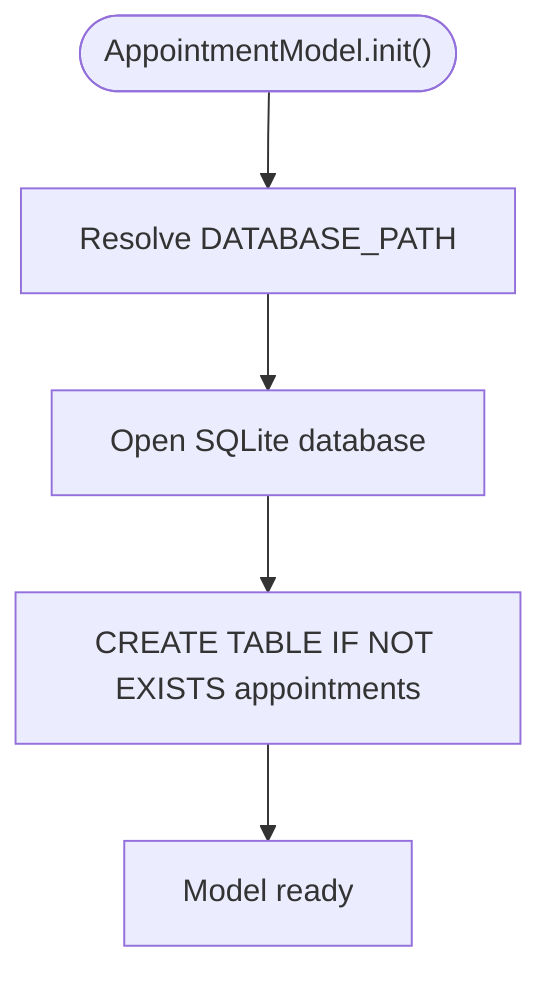
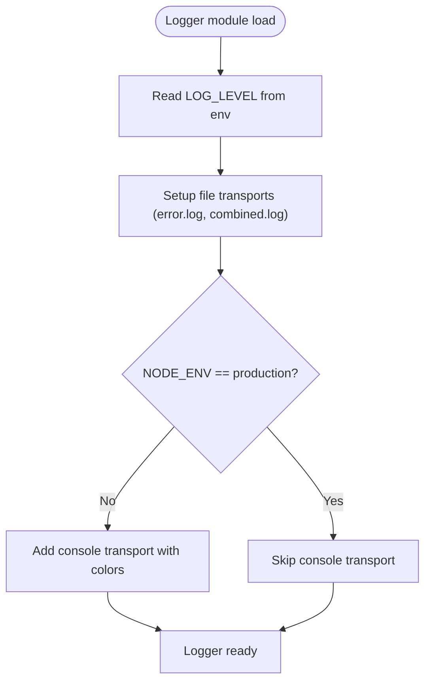
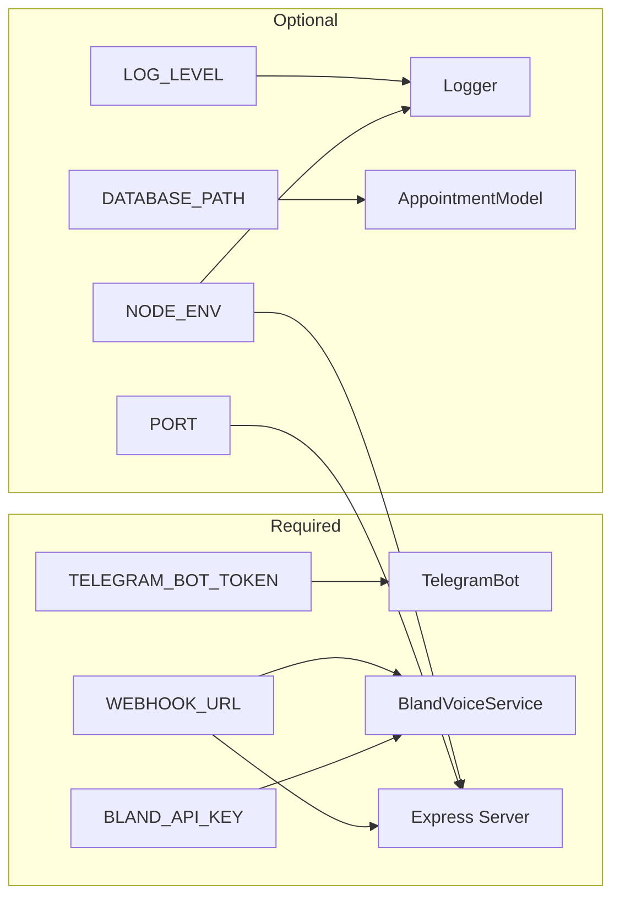

# Configuration and Environment Management

<cite>
**Referenced Files in This Document**
- [src/index.js](file://src/index.js)
- [src/server.js](file://src/server.js)
- [src/bot/telegram.js](file://src/bot/telegram.js)
- [src/voice/bland.js](file://src/voice/bland.js)
- [src/utils/logger.js](file://src/utils/logger.js)
- [src/models/appointment.js](file://src/models/appointment.js)
- [package.json](file://package.json)
- [README.md](file://README.md)
- [.gitignore](file://.gitignore)
</cite>

## Table of Contents
1. [Introduction](#introduction)
2. [Project Structure](#project-structure)
3. [Core Components](#core-components)
4. [Architecture Overview](#architecture-overview)
5. [Detailed Component Analysis](#detailed-component-analysis)
6. [Dependency Analysis](#dependency-analysis)
7. [Performance Considerations](#performance-considerations)
8. [Troubleshooting Guide](#troubleshooting-guide)
9. [Conclusion](#conclusion)
10. [Appendices](#appendices)

## Introduction
This document provides comprehensive guidance for configuration and environment management in the Appointment Voice Agent. It covers all environment variables, their roles, validation mechanisms, security considerations, and best practices for deploying the system across different environments. It also explains how environment variables influence application behavior, how to manage configuration files and secrets, and offers troubleshooting advice for common configuration issues.

## Project Structure
The application is structured around four primary runtime concerns:
- Entry point initializes environment loading and orchestrates startup
- Express server exposes endpoints and manages webhooks
- Telegram bot integrates with Telegram APIs using a configured token
- Voice service integrates with Bland.ai using an API key and webhook URL
- Logger reads log level from environment and writes to files/console
- SQLite database path is configurable via environment variable

**Diagram sources**
- [src/index.js:1-91](file://src/index.js#L1-L91)
- [src/server.js:1-266](file://src/server.js#L1-L266)
- [src/bot/telegram.js:1-461](file://src/bot/telegram.js#L1-L461)
- [src/voice/bland.js:1-235](file://src/voice/bland.js#L1-L235)
- [src/utils/logger.js:1-28](file://src/utils/logger.js#L1-L28)
- [src/models/appointment.js:1-238](file://src/models/appointment.js#L1-L238)

**Section sources**
- [src/index.js:1-91](file://src/index.js#L1-L91)
- [src/server.js:1-266](file://src/server.js#L1-L266)
- [src/bot/telegram.js:1-461](file://src/bot/telegram.js#L1-L461)
- [src/voice/bland.js:1-235](file://src/voice/bland.js#L1-L235)
- [src/utils/logger.js:1-28](file://src/utils/logger.js#L1-L28)
- [src/models/appointment.js:1-238](file://src/models/appointment.js#L1-L238)
- [package.json:1-35](file://package.json#L1-L35)
- [README.md:154-175](file://README.md#L154-L175)

## Core Components
This section documents each environment variable, its purpose, and how it affects application behavior.

- TELEGRAM_BOT_TOKEN
  - Purpose: Authenticates the Telegram bot client.
  - Usage locations:
    - Telegram bot initialization constructs the Telegraf client with this token.
  - Impact: Without a valid token, the Telegram bot cannot connect to Telegram APIs.
  - Security: Treat as a secret credential; never commit to version control.
  - Validation: The Telegram bot constructor does not validate the token format; ensure correctness externally.

- BLAND_API_KEY
  - Purpose: Authenticates requests to the Bland.ai voice service.
  - Usage locations:
    - Bland voice service constructor uses this key to initialize the client.
    - Used when creating calls and retrieving call details.
  - Impact: Invalid or missing key prevents voice calls and webhook processing.
  - Security: Treat as a secret credential; never commit to version control.

- WEBHOOK_URL
  - Purpose: Public URL where Bland.ai sends call status webhooks.
  - Usage locations:
    - Bland voice service stores this URL and passes it to Bland.ai when creating calls.
    - Express server exposes a webhook endpoint to receive and process these events.
  - Impact: Incorrect or unreachable URL causes missed call status updates.
  - Security: Ensure the URL is HTTPS and only accessible to Bland.ai; avoid exposing internal network details.

- PORT
  - Purpose: TCP port on which the Express server listens.
  - Usage locations:
    - Server class reads this environment variable to configure the listening port.
  - Impact: If unset, defaults to 3000.
  - Best practice: Bind to a non-root privileged port in production; ensure firewall allows inbound connections.

- NODE_ENV
  - Purpose: Controls environment mode and error reporting behavior.
  - Usage locations:
    - Express error handler conditionally includes error messages in development mode.
    - Logger adds console transport when not in production.
  - Impact: Development mode enables verbose error messages and console logging; production mode suppresses sensitive details.

- DATABASE_PATH
  - Purpose: Path to the SQLite database file.
  - Usage locations:
    - Appointment model resolves this path for database initialization.
  - Impact: If unset, defaults to a path under the data directory.
  - Best practice: Use absolute paths in production; ensure write permissions for the application user.

- LOG_LEVEL
  - Purpose: Controls logging verbosity.
  - Usage locations:
    - Logger configuration reads this environment variable to set the minimum log level.
  - Impact: Lower levels increase log volume; higher levels reduce noise.
  - Best practice: Use info in production; debug for development troubleshooting.

**Section sources**
- [src/bot/telegram.js:8](file://src/bot/telegram.js#L8)
- [src/voice/bland.js:6-10](file://src/voice/bland.js#L6-L10)
- [src/server.js:10](file://src/server.js#L10)
- [src/server.js:237](file://src/server.js#L237)
- [src/utils/logger.js:4](file://src/utils/logger.js#L4)
- [src/models/appointment.js:5](file://src/models/appointment.js#L5)

## Architecture Overview
The configuration system centers on environment variables consumed by multiple subsystems. The entry point validates required variables, while other modules read configuration passively. The server exposes endpoints for health checks and webhooks, and the Telegram bot and voice service rely on tokens and URLs respectively.

**Diagram sources**
- [src/index.js:13-20](file://src/index.js#L13-L20)
- [src/server.js:10](file://src/server.js#L10)
- [src/server.js:237](file://src/server.js#L237)
- [src/bot/telegram.js:8](file://src/bot/telegram.js#L8)
- [src/voice/bland.js:6-10](file://src/voice/bland.js#L6-L10)
- [src/utils/logger.js:4](file://src/utils/logger.js#L4)
- [src/models/appointment.js:5](file://src/models/appointment.js#L5)

## Detailed Component Analysis

### Environment Validation and Startup
The entry point performs early validation of required environment variables and initializes subsystems in order. It logs startup progress and sets up graceful shutdown handlers.

**Diagram sources**
- [src/index.js:13-20](file://src/index.js#L13-L20)
- [src/index.js:22-36](file://src/index.js#L22-L36)
- [src/utils/logger.js:1-28](file://src/utils/logger.js#L1-L28)
- [src/models/appointment.js:12-24](file://src/models/appointment.js#L12-L24)
- [src/server.js:242-249](file://src/server.js#L242-L249)
- [src/bot/telegram.js:449-457](file://src/bot/telegram.js#L449-L457)

**Section sources**
- [src/index.js:1-91](file://src/index.js#L1-L91)

### Express Server Configuration and Webhooks
The server reads the port from environment variables and exposes endpoints for health checks and Bland.ai webhooks. It logs incoming requests and routes webhook payloads to the voice service for processing.

**Diagram sources**
- [src/server.js:10](file://src/server.js#L10)
- [src/server.js:34-75](file://src/server.js#L34-L75)
- [src/server.js:77-123](file://src/server.js#L77-L123)
- [src/server.js:125-229](file://src/server.js#L125-L229)

**Section sources**
- [src/server.js:1-266](file://src/server.js#L1-L266)

### Telegram Bot Configuration
The Telegram bot uses the configured token to initialize the Telegraf client. It registers commands and handlers, and logs errors encountered during operation.

**Diagram sources**
- [src/bot/telegram.js:6-461](file://src/bot/telegram.js#L6-L461)

**Section sources**
- [src/bot/telegram.js:1-461](file://src/bot/telegram.js#L1-L461)

### Bland.ai Voice Service Configuration
The voice service uses the API key and webhook URL to create calls and handle webhook events. It extracts appointment details from transcripts and ends calls when necessary.

**Diagram sources**
- [src/bot/telegram.js:373-405](file://src/bot/telegram.js#L373-L405)
- [src/voice/bland.js:23-52](file://src/voice/bland.js#L23-L52)
- [src/voice/bland.js:123-149](file://src/voice/bland.js#L123-L149)
- [src/server.js:77-123](file://src/server.js#L77-L123)

**Section sources**
- [src/voice/bland.js:1-235](file://src/voice/bland.js#L1-L235)

### Database Configuration
The appointment model resolves the database path from environment variables and creates the required table on initialization.

**Diagram sources**
- [src/models/appointment.js:5](file://src/models/appointment.js#L5)
- [src/models/appointment.js:12-60](file://src/models/appointment.js#L12-L60)

**Section sources**
- [src/models/appointment.js:1-238](file://src/models/appointment.js#L1-L238)

### Logging Configuration
The logger reads the log level from environment variables and configures transports for file and console output depending on the environment mode.

**Diagram sources**
- [src/utils/logger.js:4](file://src/utils/logger.js#L4)
- [src/utils/logger.js:18-25](file://src/utils/logger.js#L18-L25)

**Section sources**
- [src/utils/logger.js:1-28](file://src/utils/logger.js#L1-L28)

## Dependency Analysis
The following diagram shows how environment variables flow through the system and which modules depend on them.

**Diagram sources**
- [src/bot/telegram.js:8](file://src/bot/telegram.js#L8)
- [src/voice/bland.js:6-10](file://src/voice/bland.js#L6-L10)
- [src/server.js:10](file://src/server.js#L10)
- [src/server.js:237](file://src/server.js#L237)
- [src/utils/logger.js:4](file://src/utils/logger.js#L4)
- [src/models/appointment.js:5](file://src/models/appointment.js#L5)

**Section sources**
- [src/index.js:13-20](file://src/index.js#L13-L20)
- [src/server.js:1-266](file://src/server.js#L1-L266)
- [src/bot/telegram.js:1-461](file://src/bot/telegram.js#L1-L461)
- [src/voice/bland.js:1-235](file://src/voice/bland.js#L1-L235)
- [src/utils/logger.js:1-28](file://src/utils/logger.js#L1-L28)
- [src/models/appointment.js:1-238](file://src/models/appointment.js#L1-L238)

## Performance Considerations
- Port binding: Ensure the chosen port is available and firewalled appropriately. Avoid binding to low-numbered ports in production without proper privilege separation.
- Logging overhead: Higher log levels increase disk I/O. Use appropriate levels per environment.
- Database path: Using a mounted persistent volume for the database path improves reliability and performance in containerized deployments.
- Webhook URL stability: Use a reliable reverse proxy or cloud platform to expose the webhook endpoint securely and with minimal latency.

[No sources needed since this section provides general guidance]

## Troubleshooting Guide
Common configuration issues and resolutions:

- Missing required environment variables
  - Symptom: Application exits immediately after startup with an error indicating missing variables.
  - Resolution: Ensure TELEGRAM_BOT_TOKEN, BLAND_API_KEY, and WEBHOOK_URL are set in the environment.
  - Reference: [src/index.js:13-20](file://src/index.js#L13-L20)

- Telegram bot not responding
  - Symptom: Users cannot interact with the bot.
  - Possible causes:
    - Invalid TELEGRAM_BOT_TOKEN
    - Bot not started or crashed
  - Resolution: Verify the token is correct and the application is running; check logs for errors.
  - Reference: [src/bot/telegram.js:8](file://src/bot/telegram.js#L8), [src/utils/logger.js:1-28](file://src/utils/logger.js#L1-L28)

- Calls not being made or webhooks not received
  - Symptom: No call initiation or webhook notifications.
  - Possible causes:
    - Invalid BLAND_API_KEY
    - WEBHOOK_URL is incorrect or unreachable
    - Local development requires a tunnel (e.g., ngrok) for webhook delivery
  - Resolution: Validate API key, ensure webhook URL is publicly accessible, and confirm the server is reachable from the internet.
  - Reference: [src/voice/bland.js:6-10](file://src/voice/bland.js#L6-L10), [src/server.js:77-123](file://src/server.js#L77-L123)

- Port conflicts or accessibility issues
  - Symptom: Server fails to start or cannot accept incoming webhooks.
  - Resolution: Change PORT to an available port and ensure network/firewall allows inbound connections.
  - Reference: [src/server.js:10](file://src/server.js#L10)

- Database connectivity problems
  - Symptom: Errors when initializing or querying the database.
  - Resolution: Verify DATABASE_PATH is writable and accessible; ensure the path exists or is creatable by the application user.
  - Reference: [src/models/appointment.js:5](file://src/models/appointment.js#L5), [src/models/appointment.js:12-24](file://src/models/appointment.js#L12-L24)

- Excessive or insufficient logging
  - Symptom: Too much or too little log output.
  - Resolution: Adjust LOG_LEVEL to control verbosity; NODE_ENV controls console transport in development vs production.
  - Reference: [src/utils/logger.js:4](file://src/utils/logger.js#L4), [src/utils/logger.js:18-25](file://src/utils/logger.js#L18-L25)

**Section sources**
- [src/index.js:13-20](file://src/index.js#L13-L20)
- [src/bot/telegram.js:8](file://src/bot/telegram.js#L8)
- [src/voice/bland.js:6-10](file://src/voice/bland.js#L6-L10)
- [src/server.js:10](file://src/server.js#L10)
- [src/server.js:77-123](file://src/server.js#L77-L123)
- [src/models/appointment.js:5](file://src/models/appointment.js#L5)
- [src/models/appointment.js:12-24](file://src/models/appointment.js#L12-L24)
- [src/utils/logger.js:4](file://src/utils/logger.js#L4)
- [src/utils/logger.js:18-25](file://src/utils/logger.js#L18-L25)

## Conclusion
Proper configuration and environment management are critical for the Appointment Voice Agent’s reliability and security. This guide outlined how each environment variable influences behavior, validated the startup process, and provided practical troubleshooting steps. By following the best practices described here—especially around secret handling, webhook exposure, and logging—you can deploy the system confidently across development, staging, and production environments.

[No sources needed since this section summarizes without analyzing specific files]

## Appendices

### Environment Variables Reference
- TELEGRAM_BOT_TOKEN: Required for Telegram bot authentication.
- BLAND_API_KEY: Required for Bland.ai API access.
- WEBHOOK_URL: Required for Bland.ai webhook delivery.
- PORT: Optional; defaults to 3000 if unset.
- NODE_ENV: Optional; controls error reporting and console logging.
- DATABASE_PATH: Optional; defaults to a path under the data directory.
- LOG_LEVEL: Optional; controls logging verbosity.

**Section sources**
- [README.md:184-195](file://README.md#L184-L195)

### Secret Handling Best Practices
- Never commit .env files to version control; they are already ignored by the repository configuration.
- Use a secrets manager or environment-specific configuration management in production.
- Rotate API keys regularly and revoke compromised tokens promptly.
- Restrict webhook URL exposure to trusted endpoints only.

**Section sources**
- [.gitignore:9-12](file://.gitignore#L9-L12)

### Deployment Scenarios

- Local Development
  - Use development scripts and environment variables loaded via dotenv.
  - Expose the webhook URL using a tunnel (e.g., ngrok) for testing.
  - Keep NODE_ENV unset or set to development to enable console logging and verbose error messages.

- Staging
  - Use a dedicated staging environment with its own secrets.
  - Ensure WEBHOOK_URL points to a staging endpoint and is reachable from Bland.ai.
  - Set NODE_ENV to production to suppress sensitive error details.

- Production
  - Use a managed secrets store to inject environment variables at runtime.
  - Bind to a non-root privileged port and secure network access.
  - Persist the database path on durable storage and monitor logs.

**Section sources**
- [README.md:72-88](file://README.md#L72-L88)
- [src/server.js:237](file://src/server.js#L237)
- [src/utils/logger.js:18-25](file://src/utils/logger.js#L18-L25)