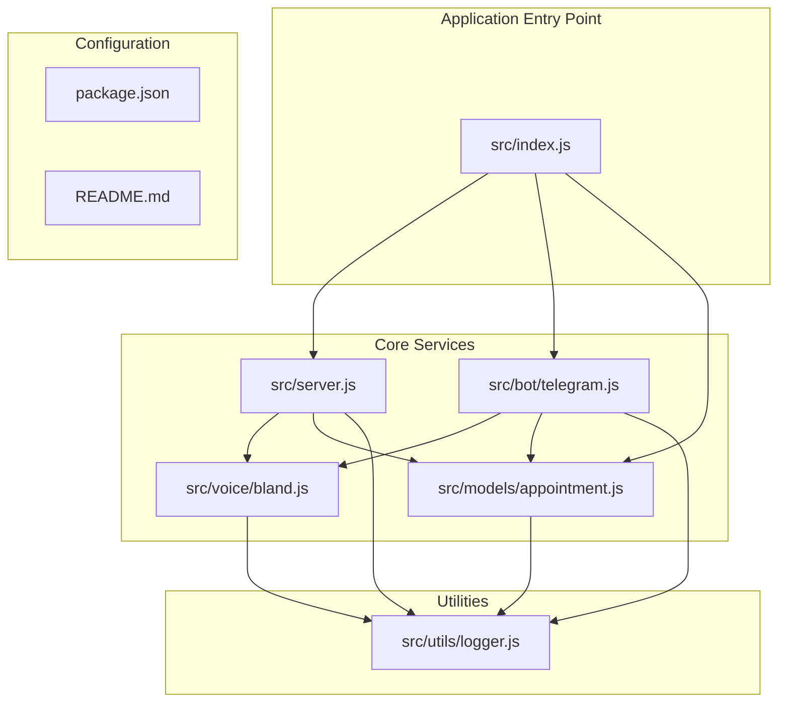
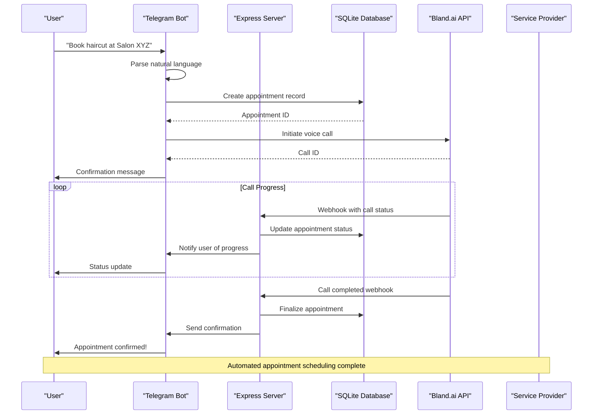
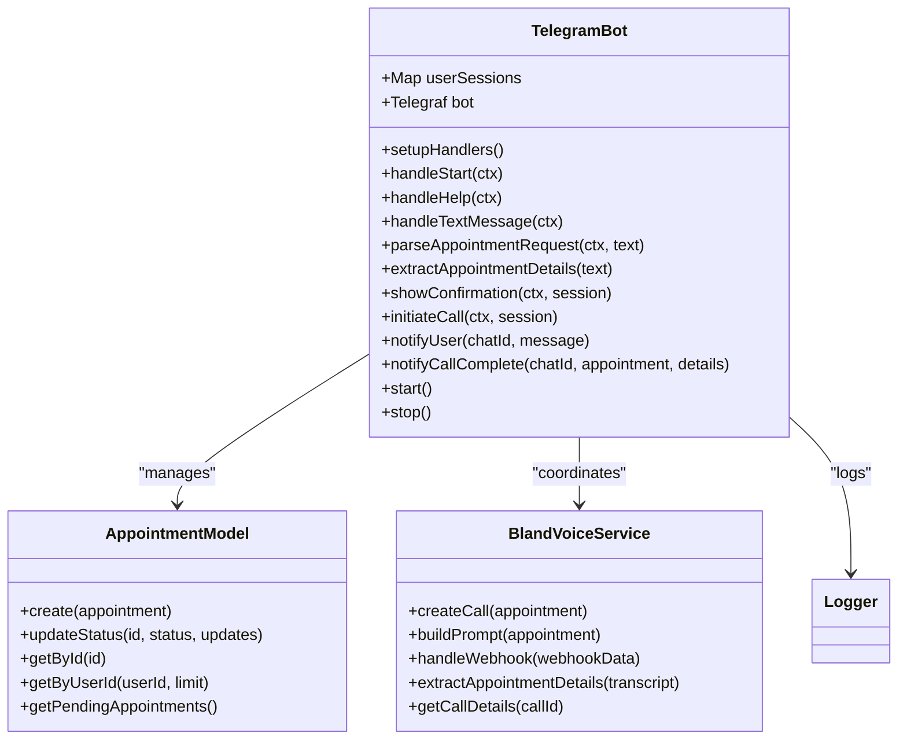
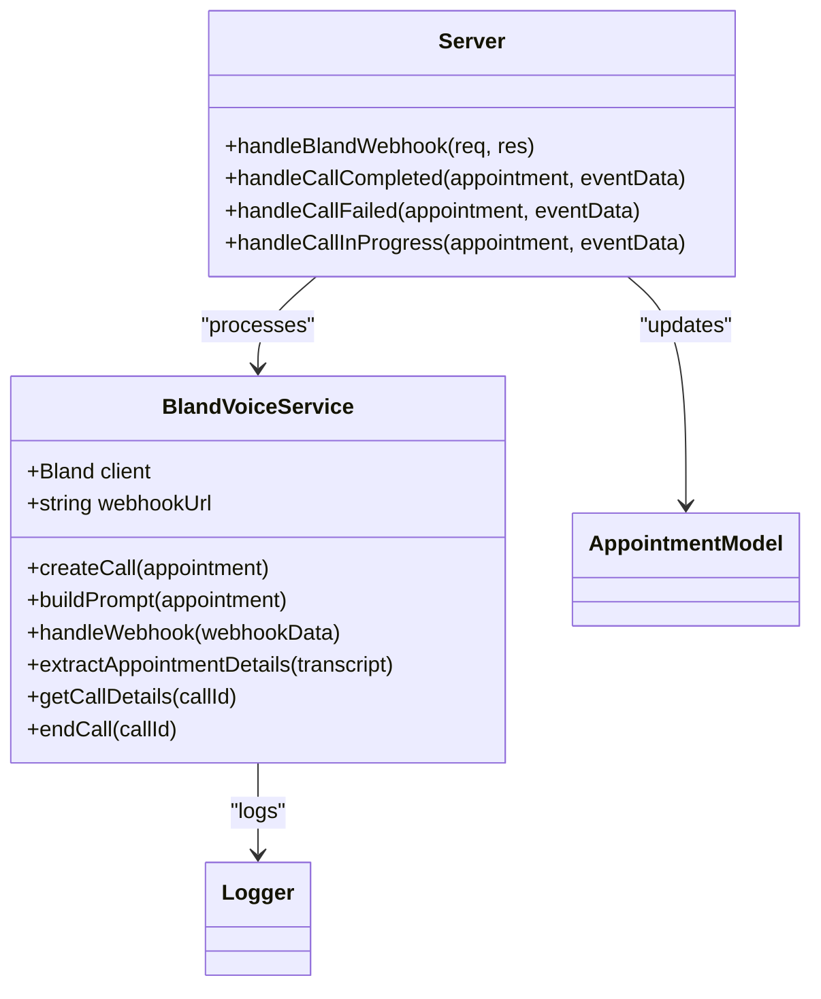
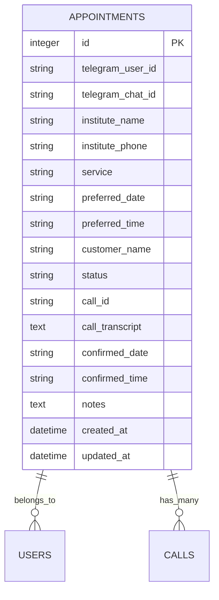
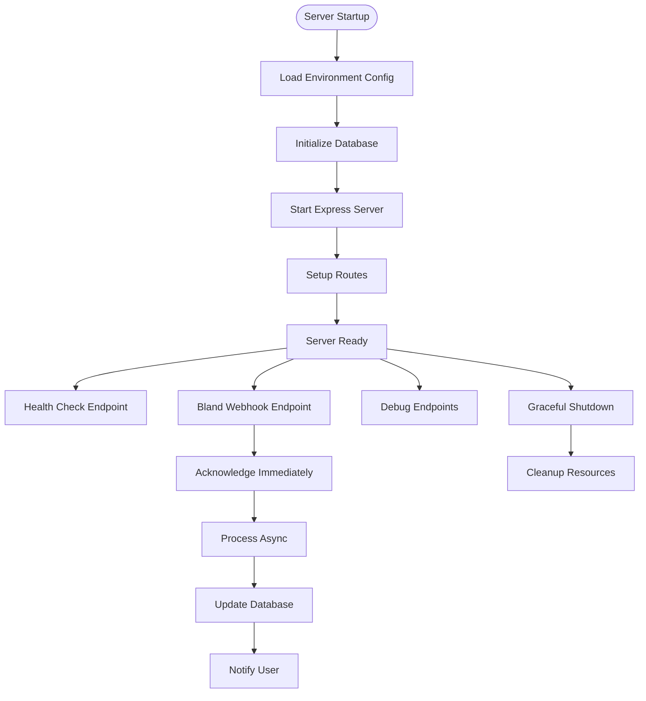
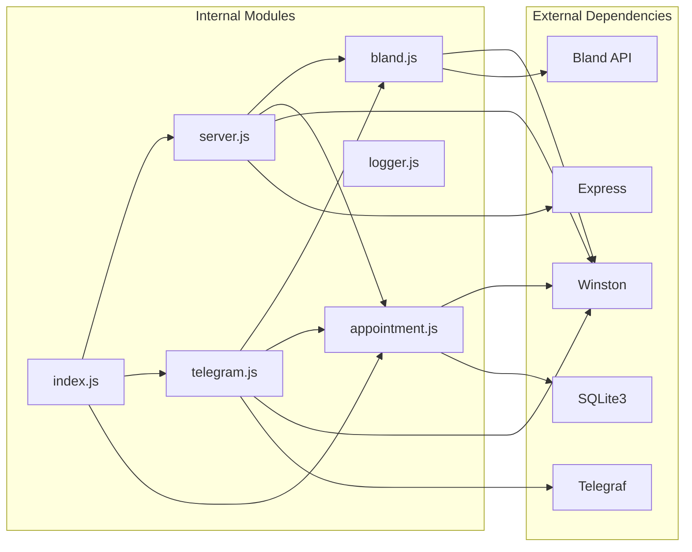

# Core Components

<cite>
**Referenced Files in This Document**
- [src/index.js](file://src/index.js)
- [src/server.js](file://src/server.js)
- [src/bot/telegram.js](file://src/bot/telegram.js)
- [src/voice/bland.js](file://src/voice/bland.js)
- [src/models/appointment.js](file://src/models/appointment.js)
- [src/utils/logger.js](file://src/utils/logger.js)
- [package.json](file://package.json)
- [README.md](file://README.md)
</cite>

## Table of Contents
1. [Introduction](#introduction)
2. [Project Structure](#project-structure)
3. [Core Components](#core-components)
4. [Architecture Overview](#architecture-overview)
5. [Detailed Component Analysis](#detailed-component-analysis)
6. [Dependency Analysis](#dependency-analysis)
7. [Performance Considerations](#performance-considerations)
8. [Troubleshooting Guide](#troubleshooting-guide)
9. [Conclusion](#conclusion)

## Introduction

The Appointment Voice Agent is an AI-powered system that automates appointment scheduling through natural language conversations with users and automated phone calls to service providers. The system integrates four core modules: Telegram bot integration for natural language processing and user interaction, voice service integration with Bland.ai for automated phone calls, database management for appointment persistence, and server/webhook handling for external communication.

This system transforms casual user requests like "Book a haircut at Salon XYZ tomorrow at 3pm" into successful phone appointments by leveraging AI voice agents and intelligent natural language processing.

## Project Structure

The project follows a modular architecture with clear separation of concerns:

**Diagram sources**
- [src/index.js:1-91](file://src/index.js#L1-L91)
- [src/server.js:1-266](file://src/server.js#L1-L266)
- [src/bot/telegram.js:1-461](file://src/bot/telegram.js#L1-L461)
- [src/voice/bland.js:1-235](file://src/voice/bland.js#L1-L235)
- [src/models/appointment.js:1-238](file://src/models/appointment.js#L1-L238)
- [src/utils/logger.js:1-28](file://src/utils/logger.js#L1-L28)

**Section sources**
- [src/index.js:1-91](file://src/index.js#L1-L91)
- [src/server.js:1-266](file://src/server.js#L1-L266)
- [src/bot/telegram.js:1-461](file://src/bot/telegram.js#L1-L461)
- [src/voice/bland.js:1-235](file://src/voice/bland.js#L1-L235)
- [src/models/appointment.js:1-238](file://src/models/appointment.js#L1-L238)
- [src/utils/logger.js:1-28](file://src/utils/logger.js#L1-L28)
- [package.json:1-35](file://package.json#L1-L35)
- [README.md:154-175](file://README.md#L154-L175)

## Core Components

The system consists of four interconnected components that work together to provide seamless appointment scheduling automation:

### 1. Telegram Bot Integration Module
Handles natural language processing, user interaction, and conversation flow management. Features include:
- Natural language parsing for appointment requests
- Interactive conversation flows with inline keyboards
- User session management and state tracking
- Real-time notifications and updates
- Command-based interface (/start, /help, /myappointments, /cancel)

### 2. Voice Service Integration Module (Bland.ai)
Manages automated phone calls and voice interactions:
- AI-powered voice conversations with service providers
- Intelligent prompt construction for different scenarios
- Call lifecycle management (initiation, monitoring, completion)
- Transcript analysis and appointment confirmation extraction
- Webhook processing for call status updates

### 3. Database Management Module
Provides persistent storage for appointment data:
- SQLite-based appointment tracking
- Comprehensive appointment lifecycle management
- User-specific appointment filtering and retrieval
- Status tracking and audit capabilities
- Automatic timestamp management

### 4. Server/Webhook Handler Module
Manages external communications and system orchestration:
- Express.js server for API endpoints and webhooks
- Health check and debugging endpoints
- Bland.ai webhook processing and event handling
- Cross-service coordination and data synchronization
- Graceful shutdown and error handling

**Section sources**
- [src/bot/telegram.js:6-461](file://src/bot/telegram.js#L6-L461)
- [src/voice/bland.js:4-235](file://src/voice/bland.js#L4-L235)
- [src/models/appointment.js:7-238](file://src/models/appointment.js#L7-L238)
- [src/server.js:7-266](file://src/server.js#L7-L266)

## Architecture Overview

The system follows a client-server architecture with clear service boundaries and asynchronous communication patterns:

**Diagram sources**
- [src/bot/telegram.js:373-405](file://src/bot/telegram.js#L373-L405)
- [src/server.js:77-123](file://src/server.js#L77-L123)
- [src/voice/bland.js:23-52](file://src/voice/bland.js#L23-L52)
- [src/models/appointment.js:62-100](file://src/models/appointment.js#L62-L100)

The architecture demonstrates several key design patterns:
- **Event-driven architecture**: Webhooks trigger state changes
- **Command pattern**: Telegram commands drive system actions
- **Observer pattern**: Users receive real-time updates
- **Repository pattern**: Database operations are encapsulated
- **Service layer pattern**: Each module has distinct responsibilities

**Section sources**
- [src/index.js:8-45](file://src/index.js#L8-L45)
- [src/server.js:33-75](file://src/server.js#L33-L75)
- [src/bot/telegram.js:13-37](file://src/bot/telegram.js#L13-L37)

## Detailed Component Analysis

### Telegram Bot Integration Analysis

The Telegram bot serves as the primary user interface and natural language processing engine:

**Diagram sources**
- [src/bot/telegram.js:6-461](file://src/bot/telegram.js#L6-L461)
- [src/models/appointment.js:7-238](file://src/models/appointment.js#L7-L238)
- [src/voice/bland.js:4-235](file://src/voice/bland.js#L4-L235)

Key implementation patterns include:

#### Natural Language Processing
The bot employs sophisticated pattern matching for extracting appointment details:
- Service type detection using multiple regex patterns
- Institute name extraction with contextual awareness
- Phone number normalization and validation
- Flexible date and time parsing with natural language support

#### Conversation State Management
Session-based conversation flow with state tracking:
- User session storage using Map for efficient lookups
- Multi-step confirmation process with inline keyboards
- Error recovery and session expiration handling
- Context preservation across conversation steps

#### Integration Patterns
Seamless coordination between services:
- Database-first approach for reliable state management
- Asynchronous call initiation with immediate user feedback
- Real-time notification system for call progress updates

**Section sources**
- [src/bot/telegram.js:182-224](file://src/bot/telegram.js#L182-L224)
- [src/bot/telegram.js:226-294](file://src/bot/telegram.js#L226-L294)
- [src/bot/telegram.js:311-337](file://src/bot/telegram.js#L311-L337)
- [src/bot/telegram.js:373-405](file://src/bot/telegram.js#L373-L405)

### Voice Service Integration Analysis

The Bland.ai integration provides automated voice call capabilities:

**Diagram sources**
- [src/voice/bland.js:4-235](file://src/voice/bland.js#L4-L235)
- [src/server.js:77-230](file://src/server.js#L77-L230)

#### Call Lifecycle Management
Comprehensive call handling with status tracking:
- Initial call creation with intelligent prompt construction
- Real-time webhook processing for call status updates
- Transcript analysis for appointment confirmation extraction
- Graceful error handling and retry mechanisms

#### Prompt Engineering
Sophisticated AI conversation scripting:
- Context-aware instruction templates
- Professional tone and conversational patterns
- Flexible scheduling negotiation strategies
- Compliance with privacy and safety guidelines

#### Webhook Processing
Robust event handling for external system integration:
- Immediate webhook acknowledgment for reliability
- Structured event data extraction and validation
- Asynchronous processing to prevent timeout issues
- Comprehensive error logging and recovery

**Section sources**
- [src/voice/bland.js:23-52](file://src/voice/bland.js#L23-L52)
- [src/voice/bland.js:59-100](file://src/voice/bland.js#L59-L100)
- [src/voice/bland.js:123-149](file://src/voice/bland.js#L123-L149)
- [src/voice/bland.js:156-215](file://src/voice/bland.js#L156-L215)

### Database Management Analysis

The SQLite-based appointment management system provides robust persistence:

**Diagram sources**
- [src/models/appointment.js:27-47](file://src/models/appointment.js#L27-L47)

#### Data Model Design
Well-structured schema supporting comprehensive appointment tracking:
- User identification and chat context preservation
- Complete appointment lifecycle state management
- Flexible scheduling information storage
- Audit trail through timestamp fields

#### Operation Patterns
Efficient database operations with transaction safety:
- Atomic create operations with immediate ID retrieval
- Flexible status update mechanism with validation
- Multi-field update capability with selective field updates
- Comprehensive query patterns for different use cases

#### Concurrency Handling
Safe concurrent access patterns:
- Single database connection per model instance
- Promise-based operations for async safety
- Proper error handling and connection management
- Graceful shutdown with connection cleanup

**Section sources**
- [src/models/appointment.js:12-60](file://src/models/appointment.js#L12-L60)
- [src/models/appointment.js:102-147](file://src/models/appointment.js#L102-L147)
- [src/models/appointment.js:179-216](file://src/models/appointment.js#L179-L216)

### Server/Webhook Handler Analysis

The Express.js server manages external communications and system orchestration:

**Diagram sources**
- [src/server.js:242-262](file://src/server.js#L242-L262)
- [src/index.js:47-87](file://src/index.js#L47-L87)

#### Webhook Processing Workflow
Asynchronous webhook handling for reliability:
- Immediate HTTP 200 acknowledgment to prevent retries
- Background processing to handle complex operations
- Comprehensive error logging and recovery mechanisms
- Structured event data extraction and validation

#### Error Handling Strategy
Multi-layered error management:
- Global Express error handler for uncaught exceptions
- Specific route error handling for business logic
- Graceful degradation for partial failures
- Comprehensive logging for debugging and monitoring

#### API Design
RESTful endpoint design with clear responsibilities:
- Health check endpoint for monitoring
- Dedicated webhook endpoint for external integrations
- Debug endpoints for development and testing
- Consistent error response format

**Section sources**
- [src/server.js:77-123](file://src/server.js#L77-L123)
- [src/server.js:231-240](file://src/server.js#L231-L240)
- [src/server.js:33-75](file://src/server.js#L33-L75)

## Dependency Analysis

The system exhibits clean dependency relationships with minimal coupling:

**Diagram sources**
- [package.json:20-27](file://package.json#L20-L27)
- [src/index.js:3-6](file://src/index.js#L3-L6)
- [src/server.js:1-6](file://src/server.js#L1-L6)

### Dependency Management
- **Minimal external dependencies**: Only essential libraries for core functionality
- **Clear module boundaries**: Each component has distinct responsibilities
- **Environment-based configuration**: All external services configured via environment variables
- **Logging abstraction**: Winston provides consistent logging across all modules

### Circular Dependency Prevention
The architecture avoids circular dependencies through:
- Centralized initialization in the main entry point
- Unidirectional data flow between modules
- Interface-based communication patterns
- Event-driven coordination through webhooks

**Section sources**
- [package.json:20-35](file://package.json#L20-L35)
- [src/index.js:1-45](file://src/index.js#L1-L45)

## Performance Considerations

### Scalability Factors
- **Database concurrency**: SQLite single-writer limitation requires careful operation sequencing
- **Memory usage**: Session storage grows with active user conversations
- **Network latency**: External API calls (Bland.ai) introduce timing dependencies
- **Rate limiting**: External services may impose usage limits

### Optimization Strategies
- **Connection pooling**: Consider upgrading to connection pool for database operations
- **Caching layer**: Implement Redis cache for frequently accessed appointment data
- **Background processing**: Use job queues for heavy operations like transcript analysis
- **Database indexing**: Add indexes for common query patterns (user ID, status, timestamps)

### Monitoring and Metrics
- **Call duration tracking**: Monitor average call processing time
- **Error rate monitoring**: Track webhook processing failures
- **User engagement metrics**: Monitor conversation completion rates
- **System health indicators**: Track database connection health and memory usage

## Troubleshooting Guide

### Common Issues and Solutions

#### Telegram Bot Not Responding
**Symptoms**: Users report no response from the bot
**Causes**: 
- Invalid Telegram bot token configuration
- Bot not started or crashed
- Network connectivity issues

**Solutions**:
- Verify TELEGRAM_BOT_TOKEN in environment variables
- Check application logs for startup errors
- Restart the application if the bot is not active

#### Calls Not Being Made
**Symptoms**: Appointment records created but no phone calls initiated
**Causes**:
- Invalid Bland.ai API key
- Webhook URL not publicly accessible
- Network connectivity issues

**Solutions**:
- Validate BLAND_API_KEY in environment configuration
- Test webhook URL accessibility using curl
- Check ngrok tunnel status (for local development)

#### Webhooks Not Received
**Symptoms**: Call status updates not reflected in the system
**Causes**:
- Incorrect webhook URL configuration
- Server not accessible from external network
- SSL certificate issues with webhook URLs

**Solutions**:
- Verify WEBHOOK_URL points to correct server endpoint
- Test webhook endpoint with curl command
- Ensure server is running on publicly accessible port

#### Database Connection Issues
**Symptoms**: Application crashes with database errors
**Causes**:
- Database file corruption
- Permission issues with database directory
- Concurrent access conflicts

**Solutions**:
- Check database file permissions and existence
- Verify DATABASE_PATH environment variable
- Restart application to recover from transient errors

### Debugging Procedures

#### Log Analysis
- Check logs/error.log for error-level events
- Review combined.log for comprehensive system activity
- Monitor Winston transport configuration for log file locations

#### API Testing
- Use curl to test health endpoint: `curl http://localhost:3000/health`
- Test webhook endpoint with sample payload
- Verify appointment retrieval endpoints work correctly

#### Environment Validation
- Run environment validation script before startup
- Test all required environment variables are present
- Verify external service credentials are valid

**Section sources**
- [src/utils/logger.js:1-28](file://src/utils/logger.js#L1-L28)
- [src/server.js:35-41](file://src/server.js#L35-L41)
- [README.md:212-228](file://README.md#L212-L228)

## Conclusion

The Appointment Voice Agent system demonstrates a well-architected solution for automated appointment scheduling that successfully combines natural language processing, AI voice interactions, and robust backend services. The modular design ensures maintainability while the clear separation of concerns enables focused development and testing.

Key strengths of the implementation include:
- **Clean architectural boundaries** between user interface, voice services, data persistence, and external communications
- **Comprehensive error handling** with graceful degradation and recovery mechanisms
- **Real-time communication** through webhook processing and user notifications
- **Extensible design** that accommodates future enhancements and additional service providers

The system provides a solid foundation for automated appointment scheduling that can be extended with additional features such as advanced NLP processing, multi-language support, enhanced analytics, and integration with additional voice services.

Future enhancement opportunities include implementing connection pooling for database operations, adding caching layers for improved performance, and developing comprehensive testing suites for all components.