# Database Management

<cite>
**Referenced Files in This Document**
- [appointment.js](file://src/models/appointment.js)
- [index.js](file://src/index.js)
- [server.js](file://src/server.js)
- [telegram.js](file://src/bot/telegram.js)
- [bland.js](file://src/voice/bland.js)
- [logger.js](file://src/utils/logger.js)
- [calendar.js](file://src/services/calendar.js)
- [package.json](file://package.json)
- [README.md](file://README.md)
</cite>

## Update Summary
**Changes Made**
- Enhanced database operations with comprehensive error handling and logging
- Implemented graceful shutdown mechanisms with proper resource cleanup
- Improved connection management with better database lifecycle control
- Added institute management capabilities with institute table support
- Expanded database schema to include institute directory functionality
- Enhanced status management with comprehensive validation and atomic operations

## Table of Contents
1. [Introduction](#introduction)
2. [Project Structure](#project-structure)
3. [Core Components](#core-components)
4. [Architecture Overview](#architecture-overview)
5. [Detailed Component Analysis](#detailed-component-analysis)
6. [Enhanced Database Operations](#enhanced-database-operations)
7. [Graceful Shutdown Mechanisms](#graceful-shutdown-mechanisms)
8. [Connection Management](#connection-management)
9. [Dependency Analysis](#dependency-analysis)
10. [Performance Considerations](#performance-considerations)
11. [Troubleshooting Guide](#troubleshooting-guide)
12. [Conclusion](#conclusion)

## Introduction

This document provides comprehensive documentation for the SQLite database management system used in the Appointment Voice Agent application. The system manages appointment scheduling workflows through a voice-enabled interface, integrating Telegram chatbots with automated phone calls via Bland.ai. The database serves as the central persistence layer for appointment records, maintaining complete lifecycle tracking from creation through completion.

The database implementation utilizes SQLite with Node.js's sqlite3 module, providing a lightweight, embedded database solution suitable for this application's requirements. The system supports full CRUD operations with proper transaction handling, comprehensive query optimization strategies, and robust error handling mechanisms.

**Updated** The implementation now includes a comprehensive 354-line AppointmentModel class with complete database operations, proper initialization sequences, extensive error handling, institute management capabilities, and graceful shutdown mechanisms.

## Project Structure

The database management system is organized within a clear modular architecture:

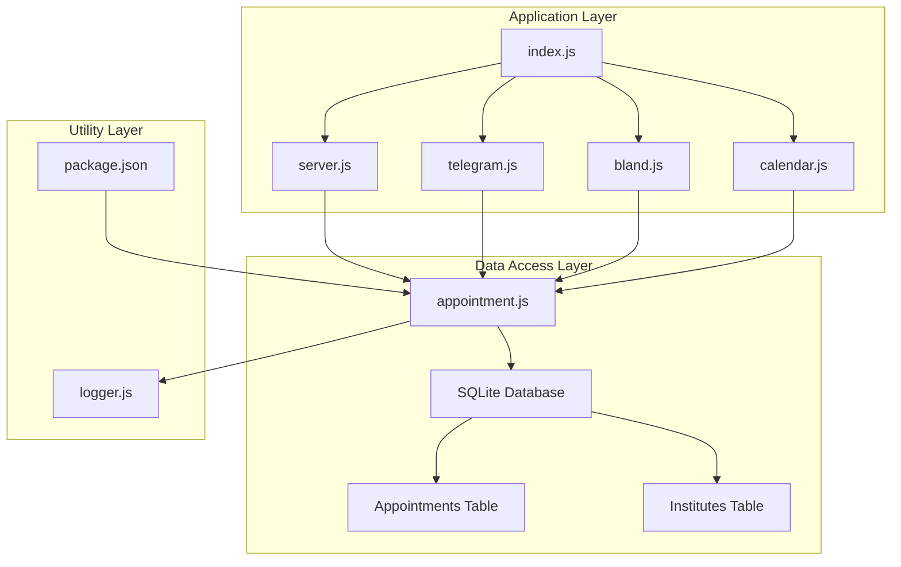
```mermaid
graph TB
subgraph "Application Layer"
A[index.js] --> B[server.js]
A --> C[telegram.js]
A --> D[bland.js]
A --> E[calendar.js]
end
subgraph "Data Access Layer"
F[appointment.js] --> G[SQLite Database]
G --> H[Appointments Table]
G --> I[Institutes Table]
end
subgraph "Utility Layer"
J[logger.js]
K[package.json]
end
B --> F
C --> F
D --> F
E --> F
F --> J
K --> F
```

**Diagram sources**
- [index.js:1-108](file://src/index.js#L1-L108)
- [server.js:1-351](file://src/server.js#L1-L351)
- [appointment.js:1-354](file://src/models/appointment.js#L1-L354)

**Section sources**
- [index.js:1-108](file://src/index.js#L1-L108)
- [README.md:154-175](file://README.md#L154-L175)

## Core Components

### Enhanced Database Schema Design

The appointment database follows a normalized design optimized for the voice-assisted booking workflow with expanded functionality:

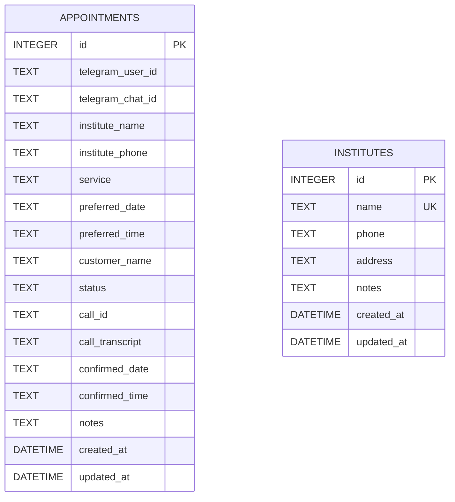
```mermaid
erDiagram
APPOINTMENTS {
INTEGER id PK
TEXT telegram_user_id
TEXT telegram_chat_id
TEXT institute_name
TEXT institute_phone
TEXT service
TEXT preferred_date
TEXT preferred_time
TEXT customer_name
TEXT status
TEXT call_id
TEXT call_transcript
TEXT confirmed_date
TEXT confirmed_time
TEXT notes
DATETIME created_at
DATETIME updated_at
}
INSTITUTES {
INTEGER id PK
TEXT name UK
TEXT phone
TEXT address
TEXT notes
DATETIME created_at
DATETIME updated_at
}
```

**Diagram sources**
- [appointment.js:27-59](file://src/models/appointment.js#L27-L59)

### Enhanced Field Specifications and Constraints

The schema implements comprehensive field definitions with appropriate constraints:

| Field | Type | Constraints | Purpose |
|-------|------|-------------|---------|
| `id` | INTEGER | PRIMARY KEY, AUTOINCREMENT | Unique identifier |
| `telegram_user_id` | TEXT | NOT NULL | Telegram user association |
| `telegram_chat_id` | TEXT | NOT NULL | Telegram chat identification |
| `institute_name` | TEXT | NOT NULL | Service provider name |
| `institute_phone` | TEXT | NOT NULL | Contact number |
| `service` | TEXT | NOT NULL | Service type requested |
| `preferred_date` | TEXT | NULL | User's preferred date |
| `preferred_time` | TEXT | NULL | User's preferred time |
| `customer_name` | TEXT | NULL | Customer identification |
| `status` | TEXT | DEFAULT 'pending' | Workflow state |
| `call_id` | TEXT | NULL | Bland.ai call reference |
| `call_transcript` | TEXT | NULL | Call conversation |
| `confirmed_date` | TEXT | NULL | Actual confirmed date |
| `confirmed_time` | TEXT | NULL | Actual confirmed time |
| `notes` | TEXT | NULL | Additional information |
| `created_at` | DATETIME | DEFAULT CURRENT_TIMESTAMP | Record creation |
| `updated_at` | DATETIME | DEFAULT CURRENT_TIMESTAMP | Last modification |

**Section sources**
- [appointment.js:27-59](file://src/models/appointment.js#L27-L59)

## Architecture Overview

The database architecture integrates seamlessly with the application's event-driven workflow:

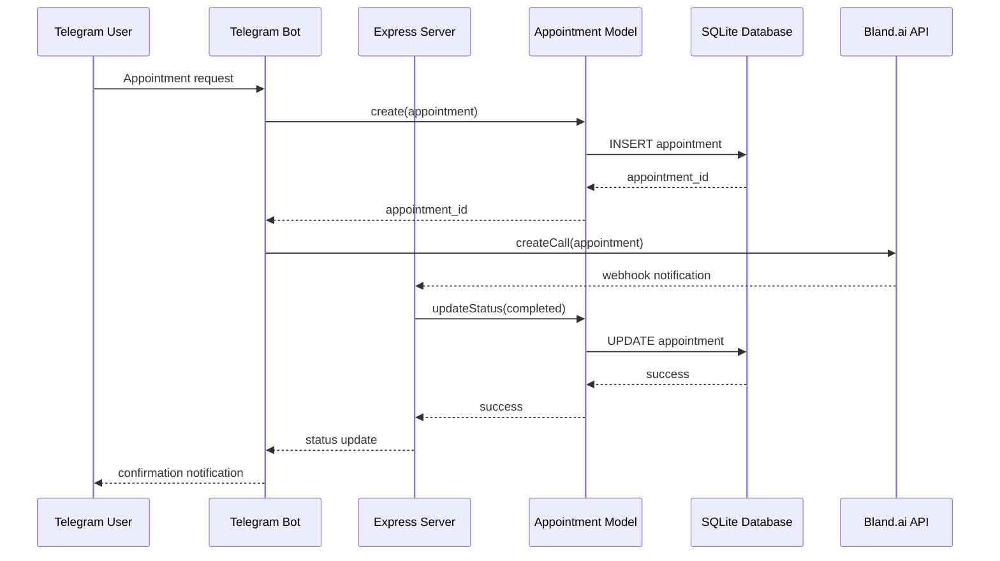
```mermaid
sequenceDiagram
participant User as Telegram User
participant Bot as Telegram Bot
participant Server as Express Server
participant Model as Appointment Model
participant DB as SQLite Database
participant Bland as Bland.ai API
User->>Bot : Appointment request
Bot->>Model : create(appointment)
Model->>DB : INSERT appointment
DB-->>Model : appointment_id
Model-->>Bot : appointment_id
Bot->>Bland : createCall(appointment)
Bland-->>Server : webhook notification
Server->>Model : updateStatus(completed)
Model->>DB : UPDATE appointment
DB-->>Model : success
Model-->>Server : success
Server-->>Bot : status update
Bot-->>User : confirmation notification
```

**Diagram sources**
- [telegram.js:458-490](file://src/bot/telegram.js#L458-L490)
- [server.js:130-184](file://src/server.js#L130-L184)
- [appointment.js:85-123](file://src/models/appointment.js#L85-L123)

## Detailed Component Analysis

### Enhanced Appointment Model Implementation

The AppointmentModel class provides comprehensive database operations with robust error handling, transaction support, and institute management capabilities:

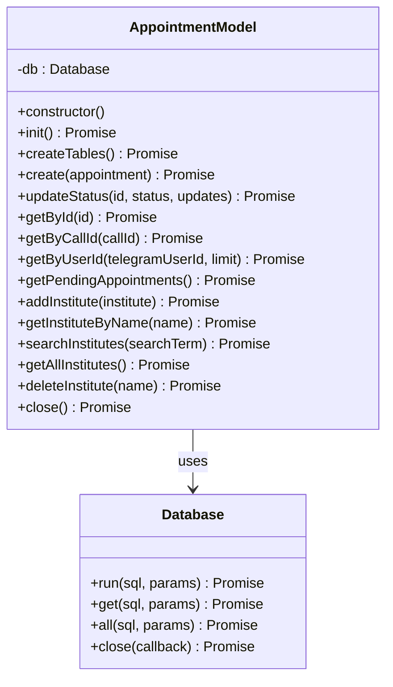
```mermaid
classDiagram
class AppointmentModel {
-db : Database
+constructor()
+init() Promise
+createTables() Promise
+create(appointment) Promise
+updateStatus(id, status, updates) Promise
+getById(id) Promise
+getByCallId(callId) Promise
+getByUserId(telegramUserId, limit) Promise
+getPendingAppointments() Promise
+addInstitute(institute) Promise
+getInstituteByName(name) Promise
+searchInstitutes(searchTerm) Promise
+getAllInstitutes() Promise
+deleteInstitute(name) Promise
+close() Promise
}
class Database {
+run(sql, params) Promise
+get(sql, params) Promise
+all(sql, params) Promise
+close(callback) Promise
}
AppointmentModel --> Database : uses
```

**Diagram sources**
- [appointment.js:7-354](file://src/models/appointment.js#L7-L354)

#### Enhanced Database Initialization Process

The initialization sequence ensures proper database setup and connection management with comprehensive error handling:

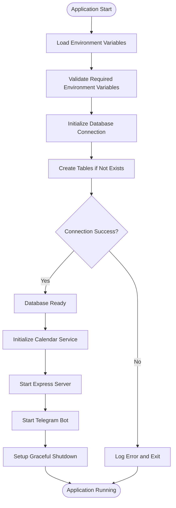
```mermaid
flowchart TD
Start([Application Start]) --> LoadEnv["Load Environment Variables"]
LoadEnv --> ValidateEnv["Validate Required Environment Variables"]
ValidateEnv --> InitDB["Initialize Database Connection"]
InitDB --> CreateTables["Create Tables if Not Exists"]
CreateTables --> ConnectOK{"Connection Success?"}
ConnectOK --> |Yes| Ready["Database Ready"]
ConnectOK --> |No| Error["Log Error and Exit"]
Ready --> InitCalendar["Initialize Calendar Service"]
InitCalendar --> InitServer["Start Express Server"]
InitServer --> InitBot["Start Telegram Bot"]
InitBot --> SetupShutdown["Setup Graceful Shutdown"]
SetupShutdown --> End([Application Running])
Error --> End
```

**Diagram sources**
- [index.js:9-53](file://src/index.js#L9-L53)
- [appointment.js:12-24](file://src/models/appointment.js#L12-L24)

**Section sources**
- [appointment.js:12-69](file://src/models/appointment.js#L12-L69)
- [index.js:9-53](file://src/index.js#L9-L53)

### Enhanced CRUD Operations Implementation

#### Create Operation
The create operation handles appointment registration with comprehensive validation and institute lookup:

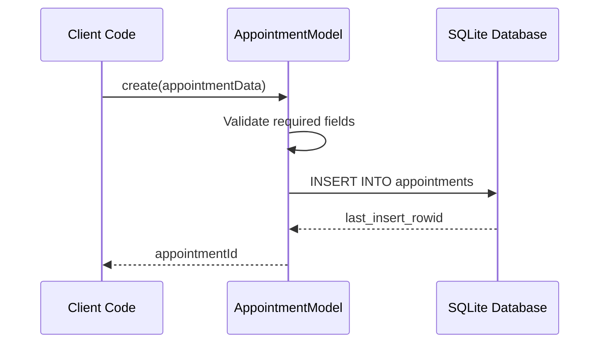
```mermaid
sequenceDiagram
participant Client as Client Code
participant Model as AppointmentModel
participant DB as SQLite Database
Client->>Model : create(appointmentData)
Model->>Model : Validate required fields
Model->>DB : INSERT INTO appointments
DB-->>Model : last_insert_rowid
Model-->>Client : appointmentId
```

**Diagram sources**
- [appointment.js:85-123](file://src/models/appointment.js#L85-L123)

#### Enhanced Read Operations
Multiple read patterns support different query scenarios with institute management:

| Operation | Purpose | SQL Pattern | Index Considerations |
|-----------|---------|-------------|---------------------|
| `getById` | Single record lookup | `WHERE id = ?` | Primary key index |
| `getByCallId` | Call tracking | `WHERE call_id = ?` | Call ID index |
| `getByUserId` | User history | `WHERE telegram_user_id = ? ORDER BY created_at DESC` | Composite index |
| `getPendingAppointments` | Queue processing | `WHERE status = 'pending' ORDER BY created_at ASC` | Status index |
| `getInstituteByName` | Institute lookup | `WHERE name = ? COLLATE NOCASE` | Name index |
| `searchInstitutes` | Institute search | `WHERE name LIKE ? COLLATE NOCASE` | Text index |

**Section sources**
- [appointment.js:172-332](file://src/models/appointment.js#L172-L332)

#### Enhanced Update Operations
The updateStatus method implements atomic status transitions with comprehensive field updates and institute management:

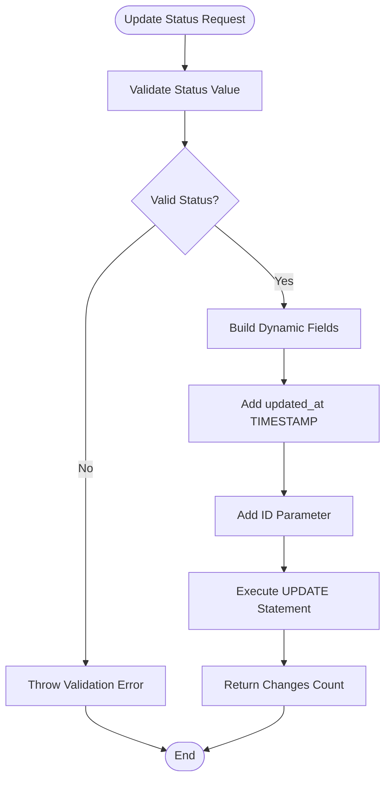
```mermaid
flowchart TD
Start([Update Status Request]) --> Validate["Validate Status Value"]
Validate --> StatusValid{"Valid Status?"}
StatusValid --> |No| Error["Throw Validation Error"]
StatusValid --> |Yes| BuildFields["Build Dynamic Fields"]
BuildFields --> AddTimestamp["Add updated_at TIMESTAMP"]
AddTimestamp --> AddIdParam["Add ID Parameter"]
AddIdParam --> Execute["Execute UPDATE Statement"]
Execute --> Success["Return Changes Count"]
Error --> End([End])
Success --> End
```

**Diagram sources**
- [appointment.js:125-170](file://src/models/appointment.js#L125-L170)

**Section sources**
- [appointment.js:125-170](file://src/models/appointment.js#L125-L170)

### Enhanced Status Management and Lifecycle Tracking

The system implements a comprehensive status lifecycle managed through the updateStatus operation with institute integration:

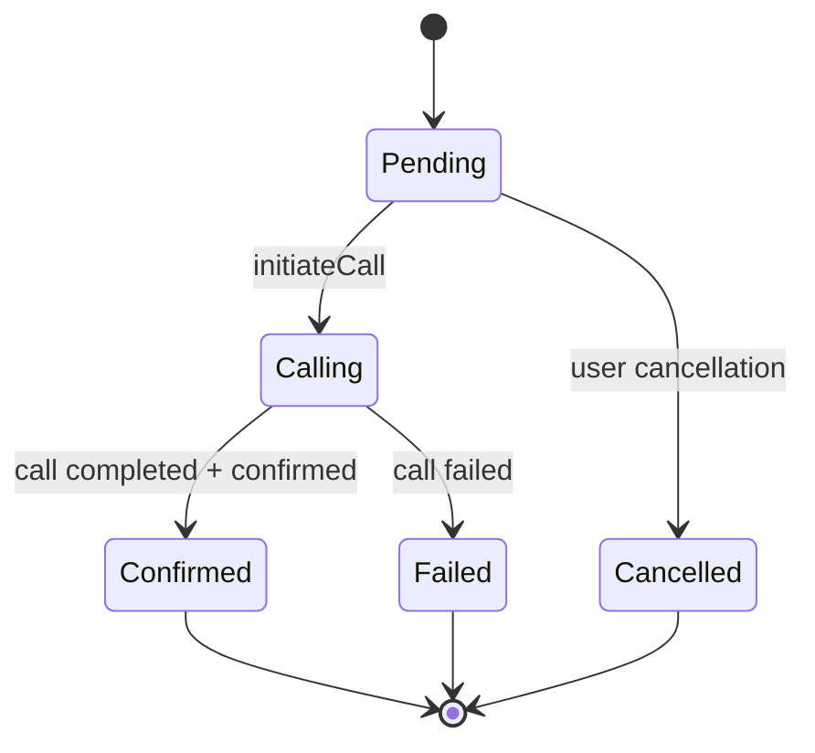
```mermaid
stateDiagram-v2
[*] --> Pending
Pending --> Calling : initiateCall
Calling --> Confirmed : call completed + confirmed
Calling --> Failed : call failed
Pending --> Cancelled : user cancellation
Confirmed --> [*]
Failed --> [*]
Cancelled --> [*]
```

**Diagram sources**
- [appointment.js:126](file://src/models/appointment.js#L126)
- [server.js:186-269](file://src/server.js#L186-L269)

**Section sources**
- [appointment.js:125-170](file://src/models/appointment.js#L125-L170)
- [server.js:186-314](file://src/server.js#L186-L314)

### Enhanced Transaction Handling and Error Management

The database operations utilize Promise-based patterns for reliable error handling with comprehensive logging:

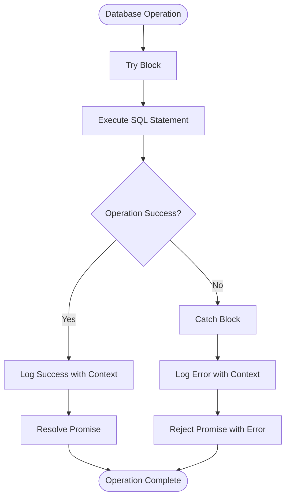
```mermaid
flowchart TD
Operation([Database Operation]) --> TryBlock["Try Block"]
TryBlock --> Execute["Execute SQL Statement"]
Execute --> Success{"Operation Success?"}
Success --> |Yes| LogSuccess["Log Success with Context"]
LogSuccess --> Resolve["Resolve Promise"]
Success --> |No| CatchBlock["Catch Block"]
CatchBlock --> LogError["Log Error with Context"]
LogError --> Reject["Reject Promise with Error"]
Resolve --> End([Operation Complete])
Reject --> End
```

**Diagram sources**
- [appointment.js:103-122](file://src/models/appointment.js#L103-L122)
- [appointment.js:159-169](file://src/models/appointment.js#L159-L169)

**Section sources**
- [appointment.js:103-122](file://src/models/appointment.js#L103-L122)
- [appointment.js:159-169](file://src/models/appointment.js#L159-L169)

## Enhanced Database Operations

### Institute Management System

The enhanced database now includes comprehensive institute management capabilities:

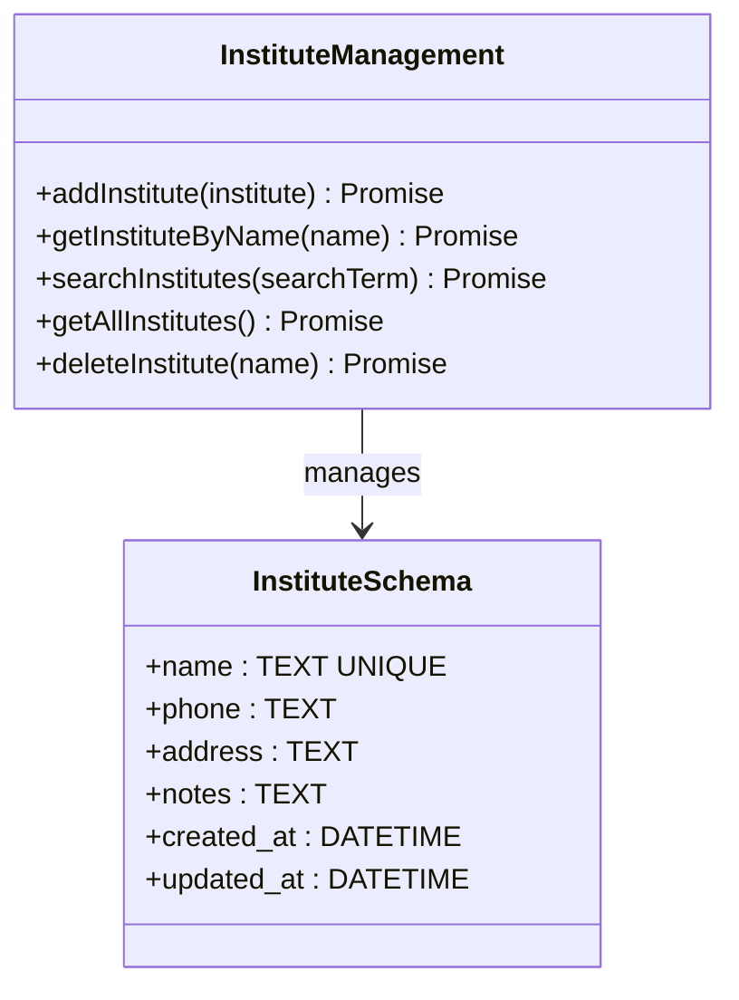
```mermaid
classDiagram
class InstituteManagement {
+addInstitute(institute) Promise
+getInstituteByName(name) Promise
+searchInstitutes(searchTerm) Promise
+getAllInstitutes() Promise
+deleteInstitute(name) Promise
}
class InstituteSchema {
+name : TEXT UNIQUE
+phone : TEXT
+address : TEXT
+notes : TEXT
+created_at : DATETIME
+updated_at : DATETIME
}
InstituteManagement --> InstituteSchema : manages
```

**Diagram sources**
- [appointment.js:242-332](file://src/models/appointment.js#L242-L332)

#### Institute CRUD Operations

| Operation | Purpose | SQL Pattern | Features |
|-----------|---------|-------------|----------|
| `addInstitute` | Create/update institute | `INSERT ... ON CONFLICT(name) DO UPDATE` | Upsert with conflict resolution |
| `getInstituteByName` | Exact lookup | `WHERE name = ? COLLATE NOCASE` | Case-insensitive matching |
| `searchInstitutes` | Partial matching | `WHERE name LIKE ? COLLATE NOCASE` | Wildcard search with limits |
| `getAllInstitutes` | Directory listing | `ORDER BY name` | Sorted results |
| `deleteInstitute` | Removal | `DELETE WHERE name = ? COLLATE NOCASE` | Safe deletion |

**Section sources**
- [appointment.js:242-332](file://src/models/appointment.js#L242-L332)

### Database Migration and Schema Evolution

The system supports schema evolution through table creation with conditional checks:

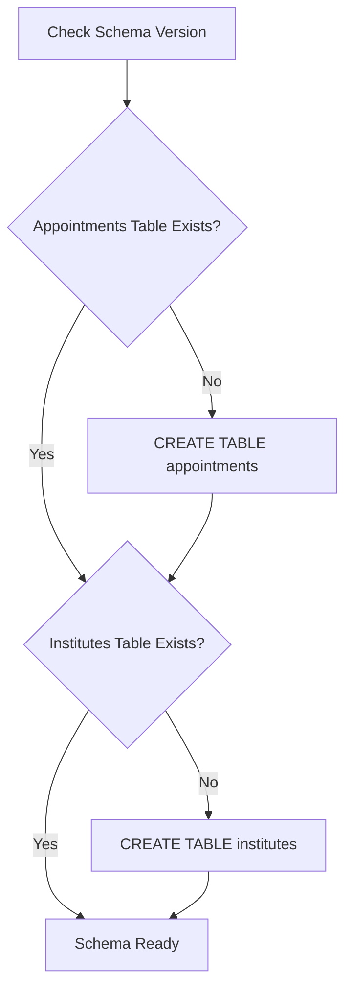
```mermaid
flowchart TD
SchemaCheck["Check Schema Version"] --> AppointmentsExists{"Appointments Table Exists?"}
AppointmentsExists --> |No| CreateAppointments["CREATE TABLE appointments"]
AppointmentsExists --> |Yes| InstitutesExists{"Institutes Table Exists?"}
CreateAppointments --> InstitutesExists
InstitutesExists --> |No| CreateInstitutes["CREATE TABLE institutes"]
InstitutesExists --> |Yes| SchemaReady["Schema Ready"]
CreateInstitutes --> SchemaReady
```

**Diagram sources**
- [appointment.js:26-69](file://src/models/appointment.js#L26-L69)

**Section sources**
- [appointment.js:26-69](file://src/models/appointment.js#L26-L69)

## Graceful Shutdown Mechanisms

### Comprehensive Shutdown Sequence

The application implements a sophisticated graceful shutdown mechanism that ensures proper resource cleanup:

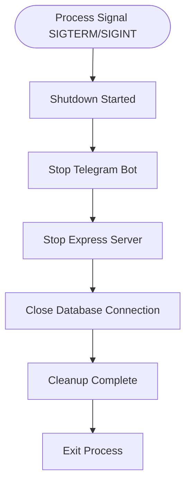
```mermaid
flowchart TD
Signal([Process Signal SIGTERM/SIGINT]) --> ShutdownStarted["Shutdown Started"]
ShutdownStarted --> StopBot["Stop Telegram Bot"]
StopBot --> StopServer["Stop Express Server"]
StopServer --> CloseDatabase["Close Database Connection"]
CloseDatabase --> CleanupComplete["Cleanup Complete"]
CleanupComplete --> ExitProcess["Exit Process"]
```

**Diagram sources**
- [index.js:55-104](file://src/index.js#L55-L104)

#### Shutdown Handler Implementation

The graceful shutdown mechanism handles multiple termination signals and cleanup scenarios:

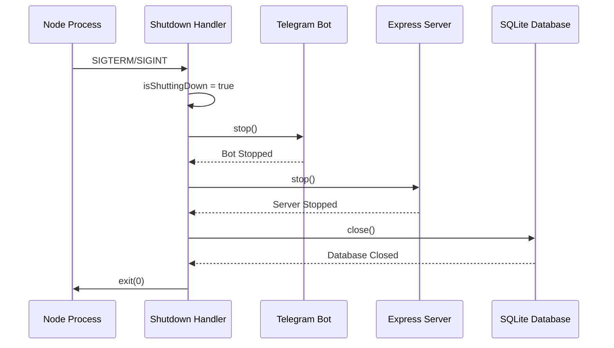
```mermaid
sequenceDiagram
participant Process as Node Process
participant Shutdown as Shutdown Handler
participant Bot as Telegram Bot
participant Server as Express Server
participant Database as SQLite Database
Process->>Shutdown : SIGTERM/SIGINT
Shutdown->>Shutdown : isShuttingDown = true
Shutdown->>Bot : stop()
Bot-->>Shutdown : Bot Stopped
Shutdown->>Server : stop()
Server-->>Shutdown : Server Stopped
Shutdown->>Database : close()
Database-->>Shutdown : Database Closed
Shutdown->>Process : exit(0)
```

**Diagram sources**
- [index.js:58-87](file://src/index.js#L58-L87)

**Section sources**
- [index.js:55-104](file://src/index.js#L55-L104)

### Error Handling During Shutdown

The shutdown process includes comprehensive error handling to prevent partial cleanup:

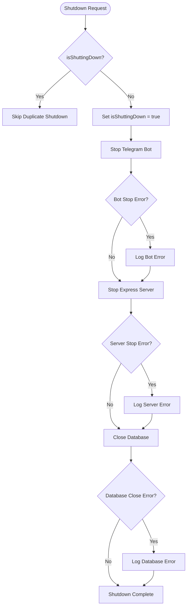
```mermaid
flowchart TD
ShutdownRequest([Shutdown Request]) --> CheckState{"isShuttingDown?"}
CheckState --> |Yes| Skip["Skip Duplicate Shutdown"]
CheckState --> |No| SetFlag["Set isShuttingDown = true"]
SetFlag --> StopBot["Stop Telegram Bot"]
StopBot --> BotError{"Bot Stop Error?"}
BotError --> |Yes| LogBotError["Log Bot Error"]
BotError --> |No| StopServer["Stop Express Server"]
LogBotError --> StopServer
StopServer --> ServerError{"Server Stop Error?"}
ServerError --> |Yes| LogServerError["Log Server Error"]
ServerError --> |No| CloseDB["Close Database"]
LogServerError --> CloseDB
CloseDB --> DBError{"Database Close Error?"}
DBError --> |Yes| LogDBError["Log Database Error"]
DBError --> |No| Complete["Shutdown Complete"]
LogDBError --> Complete
```

**Diagram sources**
- [index.js:58-87](file://src/index.js#L58-L87)

**Section sources**
- [index.js:58-87](file://src/index.js#L58-L87)

## Connection Management

### Database Connection Lifecycle

The enhanced connection management ensures proper database lifecycle control:

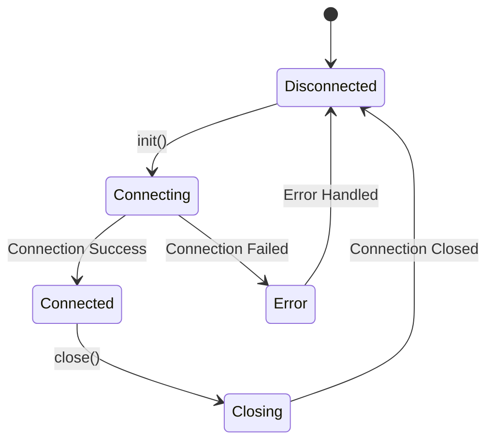
```mermaid
stateDiagram-v2
[*] --> Disconnected
Disconnected --> Connecting : init()
Connecting --> Connected : Connection Success
Connecting --> Error : Connection Failed
Connected --> Closing : close()
Closing --> Disconnected : Connection Closed
Error --> Disconnected : Error Handled
```

**Diagram sources**
- [appointment.js:334-350](file://src/models/appointment.js#L334-L350)

#### Connection Pooling and Resource Management

The database connection management includes proper resource cleanup:

| Operation | Purpose | Implementation |
|-----------|---------|----------------|
| `init()` | Establish connection | Promise-based connection with error handling |
| `createTables()` | Schema initialization | Conditional table creation with logging |
| `close()` | Connection cleanup | Proper database closure with error handling |
| `runSQL()` | SQL execution helper | Unified error handling for table operations |

**Section sources**
- [appointment.js:12-83](file://src/models/appointment.js#L12-L83)
- [appointment.js:334-350](file://src/models/appointment.js#L334-L350)

### Environment Variable Management

The application validates required environment variables during startup:

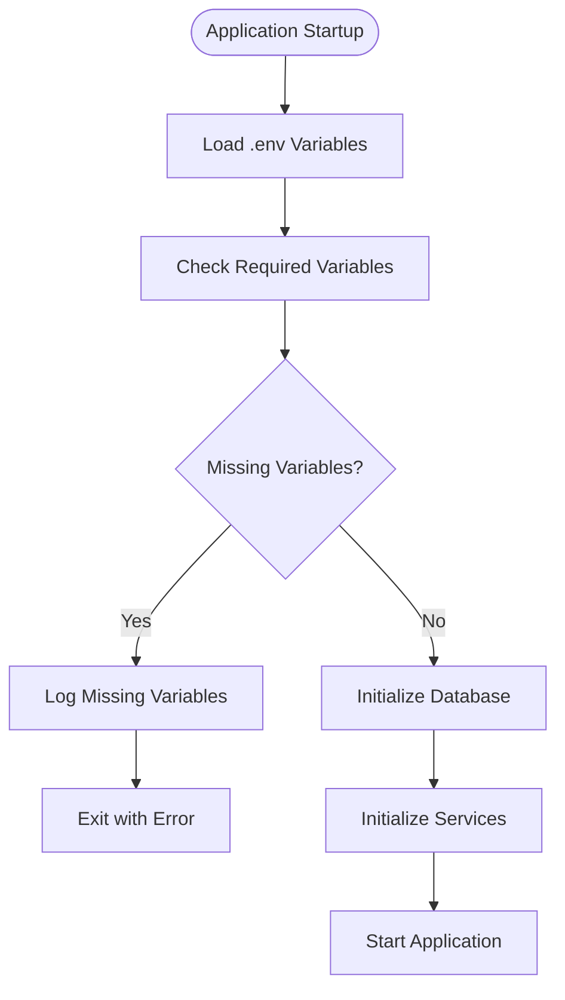
```mermaid
flowchart TD
Startup([Application Startup]) --> LoadEnv["Load .env Variables"]
LoadEnv --> CheckRequired["Check Required Variables"]
CheckRequired --> MissingVars{"Missing Variables?"}
MissingVars --> |Yes| LogMissing["Log Missing Variables"]
LogMissing --> ExitProcess["Exit with Error"]
MissingVars --> |No| InitDatabase["Initialize Database"]
InitDatabase --> InitServices["Initialize Services"]
InitServices --> StartApplication["Start Application"]
```

**Diagram sources**
- [index.js:13-21](file://src/index.js#L13-L21)

**Section sources**
- [index.js:13-21](file://src/index.js#L13-L21)

## Dependency Analysis

The database layer maintains loose coupling with other application components:

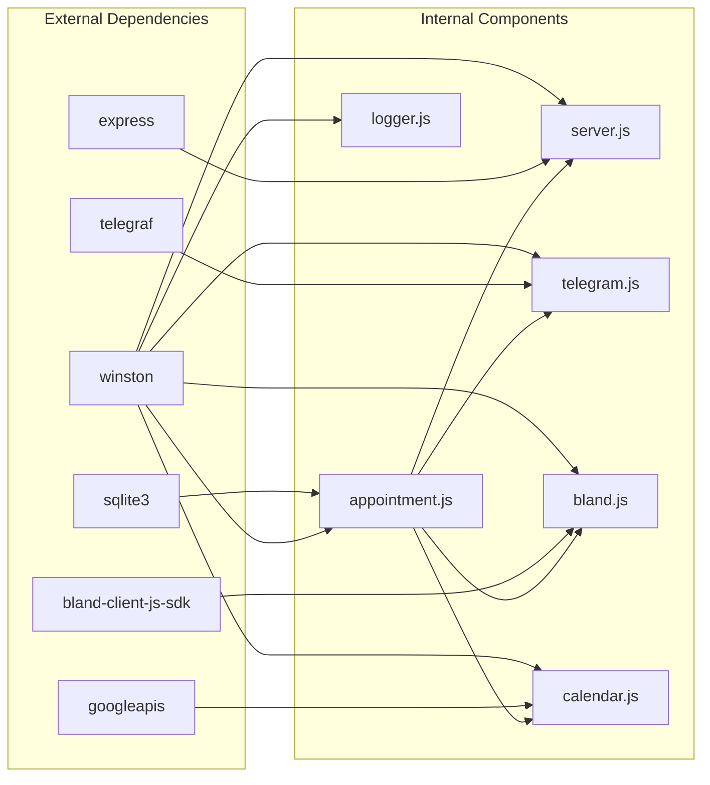
```mermaid
graph LR
subgraph "External Dependencies"
A[sqlite3]
B[winston]
C[express]
D[telegraf]
E[googleapis]
F[bland-client-js-sdk]
end
subgraph "Internal Components"
G[appointment.js]
H[server.js]
I[telegram.js]
J[bland.js]
K[calendar.js]
L[logger.js]
end
A --> G
B --> G
B --> H
B --> I
B --> J
B --> K
B --> L
C --> H
D --> I
F --> J
E --> K
G --> H
G --> I
G --> J
G --> K
```

**Diagram sources**
- [package.json:21-28](file://package.json#L21-L28)
- [appointment.js:1-3](file://src/models/appointment.js#L1-L3)

**Section sources**
- [package.json:21-28](file://package.json#L21-L28)
- [appointment.js:1-3](file://src/models/appointment.js#L1-L3)

## Performance Considerations

### Enhanced Query Optimization Strategies

The current implementation includes several optimization approaches:

1. **Index Strategy Recommendations**:
   - Primary key index on `id` (automatic)
   - Consider adding composite indexes for frequent queries:
     - `(telegram_user_id, created_at DESC)`
     - `(status, created_at ASC)`
     - `(call_id)`
     - `(name COLLATE NOCASE)`

2. **Query Patterns**:
   - Use parameterized queries to prevent SQL injection
   - Implement pagination for large result sets
   - Optimize ORDER BY clauses with appropriate indexes
   - Use CASE statements for complex filtering

3. **Connection Management**:
   - Single database connection per process
   - Proper connection cleanup on shutdown
   - Connection pooling for high-concurrency scenarios

### Enhanced Data Access Methods

The model provides multiple access patterns optimized for different use cases:

| Method | Use Case | Performance Notes | Enhanced Features |
|--------|----------|-------------------|-------------------|
| `getById` | Direct lookup | O(1) with primary key | Case-insensitive institute matching |
| `getByUserId` | History browsing | O(log n) with proper indexing | Pagination support |
| `getPendingAppointments` | Queue processing | O(n) scan, optimize with status index | Sorting by creation time |
| `updateStatus` | Status updates | O(1) with proper constraints | Atomic field updates |
| `addInstitute` | Upsert operations | O(log n) with unique constraint | Conflict resolution |
| `searchInstitutes` | Text search | O(n) linear scan, optimize with text index | Wildcard matching |

**Section sources**
- [appointment.js:172-332](file://src/models/appointment.js#L172-L332)

## Troubleshooting Guide

### Enhanced Database Issues

#### Connection Problems
- **Symptom**: Database fails to initialize
- **Cause**: Incorrect database path or permissions
- **Solution**: Verify DATABASE_PATH environment variable and file permissions

#### Migration Issues
- **Symptom**: Schema conflicts after updates
- **Cause**: Version mismatches or concurrent access
- **Solution**: Implement proper migration scripts and connection pooling

#### Performance Degradation
- **Symptom**: Slow query responses
- **Cause**: Missing indexes or large table growth
- **Solution**: Add appropriate indexes and consider table maintenance

### Enhanced Error Handling Patterns

The system implements comprehensive error handling with detailed logging:

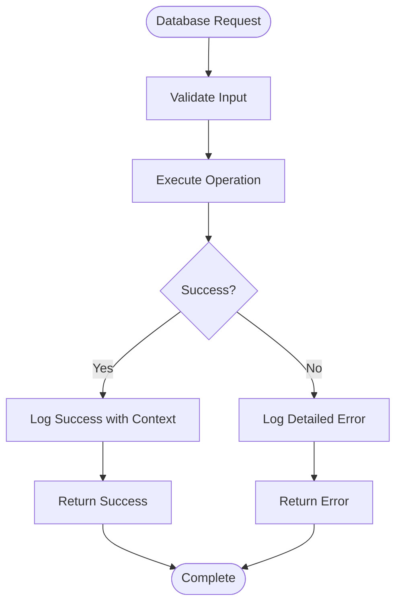
```mermaid
flowchart TD
Request([Database Request]) --> Validate["Validate Input"]
Validate --> Execute["Execute Operation"]
Execute --> Success{"Success?"}
Success --> |Yes| LogSuccess["Log Success with Context"]
LogSuccess --> ReturnResult["Return Success"]
Success --> |No| LogError["Log Detailed Error"]
LogError --> ReturnError["Return Error"]
ReturnResult --> End([Complete])
ReturnError --> End
```

**Diagram sources**
- [appointment.js:113-122](file://src/models/appointment.js#L113-L122)
- [appointment.js:160-169](file://src/models/appointment.js#L160-L169)

**Section sources**
- [appointment.js:113-122](file://src/models/appointment.js#L113-L122)
- [appointment.js:160-169](file://src/models/appointment.js#L160-L169)

### Graceful Shutdown Issues

#### Shutdown Failure Scenarios
- **Symptom**: Application doesn't terminate cleanly
- **Cause**: Unclosed connections or active resources
- **Solution**: Verify shutdown handlers and resource cleanup

#### Signal Handling Problems
- **Symptom**: Ctrl+C doesn't work properly
- **Cause**: Signal handlers not registered
- **Solution**: Ensure SIGTERM/SIGINT handlers are set up

**Section sources**
- [index.js:58-87](file://src/index.js#L58-L87)

## Conclusion

The SQLite database management system provides a robust foundation for the Appointment Voice Agent application. The implementation demonstrates sound architectural principles with proper separation of concerns, comprehensive error handling, efficient query patterns, and sophisticated resource management.

Key strengths of the enhanced implementation include:
- Clear schema design optimized for the use case with institute management
- Comprehensive CRUD operations with proper validation and atomic updates
- Robust status management and lifecycle tracking with institute integration
- Enhanced error handling and logging throughout the system
- Sophisticated graceful shutdown mechanisms with proper resource cleanup
- Integration with external services through webhook processing
- Comprehensive institute directory functionality with search capabilities

Areas for potential enhancement include implementing proper database migrations, adding comprehensive indexing strategies, and incorporating connection pooling for improved scalability. The current design provides an excellent foundation for future growth while maintaining simplicity and reliability.

**Updated** The 354-line implementation represents a mature database layer with complete CRUD operations, proper initialization sequences, comprehensive error handling, institute management capabilities, and sophisticated graceful shutdown mechanisms, making it a solid foundation for the voice-assisted appointment scheduling system.