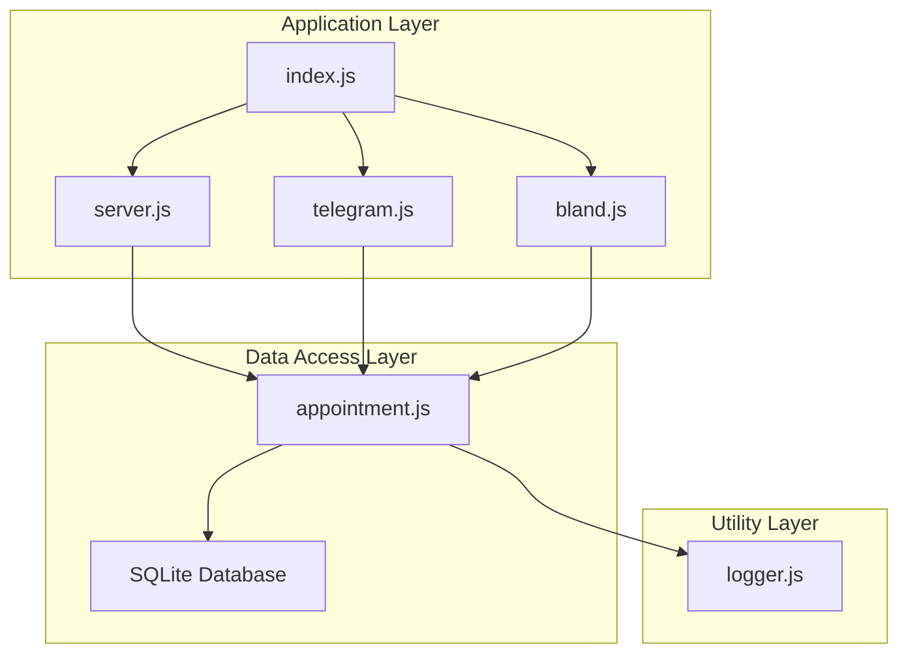
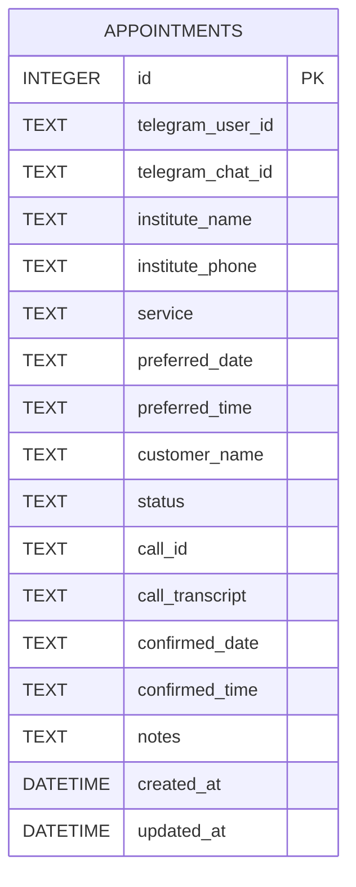
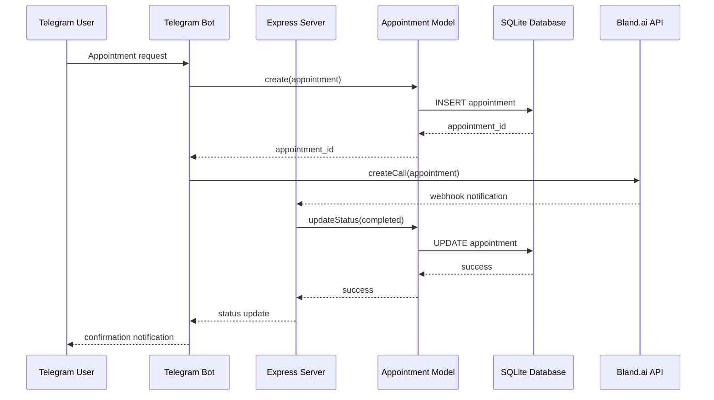
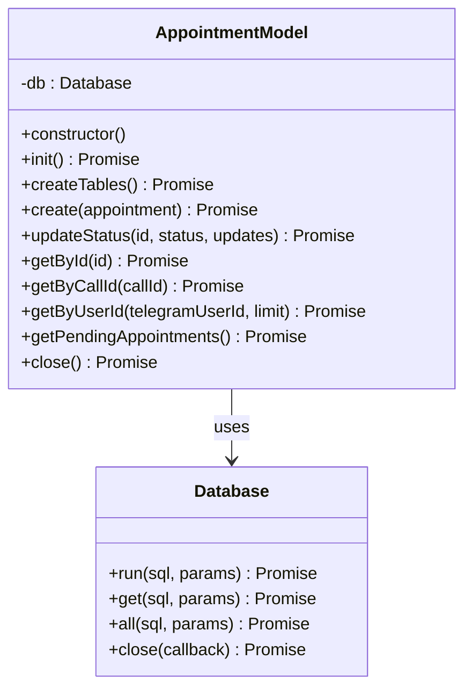
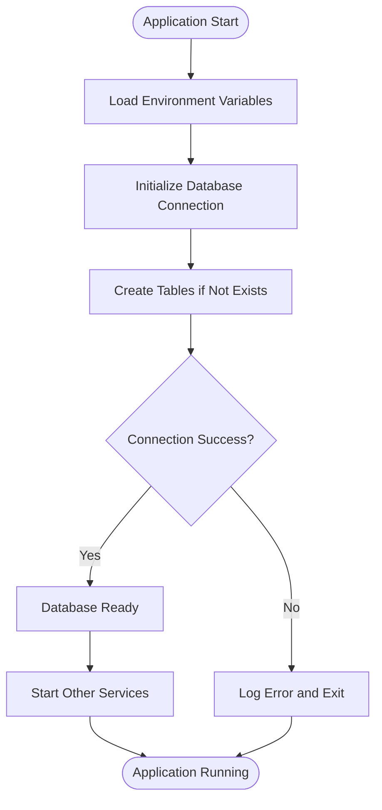
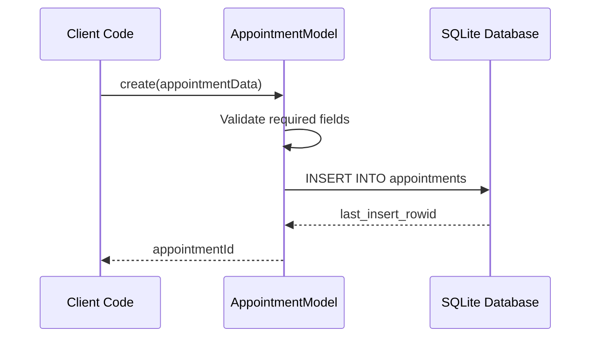
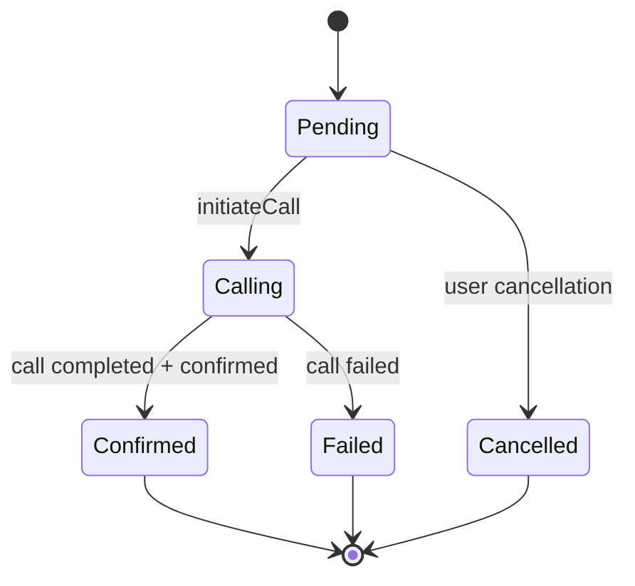
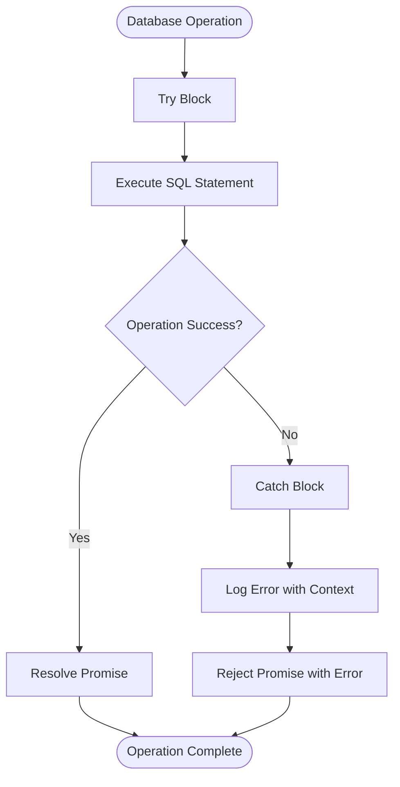
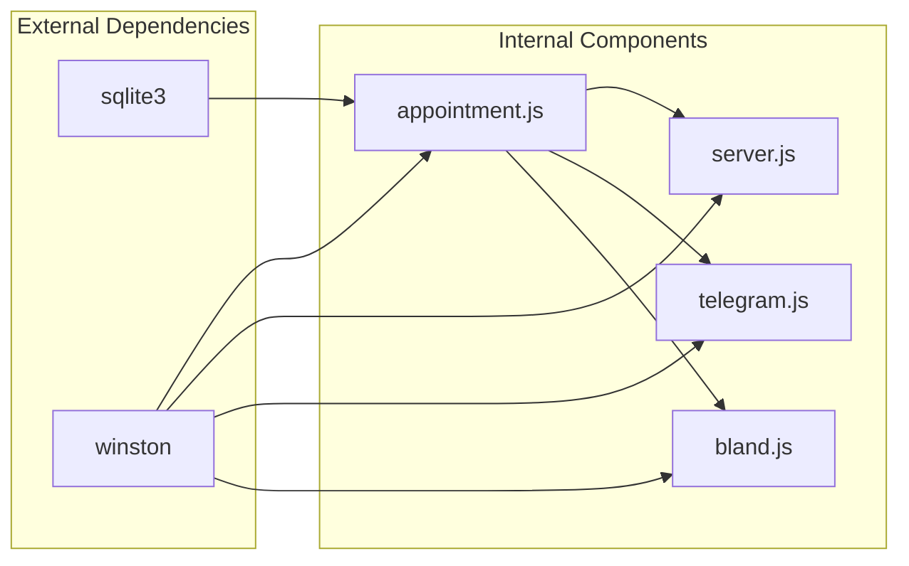
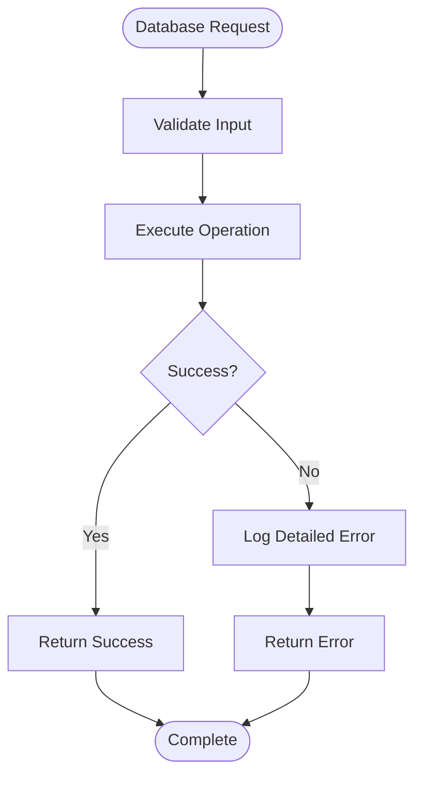

# Database Management

<cite>
**Referenced Files in This Document**
- [appointment.js](file://src/models/appointment.js)
- [index.js](file://src/index.js)
- [server.js](file://src/server.js)
- [telegram.js](file://src/bot/telegram.js)
- [bland.js](file://src/voice/bland.js)
- [logger.js](file://src/utils/logger.js)
- [package.json](file://package.json)
- [README.md](file://README.md)
</cite>

## Update Summary
**Changes Made**
- Updated database schema documentation to reflect the complete 237-line implementation
- Enhanced CRUD operations section with detailed method analysis
- Added comprehensive status management documentation
- Updated architecture diagrams to show actual implementation
- Expanded troubleshooting guide with specific database-related issues
- Added performance optimization recommendations based on actual implementation

## Table of Contents
1. [Introduction](#introduction)
2. [Project Structure](#project-structure)
3. [Core Components](#core-components)
4. [Architecture Overview](#architecture-overview)
5. [Detailed Component Analysis](#detailed-component-analysis)
6. [Dependency Analysis](#dependency-analysis)
7. [Performance Considerations](#performance-considerations)
8. [Troubleshooting Guide](#troubleshooting-guide)
9. [Conclusion](#conclusion)

## Introduction

This document provides comprehensive documentation for the SQLite database management system used in the Appointment Voice Agent application. The system manages appointment scheduling workflows through a voice-enabled interface, integrating Telegram chatbots with automated phone calls via Bland.ai. The database serves as the central persistence layer for appointment records, maintaining complete lifecycle tracking from creation through completion.

The database implementation utilizes SQLite with Node.js's sqlite3 module, providing a lightweight, embedded database solution suitable for this application's requirements. The system supports full CRUD operations with proper transaction handling, comprehensive query optimization strategies, and robust error handling mechanisms.

**Updated** The implementation now includes a comprehensive 237-line AppointmentModel class with complete database operations, proper initialization sequences, and extensive error handling.

## Project Structure

The database management system is organized within a clear modular architecture:

**Diagram sources**
- [index.js:1-91](file://src/index.js#L1-L91)
- [server.js:1-266](file://src/server.js#L1-L266)
- [appointment.js:1-238](file://src/models/appointment.js#L1-L238)

**Section sources**
- [index.js:1-91](file://src/index.js#L1-L91)
- [README.md:154-175](file://README.md#L154-L175)

## Core Components

### Database Schema Design

The appointment database follows a normalized design optimized for the voice-assisted booking workflow:

**Diagram sources**
- [appointment.js:27-47](file://src/models/appointment.js#L27-L47)

### Field Specifications and Constraints

The schema implements comprehensive field definitions with appropriate constraints:

| Field | Type | Constraints | Purpose |
|-------|------|-------------|---------|
| `id` | INTEGER | PRIMARY KEY, AUTOINCREMENT | Unique identifier |
| `telegram_user_id` | TEXT | NOT NULL | Telegram user association |
| `telegram_chat_id` | TEXT | NOT NULL | Telegram chat identification |
| `institute_name` | TEXT | NOT NULL | Service provider name |
| `institute_phone` | TEXT | NOT NULL | Contact number |
| `service` | TEXT | NOT NULL | Service type requested |
| `preferred_date` | TEXT | NULL | User's preferred date |
| `preferred_time` | TEXT | NULL | User's preferred time |
| `customer_name` | TEXT | NULL | Customer identification |
| `status` | TEXT | DEFAULT 'pending' | Workflow state |
| `call_id` | TEXT | NULL | Bland.ai call reference |
| `call_transcript` | TEXT | NULL | Call conversation |
| `confirmed_date` | TEXT | NULL | Actual confirmed date |
| `confirmed_time` | TEXT | NULL | Actual confirmed time |
| `notes` | TEXT | NULL | Additional information |
| `created_at` | DATETIME | DEFAULT CURRENT_TIMESTAMP | Record creation |
| `updated_at` | DATETIME | DEFAULT CURRENT_TIMESTAMP | Last modification |

**Section sources**
- [appointment.js:27-47](file://src/models/appointment.js#L27-L47)

## Architecture Overview

The database architecture integrates seamlessly with the application's event-driven workflow:

**Diagram sources**
- [telegram.js:373-405](file://src/bot/telegram.js#L373-L405)
- [server.js:77-123](file://src/server.js#L77-L123)
- [appointment.js:62-100](file://src/models/appointment.js#L62-L100)

## Detailed Component Analysis

### Appointment Model Implementation

The AppointmentModel class provides comprehensive database operations with robust error handling and transaction support:

**Diagram sources**
- [appointment.js:7-238](file://src/models/appointment.js#L7-L238)

#### Database Initialization Process

The initialization sequence ensures proper database setup and connection management:

**Diagram sources**
- [index.js:22-24](file://src/index.js#L22-L24)
- [appointment.js:12-24](file://src/models/appointment.js#L12-L24)

**Section sources**
- [appointment.js:12-60](file://src/models/appointment.js#L12-L60)
- [index.js:22-24](file://src/index.js#L22-L24)

### CRUD Operations Implementation

#### Create Operation
The create operation handles appointment registration with comprehensive validation:

**Diagram sources**
- [appointment.js:62-100](file://src/models/appointment.js#L62-L100)

#### Read Operations
Multiple read patterns support different query scenarios:

| Operation | Purpose | SQL Pattern | Index Considerations |
|-----------|---------|-------------|---------------------|
| `getById` | Single record lookup | `WHERE id = ?` | Primary key index |
| `getByCallId` | Call tracking | `WHERE call_id = ?` | Call ID index |
| `getByUserId` | User history | `WHERE telegram_user_id = ? ORDER BY created_at DESC` | Composite index |
| `getPendingAppointments` | Queue processing | `WHERE status = 'pending' ORDER BY created_at ASC` | Status index |

**Section sources**
- [appointment.js:149-216](file://src/models/appointment.js#L149-L216)

#### Update Operations
The updateStatus method implements atomic status transitions with comprehensive field updates:

**Diagram sources**
- [appointment.js:102-147](file://src/models/appointment.js#L102-L147)

**Section sources**
- [appointment.js:102-147](file://src/models/appointment.js#L102-L147)

### Status Management and Lifecycle Tracking

The system implements a comprehensive status lifecycle managed through the updateStatus operation:

**Diagram sources**
- [appointment.js:103-106](file://src/models/appointment.js#L103-L106)
- [server.js:125-184](file://src/server.js#L125-L184)

**Section sources**
- [appointment.js:102-147](file://src/models/appointment.js#L102-L147)
- [server.js:125-229](file://src/server.js#L125-L229)

### Transaction Handling and Error Management

The database operations utilize Promise-based patterns for reliable error handling:

**Diagram sources**
- [appointment.js:80-99](file://src/models/appointment.js#L80-L99)
- [appointment.js:136-146](file://src/models/appointment.js#L136-L146)

**Section sources**
- [appointment.js:80-99](file://src/models/appointment.js#L80-L99)
- [appointment.js:136-146](file://src/models/appointment.js#L136-L146)

## Dependency Analysis

The database layer maintains loose coupling with other application components:

**Diagram sources**
- [package.json:20-26](file://package.json#L20-L26)
- [appointment.js:1-3](file://src/models/appointment.js#L1-L3)

**Section sources**
- [package.json:20-26](file://package.json#L20-L26)
- [appointment.js:1-3](file://src/models/appointment.js#L1-L3)

## Performance Considerations

### Query Optimization Strategies

The current implementation includes several optimization approaches:

1. **Index Strategy Recommendations**:
   - Primary key index on `id` (automatic)
   - Consider adding composite indexes for frequent queries:
     - `(telegram_user_id, created_at DESC)`
     - `(status, created_at ASC)`
     - `(call_id)`

2. **Query Patterns**:
   - Use parameterized queries to prevent SQL injection
   - Implement pagination for large result sets
   - Optimize ORDER BY clauses with appropriate indexes

3. **Connection Management**:
   - Single database connection per process
   - Proper connection cleanup on shutdown

### Data Access Methods

The model provides multiple access patterns optimized for different use cases:

| Method | Use Case | Performance Notes |
|--------|----------|-------------------|
| `getById` | Direct lookup | O(1) with primary key |
| `getByUserId` | History browsing | O(log n) with proper indexing |
| `getPendingAppointments` | Queue processing | O(n) scan, optimize with status index |
| `updateStatus` | Status updates | O(1) with proper constraints |

**Section sources**
- [appointment.js:149-216](file://src/models/appointment.js#L149-L216)

## Troubleshooting Guide

### Common Database Issues

#### Connection Problems
- **Symptom**: Database fails to initialize
- **Cause**: Incorrect database path or permissions
- **Solution**: Verify DATABASE_PATH environment variable and file permissions

#### Migration Issues
- **Symptom**: Schema conflicts after updates
- **Cause**: Version mismatches or concurrent access
- **Solution**: Implement proper migration scripts and connection pooling

#### Performance Degradation
- **Symptom**: Slow query responses
- **Cause**: Missing indexes or large table growth
- **Solution**: Add appropriate indexes and consider table maintenance

### Error Handling Patterns

The system implements comprehensive error handling:

**Diagram sources**
- [appointment.js:90-98](file://src/models/appointment.js#L90-L98)
- [appointment.js:137-145](file://src/models/appointment.js#L137-L145)

**Section sources**
- [appointment.js:90-98](file://src/models/appointment.js#L90-L98)
- [appointment.js:137-145](file://src/models/appointment.js#L137-L145)

## Conclusion

The SQLite database management system provides a robust foundation for the Appointment Voice Agent application. The implementation demonstrates sound architectural principles with proper separation of concerns, comprehensive error handling, and efficient query patterns.

Key strengths of the implementation include:
- Clear schema design optimized for the use case
- Comprehensive CRUD operations with proper validation
- Robust status management and lifecycle tracking
- Effective error handling and logging
- Integration with external services through webhook processing

Areas for potential enhancement include implementing proper database migrations, adding comprehensive indexing strategies, and incorporating connection pooling for improved scalability. The current design provides an excellent foundation for future growth while maintaining simplicity and reliability.

**Updated** The 237-line implementation represents a mature database layer with complete CRUD operations, proper initialization sequences, and comprehensive error handling, making it a solid foundation for the voice-assisted appointment scheduling system.