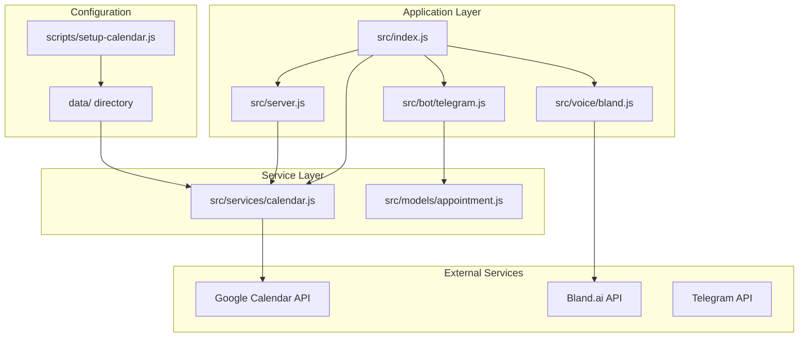
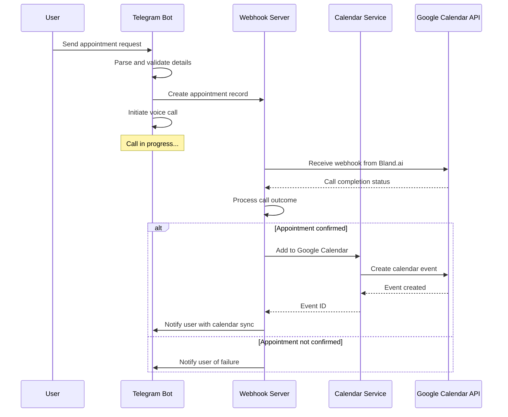
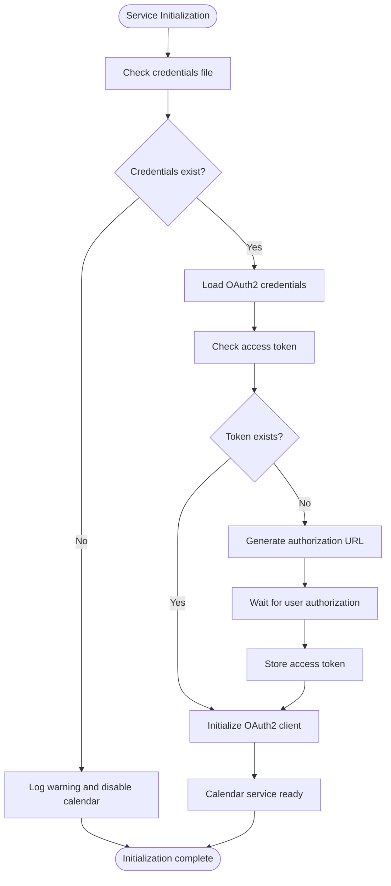
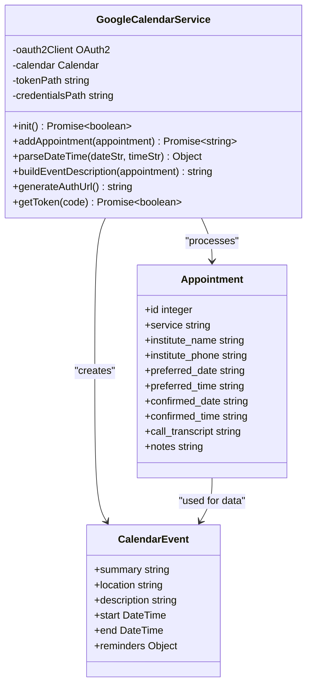
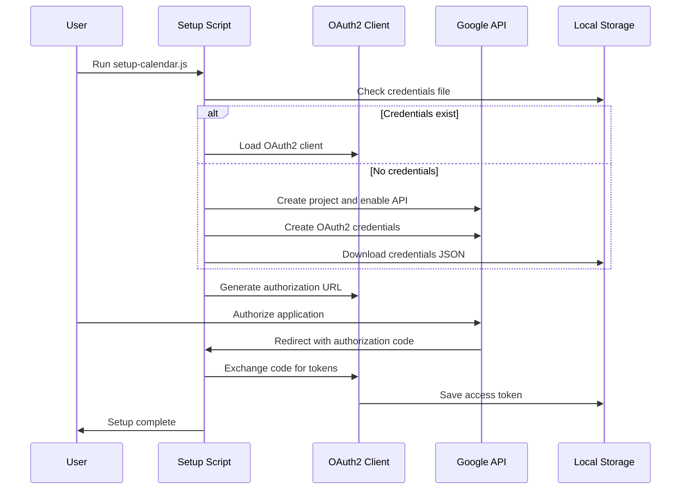
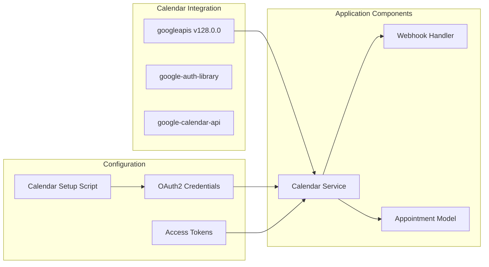

# Google Calendar Integration

<cite>
**Referenced Files in This Document**
- [README.md](file://README.md)
- [package.json](file://package.json)
- [src/index.js](file://src/index.js)
- [src/server.js](file://src/server.js)
- [src/services/calendar.js](file://src/services/calendar.js)
- [src/models/appointment.js](file://src/models/appointment.js)
- [src/voice/bland.js](file://src/voice/bland.js)
- [src/bot/telegram.js](file://src/bot/telegram.js)
- [scripts/setup-calendar.js](file://scripts/setup-calendar.js)
- [src/utils/logger.js](file://src/utils/logger.js)
</cite>

## Table of Contents
1. [Introduction](#introduction)
2. [Project Structure](#project-structure)
3. [Core Components](#core-components)
4. [Architecture Overview](#architecture-overview)
5. [Detailed Component Analysis](#detailed-component-analysis)
6. [Dependency Analysis](#dependency-analysis)
7. [Performance Considerations](#performance-considerations)
8. [Troubleshooting Guide](#troubleshooting-guide)
9. [Conclusion](#conclusion)

## Introduction
This document provides comprehensive documentation for the Google Calendar Integration within the Appointment Voice Agent system. The integration enables automatic synchronization of confirmed appointments into users' Google Calendars, providing seamless calendar management alongside the voice-assisted booking process.

The system leverages Google's Calendar API through OAuth2 authentication to create calendar events for confirmed appointments. The integration is designed to be resilient, with proper error handling and fallback mechanisms when calendar services are unavailable.

## Project Structure
The Google Calendar integration is implemented as a modular service within the broader appointment scheduling system:

**Diagram sources**
- [src/index.js:1-108](file://src/index.js#L1-L108)
- [src/server.js:8-351](file://src/server.js#L8-L351)
- [src/services/calendar.js:6-475](file://src/services/calendar.js#L6-L475)

**Section sources**
- [README.md:154-175](file://README.md#L154-L175)
- [package.json:1-37](file://package.json#L1-L37)

## Core Components

### GoogleCalendarService
The core calendar integration service provides comprehensive Google Calendar functionality including initialization, authentication, event creation, and management operations.

**Key Features:**
- OAuth2 authentication with credential storage
- Automatic event creation for confirmed appointments
- Flexible date/time parsing supporting natural language
- Comprehensive error handling and logging
- Event description generation with appointment details

**Section sources**
- [src/services/calendar.js:6-475](file://src/services/calendar.js#L6-L475)

### Calendar Setup Script
A comprehensive CLI tool that guides users through the complete Google Calendar API setup process, including project creation, API enabling, OAuth2 credential generation, and token authentication.

**Setup Process:**
1. Creates Google Cloud Project
2. Enables Calendar API
3. Generates OAuth2 credentials
4. Authenticates user
5. Stores authentication tokens

**Section sources**
- [scripts/setup-calendar.js:1-197](file://scripts/setup-calendar.js#L1-L197)

### Integration Architecture
The calendar service integrates seamlessly with the appointment lifecycle, automatically adding events when calls are completed successfully.

**Diagram sources**
- [src/server.js:186-269](file://src/server.js#L186-L269)
- [src/services/calendar.js:96-163](file://src/services/calendar.js#L96-L163)

**Section sources**
- [src/server.js:186-269](file://src/server.js#L186-L269)
- [src/services/calendar.js:96-163](file://src/services/calendar.js#L96-L163)

## Architecture Overview

### Calendar Service Initialization
The calendar service follows a robust initialization pattern that handles both successful setup and graceful degradation when authentication is unavailable.

**Diagram sources**
- [src/services/calendar.js:18-55](file://src/services/calendar.js#L18-L55)

### Date/Time Parsing System
The calendar integration includes sophisticated date and time parsing that supports natural language expressions commonly used in appointment scheduling.

**Supported Formats:**
- Absolute dates: "March 15, 2026", "03/15/2026"
- Relative dates: "today", "tomorrow", "next Monday"
- Spelled-out dates: "April tenth", "May fifth"
- Time formats: "3pm", "15:00", "10:30 AM"
- Natural language: "afternoon", "morning", "evening"

**Section sources**
- [src/services/calendar.js:171-269](file://src/services/calendar.js#L171-L269)

## Detailed Component Analysis

### Calendar Event Creation Process
When an appointment is successfully confirmed, the system creates a comprehensive calendar event with detailed information and appropriate reminders.

**Diagram sources**
- [src/services/calendar.js:6-475](file://src/services/calendar.js#L6-L475)
- [src/models/appointment.js:7-354](file://src/models/appointment.js#L7-L354)

### Authentication Flow
The calendar authentication system implements a complete OAuth2 flow with proper credential management and token persistence.

**Diagram sources**
- [scripts/setup-calendar.js:43-120](file://scripts/setup-calendar.js#L43-L120)
- [src/services/calendar.js:74-89](file://src/services/calendar.js#L74-L89)

**Section sources**
- [scripts/setup-calendar.js:43-120](file://scripts/setup-calendar.js#L43-L120)
- [src/services/calendar.js:74-89](file://src/services/calendar.js#L74-L89)

### Webhook Integration
The calendar service participates in the webhook processing pipeline, automatically adding events when call outcomes indicate successful appointment confirmation.

**Processing Logic:**
1. Receive Bland.ai webhook with call status
2. Parse appointment details from transcript
3. Update appointment status to confirmed
4. Create calendar event with parsed timing
5. Store calendar event ID for future reference
6. Notify user of successful calendar sync

**Section sources**
- [src/server.js:186-269](file://src/server.js#L186-L269)
- [src/services/calendar.js:96-163](file://src/services/calendar.js#L96-L163)

## Dependency Analysis

### External Dependencies
The calendar integration relies on several key external services and libraries:

**Diagram sources**
- [package.json:25](file://package.json#L25)
- [src/services/calendar.js:1-5](file://src/services/calendar.js#L1-L5)

### Internal Dependencies
The calendar service maintains clean separation of concerns while integrating with multiple application components.

**Dependency Chain:**
1. **Initialization**: src/index.js → src/services/calendar.js
2. **Webhook Processing**: src/server.js → src/services/calendar.js
3. **Data Access**: src/services/calendar.js → src/models/appointment.js
4. **Configuration**: scripts/setup-calendar.js → src/services/calendar.js

**Section sources**
- [package.json:25](file://package.json#L25)
- [src/index.js:27-32](file://src/index.js#L27-L32)

## Performance Considerations

### Asynchronous Operations
The calendar integration is designed to minimize impact on the main application flow through asynchronous operations and non-blocking API calls.

**Performance Characteristics:**
- Calendar operations are performed asynchronously after primary call processing
- Failed calendar operations do not block appointment confirmation flow
- Token refresh and validation occur during initialization
- Event creation uses efficient batch operations where possible

### Error Resilience
The system implements comprehensive error handling to ensure calendar integration failures don't impact core functionality.

**Failure Scenarios Handled:**
- Missing authentication credentials
- Expired or invalid access tokens
- Google Calendar API rate limiting
- Network connectivity issues
- Invalid date/time parsing

## Troubleshooting Guide

### Common Issues and Solutions

**Calendar Service Disabled**
- **Symptom**: Calendar integration appears inactive
- **Cause**: Missing credentials file or authentication failure
- **Solution**: Run `npm run setup:calendar` to reconfigure

**Authentication Failures**
- **Symptom**: Calendar operations fail with authentication errors
- **Cause**: Expired or invalid access tokens
- **Solution**: Re-run setup script and re-authorize the application

**Date/Time Parsing Errors**
- **Symptom**: Calendar events created with incorrect timing
- **Cause**: Ambiguous date/time expressions
- **Solution**: Provide more specific date/time information in natural language

**API Rate Limiting**
- **Symptom**: Calendar API requests failing intermittently
- **Cause**: Exceeding Google Calendar API quotas
- **Solution**: Implement retry logic with exponential backoff

**Section sources**
- [src/services/calendar.js:18-55](file://src/services/calendar.js#L18-L55)
- [scripts/setup-calendar.js:168-176](file://scripts/setup-calendar.js#L168-L176)

### Debugging Calendar Operations
Enable detailed logging to troubleshoot calendar integration issues:

1. Set `LOG_LEVEL=debug` in environment variables
2. Monitor logs for calendar initialization messages
3. Check for OAuth2 authentication flow logs
4. Verify calendar event creation timestamps
5. Review error messages for specific failure points

**Section sources**
- [src/utils/logger.js:1-28](file://src/utils/logger.js#L1-L28)
- [src/services/calendar.js:44-45](file://src/services/calendar.js#L44-L45)

## Conclusion

The Google Calendar Integration provides a robust, production-ready solution for synchronizing confirmed appointments with users' personal calendars. The implementation demonstrates excellent separation of concerns, comprehensive error handling, and user-friendly setup processes.

Key strengths of the integration include:
- **Seamless User Experience**: Automatic calendar synchronization without user intervention
- **Resilient Design**: Graceful degradation when calendar services are unavailable
- **Comprehensive Setup**: Complete OAuth2 authentication flow with guided configuration
- **Flexible Date/Time Parsing**: Support for natural language expressions commonly used in scheduling
- **Production-Ready**: Proper error handling, logging, and monitoring capabilities

The integration successfully bridges the gap between automated voice-assisted appointment booking and personal calendar management, providing users with a complete solution for their scheduling needs.