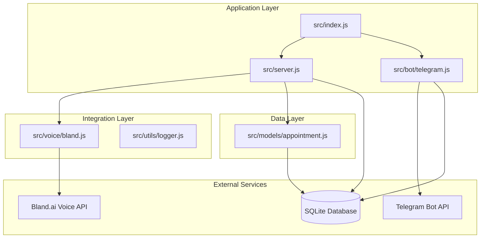
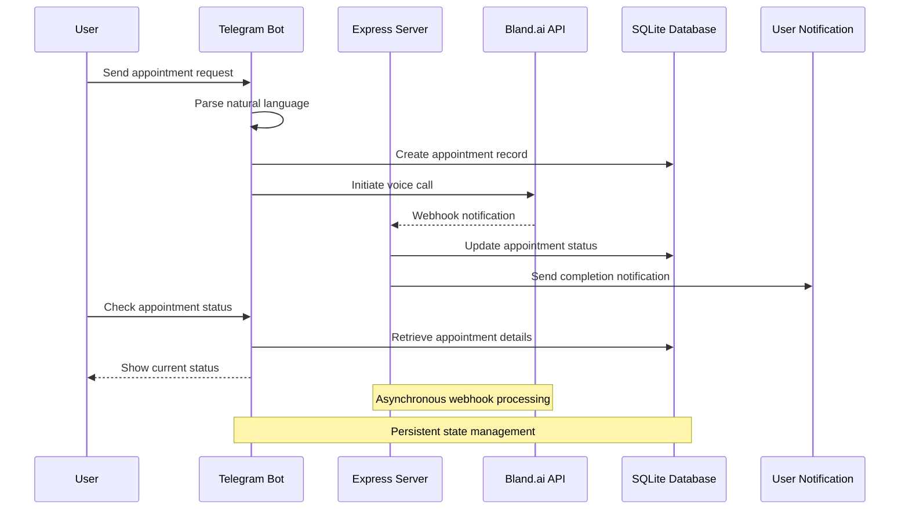
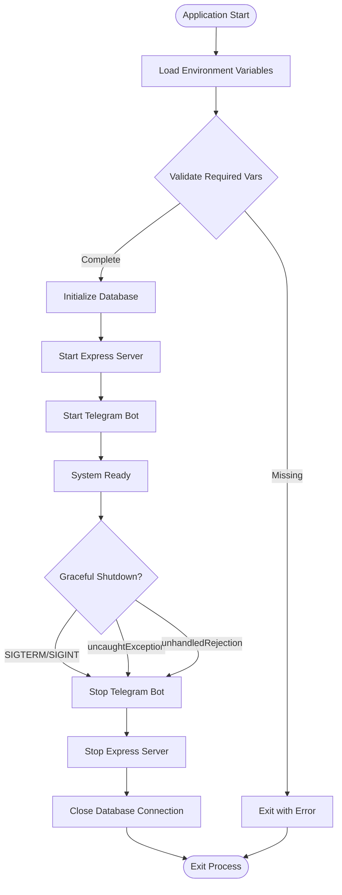
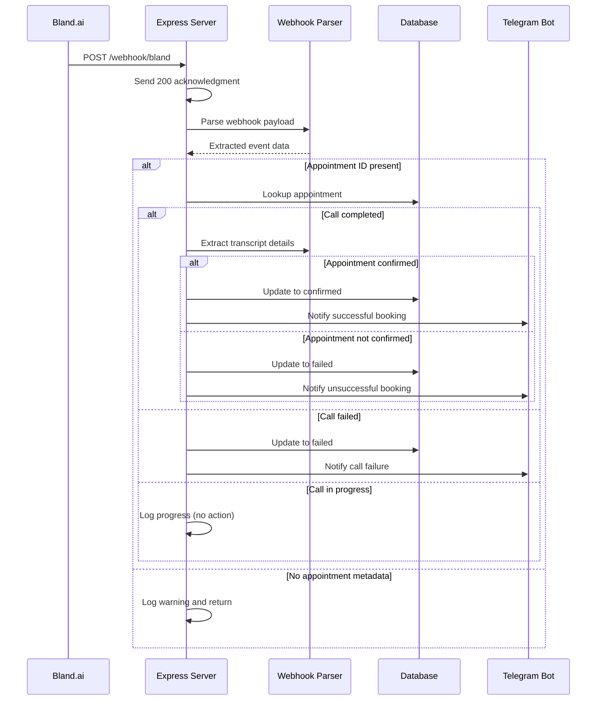
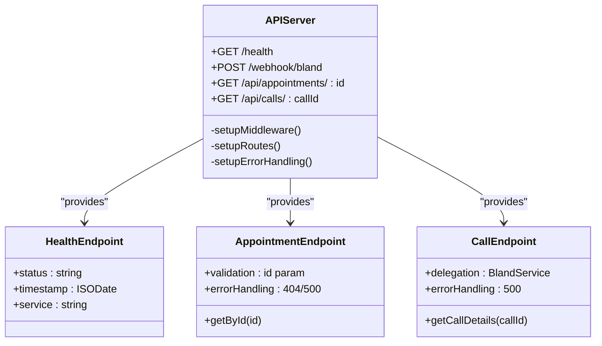
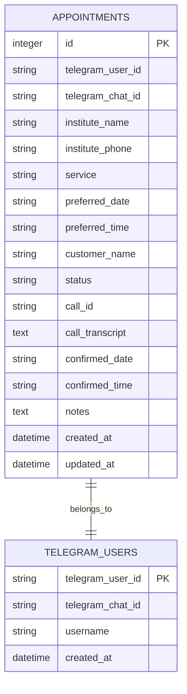
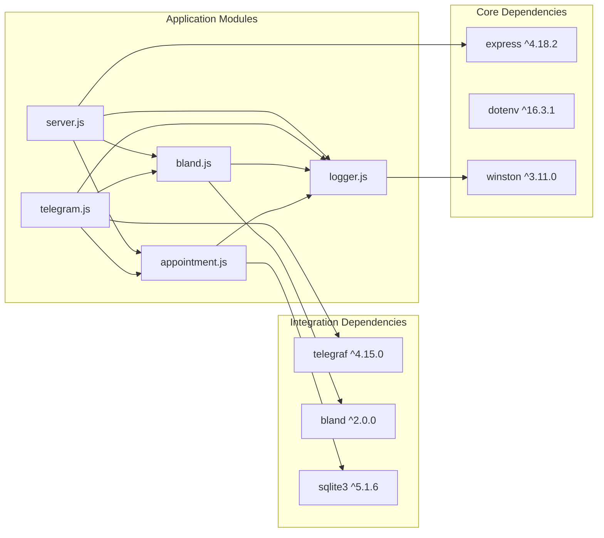

# Server and Webhook Handling

<cite>
**Referenced Files in This Document**
- [index.js](file://src/index.js)
- [server.js](file://src/server.js)
- [bland.js](file://src/voice/bland.js)
- [appointment.js](file://src/models/appointment.js)
- [logger.js](file://src/utils/logger.js)
- [telegram.js](file://src/bot/telegram.js)
- [package.json](file://package.json)
- [README.md](file://README.md)
</cite>

## Update Summary
**Changes Made**
- Updated Express server implementation documentation to reflect the complete 265-line server.js implementation
- Added detailed webhook processing logic documentation
- Enhanced API endpoint documentation with specific routes and handlers
- Updated architecture diagrams to show the new server structure
- Added comprehensive error handling and graceful shutdown documentation
- Expanded troubleshooting guide with server-specific issues

## Table of Contents
1. [Introduction](#introduction)
2. [Project Structure](#project-structure)
3. [Core Components](#core-components)
4. [Architecture Overview](#architecture-overview)
5. [Detailed Component Analysis](#detailed-component-analysis)
6. [Dependency Analysis](#dependency-analysis)
7. [Performance Considerations](#performance-considerations)
8. [Troubleshooting Guide](#troubleshooting-guide)
9. [Conclusion](#conclusion)

## Introduction

The Appointment Voice Agent is a Node.js application that integrates Telegram chatbots with Bland.ai voice services to automate appointment scheduling. The system consists of three main components: a Telegram bot interface for user interaction, an Express server for webhook handling and API endpoints, and a SQLite database for persistent storage.

The server handles Bland.ai webhook notifications, processes call status updates, and maintains real-time communication with users through Telegram notifications. The system is designed for production deployment with proper logging, error handling, and graceful shutdown capabilities.

**Section sources**
- [README.md:1-200](file://README.md#L1-L200)

## Project Structure

The application follows a modular architecture with clear separation of concerns:

**Diagram sources**
- [index.js:1-91](file://src/index.js#L1-L91)
- [server.js:1-266](file://src/server.js#L1-L266)
- [telegram.js:1-461](file://src/bot/telegram.js#L1-L461)
- [bland.js:1-272](file://src/voice/bland.js#L1-L272)
- [appointment.js:1-238](file://src/models/appointment.js#L1-L238)

**Section sources**
- [README.md:154-175](file://README.md#L154-L175)
- [package.json:1-35](file://package.json#L1-L35)

## Core Components

### Express Server Configuration

The Express server provides the foundation for webhook handling and API management. It includes comprehensive middleware setup, routing configuration, and error handling mechanisms.

**Key Features:**
- JSON and URL-encoded body parsing
- Request logging with IP and user agent tracking
- Health check endpoint for monitoring
- Bland.ai webhook endpoint for call status updates
- Debugging endpoints for appointment and call details
- Global error handling with structured responses
- Graceful shutdown capabilities

**Updated** Enhanced with comprehensive middleware setup and error handling

**Section sources**
- [server.js:16-31](file://src/server.js#L16-L31)
- [server.js:33-75](file://src/server.js#L33-L75)
- [server.js:231-240](file://src/server.js#L231-L240)
- [server.js:242-262](file://src/server.js#L242-L262)

### Bland.ai Integration Service

The Bland.ai service handles all voice-related operations including call creation, webhook processing, and transcript analysis.

**Core Functions:**
- Call initiation with custom prompts and metadata
- Webhook payload parsing and validation
- Transcript analysis for appointment confirmation
- Call termination and status monitoring
- Integration with external voice API

**Section sources**
- [bland.js:4-52](file://src/voice/bland.js#L4-L52)
- [bland.js:118-149](file://src/voice/bland.js#L118-L149)
- [bland.js:155-215](file://src/voice/bland.js#L155-L215)

### Appointment Management System

The SQLite-based appointment model provides comprehensive CRUD operations and status tracking for all scheduled appointments.

**Database Schema:**
- Auto-incrementing primary key
- User identification and contact information
- Institute details and service preferences
- Status tracking (pending, calling, confirmed, failed, cancelled)
- Call metadata and transcription storage
- Timestamps for creation and updates

**Section sources**
- [appointment.js:26-60](file://src/models/appointment.js#L26-L60)
- [appointment.js:102-147](file://src/models/appointment.js#L102-L147)

### Telegram Bot Integration

The Telegram bot provides natural language processing for appointment requests and real-time notification delivery.

**Capabilities:**
- Natural language parsing for appointment details
- Interactive confirmation workflows
- Inline keyboard navigation
- Real-time call status notifications
- User session management

**Section sources**
- [telegram.js:13-37](file://src/bot/telegram.js#L13-L37)
- [telegram.js:182-224](file://src/bot/telegram.js#L182-L224)
- [telegram.js:373-405](file://src/bot/telegram.js#L373-L405)

## Architecture Overview

The system follows a microservice-like architecture with clear boundaries between components:

**Diagram sources**
- [telegram.js:373-405](file://src/bot/telegram.js#L373-L405)
- [server.js:77-123](file://src/server.js#L77-L123)
- [bland.js:23-52](file://src/voice/bland.js#L23-L52)

The architecture ensures loose coupling between components while maintaining reliable communication through well-defined interfaces and asynchronous processing patterns.

## Detailed Component Analysis

### Server Startup and Configuration

The application initialization process coordinates multiple services with proper error handling and graceful shutdown support.

**Diagram sources**
- [index.js:8-45](file://src/index.js#L8-L45)
- [index.js:47-87](file://src/index.js#L47-L87)

**Section sources**
- [index.js:12-20](file://src/index.js#L12-L20)
- [index.js:22-28](file://src/index.js#L22-L28)

### Webhook Processing Logic

The webhook endpoint handles Bland.ai call status notifications with immediate acknowledgment and asynchronous processing.

**Diagram sources**
- [server.js:77-123](file://src/server.js#L77-L123)
- [server.js:125-184](file://src/server.js#L125-L184)
- [server.js:186-218](file://src/server.js#L186-L218)

**Section sources**
- [server.js:77-123](file://src/server.js#L77-L123)
- [bland.js:123-149](file://src/voice/bland.js#L123-L149)

### API Endpoint Management

The server exposes several endpoints for monitoring, debugging, and integration purposes.

**Diagram sources**
- [server.js:34-75](file://src/server.js#L34-L75)

**Section sources**
- [server.js:34-75](file://src/server.js#L34-L75)

### Database Operations

The appointment model provides comprehensive database operations with proper error handling and transaction support.

**Diagram sources**
- [appointment.js:27-47](file://src/models/appointment.js#L27-L47)

**Section sources**
- [appointment.js:102-147](file://src/models/appointment.js#L102-L147)
- [appointment.js:164-177](file://src/models/appointment.js#L164-L177)

### Server Lifecycle Management

The server implements comprehensive lifecycle management with graceful shutdown capabilities.

**Lifecycle Features:**
- Server startup with port configuration
- Middleware initialization
- Route registration
- Error handling setup
- Graceful shutdown handling
- Signal-based shutdown (SIGTERM, SIGINT)
- Exception and rejection handling

**Section sources**
- [server.js:242-262](file://src/server.js#L242-L262)
- [index.js:47-87](file://src/index.js#L47-L87)

## Dependency Analysis

The application has a clean dependency structure with minimal coupling between components:

**Diagram sources**
- [package.json:20-34](file://package.json#L20-L34)
- [server.js:1-6](file://src/server.js#L1-L6)

**Section sources**
- [package.json:20-34](file://package.json#L20-L34)

## Performance Considerations

### Asynchronous Processing Patterns

The system implements several performance optimization strategies:

- **Immediate Webhook Acknowledgment**: Responds immediately to webhook requests to prevent timeout issues
- **Non-blocking Processing**: Processes webhook events asynchronously after acknowledging receipt
- **Connection Pooling**: Uses efficient database connections with proper cleanup
- **Memory Management**: Implements graceful shutdown to prevent memory leaks

### Scalability Factors

- **Horizontal Scaling**: Each component can potentially scale independently
- **Database Optimization**: SQLite provides good performance for moderate loads
- **External API Limits**: Bland.ai rate limits and connection pooling considerations
- **Memory Footprint**: Optimized for single-instance deployment scenarios

## Troubleshooting Guide

### Common Issues and Solutions

**Webhook Delivery Problems:**
- Verify webhook URL in Bland.ai settings matches configured WEBHOOK_URL
- Ensure server is publicly accessible during development (use ngrok)
- Check server logs for incoming webhook requests
- Validate webhook signature if implemented by Bland.ai

**Database Connection Issues:**
- Verify DATABASE_PATH environment variable
- Check file permissions for database directory
- Monitor database file growth and cleanup old records
- Implement database connection retry logic

**Telegram Bot Issues:**
- Verify TELEGRAM_BOT_TOKEN validity
- Check bot connectivity and network accessibility
- Monitor Telegram API rate limits
- Implement bot restart procedures

**Server Startup Issues:**
- Verify PORT environment variable is available
- Check required environment variables (TELEGRAM_BOT_TOKEN, BLAND_API_KEY, WEBHOOK_URL)
- Ensure database initialization completes successfully
- Monitor server startup logs for errors

**Section sources**
- [README.md:212-228](file://README.md#L212-L228)
- [server.js:231-240](file://src/server.js#L231-L240)

### Logging and Monitoring

The application provides comprehensive logging infrastructure:

- **File-based Logging**: Separate error and combined log files
- **Console Output**: Development-friendly colored console logging
- **Structured JSON**: Machine-readable log format for monitoring systems
- **Contextual Information**: Request details, user agents, and error stacks

**Section sources**
- [logger.js:3-28](file://src/utils/logger.js#L3-L28)

### Server-Specific Troubleshooting

**Health Check Failures:**
- Verify server is running on expected port
- Check /health endpoint response format
- Monitor server logs for startup errors

**Webhook Processing Issues:**
- Verify webhook endpoint accessibility
- Check appointment ID extraction from metadata
- Monitor webhook payload parsing errors
- Validate appointment existence in database

**API Endpoint Issues:**
- Check /api/appointments/:id endpoint for valid IDs
- Verify /api/calls/:callId endpoint accessibility
- Monitor database query errors
- Validate Bland.ai API connectivity

**Section sources**
- [server.js:34-75](file://src/server.js#L34-L75)
- [server.js:77-123](file://src/server.js#L77-L123)

## Conclusion

The Appointment Voice Agent demonstrates a well-architected system that successfully integrates multiple services while maintaining reliability and scalability. The Express server provides robust webhook handling with proper error management, the Bland.ai integration enables sophisticated voice automation, and the Telegram interface delivers excellent user experience.

Key strengths of the implementation include:

- **Clean Architecture**: Clear separation of concerns with well-defined interfaces
- **Production Ready**: Comprehensive error handling, logging, and graceful shutdown
- **Extensible Design**: Modular components that can be enhanced independently
- **Developer Experience**: Comprehensive documentation and debugging endpoints
- **Robust Server Implementation**: Complete Express server with proper lifecycle management

The system serves as an excellent foundation for voice-enabled appointment scheduling applications and can be extended with additional features such as webhook verification, enhanced transcript analysis, and advanced user session management.

**Updated** Enhanced with comprehensive server implementation details and improved error handling documentation