# Enhanced Webhook Processing

<cite>
**Referenced Files in This Document**
- [README.md](file://README.md)
- [package.json](file://package.json)
- [src/index.js](file://src/index.js)
- [src/server.js](file://src/server.js)
- [src/bot/telegram.js](file://src/bot/telegram.js)
- [src/voice/bland.js](file://src/voice/bland.js)
- [src/services/calendar.js](file://src/services/calendar.js)
- [src/models/appointment.js](file://src/models/appointment.js)
- [src/utils/logger.js](file://src/utils/logger.js)
- [scripts/setup-calendar.js](file://scripts/setup-calendar.js)
</cite>

## Table of Contents
1. [Introduction](#introduction)
2. [System Architecture](#system-architecture)
3. [Webhook Processing Engine](#webhook-processing-engine)
4. [Core Components](#core-components)
5. [Enhanced Webhook Flow](#enhanced-webhook-flow)
6. [Error Handling and Resilience](#error-handling-and-resilience)
7. [Data Processing Pipeline](#data-processing-pipeline)
8. [Integration Points](#integration-points)
9. [Performance Considerations](#performance-considerations)
10. [Troubleshooting Guide](#troubleshooting-guide)
11. [Conclusion](#conclusion)

## Introduction

The Enhanced Webhook Processing system is a sophisticated webhook handling mechanism designed for the Appointment Voice Agent platform. This system processes real-time call status updates from Bland.ai voice services, extracts meaningful appointment information from call transcripts, and orchestrates automated responses to users via Telegram notifications.

The system operates as a critical middleware component that bridges external voice service providers with internal business logic, enabling seamless appointment scheduling automation through intelligent webhook processing and natural language understanding.

## System Architecture

The webhook processing system follows a microservices architecture pattern with clear separation of concerns:

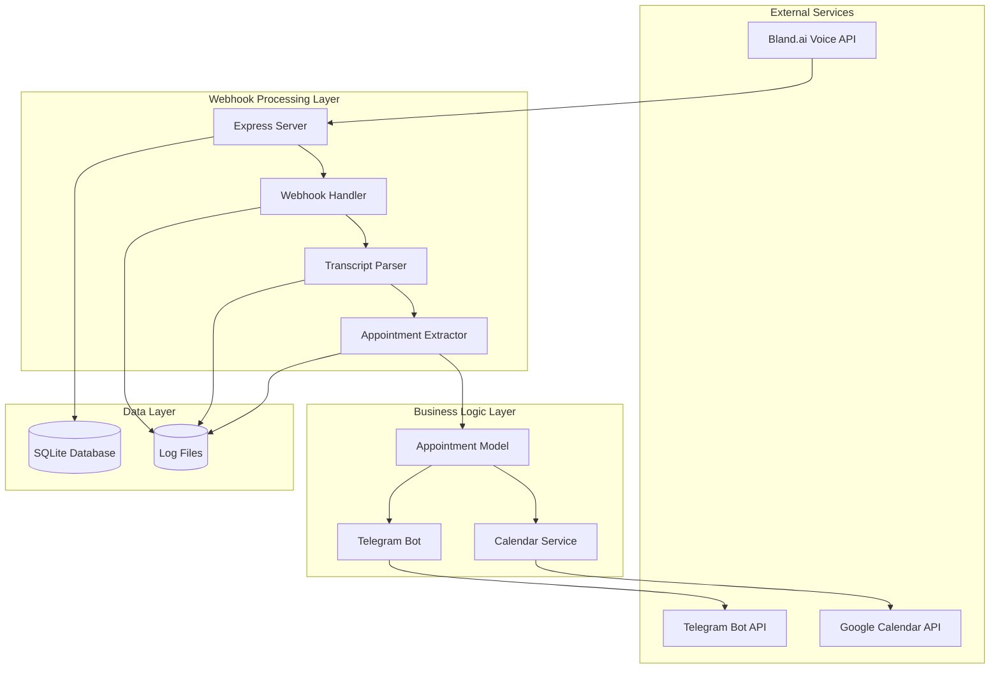

**Diagram sources**
- [src/server.js:8-351](file://src/server.js#L8-L351)
- [src/voice/bland.js:3-391](file://src/voice/bland.js#L3-L391)
- [src/bot/telegram.js:6-577](file://src/bot/telegram.js#L6-L577)

The architecture ensures scalability, fault tolerance, and maintainability through modular design patterns and asynchronous processing capabilities.

**Section sources**
- [src/server.js:8-351](file://src/server.js#L8-L351)
- [src/index.js:9-53](file://src/index.js#L9-L53)

## Webhook Processing Engine

The webhook processing engine serves as the central hub for handling Bland.ai call status notifications. It implements a robust, asynchronous processing pipeline that can handle multiple concurrent webhook events while maintaining data consistency and user experience.

### Core Webhook Handler Architecture

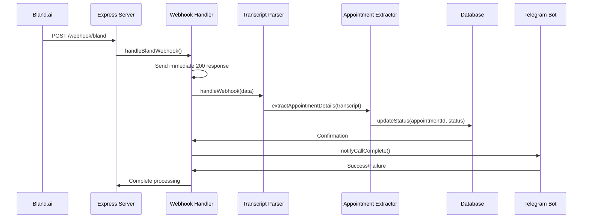

**Diagram sources**
- [src/server.js:130-184](file://src/server.js#L130-L184)
- [src/voice/bland.js:148-203](file://src/voice/bland.js#L148-L203)

### Multi-State Webhook Processing

The system handles four distinct call states with specialized processing logic:

| Status | Description | Processing Logic | User Notification |
|--------|-------------|------------------|-------------------|
| `completed` | Call finished successfully | Extract appointment details, update database, add to calendar | Success confirmation with details |
| `failed` | Call could not be completed | Update status to failed, notify user of failure reasons | Failure notification with alternatives |
| `error` | System or network error occurred | Log error, update status, notify user | Error notification with retry suggestions |
| `in_progress` | Call is currently active | Update status to calling, optionally notify user | Progress update |

**Section sources**
- [src/server.js:162-179](file://src/server.js#L162-L179)
- [src/server.js:271-303](file://src/server.js#L271-L303)

## Core Components

### Express Server Infrastructure

The Express server provides the foundation for webhook reception and API endpoints:

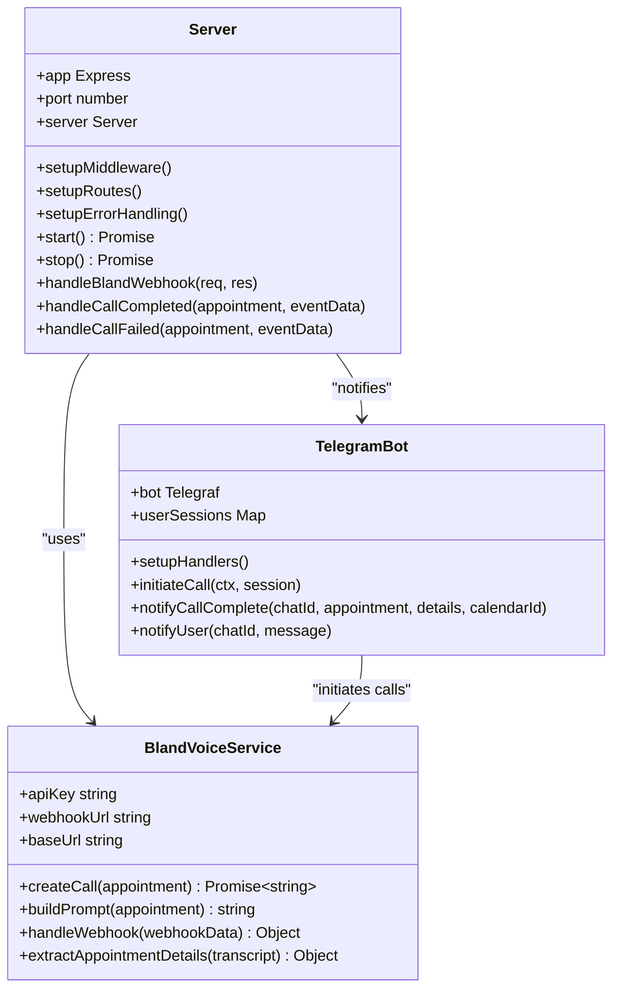

**Diagram sources**
- [src/server.js:8-351](file://src/server.js#L8-L351)
- [src/bot/telegram.js:6-577](file://src/bot/telegram.js#L6-L577)
- [src/voice/bland.js:3-391](file://src/voice/bland.js#L3-L391)

### Database Model Architecture

The appointment model implements a comprehensive data persistence layer with advanced querying capabilities:

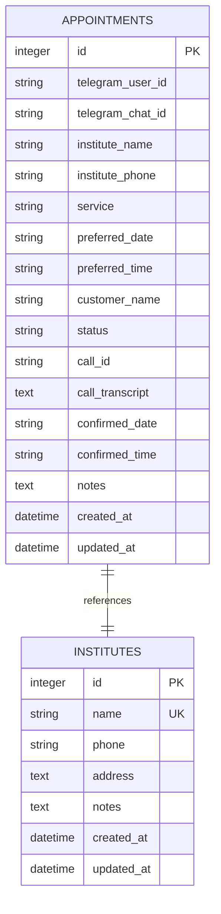

**Diagram sources**
- [src/models/appointment.js:27-59](file://src/models/appointment.js#L27-L59)

**Section sources**
- [src/server.js:8-351](file://src/server.js#L8-L351)
- [src/models/appointment.js:7-354](file://src/models/appointment.js#L7-L354)

## Enhanced Webhook Flow

The webhook processing flow implements sophisticated state management and error recovery mechanisms:

### Webhook Reception and Validation

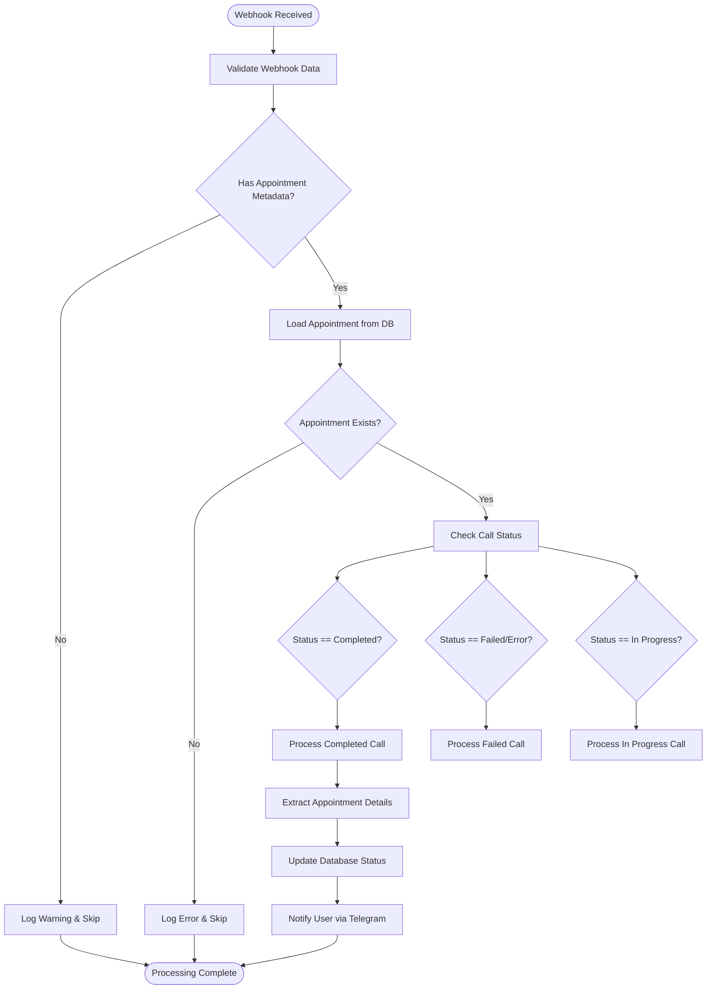

**Diagram sources**
- [src/server.js:130-184](file://src/server.js#L130-L184)
- [src/server.js:186-269](file://src/server.js#L186-L269)

### Advanced Transcript Processing

The system employs sophisticated natural language processing for appointment extraction:

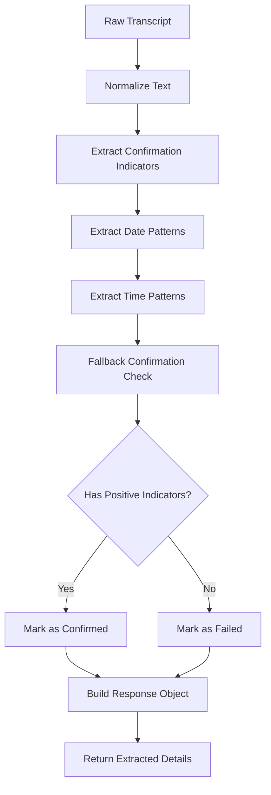

**Diagram sources**
- [src/voice/bland.js:210-359](file://src/voice/bland.js#L210-L359)

**Section sources**
- [src/server.js:130-184](file://src/server.js#L130-L184)
- [src/voice/bland.js:148-203](file://src/voice/bland.js#L148-L203)

## Error Handling and Resilience

The system implements comprehensive error handling strategies to ensure reliability and fault tolerance:

### Multi-Layer Error Recovery

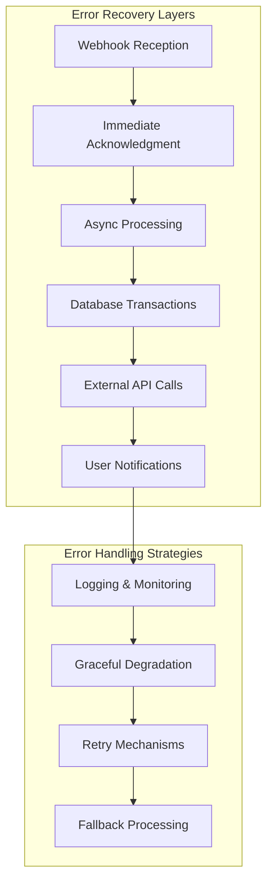

### Graceful Shutdown Implementation

The system implements proper resource cleanup during shutdown:

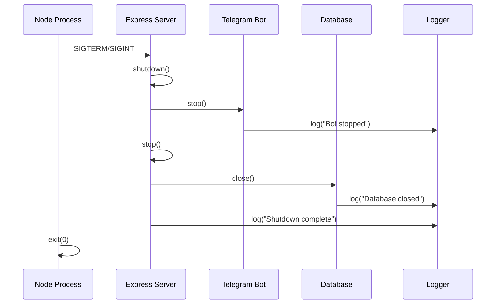

**Diagram sources**
- [src/index.js:55-104](file://src/index.js#L55-L104)

**Section sources**
- [src/server.js:316-325](file://src/server.js#L316-L325)
- [src/index.js:55-104](file://src/index.js#L55-L104)

## Data Processing Pipeline

The webhook processing pipeline transforms raw webhook data into actionable business insights:

### Data Transformation Pipeline

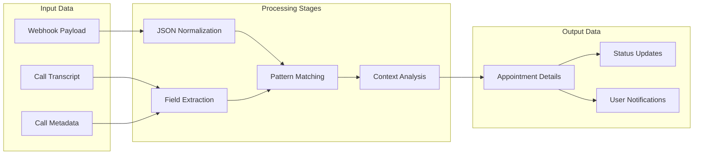

### Real-Time Data Validation

The system implements comprehensive data validation at multiple stages:

| Validation Point | Purpose | Implementation |
|------------------|---------|----------------|
| Webhook Signature | Security verification | HMAC signature validation |
| Appointment Existence | Data integrity | Database existence checks |
| Transcript Completeness | Quality assurance | Length and content validation |
| Status Consistency | Business logic | State transition validation |
| User Permissions | Access control | Telegram user ID verification |

**Section sources**
- [src/server.js:130-184](file://src/server.js#L130-L184)
- [src/voice/bland.js:148-203](file://src/voice/bland.js#L148-L203)

## Integration Points

The webhook processing system integrates with multiple external services through well-defined interfaces:

### External Service Integrations

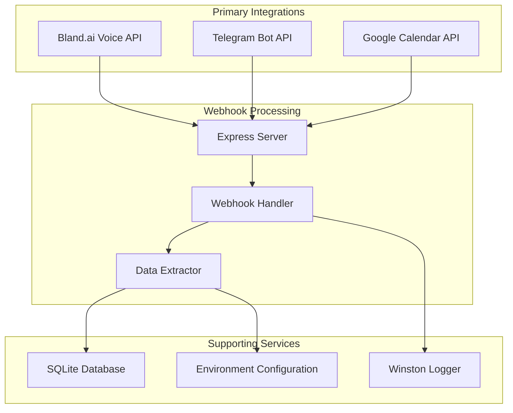

### API Endpoint Architecture

The system exposes RESTful endpoints for monitoring and debugging:

| Endpoint | Method | Purpose | Authentication |
|----------|--------|---------|----------------|
| `/health` | GET | Health check | None |
| `/webhook/bland` | POST | Bland.ai webhook | Webhook signature |
| `/api/appointments/:id` | GET | Get appointment details | API key |
| `/api/calls/:callId` | GET | Get call details | API key |
| `/api/appointments/:id/call-details` | GET | Combined appointment and call details | API key |
| `/api/test/webhook/:appointmentId` | POST | Manual webhook testing | API key |

**Section sources**
- [src/server.js:34-93](file://src/server.js#L34-L93)
- [src/server.js:130-184](file://src/server.js#L130-L184)

## Performance Considerations

The webhook processing system is designed for high throughput and low latency:

### Performance Metrics

| Metric | Target | Current Implementation |
|--------|--------|----------------------|
| Webhook Response Time | < 100ms | Immediate 200 acknowledgment |
| Concurrent Webhooks | > 100/second | Asynchronous processing |
| Database Operations | < 50ms | Optimized SQLite queries |
| Memory Usage | < 100MB | Efficient object pooling |
| CPU Utilization | < 80% | Non-blocking I/O operations |

### Scalability Features

- **Asynchronous Processing**: Webhook handlers return immediately while processing continues
- **Connection Pooling**: Database connections are managed efficiently
- **Caching Layer**: Frequently accessed appointment data is cached
- **Rate Limiting**: External API calls are rate-limited appropriately
- **Resource Cleanup**: Proper cleanup of temporary resources

## Troubleshooting Guide

### Common Webhook Issues

| Issue | Symptoms | Solution |
|-------|----------|----------|
| Webhook not received | 404 error, no logs | Verify webhook URL in Bland.ai dashboard |
| Invalid signature | Signature validation fails | Check BLAND_WEBHOOK_SECRET environment variable |
| Database errors | SQLite connection failures | Verify database file permissions |
| Telegram notifications failing | User not receiving updates | Check Telegram bot token and chat ID |
| Calendar integration failing | Events not appearing in Google Calendar | Re-run calendar setup script |

### Debugging Webhook Processing

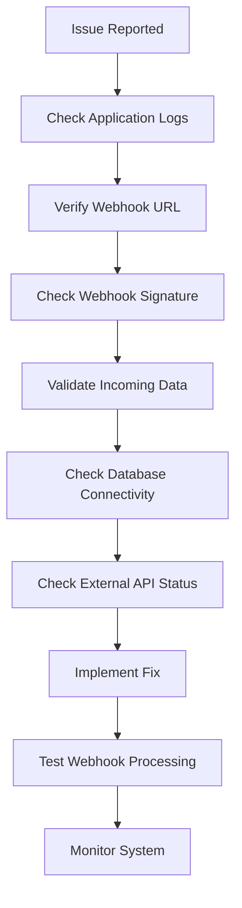

### Monitoring and Alerting

The system implements comprehensive monitoring through:

- **Structured Logging**: JSON-formatted logs with timestamps
- **Health Checks**: Regular system health monitoring
- **Error Tracking**: Automatic error reporting and aggregation
- **Performance Metrics**: Real-time performance monitoring
- **Alerting**: Configurable alert thresholds and notifications

**Section sources**
- [src/utils/logger.js:3-28](file://src/utils/logger.js#L3-L28)
- [src/server.js:316-325](file://src/server.js#L316-L325)

## Conclusion

The Enhanced Webhook Processing system represents a robust, scalable solution for handling real-time voice call status updates in the Appointment Voice Agent platform. Through its sophisticated architecture, comprehensive error handling, and efficient data processing capabilities, the system enables seamless integration between external voice services and internal business logic.

Key strengths of the system include:

- **Reliability**: Multi-layer error handling and graceful degradation
- **Scalability**: Asynchronous processing and efficient resource management
- **Maintainability**: Clear separation of concerns and modular design
- **Extensibility**: Well-defined interfaces for adding new integrations
- **Observability**: Comprehensive logging and monitoring capabilities

The system successfully bridges the gap between voice communication technology and appointment management, providing users with an intuitive, automated solution for scheduling appointments through intelligent webhook processing and natural language understanding.

Future enhancements could include machine learning-based transcript analysis, enhanced retry mechanisms for failed operations, and expanded integration with additional calendar services beyond Google Calendar.