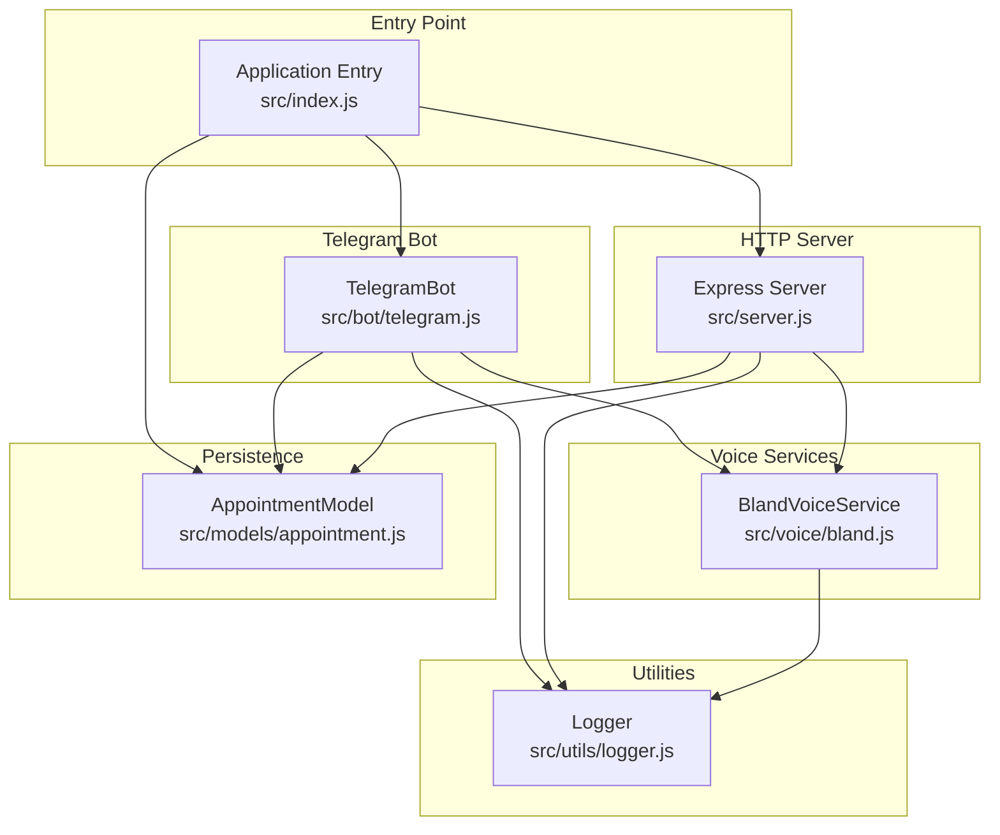
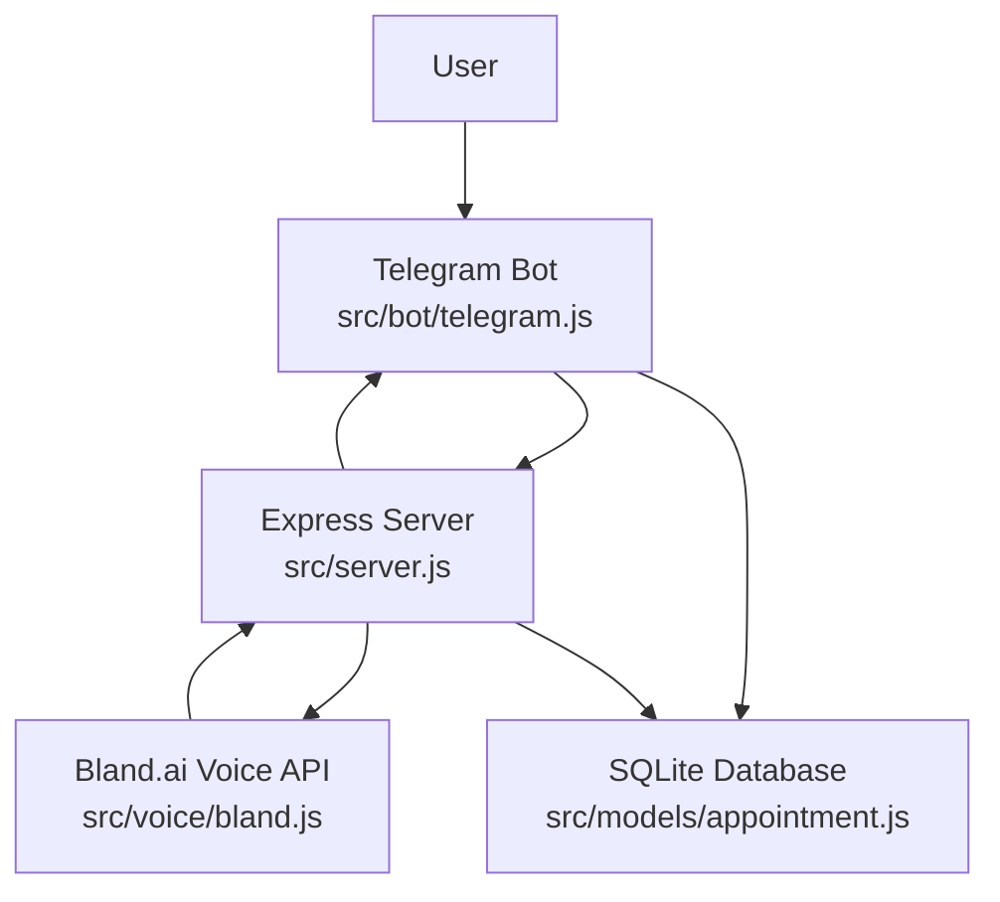
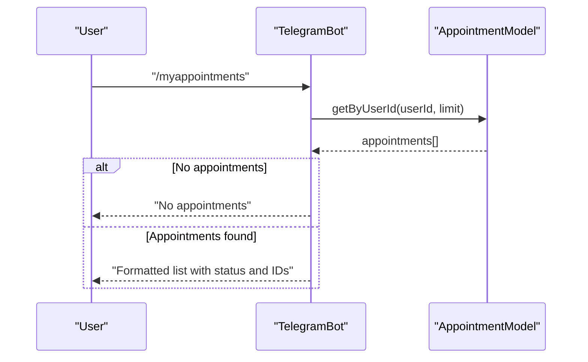
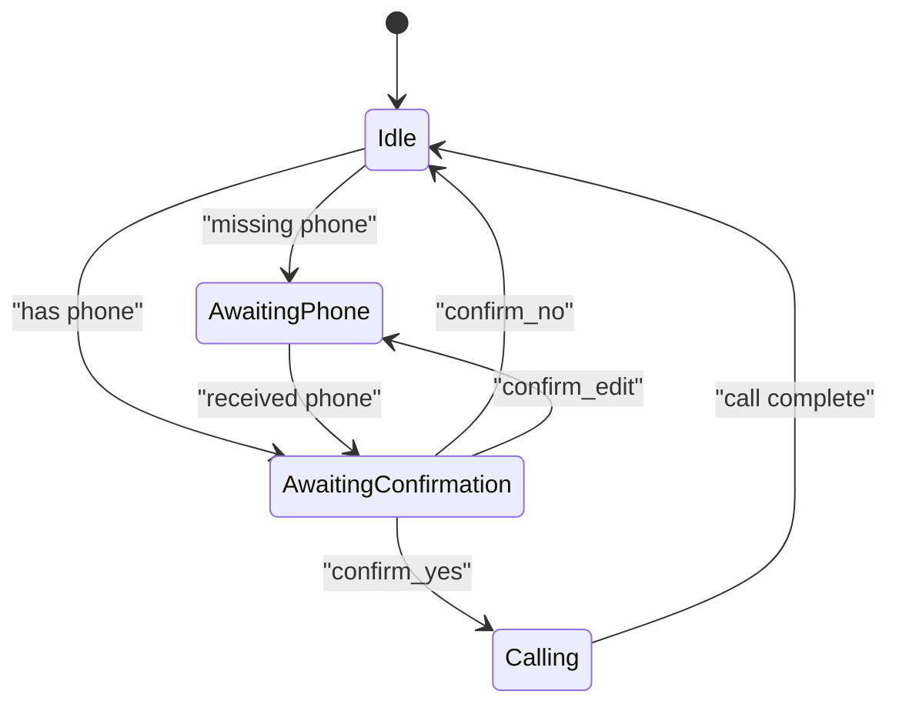
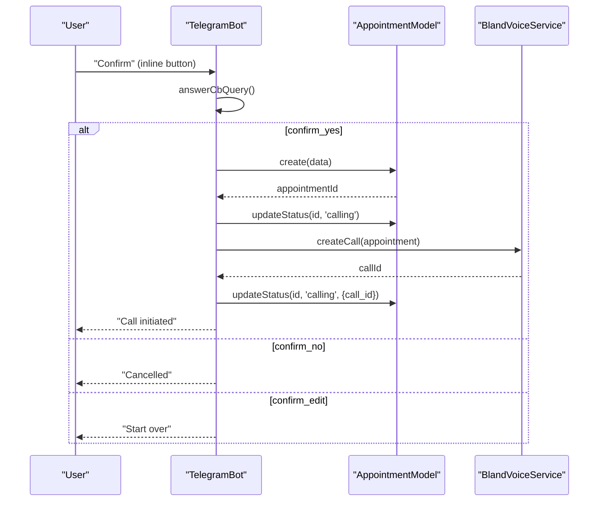
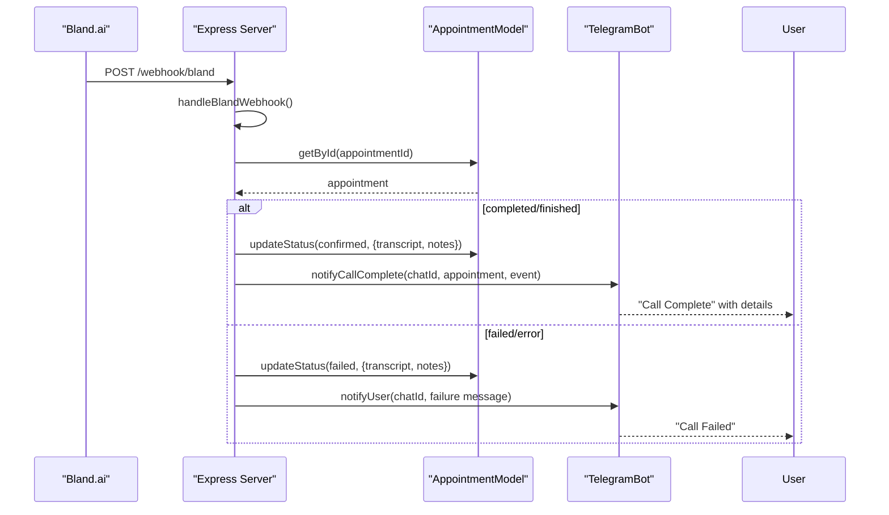
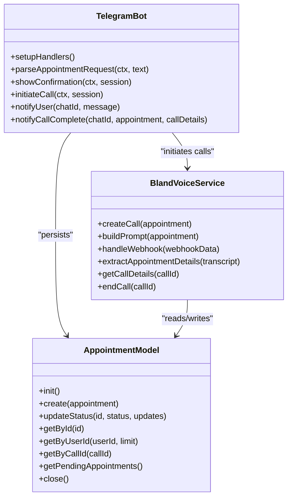
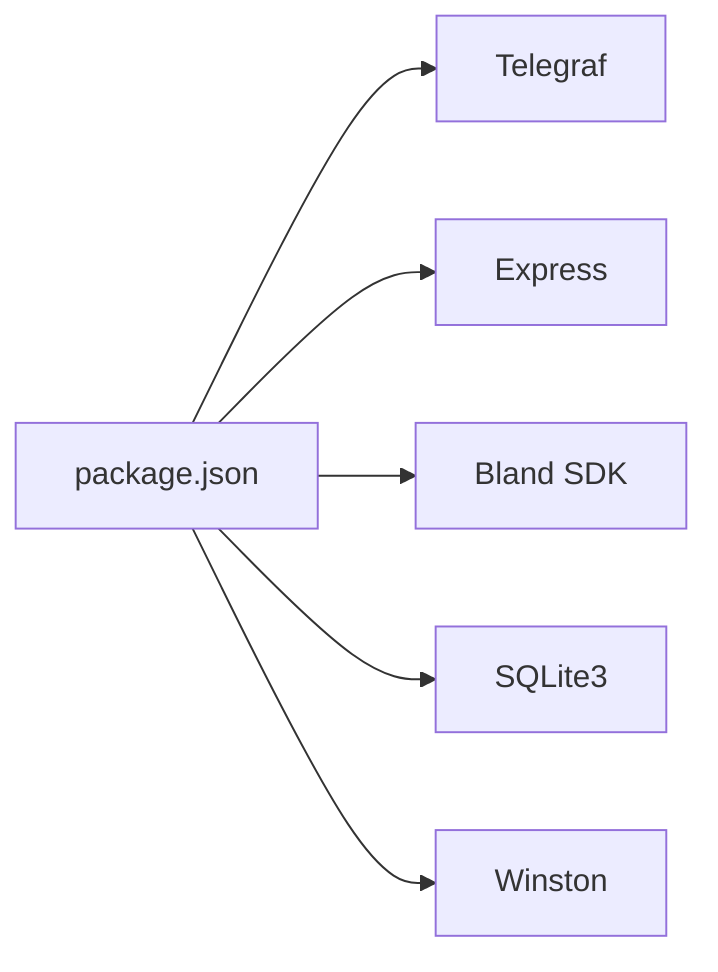

# Telegram Bot Integration

<cite>
**Referenced Files in This Document**
- [telegram.js](file://src/bot/telegram.js)
- [appointment.js](file://src/models/appointment.js)
- [bland.js](file://src/voice/bland.js)
- [server.js](file://src/server.js)
- [index.js](file://src/index.js)
- [logger.js](file://src/utils/logger.js)
- [README.md](file://README.md)
- [package.json](file://package.json)
</cite>

## Table of Contents
1. [Introduction](#introduction)
2. [Project Structure](#project-structure)
3. [Core Components](#core-components)
4. [Architecture Overview](#architecture-overview)
5. [Detailed Component Analysis](#detailed-component-analysis)
6. [Dependency Analysis](#dependency-analysis)
7. [Performance Considerations](#performance-considerations)
8. [Troubleshooting Guide](#troubleshooting-guide)
9. [Conclusion](#conclusion)

## Introduction
This document provides comprehensive documentation for the Telegram bot integration component that powers the appointment scheduling system. The bot is built with Telegraf and integrates with Bland.ai for voice calls, SQLite for persistence, and Express for webhook handling. It supports natural language processing for extracting appointment details, manages user sessions with conversation state tracking, and provides inline keyboard interfaces for confirmation workflows.

Supported commands include:
- /start: Welcome and instructions
- /help: Usage examples and tips
- /myappointments: View recent appointments
- /cancel <appointment_id>: Cancel an appointment

The bot parses natural language inputs to extract service types, institute names, phone numbers, dates, and times, then initiates voice calls via Bland.ai and notifies users of outcomes.

## Project Structure
The project follows a modular structure with clear separation of concerns:
- src/bot/telegram.js: Telegram bot implementation with command handlers, session management, and inline keyboard interactions
- src/models/appointment.js: SQLite-backed appointment model with CRUD operations and status management
- src/voice/bland.js: Bland.ai integration for voice calls, prompt building, webhook handling, and transcript analysis
- src/server.js: Express server exposing health checks, webhook endpoints, and debugging APIs
- src/index.js: Application entry point orchestrating initialization, environment validation, and graceful shutdown
- src/utils/logger.js: Winston-based logging configuration
- README.md: Project overview, setup, usage, and troubleshooting
- package.json: Dependencies and scripts

**Diagram sources**
- [telegram.js:1-461](file://src/bot/telegram.js#L1-L461)
- [bland.js:1-235](file://src/voice/bland.js#L1-L235)
- [appointment.js:1-238](file://src/models/appointment.js#L1-L238)
- [server.js:1-266](file://src/server.js#L1-L266)
- [index.js:1-91](file://src/index.js#L1-L91)
- [logger.js:1-28](file://src/utils/logger.js#L1-L28)

**Section sources**
- [README.md:154-175](file://README.md#L154-L175)
- [package.json:1-35](file://package.json#L1-L35)

## Core Components
This section outlines the primary components and their responsibilities.

- TelegramBot (src/bot/telegram.js)
  - Registers command handlers for /start, /help, /myappointments, and /cancel
  - Processes natural language text messages to extract appointment details
  - Manages user sessions with conversation state tracking
  - Renders inline keyboards for confirmation workflows
  - Handles callback queries from button interactions
  - Initiates voice calls via Bland.ai and updates statuses
  - Sends real-time notifications to users

- AppointmentModel (src/models/appointment.js)
  - Initializes SQLite database and creates the appointments table
  - Provides methods to create, update, and query appointments
  - Supports status transitions and metadata storage
  - Exposes helpers for retrieving appointments by user, call ID, and pending status

- BlandVoiceService (src/voice/bland.js)
  - Creates voice calls with Bland.ai using structured prompts
  - Handles webhook events and extracts call status and transcript details
  - Parses transcripts to detect confirmation outcomes and extract date/time
  - Ends calls programmatically when needed

- Express Server (src/server.js)
  - Serves health checks and debugging endpoints
  - Receives Bland.ai webhooks and processes call status updates
  - Updates appointment records and triggers user notifications

- Logger (src/utils/logger.js)
  - Configures Winston for structured logging with file and console transports
  - Provides consistent logging across all components

**Section sources**
- [telegram.js:6-461](file://src/bot/telegram.js#L6-L461)
- [appointment.js:7-238](file://src/models/appointment.js#L7-L238)
- [bland.js:4-235](file://src/voice/bland.js#L4-L235)
- [server.js:7-266](file://src/server.js#L7-L266)
- [logger.js:1-28](file://src/utils/logger.js#L1-L28)

## Architecture Overview
The system architecture integrates Telegram, Express, Bland.ai, and SQLite as shown below.

Key flows:
- User sends natural language appointment requests to the Telegram bot
- The bot parses the request, manages conversation state, and confirms details
- The bot initiates a voice call via Bland.ai and updates the database
- Bland.ai posts webhook events to the Express server
- The server updates appointment status and notifies the user via Telegram

**Diagram sources**
- [telegram.js:1-461](file://src/bot/telegram.js#L1-L461)
- [server.js:1-266](file://src/server.js#L1-L266)
- [bland.js:1-235](file://src/voice/bland.js#L1-L235)
- [appointment.js:1-238](file://src/models/appointment.js#L1-L238)

## Detailed Component Analysis

### Telegram Bot Command Handlers
The Telegram bot registers four primary commands and a text handler for natural language processing.

- /start
  - Responds with a welcome message and usage instructions
  - Provides examples of supported formats

- /help
  - Returns usage examples and tips for flexible time/date expressions
  - Explains what information is required for successful booking

- /myappointments
  - Retrieves the user’s recent appointments from the database
  - Formats and displays them with status emojis and IDs
  - Handles errors gracefully with user-friendly messages

- /cancel <appointment_id>
  - Validates arguments and appointment ownership
  - Prevents cancellation of already-cancelled appointments
  - Updates status to cancelled and informs the user

**Diagram sources**
- [telegram.js:92-121](file://src/bot/telegram.js#L92-L121)
- [appointment.js:179-197](file://src/models/appointment.js#L179-L197)

**Section sources**
- [telegram.js:13-37](file://src/bot/telegram.js#L13-L37)
- [telegram.js:39-90](file://src/bot/telegram.js#L39-L90)
- [telegram.js:92-121](file://src/bot/telegram.js#L92-L121)
- [telegram.js:123-159](file://src/bot/telegram.js#L123-L159)
- [appointment.js:179-197](file://src/models/appointment.js#L179-L197)

### Natural Language Processing for Appointment Extraction
The bot extracts appointment details from natural language using pattern matching.

Extraction capabilities:
- Service types: Matches patterns like “book a haircut”, “schedule a cleaning”, “make a reservation”
- Institute names: Captured after prepositions such as “at” or “with”
- Phone numbers: Extracted with optional prefixes and punctuation normalization
- Dates: Recognizes “today”, “tomorrow”, “next Monday”, “this Friday”, day-of-week, and numeric formats
- Times: Recognizes “3pm”, “14:30”, “morning”, “afternoon”, “evening”

Edge cases handled:
- Missing service or institute name prompts the user for clarification
- Flexible time/date expressions are supported
- Phone numbers are normalized to digits only

**Diagram sources**
- [telegram.js:226-294](file://src/bot/telegram.js#L226-L294)

**Section sources**
- [telegram.js:161-224](file://src/bot/telegram.js#L161-L224)
- [telegram.js:226-294](file://src/bot/telegram.js#L226-L294)

### User Session Management and Conversation State Tracking
The bot maintains user sessions in memory using a Map keyed by Telegram user ID. Sessions track:
- Current state: awaiting_phone or awaiting_confirmation
- Data: extracted appointment details plus Telegram identifiers and customer name

Conversation flows:
- If phone is missing, the bot transitions to awaiting_phone and requests the phone number
- After collecting phone, the bot transitions to awaiting_confirmation and shows confirmation
- Confirmation buttons:
  - ✅ Yes, make the call: proceeds to initiate call
  - ❌ No, cancel: cancels the session
  - ✏️ Edit details: resets to awaiting_phone

**Diagram sources**
- [telegram.js:161-180](file://src/bot/telegram.js#L161-L180)
- [telegram.js:311-337](file://src/bot/telegram.js#L311-L337)
- [telegram.js:349-371](file://src/bot/telegram.js#L349-L371)

**Section sources**
- [telegram.js:9-11](file://src/bot/telegram.js#L9-L11)
- [telegram.js:161-180](file://src/bot/telegram.js#L161-L180)
- [telegram.js:296-309](file://src/bot/telegram.js#L296-L309)
- [telegram.js:311-337](file://src/bot/telegram.js#L311-L337)
- [telegram.js:349-371](file://src/bot/telegram.js#L349-L371)

### Inline Keyboard Interfaces and Interactive Button Handling
Inline keyboards provide quick actions for confirmation workflows:
- Buttons: ✅ Yes, make the call, ❌ No, cancel, ✏️ Edit details
- Callback handling:
  - confirm_yes: saves to database, updates status to calling, initiates call, clears session
  - confirm_no: deletes session and informs user
  - confirm_edit: resets session state to awaiting_phone

**Diagram sources**
- [telegram.js:349-371](file://src/bot/telegram.js#L349-L371)
- [telegram.js:373-405](file://src/bot/telegram.js#L373-L405)
- [bland.js:23-52](file://src/voice/bland.js#L23-L52)
- [appointment.js:62-100](file://src/models/appointment.js#L62-L100)

**Section sources**
- [telegram.js:326-336](file://src/bot/telegram.js#L326-L336)
- [telegram.js:349-371](file://src/bot/telegram.js#L349-L371)
- [telegram.js:373-405](file://src/bot/telegram.js#L373-L405)

### Real-Time User Notifications
The server receives Bland.ai webhooks and updates appointment statuses accordingly. It then notifies users via Telegram with:
- Success: confirmed date/time and recording link
- Failure: reasons for failure and suggested actions
- General completion: summary and recording link

Notification methods:
- notifyUser: Sends a message to a Telegram chat ID
- notifyCallComplete: Builds a formatted message with extracted details

**Diagram sources**
- [server.js:77-123](file://src/server.js#L77-L123)
- [server.js:125-184](file://src/server.js#L125-L184)
- [server.js:186-218](file://src/server.js#L186-L218)
- [telegram.js:418-447](file://src/bot/telegram.js#L418-L447)
- [appointment.js:102-147](file://src/models/appointment.js#L102-L147)

**Section sources**
- [server.js:77-123](file://src/server.js#L77-L123)
- [server.js:125-184](file://src/server.js#L125-L184)
- [server.js:186-218](file://src/server.js#L186-L218)
- [telegram.js:418-447](file://src/bot/telegram.js#L418-L447)

### Integration with Database and Voice Services
- Database integration:
  - AppointmentModel initializes SQLite, creates the appointments table, and provides CRUD operations
  - Supports status transitions and metadata fields for call transcripts and recording URLs
- Voice service integration:
  - BlandVoiceService builds prompts tailored to the requested service and preferences
  - Sends calls with metadata linking to Telegram chat and appointment records
  - Parses webhooks to extract call outcomes and updates the database

**Diagram sources**
- [telegram.js:6-461](file://src/bot/telegram.js#L6-L461)
- [appointment.js:7-238](file://src/models/appointment.js#L7-L238)
- [bland.js:4-235](file://src/voice/bland.js#L4-L235)

**Section sources**
- [appointment.js:12-60](file://src/models/appointment.js#L12-L60)
- [bland.js:23-52](file://src/voice/bland.js#L23-L52)
- [telegram.js:373-405](file://src/bot/telegram.js#L373-L405)

## Dependency Analysis
The application depends on several external libraries and services:
- Telegraf for Telegram bot framework
- Express for HTTP server and webhook handling
- Bland SDK for voice call initiation and webhook processing
- SQLite3 for local database persistence
- Winston for structured logging

**Diagram sources**
- [package.json:20-34](file://package.json#L20-L34)

**Section sources**
- [package.json:20-34](file://package.json#L20-L34)

## Performance Considerations
- Memory usage: Sessions are stored in-memory using a Map; consider persistence for production scale
- Database I/O: SQLite operations are synchronous; ensure adequate indexing and avoid heavy queries
- Webhook throughput: Server acknowledges webhooks immediately and processes asynchronously to prevent timeouts
- Logging overhead: Structured logging to files is efficient; adjust log levels for production environments

## Troubleshooting Guide
Common issues and resolutions:
- Bot not responding
  - Verify TELEGRAM_BOT_TOKEN is correct and loaded from environment
  - Ensure the application starts successfully and logs indicate the bot is active
- Calls not being made
  - Confirm BLAND_API_KEY is valid and WEBHOOK_URL is publicly accessible
  - For local development, ensure ngrok is running and the webhook URL is updated
- Webhooks not received
  - Validate the webhook URL in .env matches the configured Bland.ai webhook
  - Check server logs for incoming requests and ensure the server is reachable from the internet
- Parsing failures
  - Provide clearer service/institute details and explicit phone numbers
  - Use recognized time/date expressions (e.g., “tomorrow”, “3pm”, “next Monday”)
- Session issues
  - If session expires, ask the user to resend the full request
  - Ensure the bot remains online during the conversation flow

**Section sources**
- [README.md:212-228](file://README.md#L212-L228)
- [index.js:12-20](file://src/index.js#L12-L20)
- [server.js:77-123](file://src/server.js#L77-L123)
- [telegram.js:33-36](file://src/bot/telegram.js#L33-L36)

## Conclusion
The Telegram bot integration provides a robust foundation for natural language-driven appointment scheduling. It combines Telegraf for messaging, Bland.ai for voice automation, SQLite for persistence, and Express for webhook orchestration. The system supports flexible user inputs, interactive confirmation workflows, and real-time notifications. By following the troubleshooting guidance and leveraging the documented flows, users can effectively book appointments and receive timely updates on call outcomes.