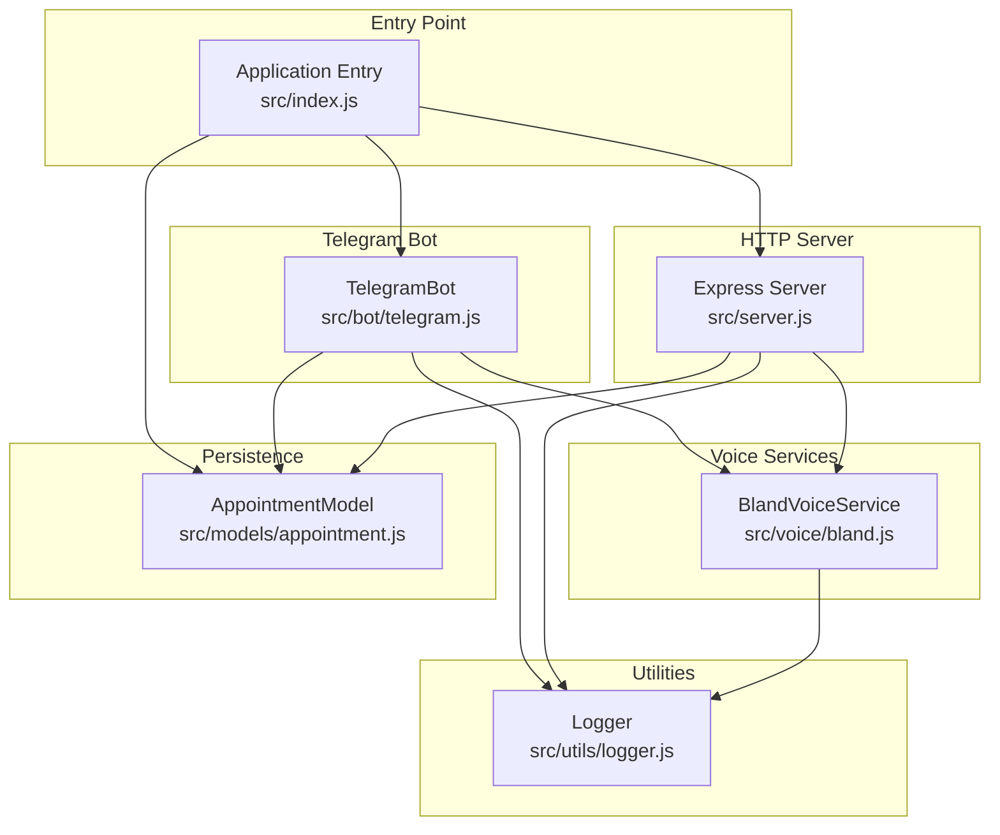
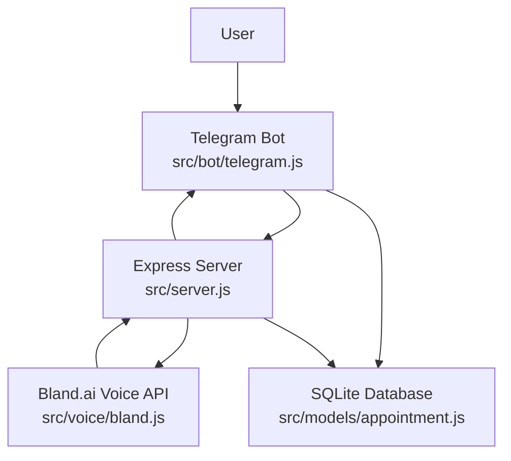
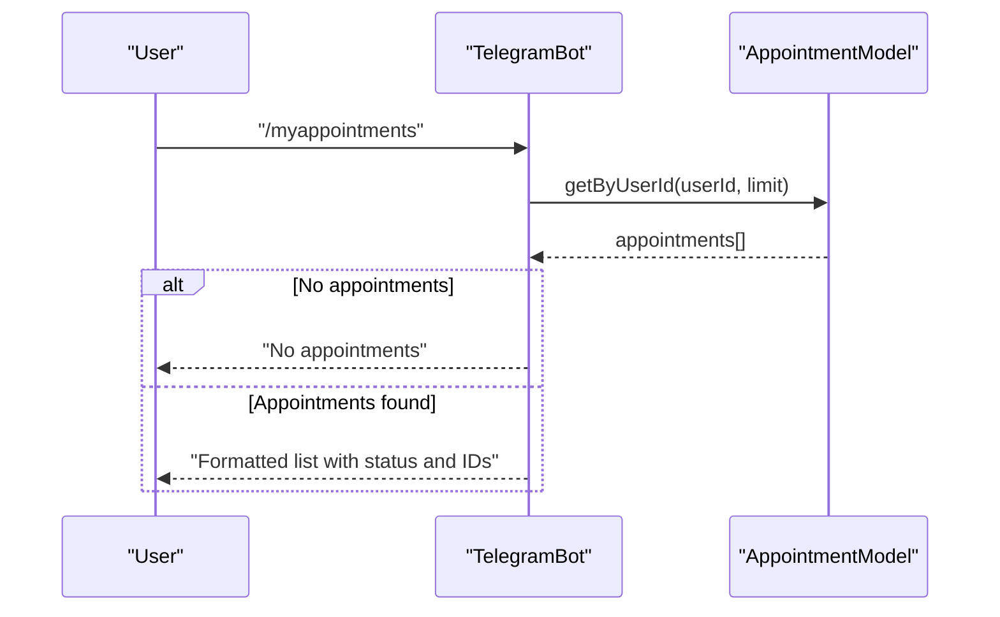
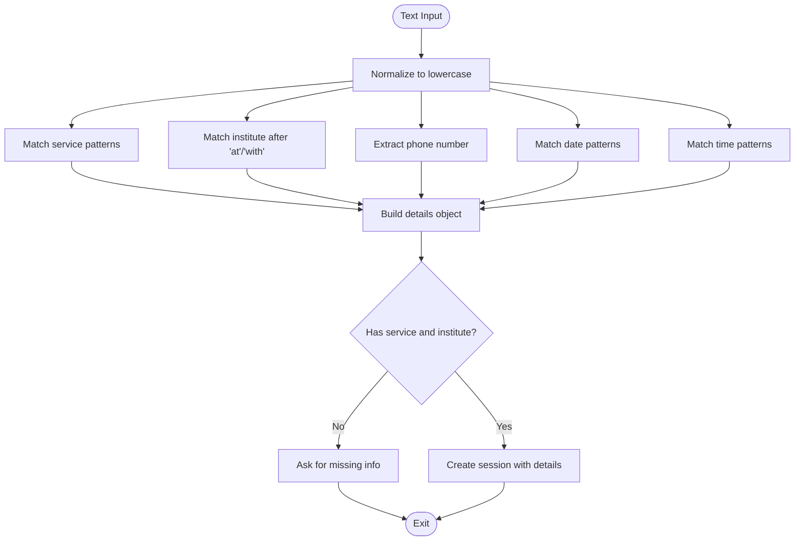
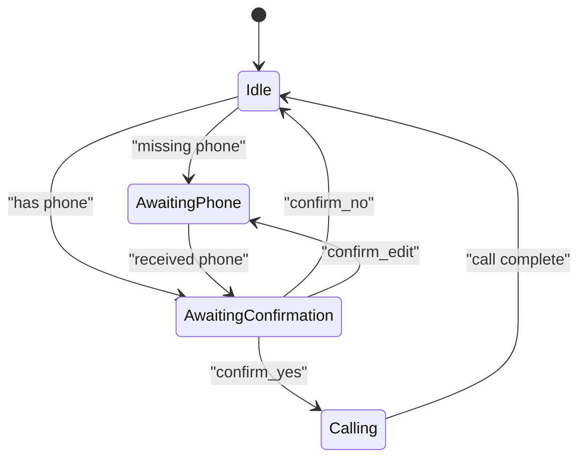
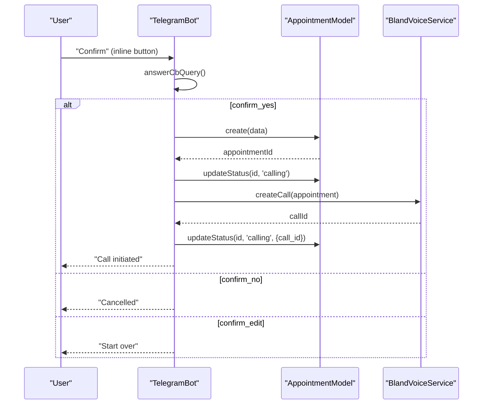
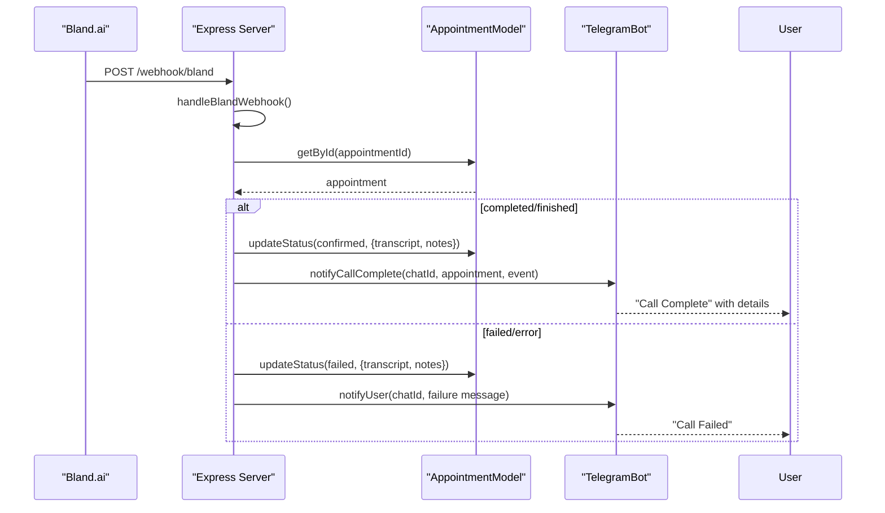
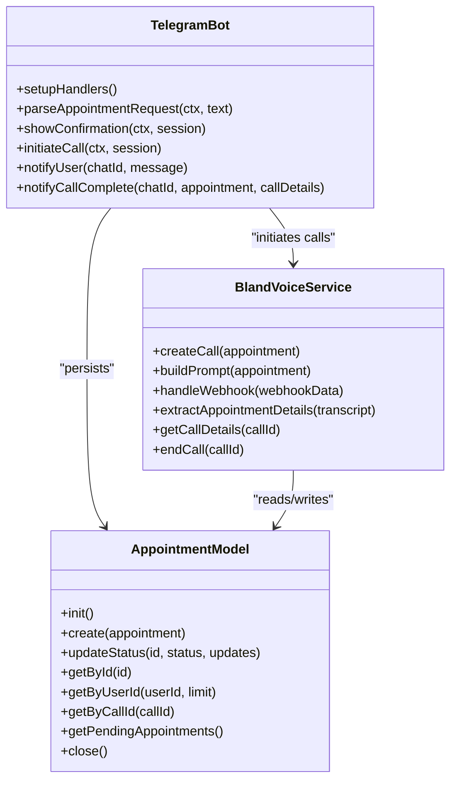
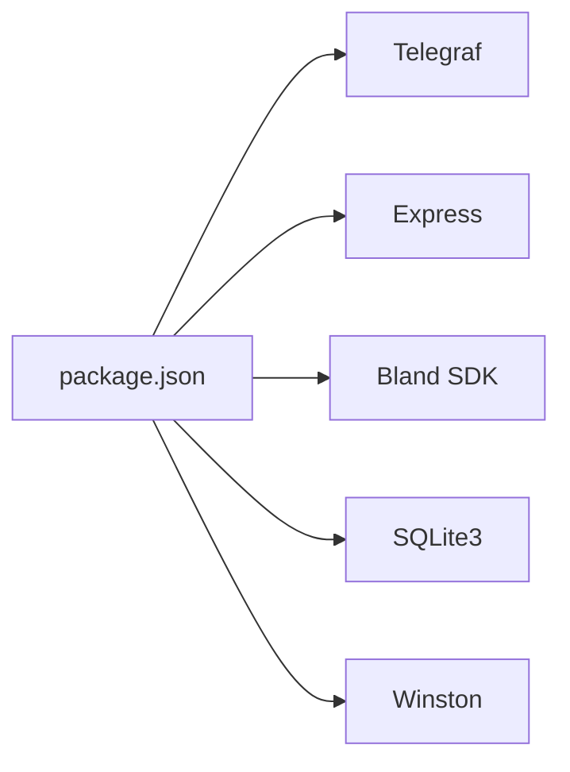

# Telegram Bot Integration

<cite>
**Referenced Files in This Document**
- [telegram.js](file://src/bot/telegram.js)
- [appointment.js](file://src/models/appointment.js)
- [bland.js](file://src/voice/bland.js)
- [server.js](file://src/server.js)
- [index.js](file://src/index.js)
- [logger.js](file://src/utils/logger.js)
- [README.md](file://README.md)
- [package.json](file://package.json)
</cite>

## Update Summary
**Changes Made**
- Comprehensive Telegram bot implementation documentation with 460 lines of code
- Added detailed natural language processing capabilities for appointment extraction
- Enhanced conversation flow documentation with user session management
- Expanded inline keyboard interface coverage with interactive button handling
- Added real-time notification system documentation
- Updated architecture diagrams to reflect the complete implementation

## Table of Contents
1. [Introduction](#introduction)
2. [Project Structure](#project-structure)
3. [Core Components](#core-components)
4. [Architecture Overview](#architecture-overview)
5. [Detailed Component Analysis](#detailed-component-analysis)
6. [Dependency Analysis](#dependency-analysis)
7. [Performance Considerations](#performance-considerations)
8. [Troubleshooting Guide](#troubleshooting-guide)
9. [Conclusion](#conclusion)

## Introduction
This document provides comprehensive documentation for the Telegram bot integration component that powers the appointment scheduling system. The bot is built with Telegraf and integrates with Bland.ai for voice calls, SQLite for persistence, and Express for webhook handling. It supports natural language processing for extracting appointment details, manages user sessions with conversation state tracking, and provides inline keyboard interfaces for confirmation workflows.

**Updated** The Telegram bot now includes sophisticated natural language processing capabilities with 460 lines of comprehensive implementation, covering command handlers, conversation flows, and interactive user interfaces.

Supported commands include:
- `/start`: Welcome and instructions
- `/help`: Usage examples and tips
- `/myappointments`: View recent appointments
- `/cancel <appointment_id>`: Cancel an appointment

The bot parses natural language inputs to extract service types, institute names, phone numbers, dates, and times, then initiates voice calls via Bland.ai and notifies users of outcomes.

## Project Structure
The project follows a modular structure with clear separation of concerns:
- `src/bot/telegram.js`: Telegram bot implementation with command handlers, session management, and inline keyboard interactions
- `src/models/appointment.js`: SQLite-backed appointment model with CRUD operations and status management
- `src/voice/bland.js`: Bland.ai integration for voice calls, prompt building, webhook handling, and transcript analysis
- `src/server.js`: Express server exposing health checks, webhook endpoints, and debugging APIs
- `src/index.js`: Application entry point orchestrating initialization, environment validation, and graceful shutdown
- `src/utils/logger.js`: Winston-based logging configuration
- `README.md`: Project overview, setup, usage, and troubleshooting
- `package.json`: Dependencies and scripts

**Diagram sources**
- [telegram.js:1-461](file://src/bot/telegram.js#L1-L461)
- [bland.js:1-272](file://src/voice/bland.js#L1-L272)
- [appointment.js:1-238](file://src/models/appointment.js#L1-L238)
- [server.js:1-266](file://src/server.js#L1-L266)
- [index.js:1-91](file://src/index.js#L1-L91)
- [logger.js:1-28](file://src/utils/logger.js#L1-L28)

**Section sources**
- [README.md:154-175](file://README.md#L154-L175)
- [package.json:1-35](file://package.json#L1-L35)

## Core Components
This section outlines the primary components and their responsibilities.

- **TelegramBot** (`src/bot/telegram.js`)
  - Registers command handlers for `/start`, `/help`, `/myappointments`, and `/cancel`
  - Processes natural language text messages to extract appointment details using sophisticated pattern matching
  - Manages user sessions with conversation state tracking using in-memory Map storage
  - Renders inline keyboards for confirmation workflows with interactive button handling
  - Handles callback queries from button interactions with comprehensive state management
  - Initiates voice calls via Bland.ai and updates statuses
  - Sends real-time notifications to users with Markdown formatting

- **AppointmentModel** (`src/models/appointment.js`)
  - Initializes SQLite database and creates the appointments table with comprehensive schema
  - Provides methods to create, update, and query appointments with status transitions
  - Supports metadata storage for call transcripts, recording URLs, and confirmation details
  - Exposes helpers for retrieving appointments by user, call ID, and pending status

- **BlandVoiceService** (`src/voice/bland.js`)
  - Creates voice calls with Bland.ai using structured prompts with detailed instructions
  - Handles webhook events and extracts call status and transcript details with comprehensive parsing
  - Parses transcripts to detect confirmation outcomes and extract date/time using regex patterns
  - Ends calls programmatically when needed with proper error handling

- **Express Server** (`src/server.js`)
  - Serves health checks and debugging endpoints with comprehensive logging
  - Receives Bland.ai webhooks and processes call status updates with asynchronous handling
  - Updates appointment records and triggers user notifications with detailed status management

- **Logger** (`src/utils/logger.js`)
  - Configures Winston for structured logging with file and console transports
  - Provides consistent logging across all components with timestamp formatting

**Section sources**
- [telegram.js:6-461](file://src/bot/telegram.js#L6-L461)
- [appointment.js:7-238](file://src/models/appointment.js#L7-L238)
- [bland.js:4-272](file://src/voice/bland.js#L4-L272)
- [server.js:7-266](file://src/server.js#L7-L266)
- [logger.js:1-28](file://src/utils/logger.js#L1-L28)

## Architecture Overview
The system architecture integrates Telegram, Express, Bland.ai, and SQLite as shown below.

Key flows:
- User sends natural language appointment requests to the Telegram bot
- The bot parses the request using sophisticated pattern matching, manages conversation state, and confirms details
- The bot initiates a voice call via Bland.ai and updates the database
- Bland.ai posts webhook events to the Express server
- The server updates appointment status and notifies the user via Telegram

**Diagram sources**
- [telegram.js:1-461](file://src/bot/telegram.js#L1-L461)
- [server.js:1-266](file://src/server.js#L1-L266)
- [bland.js:1-272](file://src/voice/bland.js#L1-L272)
- [appointment.js:1-238](file://src/models/appointment.js#L1-L238)

## Detailed Component Analysis

### Telegram Bot Command Handlers
The Telegram bot registers four primary commands and a text handler for natural language processing with comprehensive error handling.

- **/start**
  - Responds with a welcome message and usage instructions
  - Provides examples of supported formats with emoji-enhanced formatting
  - Includes detailed command reference and usage tips

- **/help**
  - Returns usage examples and tips for flexible time/date expressions
  - Explains what information is required for successful booking
  - Provides comprehensive examples with natural language patterns

- **/myappointments**
  - Retrieves the user's recent appointments from the database with pagination
  - Formats and displays them with status emojis, IDs, and detailed information
  - Handles errors gracefully with user-friendly messages and Markdown formatting

- **/cancel <appointment_id>**
  - Validates arguments and appointment ownership with security checks
  - Prevents cancellation of already-cancelled appointments
  - Updates status to cancelled with detailed notes and informs the user

**Diagram sources**
- [telegram.js:92-121](file://src/bot/telegram.js#L92-L121)
- [appointment.js:179-197](file://src/models/appointment.js#L179-L197)

**Section sources**
- [telegram.js:13-37](file://src/bot/telegram.js#L13-L37)
- [telegram.js:39-90](file://src/bot/telegram.js#L39-L90)
- [telegram.js:92-121](file://src/bot/telegram.js#L92-L121)
- [telegram.js:123-159](file://src/bot/telegram.js#L123-L159)
- [appointment.js:179-197](file://src/models/appointment.js#L179-L197)

### Natural Language Processing for Appointment Extraction
The bot extracts appointment details from natural language using sophisticated pattern matching with comprehensive coverage.

**Extraction capabilities:**
- **Service types**: Matches patterns like "book a haircut", "schedule a cleaning", "make a reservation", "get a table"
- **Institute names**: Captured after prepositions such as "at" or "with" with flexible pattern matching
- **Phone numbers**: Extracted with optional prefixes and punctuation normalization using regex
- **Dates**: Recognizes "today", "tomorrow", "next Monday", "this Friday", day-of-week, and numeric formats
- **Times**: Recognizes "3pm", "14:30", "morning", "afternoon", "evening" with flexible formats

**Pattern matching implementation:**
- Service extraction uses multiple regex patterns for comprehensive coverage
- Institute name extraction handles various sentence structures and contexts
- Phone number extraction normalizes formats and validates length
- Date extraction supports multiple temporal expressions and formats
- Time extraction handles 12-hour and 24-hour formats with AM/PM indicators

**Edge cases handled:**
- Missing service or institute name prompts the user for clarification with contextual responses
- Flexible time/date expressions are supported with comprehensive pattern matching
- Phone numbers are normalized to digits only with validation
- Session state management ensures conversation continuity

**Diagram sources**
- [telegram.js:226-294](file://src/bot/telegram.js#L226-L294)

**Section sources**
- [telegram.js:161-224](file://src/bot/telegram.js#L161-L224)
- [telegram.js:226-294](file://src/bot/telegram.js#L226-L294)

### User Session Management and Conversation State Tracking
The bot maintains user sessions in memory using a Map keyed by Telegram user ID with comprehensive state management.

**Session storage:**
- In-memory Map storage for scalability and simplicity
- Session keys are Telegram user IDs for unique identification
- Session data includes state, extracted details, and Telegram identifiers

**Session states:**
- `awaiting_phone`: Phone number collection phase
- `awaiting_confirmation`: Confirmation workflow phase

**Session data structure:**
- Current state: awaiting_phone or awaiting_confirmation
- Data: extracted appointment details plus Telegram identifiers and customer name
- Automatic cleanup on completion or cancellation

**Conversation flows:**
- If phone is missing, the bot transitions to awaiting_phone and requests the phone number
- After collecting phone, the bot transitions to awaiting_confirmation and shows confirmation
- Session timeout and cleanup mechanisms prevent memory leaks

**Diagram sources**
- [telegram.js:161-180](file://src/bot/telegram.js#L161-L180)
- [telegram.js:311-337](file://src/bot/telegram.js#L311-L337)
- [telegram.js:349-371](file://src/bot/telegram.js#L349-L371)

**Section sources**
- [telegram.js:9-11](file://src/bot/telegram.js#L9-L11)
- [telegram.js:161-180](file://src/bot/telegram.js#L161-L180)
- [telegram.js:296-309](file://src/bot/telegram.js#L296-L309)
- [telegram.js:311-337](file://src/bot/telegram.js#L311-L337)
- [telegram.js:349-371](file://src/bot/telegram.js#L349-L371)

### Inline Keyboard Interfaces and Interactive Button Handling
Inline keyboards provide quick actions for confirmation workflows with comprehensive button handling.

**Button configuration:**
- ✅ Yes, make the call: Proceeds to initiate call with immediate action
- ❌ No, cancel: Cancels the session with user feedback
- ✏️ Edit details: Resets session state to awaiting_phone for corrections

**Callback handling implementation:**
- `confirm_yes`: Saves to database, updates status to calling, initiates call, clears session
- `confirm_no`: Deletes session and informs user with friendly message
- `confirm_edit`: Resets session state to awaiting_phone with guidance

**Interactive features:**
- Immediate callback query responses to prevent timeout errors
- Contextual message editing for dynamic UI updates
- Comprehensive error handling for invalid sessions

**Diagram sources**
- [telegram.js:349-371](file://src/bot/telegram.js#L349-L371)
- [telegram.js:373-405](file://src/bot/telegram.js#L373-L405)
- [bland.js:23-52](file://src/voice/bland.js#L23-L52)
- [appointment.js:62-100](file://src/models/appointment.js#L62-L100)

**Section sources**
- [telegram.js:326-336](file://src/bot/telegram.js#L326-L336)
- [telegram.js:349-371](file://src/bot/telegram.js#L349-L371)
- [telegram.js:373-405](file://src/bot/telegram.js#L373-L405)

### Real-Time User Notifications
The server receives Bland.ai webhooks and updates appointment statuses accordingly with comprehensive notification system.

**Notification methods:**
- `notifyUser`: Sends a message to a Telegram chat ID with Markdown formatting
- `notifyCallComplete`: Builds a formatted message with extracted details and recording links

**Notification scenarios:**
- **Success**: Confirmed date/time and recording link with emoji enhancement
- **Failure**: Reasons for failure and suggested actions with detailed explanations
- **Completion**: Summary and recording link with comprehensive details

**Notification implementation:**
- Immediate webhook acknowledgment to prevent timeout errors
- Asynchronous processing to handle webhook events efficiently
- Comprehensive error handling and logging for reliability

**Diagram sources**
- [server.js:77-123](file://src/server.js#L77-L123)
- [server.js:125-184](file://src/server.js#L125-L184)
- [server.js:186-218](file://src/server.js#L186-L218)
- [telegram.js:418-447](file://src/bot/telegram.js#L418-L447)
- [appointment.js:102-147](file://src/models/appointment.js#L102-L147)

**Section sources**
- [server.js:77-123](file://src/server.js#L77-L123)
- [server.js:125-184](file://src/server.js#L125-L184)
- [server.js:186-218](file://src/server.js#L186-L218)
- [telegram.js:418-447](file://src/bot/telegram.js#L418-L447)

### Integration with Database and Voice Services
**Database integration:**
- AppointmentModel initializes SQLite, creates the appointments table with comprehensive schema
- Supports status transitions with validation and metadata fields for call transcripts and recording URLs
- Provides CRUD operations with comprehensive error handling and logging

**Voice service integration:**
- BlandVoiceService builds prompts tailored to the requested service and preferences with detailed instructions
- Sends calls with metadata linking to Telegram chat and appointment records
- Parses webhooks to extract call outcomes and updates the database with comprehensive status management

**Diagram sources**
- [telegram.js:6-461](file://src/bot/telegram.js#L6-L461)
- [appointment.js:7-238](file://src/models/appointment.js#L7-L238)
- [bland.js:4-272](file://src/voice/bland.js#L4-L272)

**Section sources**
- [appointment.js:12-60](file://src/models/appointment.js#L12-L60)
- [bland.js:23-52](file://src/voice/bland.js#L23-L52)
- [telegram.js:373-405](file://src/bot/telegram.js#L373-L405)

## Dependency Analysis
The application depends on several external libraries and services:
- **Telegraf** for Telegram bot framework with comprehensive command handling
- **Express** for HTTP server and webhook handling with middleware support
- **Bland SDK** for voice call initiation and webhook processing with detailed API integration
- **SQLite3** for local database persistence with ORM-like operations
- **Winston** for structured logging with file and console transports

**Diagram sources**
- [package.json:20-34](file://package.json#L20-L34)

**Section sources**
- [package.json:20-34](file://package.json#L20-L34)

## Performance Considerations
- **Memory usage**: Sessions are stored in-memory using a Map; consider persistence for production scale with Redis or database storage
- **Database I/O**: SQLite operations are synchronous; ensure adequate indexing and avoid heavy queries with proper query optimization
- **Webhook throughput**: Server acknowledges webhooks immediately and processes asynchronously to prevent timeouts with background job processing
- **Logging overhead**: Structured logging to files is efficient; adjust log levels for production environments with environment-specific configurations
- **Concurrency**: Bot handles multiple users concurrently with proper session isolation and state management

## Troubleshooting Guide
Common issues and resolutions:
- **Bot not responding**
  - Verify `TELEGRAM_BOT_TOKEN` is correct and loaded from environment with proper validation
  - Ensure the application starts successfully and logs indicate the bot is active with startup messages
  - Check network connectivity and firewall settings for webhook URLs

- **Calls not being made**
  - Confirm `BLAND_API_KEY` is valid and WEBHOOK_URL is publicly accessible with URL validation
  - For local development, ensure ngrok is running and the webhook URL is updated with proper tunnel monitoring
  - Verify Bland.ai account balance and service availability with API status checks

- **Webhooks not received**
  - Validate the webhook URL in .env matches the configured Bland.ai webhook with URL verification
  - Check server logs for incoming requests and ensure the server is reachable from the internet with network diagnostics
  - Monitor server uptime and ensure proper SSL certificate configuration for production deployments

- **Parsing failures**
  - Provide clearer service/institute details and explicit phone numbers with pattern examples
  - Use recognized time/date expressions (e.g., "tomorrow", "3pm", "next Monday") with format guidance
  - Test with simple requests first and gradually increase complexity with debugging output

- **Session issues**
  - If session expires, ask the user to resend the full request with session timeout configuration
  - Ensure the bot remains online during the conversation flow with proper error handling
  - Monitor memory usage and implement session cleanup policies for long-running instances

**Section sources**
- [README.md:212-228](file://README.md#L212-L228)
- [index.js:12-20](file://src/index.js#L12-L20)
- [server.js:77-123](file://src/server.js#L77-L123)
- [telegram.js:33-36](file://src/bot/telegram.js#L33-L36)

## Conclusion
The Telegram bot integration provides a robust foundation for natural language-driven appointment scheduling with comprehensive 460 lines of sophisticated implementation. It combines Telegraf for messaging with advanced natural language processing, Bland.ai for voice automation, SQLite for persistence, and Express for webhook orchestration. The system supports flexible user inputs with intelligent pattern matching, interactive confirmation workflows with inline keyboards, and real-time notifications with comprehensive status management. By following the troubleshooting guidance and leveraging the documented flows, users can effectively book appointments and receive timely updates on call outcomes. The implementation demonstrates best practices in session management, error handling, and user experience design.