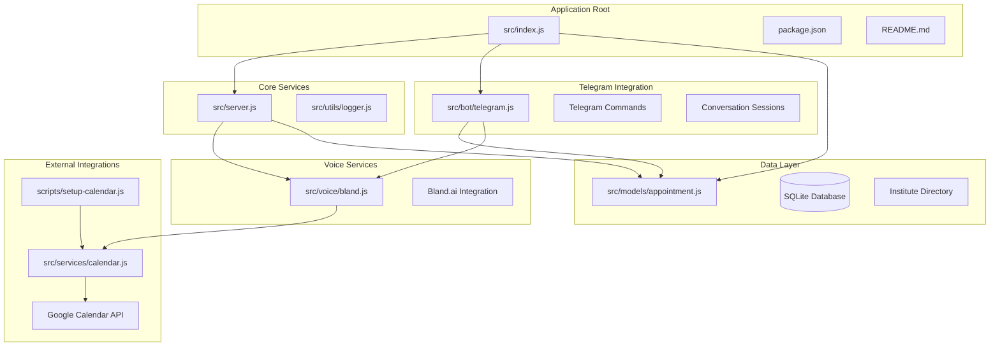
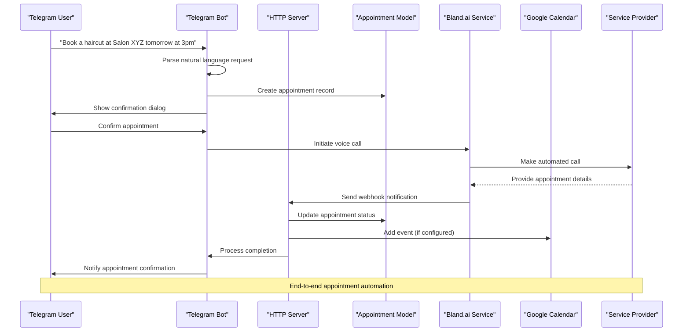
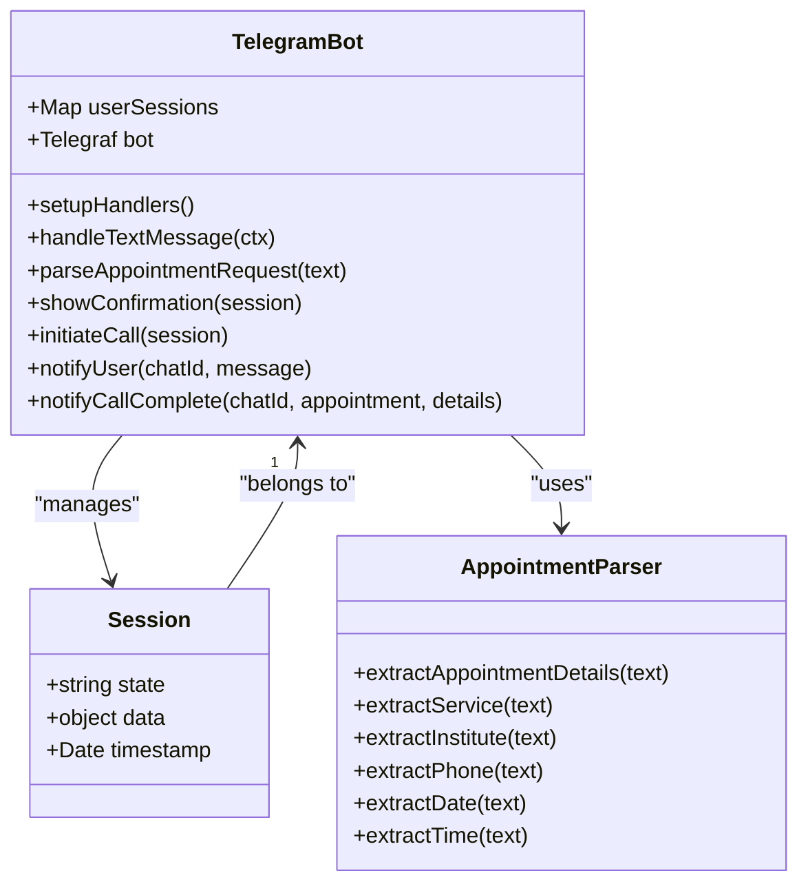
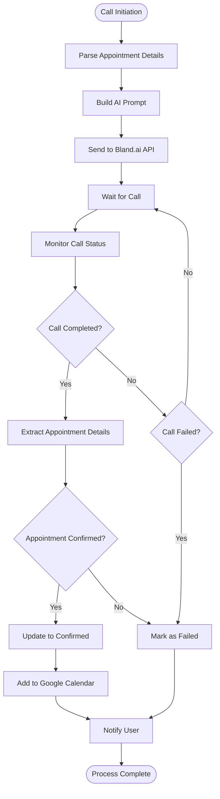
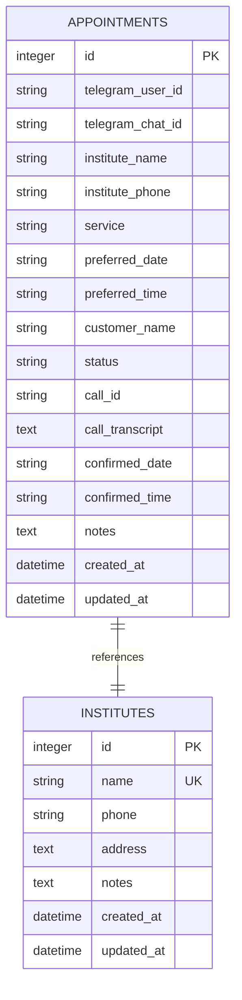
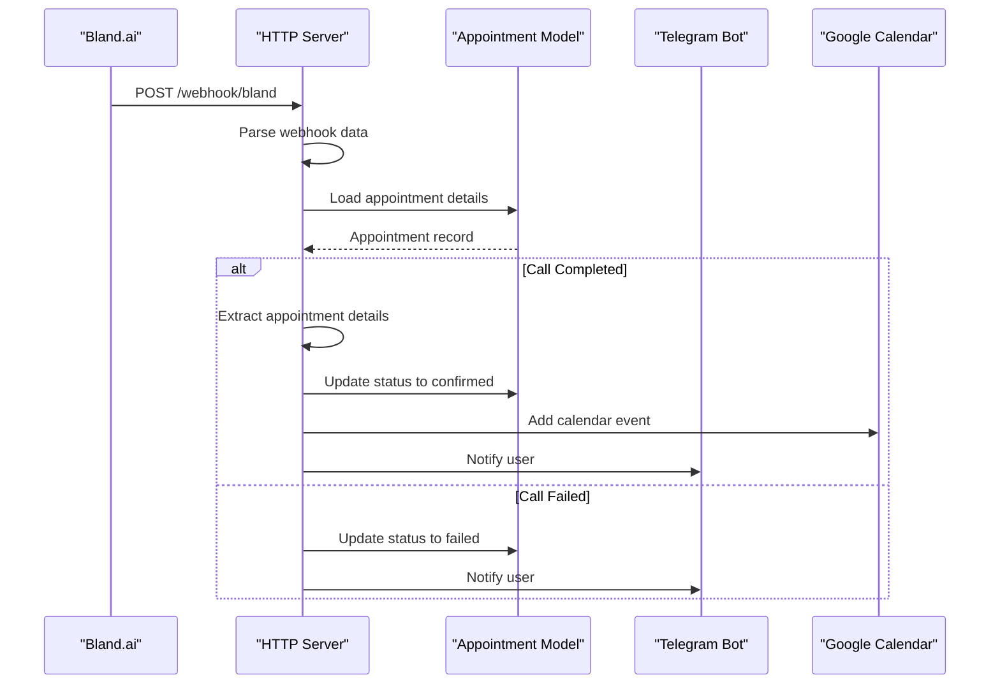
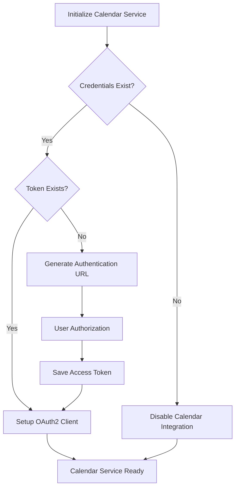
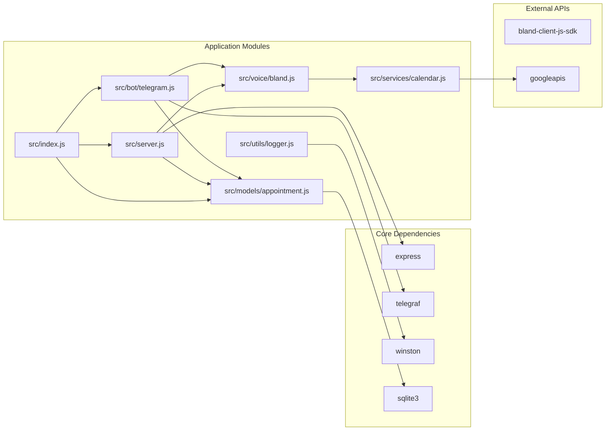

# Telegram Bot Enhancements

<cite>
**Referenced Files in This Document**
- [README.md](file://README.md)
- [package.json](file://package.json)
- [src/index.js](file://src/index.js)
- [src/server.js](file://src/server.js)
- [src/bot/telegram.js](file://src/bot/telegram.js)
- [src/models/appointment.js](file://src/models/appointment.js)
- [src/voice/bland.js](file://src/voice/bland.js)
- [src/utils/logger.js](file://src/utils/logger.js)
- [src/services/calendar.js](file://src/services/calendar.js)
- [scripts/setup-calendar.js](file://scripts/setup-calendar.js)
</cite>

## Table of Contents
1. [Introduction](#introduction)
2. [Project Structure](#project-structure)
3. [Core Components](#core-components)
4. [Architecture Overview](#architecture-overview)
5. [Detailed Component Analysis](#detailed-component-analysis)
6. [Dependency Analysis](#dependency-analysis)
7. [Performance Considerations](#performance-considerations)
8. [Troubleshooting Guide](#troubleshooting-guide)
9. [Conclusion](#conclusion)

## Introduction
The Telegram Bot Enhancements project is an AI-powered voice agent that automates appointment scheduling through natural language conversations on Telegram and automated phone calls via Bland.ai. This system transforms casual messages like "Book a haircut at Salon XYZ tomorrow at 3pm" into confirmed appointments by making intelligent phone calls and managing the entire process automatically.

The application provides a comprehensive solution for appointment management with features including:
- Natural language processing for appointment requests
- Automated phone call orchestration
- Real-time status updates via Telegram
- Google Calendar integration
- Persistent storage of appointment data
- Comprehensive logging and error handling

## Project Structure
The project follows a modular architecture with clear separation of concerns across different functional areas:

**Diagram sources**
- [src/index.js:1-108](file://src/index.js#L1-L108)
- [src/server.js:8-351](file://src/server.js#L8-L351)
- [src/bot/telegram.js:6-577](file://src/bot/telegram.js#L6-L577)

**Section sources**
- [README.md:154-175](file://README.md#L154-L175)
- [package.json:1-37](file://package.json#L1-L37)

## Core Components

### Application Entry Point
The application starts through a centralized entry point that orchestrates the initialization of all major components. The main function validates required environment variables, initializes the database, sets up external services, and launches both the Telegram bot and HTTP server.

### Telegram Bot Engine
The Telegram bot provides a conversational interface for users to request appointments. It supports natural language processing, interactive button-based confirmation, and comprehensive command handling for managing appointments and institute directories.

### Voice Call Service
Powered by Bland.ai, this service handles the automated phone conversations with service providers. It generates contextually appropriate prompts, manages call lifecycle, and processes call outcomes to extract appointment confirmation details.

### Data Management
The SQLite-based persistence layer manages appointment records, institute directories, and maintains transactional integrity across all operations. It provides robust querying capabilities and supports concurrent access patterns.

### Calendar Integration
Optional Google Calendar integration allows automatic event creation when appointments are confirmed, providing seamless synchronization with users' calendar systems.

**Section sources**
- [src/index.js:9-53](file://src/index.js#L9-L53)
- [src/bot/telegram.js:6-42](file://src/bot/telegram.js#L6-L42)
- [src/voice/bland.js:3-8](file://src/voice/bland.js#L3-L8)
- [src/models/appointment.js:7-24](file://src/models/appointment.js#L7-L24)

## Architecture Overview

The system implements a microservice-style architecture with clear boundaries between components:

**Diagram sources**
- [src/bot/telegram.js:485-517](file://src/bot/telegram.js#L485-L517)
- [src/server.js:130-184](file://src/server.js#L130-L184)
- [src/voice/bland.js:21-64](file://src/voice/bland.js#L21-L64)

The architecture emphasizes:
- **Decoupled Components**: Each service has distinct responsibilities
- **Asynchronous Processing**: Webhooks handle event-driven updates
- **Resilient Error Handling**: Comprehensive logging and graceful degradation
- **Extensible Design**: Modular services can be independently maintained

## Detailed Component Analysis

### Telegram Bot Implementation

The Telegram bot implements a sophisticated conversational interface with state management and natural language processing capabilities.

**Diagram sources**
- [src/bot/telegram.js:6-577](file://src/bot/telegram.js#L6-L577)

The bot supports multiple interaction modes:
- **Natural Language Requests**: Users can describe appointments in conversational terms
- **Interactive Confirmation**: Inline buttons for approval, cancellation, or editing
- **Command-Based Management**: Dedicated commands for appointments, institutes, and user management
- **State Persistence**: Conversation state maintained per user session

**Section sources**
- [src/bot/telegram.js:139-331](file://src/bot/telegram.js#L139-L331)
- [src/bot/telegram.js:423-475](file://src/bot/telegram.js#L423-L475)

### Voice Call Service Architecture

The Bland.ai integration provides automated phone conversation capabilities with sophisticated prompt engineering and outcome processing.

**Diagram sources**
- [src/voice/bland.js:21-64](file://src/voice/bland.js#L21-L64)
- [src/server.js:186-269](file://src/server.js#L186-L269)

The voice service implements:
- **Dynamic Prompt Generation**: Context-aware conversation scripts
- **Multi-format Transcript Processing**: Handles various webhook data structures
- **Intelligent Confirmation Detection**: Sophisticated logic for determining appointment success
- **Call Lifecycle Management**: Full control over call initiation, monitoring, and termination

**Section sources**
- [src/voice/bland.js:71-112](file://src/voice/bland.js#L71-L112)
- [src/voice/bland.js:210-359](file://src/voice/bland.js#L210-L359)

### Data Management System

The SQLite-based persistence layer provides robust data management with comprehensive querying capabilities and transactional integrity.

**Diagram sources**
- [src/models/appointment.js:27-59](file://src/models/appointment.js#L27-L59)

The model provides:
- **Dual-Purpose Design**: Manages both appointments and institute directories
- **Flexible Querying**: Multiple retrieval methods for different use cases
- **Atomic Operations**: Transaction-safe updates with status validation
- **Search Capabilities**: Intelligent institute lookup and matching

**Section sources**
- [src/models/appointment.js:85-240](file://src/models/appointment.js#L85-L240)
- [src/models/appointment.js:242-332](file://src/models/appointment.js#L242-L332)

### HTTP Server and Webhook Processing

The Express-based server handles external integrations and provides administrative endpoints for debugging and monitoring.

**Diagram sources**
- [src/server.js:130-184](file://src/server.js#L130-L184)
- [src/server.js:186-314](file://src/server.js#L186-L314)

**Section sources**
- [src/server.js:17-32](file://src/server.js#L17-L32)
- [src/server.js:44-93](file://src/server.js#L44-L93)

### Google Calendar Integration

The calendar service provides optional integration with Google Calendar for automatic event creation and synchronization.

**Diagram sources**
- [src/services/calendar.js:18-55](file://src/services/calendar.js#L18-L55)

**Section sources**
- [src/services/calendar.js:96-163](file://src/services/calendar.js#L96-L163)
- [src/services/calendar.js:171-269](file://src/services/calendar.js#L171-L269)

## Dependency Analysis

The project demonstrates excellent modularity with clear dependency relationships:

**Diagram sources**
- [package.json:21-28](file://package.json#L21-L28)
- [src/index.js:3-7](file://src/index.js#L3-L7)

Key dependency characteristics:
- **Minimal External Dependencies**: Only essential packages for core functionality
- **Clear Separation**: Business logic isolated from framework concerns
- **Testable Architecture**: Modular design enables comprehensive testing
- **Maintainable Codebase**: Single responsibility principle across all components

**Section sources**
- [package.json:21-36](file://package.json#L21-L36)
- [src/index.js:1-108](file://src/index.js#L1-L108)

## Performance Considerations

The application is designed with several performance optimization strategies:

### Asynchronous Processing
- **Non-blocking Operations**: All I/O operations use promises and async/await patterns
- **Concurrent Processing**: Multiple operations can run simultaneously without blocking
- **Efficient Database Queries**: Optimized SQL statements with appropriate indexing

### Resource Management
- **Connection Pooling**: SQLite connections managed efficiently with proper cleanup
- **Memory Optimization**: Session data stored temporarily, cleared after completion
- **Network Efficiency**: Minimal external API calls with caching where appropriate

### Scalability Factors
- **Stateless Design**: Components designed to handle multiple concurrent users
- **Modular Architecture**: Independent scaling of different services
- **Graceful Degradation**: Calendar integration disabled if not configured

## Troubleshooting Guide

### Common Issues and Solutions

**Telegram Bot Not Responding**
- Verify TELEGRAM_BOT_TOKEN environment variable is correctly set
- Check that the bot is started with npm run dev or npm start
- Review logs for authentication errors or network connectivity issues

**Voice Calls Failing**
- Confirm BLAND_API_KEY is valid and has sufficient credits
- Verify WEBHOOK_URL is publicly accessible and properly configured
- Ensure ngrok is running for local development environments

**Calendar Integration Problems**
- Check that calendar-credentials.json exists in the data directory
- Verify OAuth2 authentication process completed successfully
- Ensure Google Calendar API is enabled in the Google Cloud Console

**Database Connection Issues**
- Verify DATABASE_PATH environment variable points to writable location
- Check SQLite database file permissions
- Ensure sufficient disk space for database growth

**Webhook Processing Failures**
- Validate webhook URL matches WEBHOOK_URL environment variable
- Check server accessibility from external networks
- Review server logs for incoming request patterns

**Section sources**
- [README.md:212-227](file://README.md#L212-L227)
- [src/utils/logger.js:1-28](file://src/utils/logger.js#L1-L28)

## Conclusion

The Telegram Bot Enhancements project represents a sophisticated solution for automated appointment scheduling that successfully combines natural language processing, voice automation, and intelligent data management. The modular architecture ensures maintainability while the comprehensive feature set addresses real-world appointment scheduling challenges.

Key strengths of the implementation include:
- **Robust Error Handling**: Comprehensive logging and graceful degradation strategies
- **Flexible Architecture**: Modular design enabling easy extension and maintenance
- **User-Friendly Interface**: Natural language processing and intuitive Telegram interactions
- **Professional Integration**: Seamless voice call automation and calendar synchronization
- **Production-Ready Design**: Proper resource management and scalability considerations

The system provides a solid foundation for appointment automation that can be extended with additional features such as advanced NLP processing, multi-language support, enhanced calendar integration, and expanded service provider networks.