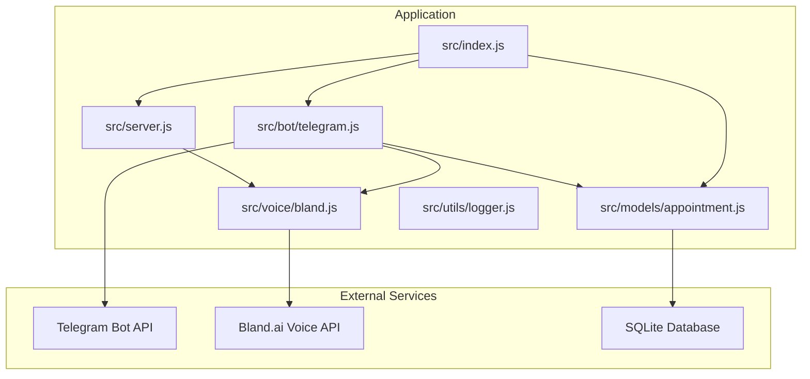
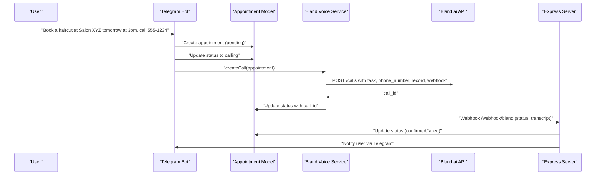
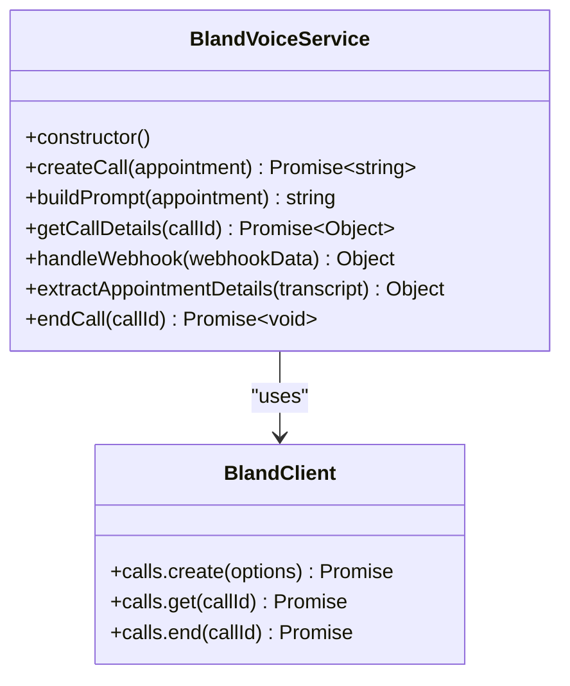
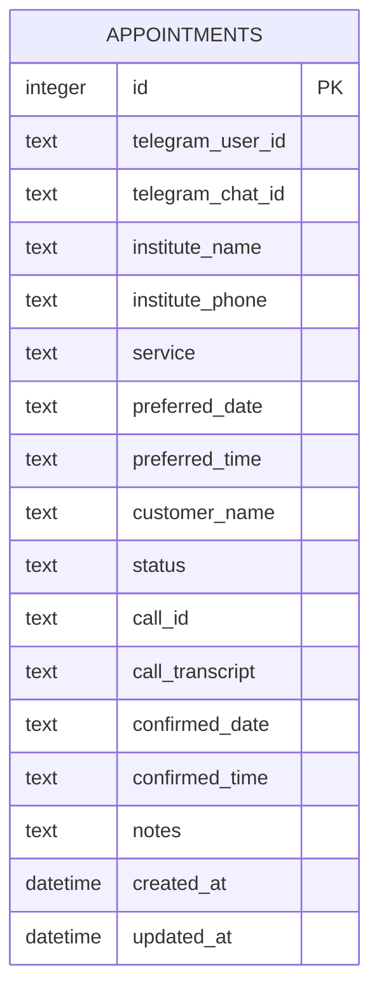
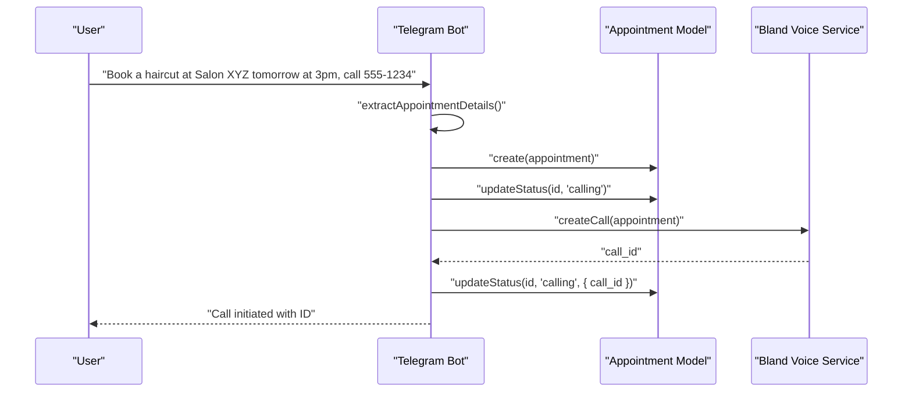
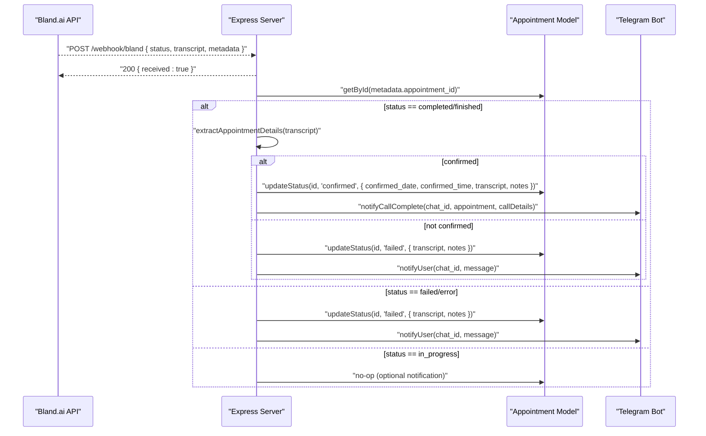
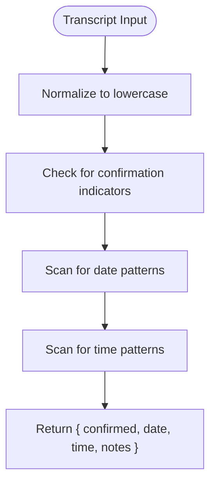
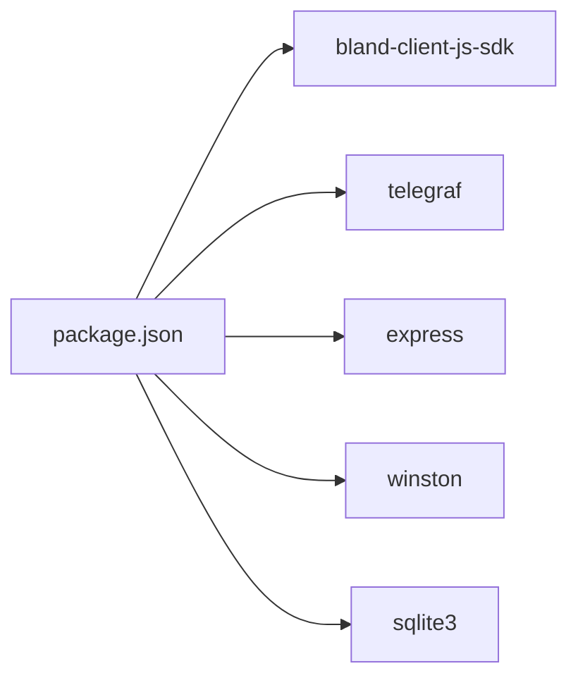

# Voice Service Integration

<cite>
**Referenced Files in This Document**
- [src/voice/bland.js](file://src/voice/bland.js)
- [src/models/appointment.js](file://src/models/appointment.js)
- [src/server.js](file://src/server.js)
- [src/bot/telegram.js](file://src/bot/telegram.js)
- [src/index.js](file://src/index.js)
- [src/utils/logger.js](file://src/utils/logger.js)
- [README.md](file://README.md)
- [package.json](file://package.json)
</cite>

## Update Summary
**Changes Made**
- Updated Bland Voice Service section to reflect the complete 272-line implementation
- Enhanced call creation process documentation with detailed API integration
- Expanded transcript analysis section with comprehensive regex patterns
- Added detailed webhook handling documentation with status routing
- Updated integration patterns with Bland.ai Voice API including all parameters
- Enhanced error handling and fallback strategies documentation

## Table of Contents
1. [Introduction](#introduction)
2. [Project Structure](#project-structure)
3. [Core Components](#core-components)
4. [Architecture Overview](#architecture-overview)
5. [Detailed Component Analysis](#detailed-component-analysis)
6. [Dependency Analysis](#dependency-analysis)
7. [Performance Considerations](#performance-considerations)
8. [Troubleshooting Guide](#troubleshooting-guide)
9. [Conclusion](#conclusion)

## Introduction
This document explains the voice service integration with Bland.ai for automated appointment scheduling. It covers the call creation process, dynamic prompt engineering for different service types, webhook handling for call status updates, transcript analysis and confirmation extraction, and call lifecycle management. It also documents the integration patterns with Bland.ai's Voice API, including call initiation parameters, recording management, and status polling, along with error handling, retry mechanisms, and fallback strategies.

## Project Structure
The application is organized into modular components:
- Voice service integration with Bland.ai
- Telegram bot for user interaction and conversation flow
- Appointment model for database persistence
- Express server for webhook reception and debugging endpoints
- Central entry point orchestrating startup and shutdown

**Diagram sources**
- [src/index.js:1-91](file://src/index.js#L1-L91)
- [src/server.js:1-266](file://src/server.js#L1-L266)
- [src/bot/telegram.js:1-461](file://src/bot/telegram.js#L1-L461)
- [src/voice/bland.js:1-272](file://src/voice/bland.js#L1-L272)
- [src/models/appointment.js:1-238](file://src/models/appointment.js#L1-L238)
- [src/utils/logger.js:1-28](file://src/utils/logger.js#L1-L28)

**Section sources**
- [README.md:154-175](file://README.md#L154-L175)
- [package.json:1-35](file://package.json#L1-L35)

## Core Components
- Bland Voice Service: Handles call creation, prompt building, call details retrieval, webhook parsing, transcript analysis, and call termination.
- Appointment Model: Manages SQLite database operations for appointment lifecycle and status updates.
- Telegram Bot: Parses user requests, manages conversation sessions, initiates calls, and notifies users.
- Express Server: Exposes health checks, webhook receiver, and debugging endpoints.
- Logger: Provides structured logging across components.

**Section sources**
- [src/voice/bland.js:4-272](file://src/voice/bland.js#L4-L272)
- [src/models/appointment.js:7-238](file://src/models/appointment.js#L7-L238)
- [src/bot/telegram.js:6-461](file://src/bot/telegram.js#L6-L461)
- [src/server.js:7-266](file://src/server.js#L7-L266)
- [src/utils/logger.js:1-28](file://src/utils/logger.js#L1-L28)

## Architecture Overview
The system integrates Telegram, Bland.ai, and SQLite through a central orchestration layer. Users interact with the Telegram bot, which persists appointment requests and triggers voice calls via Bland.ai. Bland.ai sends call status webhooks to the Express server, which parses events, updates the database, and notifies users.

**Diagram sources**
- [src/bot/telegram.js:373-405](file://src/bot/telegram.js#L373-L405)
- [src/voice/bland.js:23-64](file://src/voice/bland.js#L23-L64)
- [src/server.js:77-123](file://src/server.js#L77-L123)
- [src/models/appointment.js:102-147](file://src/models/appointment.js#L102-L147)

## Detailed Component Analysis

### Bland Voice Service
The Bland Voice Service encapsulates all Bland.ai integration logic with comprehensive functionality:
- Call Creation: Builds a dynamic prompt based on appointment details and invokes the Bland.ai API with call initiation parameters.
- Prompt Engineering: Generates a natural-sounding script tailored to the service type and user preferences.
- Call Details Retrieval: Fetches live call details and transcripts from Bland.ai.
- Webhook Handling: Parses incoming webhook payloads and extracts metadata for appointment correlation.
- Transcript Analysis: Extracts confirmation status, date, and time from the transcript.
- Call Termination: Ends active calls programmatically.

Key implementation patterns:
- Constructor initializes the Bland client with API key and webhook URL from environment variables.
- createCall builds a prompt and sets call options including phone number, task, voice selection, greeting wait, recording, webhook, and metadata.
- buildPrompt composes a structured instruction set for the AI assistant.
- handleWebhook extracts call_id, status, transcript, recording_url, summary, and metadata.
- extractAppointmentDetails performs comprehensive confirmation detection and date/time extraction using pattern matching.
- getCallDetails and endCall wrap Bland.ai API calls with error logging.

**Updated** Enhanced with complete 272-line implementation including advanced transcript analysis and comprehensive error handling.

**Diagram sources**
- [src/voice/bland.js:4-272](file://src/voice/bland.js#L4-L272)

**Section sources**
- [src/voice/bland.js:23-64](file://src/voice/bland.js#L23-L64)
- [src/voice/bland.js:71-112](file://src/voice/bland.js#L71-L112)
- [src/voice/bland.js:119-141](file://src/voice/bland.js#L119-L141)
- [src/voice/bland.js:148-174](file://src/voice/bland.js#L148-L174)
- [src/voice/bland.js:181-240](file://src/voice/bland.js#L181-L240)
- [src/voice/bland.js:247-268](file://src/voice/bland.js#L247-L268)

### Appointment Model
The Appointment Model manages SQLite operations:
- Initialization: Creates the appointments table with fields for Telegram identifiers, institute details, service, preferences, status, call metadata, and timestamps.
- CRUD Operations: Create, update status, retrieve by ID, by call ID, by user, and pending appointments.
- Status Management: Enforces allowed statuses and updates timestamps automatically.

**Diagram sources**
- [src/models/appointment.js:27-60](file://src/models/appointment.js#L27-L60)

**Section sources**
- [src/models/appointment.js:12-60](file://src/models/appointment.js#L12-L60)
- [src/models/appointment.js:62-100](file://src/models/appointment.js#L62-L100)
- [src/models/appointment.js:102-147](file://src/models/appointment.js#L102-L147)
- [src/models/appointment.js:149-177](file://src/models/appointment.js#L149-L177)
- [src/models/appointment.js:199-216](file://src/models/appointment.js#L199-L216)

### Telegram Bot Integration
The Telegram Bot:
- Parses natural language requests to extract service, institute, phone, date, and time.
- Manages conversation sessions and confirmation flows.
- Initiates calls by creating appointments, updating status, invoking Bland Voice Service, and persisting call IDs.
- Notifies users of call progress and outcomes.

**Diagram sources**
- [src/bot/telegram.js:182-224](file://src/bot/telegram.js#L182-L224)
- [src/bot/telegram.js:373-405](file://src/bot/telegram.js#L373-L405)
- [src/models/appointment.js:62-100](file://src/models/appointment.js#L62-L100)
- [src/models/appointment.js:102-147](file://src/models/appointment.js#L102-L147)
- [src/voice/bland.js:23-64](file://src/voice/bland.js#L23-L64)

**Section sources**
- [src/bot/telegram.js:182-294](file://src/bot/telegram.js#L182-L294)
- [src/bot/telegram.js:373-405](file://src/bot/telegram.js#L373-L405)

### Webhook Handling and Call Lifecycle
The Express server receives Bland.ai webhooks and processes call status updates:
- Immediate acknowledgment to Bland.ai to prevent retries.
- Asynchronous processing to avoid blocking the webhook response.
- Status routing: completed, failed/error, in_progress.
- Transcript-based confirmation extraction and database updates.
- User notifications via Telegram.

**Updated** Enhanced with comprehensive status handling including detailed error processing and user notification flows.

**Diagram sources**
- [src/server.js:77-123](file://src/server.js#L77-L123)
- [src/server.js:125-184](file://src/server.js#L125-L184)
- [src/server.js:186-218](file://src/server.js#L186-L218)
- [src/server.js:220-229](file://src/server.js#L220-L229)
- [src/voice/bland.js:181-240](file://src/voice/bland.js#L181-L240)

**Section sources**
- [src/server.js:77-123](file://src/server.js#L77-L123)
- [src/server.js:125-184](file://src/server.js#L125-L184)
- [src/server.js:186-218](file://src/server.js#L186-L218)
- [src/server.js:220-229](file://src/server.js#L220-L229)

### Transcript Processing Logic
The transcript processing logic performs comprehensive analysis:
- Confirmation Detection: Scans for phrases indicating successful booking using multiple confirmation indicators.
- Date Extraction: Matches day-of-week, numeric dates, and month-day patterns using regex patterns.
- Time Extraction: Matches 12-hour clock formats and am/pm markers using sophisticated time patterns.
- Output: Returns a structured object with confirmation flag, extracted date, and time.

**Updated** Enhanced with comprehensive regex patterns for date and time extraction, including support for various formats.

**Diagram sources**
- [src/voice/bland.js:181-240](file://src/voice/bland.js#L181-L240)

**Section sources**
- [src/voice/bland.js:181-240](file://src/voice/bland.js#L181-L240)

### Integration Patterns with Bland.ai Voice API
The Bland Voice Service integrates with Bland.ai's Voice API through comprehensive call management:
- Call Initiation Parameters:
  - phone_number: Target institute phone number.
  - task: Dynamic prompt built from appointment details.
  - voice: Voice selection identifier.
  - wait_for_greeting: Waits for greeting before proceeding.
  - record: Enables call recording.
  - webhook: Public URL for status updates.
  - metadata: Embeds appointment and Telegram identifiers for correlation.
- Recording Management: Recording URL is included in webhook payload for user access.
- Status Polling: The system relies on webhooks rather than polling; call details can be fetched via getCallDetails for debugging.

**Updated** Enhanced with complete API integration including detailed parameter configuration and error handling.

**Section sources**
- [src/voice/bland.js:25-37](file://src/voice/bland.js#L25-L37)
- [src/voice/bland.js:119-141](file://src/voice/bland.js#L119-L141)
- [src/server.js:60-69](file://src/server.js#L60-L69)

### Supported Service Types and Prompt Templates
Supported service types include haircuts, dental cleanings, reservations, and general consultations. The prompt template dynamically adapts to:
- Institute name and service type
- Customer name and preferred date/time
- Negotiation of alternative times
- Confirmation of all details before ending

Examples of supported service types:
- Haircuts
- Dental cleanings
- Reservations (e.g., dinner tables)

**Section sources**
- [src/voice/bland.js:71-112](file://src/voice/bland.js#L71-L112)
- [README.md:106-114](file://README.md#L106-L114)

### Error Handling, Retries, and Fallbacks
The system implements comprehensive error handling and fallback strategies:
- Startup Validation: Ensures required environment variables are present before starting.
- Graceful Shutdown: Stops Telegram bot, Express server, and closes database connections.
- Webhook Acknowledgment: Immediately responds to Bland.ai to prevent repeated delivery.
- Status Updates: On failures, updates status to failed and notifies users with actionable messages.
- Fallback Strategies: Provides guidance for common failure scenarios (invalid phone, voicemail, service unavailable).
- API Error Handling: Comprehensive error handling for Bland.ai API calls with detailed logging.

**Updated** Enhanced with detailed error handling patterns and comprehensive fallback strategies.

**Section sources**
- [src/index.js:12-20](file://src/index.js#L12-L20)
- [src/index.js:47-87](file://src/index.js#L47-L87)
- [src/server.js:81-82](file://src/server.js#L81-L82)
- [src/server.js:186-218](file://src/server.js#L186-L218)

## Dependency Analysis
The application depends on external libraries and services:
- Bland: Bland.ai SDK for voice API integration.
- Telegraf: Telegram bot framework.
- Express: Web server for webhook and debugging endpoints.
- Winston: Structured logging.
- SQLite3: Local database storage.

**Diagram sources**
- [package.json:20-30](file://package.json#L20-L30)

**Section sources**
- [package.json:20-30](file://package.json#L20-L30)

## Performance Considerations
- Webhook Processing: Immediate acknowledgment prevents duplicate processing and reduces latency.
- Asynchronous Workflows: Webhook handlers process events asynchronously to avoid blocking responses.
- Database Efficiency: Index-friendly queries on appointment_id and status facilitate quick lookups.
- Logging Overhead: Structured logging minimizes formatting overhead while providing valuable observability.

## Troubleshooting Guide
Common issues and resolutions:
- Missing Environment Variables: Ensure TELEGRAM_BOT_TOKEN, BLAND_API_KEY, and WEBHOOK_URL are configured.
- Webhook Delivery Failures: Verify the webhook URL is publicly accessible and the server is running.
- Call Initiation Failures: Validate the phone number format and Bland.ai API key.
- Database Connectivity: Confirm the SQLite database path and permissions.

**Section sources**
- [src/index.js:12-20](file://src/index.js#L12-L20)
- [README.md:212-228](file://README.md#L212-L228)

## Conclusion
The voice service integration with Bland.ai provides a robust pipeline for automated appointment scheduling. By combining dynamic prompt engineering, reliable webhook handling, transcript-based confirmation extraction, and comprehensive error management, the system delivers a seamless user experience. The modular architecture ensures maintainability and extensibility for future enhancements. The complete 272-line implementation demonstrates comprehensive coverage of all aspects of voice service integration, from call initiation to final confirmation and user notification.