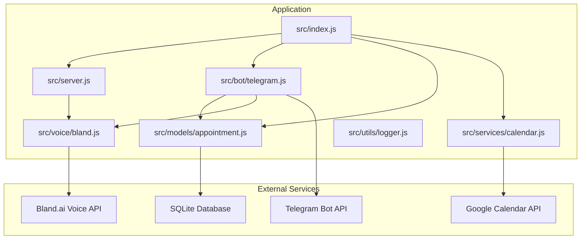
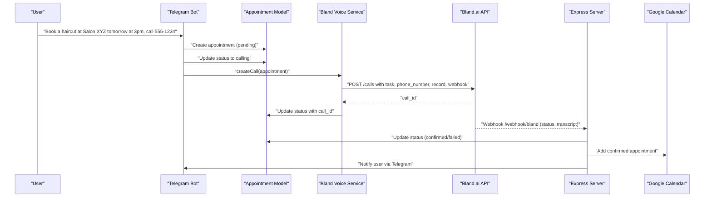
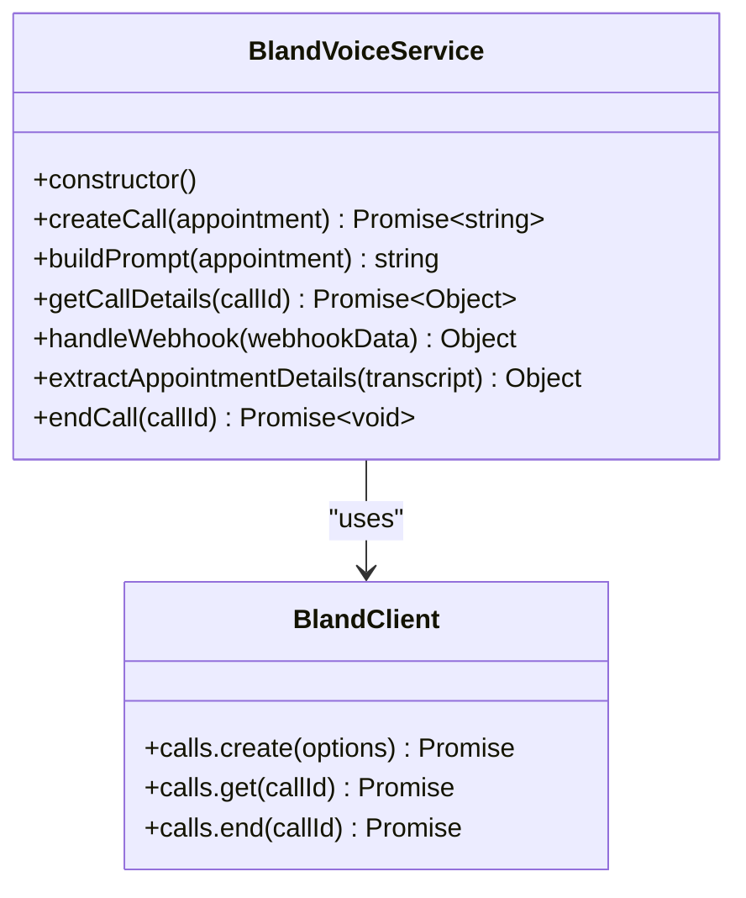
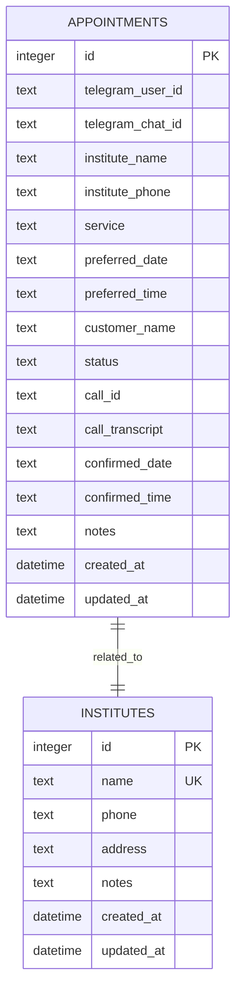
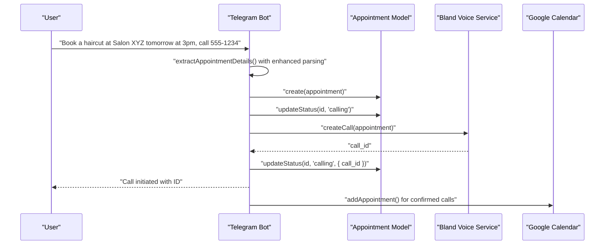
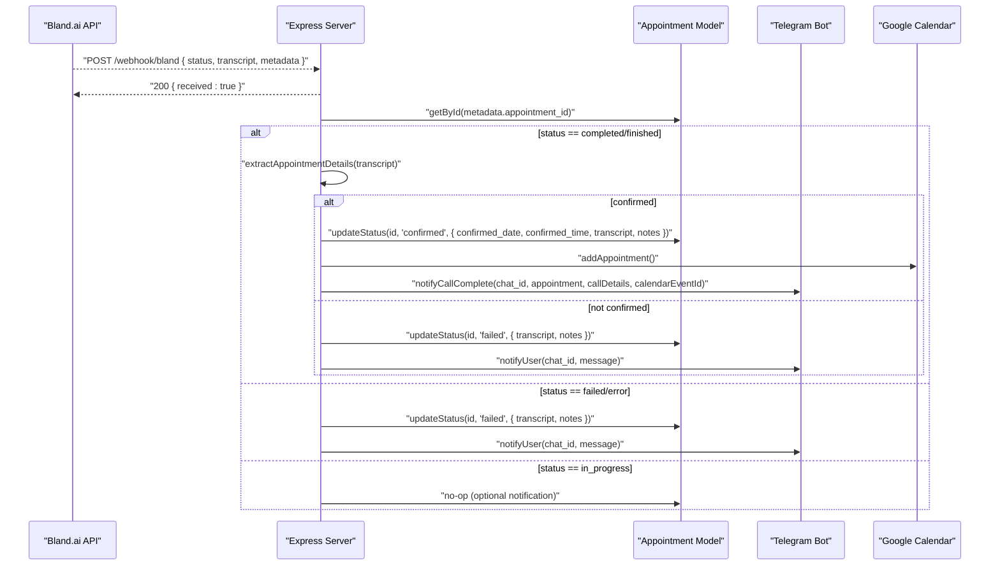
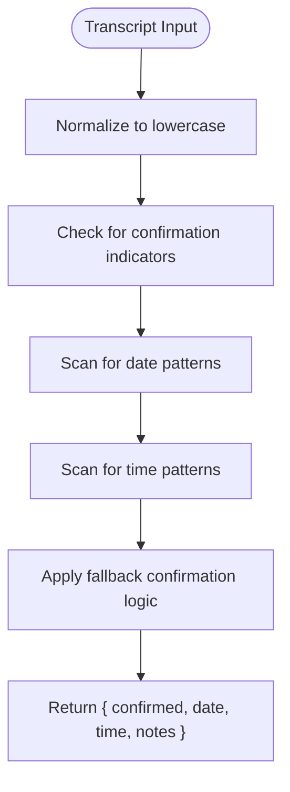
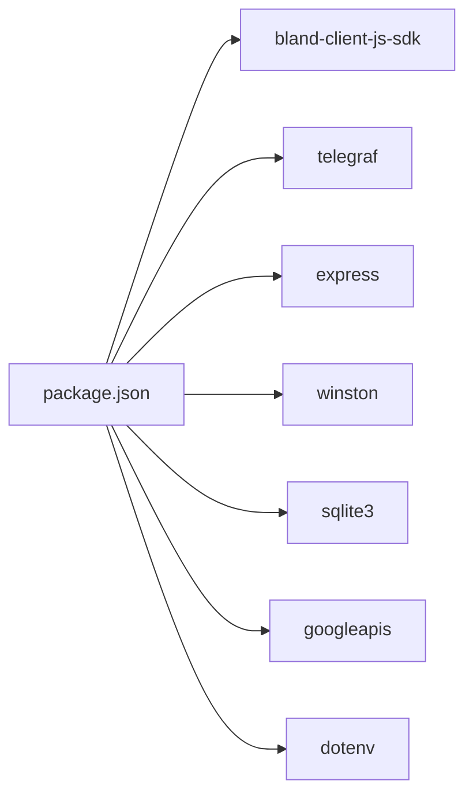

# Voice Service Integration

<cite>
**Referenced Files in This Document**
- [src/voice/bland.js](file://src/voice/bland.js)
- [src/models/appointment.js](file://src/models/appointment.js)
- [src/server.js](file://src/server.js)
- [src/bot/telegram.js](file://src/bot/telegram.js)
- [src/index.js](file://src/index.js)
- [src/utils/logger.js](file://src/utils/logger.js)
- [src/services/calendar.js](file://src/services/calendar.js)
- [README.md](file://README.md)
- [package.json](file://package.json)
</cite>

## Update Summary
**Changes Made**
- Updated Bland Voice Service section to reflect the enhanced 391-line implementation with comprehensive webhook data extraction
- Enhanced call creation process documentation with detailed API integration and error handling
- Expanded transcript analysis section with advanced regex patterns and confirmation detection algorithms
- Added detailed webhook handling documentation with multiple transcript field support and metadata extraction
- Updated integration patterns with Bland.ai Voice API including all parameters and improved error handling
- Enhanced error handling and fallback strategies documentation with comprehensive logging
- Added Google Calendar integration for automatic appointment scheduling

## Table of Contents
1. [Introduction](#introduction)
2. [Project Structure](#project-structure)
3. [Core Components](#core-components)
4. [Architecture Overview](#architecture-overview)
5. [Detailed Component Analysis](#detailed-component-analysis)
6. [Dependency Analysis](#dependency-analysis)
7. [Performance Considerations](#performance-considerations)
8. [Troubleshooting Guide](#troubleshooting-guide)
9. [Conclusion](#conclusion)

## Introduction
This document explains the voice service integration with Bland.ai for automated appointment scheduling. It covers the call creation process, dynamic prompt engineering for different service types, webhook handling for call status updates, transcript analysis and confirmation extraction, and call lifecycle management. It also documents the integration patterns with Bland.ai's Voice API, including call initiation parameters, recording management, and status polling, along with error handling, retry mechanisms, and fallback strategies.

## Project Structure
The application is organized into modular components:
- Voice service integration with Bland.ai featuring enhanced webhook processing
- Telegram bot for user interaction and conversation flow
- Appointment model for database persistence with Google Calendar integration
- Express server for webhook reception and debugging endpoints
- Central entry point orchestrating startup and shutdown
- Google Calendar service for automatic appointment scheduling

**Diagram sources**
- [src/index.js:1-108](file://src/index.js#L1-L108)
- [src/server.js:1-351](file://src/server.js#L1-L351)
- [src/bot/telegram.js:1-550](file://src/bot/telegram.js#L1-L550)
- [src/voice/bland.js:1-391](file://src/voice/bland.js#L1-L391)
- [src/models/appointment.js:1-354](file://src/models/appointment.js#L1-L354)
- [src/services/calendar.js:1-475](file://src/services/calendar.js#L1-L475)
- [src/utils/logger.js:1-28](file://src/utils/logger.js#L1-L28)

**Section sources**
- [README.md:154-175](file://README.md#L154-L175)
- [package.json:1-37](file://package.json#L1-L37)

## Core Components
- Bland Voice Service: Handles call creation, prompt building, call details retrieval, webhook parsing, transcript analysis, and call termination with enhanced error handling.
- Appointment Model: Manages SQLite database operations for appointment lifecycle, status updates, and Google Calendar integration.
- Telegram Bot: Parses user requests, manages conversation sessions, initiates calls, and notifies users with enhanced confirmation handling.
- Express Server: Exposes health checks, webhook receiver, and debugging endpoints with comprehensive logging.
- Logger: Provides structured logging across components with Winston integration.
- Google Calendar Service: Automatically adds confirmed appointments to user calendars with intelligent date/time parsing.

**Section sources**
- [src/voice/bland.js:4-391](file://src/voice/bland.js#L4-L391)
- [src/models/appointment.js:7-354](file://src/models/appointment.js#L7-L354)
- [src/bot/telegram.js:6-550](file://src/bot/telegram.js#L6-L550)
- [src/server.js:7-351](file://src/server.js#L7-L351)
- [src/utils/logger.js:1-28](file://src/utils/logger.js#L1-L28)
- [src/services/calendar.js:6-475](file://src/services/calendar.js#L6-L475)

## Architecture Overview
The system integrates Telegram, Bland.ai, Google Calendar, and SQLite through a central orchestration layer. Users interact with the Telegram bot, which persists appointment requests and triggers voice calls via Bland.ai. Bland.ai sends call status webhooks to the Express server, which parses events, updates the database, and notifies users. Confirmed appointments are automatically added to Google Calendar.

**Diagram sources**
- [src/bot/telegram.js:458-490](file://src/bot/telegram.js#L458-L490)
- [src/voice/bland.js:21-64](file://src/voice/bland.js#L21-L64)
- [src/server.js:130-184](file://src/server.js#L130-L184)
- [src/models/appointment.js:125-170](file://src/models/appointment.js#L125-L170)
- [src/services/calendar.js:96-163](file://src/services/calendar.js#L96-L163)

## Detailed Component Analysis

### Enhanced Bland Voice Service
The Bland Voice Service encapsulates all Bland.ai integration logic with comprehensive functionality and enhanced error handling:
- Call Creation: Builds a dynamic prompt based on appointment details and invokes the Bland.ai API with call initiation parameters including comprehensive error handling.
- Prompt Engineering: Generates a natural-sounding script tailored to the service type and user preferences with detailed instructions.
- Call Details Retrieval: Fetches live call details and transcripts from Bland.ai with robust error handling.
- Webhook Handling: Parses incoming webhook payloads with support for multiple transcript field formats and comprehensive metadata extraction.
- Transcript Analysis: Extracts confirmation status, date, and time from the transcript using advanced pattern matching and fallback algorithms.
- Call Termination: Ends active calls programmatically with error logging.

Key implementation patterns:
- Constructor initializes the Bland client with API key and webhook URL from environment variables.
- createCall builds a prompt and sets call options including phone number, task, voice selection, greeting wait, recording, webhook, and metadata with comprehensive error handling.
- buildPrompt composes a structured instruction set for the AI assistant with detailed conversation guidelines.
- handleWebhook extracts call_id, status, transcript variants, recording_url, summary, and metadata with fallback support.
- extractAppointmentDetails performs comprehensive confirmation detection using expanded indicator lists and date/time extraction using sophisticated regex patterns.
- getCallDetails and endCall wrap Bland.ai API calls with detailed error logging and response validation.

**Updated** Enhanced with complete 391-line implementation including advanced transcript analysis, comprehensive error handling, and multiple webhook data format support.

**Diagram sources**
- [src/voice/bland.js:4-391](file://src/voice/bland.js#L4-L391)

**Section sources**
- [src/voice/bland.js:21-64](file://src/voice/bland.js#L21-L64)
- [src/voice/bland.js:71-112](file://src/voice/bland.js#L71-L112)
- [src/voice/bland.js:119-141](file://src/voice/bland.js#L119-L141)
- [src/voice/bland.js:148-203](file://src/voice/bland.js#L148-L203)
- [src/voice/bland.js:210-359](file://src/voice/bland.js#L210-L359)
- [src/voice/bland.js:366-387](file://src/voice/bland.js#L366-L387)

### Enhanced Appointment Model
The Appointment Model manages SQLite operations with comprehensive Google Calendar integration:
- Initialization: Creates the appointments table with fields for Telegram identifiers, institute details, service, preferences, status, call metadata, and timestamps.
- CRUD Operations: Create, update status, retrieve by ID, by call ID, by user, and pending appointments.
- Status Management: Enforces allowed statuses and updates timestamps automatically.
- Google Calendar Integration: Adds confirmed appointments to user calendars with intelligent date/time parsing and event description generation.

**Diagram sources**
- [src/models/appointment.js:27-60](file://src/models/appointment.js#L27-L60)
- [src/models/appointment.js:49-59](file://src/models/appointment.js#L49-L59)

**Section sources**
- [src/models/appointment.js:12-60](file://src/models/appointment.js#L12-L60)
- [src/models/appointment.js:62-100](file://src/models/appointment.js#L62-L100)
- [src/models/appointment.js:125-170](file://src/models/appointment.js#L125-L170)
- [src/models/appointment.js:172-239](file://src/models/appointment.js#L172-L239)
- [src/models/appointment.js:242-332](file://src/models/appointment.js#L242-L332)

### Enhanced Telegram Bot Integration
The Telegram Bot:
- Parses natural language requests to extract service, institute, phone, date, and time with enhanced pattern matching.
- Manages conversation sessions and confirmation flows with improved user experience.
- Initiates calls by creating appointments, updating status, invoking Bland Voice Service, and persisting call IDs.
- Notifies users of call progress and outcomes with detailed confirmation information.
- Integrates with Google Calendar for automatic appointment scheduling.

**Diagram sources**
- [src/bot/telegram.js:257-309](file://src/bot/telegram.js#L257-L309)
- [src/bot/telegram.js:458-490](file://src/bot/telegram.js#L458-L490)
- [src/models/appointment.js:85-123](file://src/models/appointment.js#L85-L123)
- [src/models/appointment.js:125-170](file://src/models/appointment.js#L125-L170)
- [src/voice/bland.js:21-64](file://src/voice/bland.js#L21-L64)

**Section sources**
- [src/bot/telegram.js:257-379](file://src/bot/telegram.js#L257-L379)
- [src/bot/telegram.js:458-490](file://src/bot/telegram.js#L458-L490)
- [src/bot/telegram.js:511-536](file://src/bot/telegram.js#L511-L536)

### Enhanced Webhook Handling and Call Lifecycle
The Express server receives Bland.ai webhooks and processes call status updates with comprehensive error handling:
- Immediate acknowledgment to Bland.ai to prevent retries.
- Asynchronous processing to avoid blocking the webhook response.
- Status routing: completed, failed/error, in_progress with detailed error handling.
- Transcript-based confirmation extraction with fallback algorithms and database updates.
- User notifications via Telegram with enhanced confirmation details.
- Google Calendar integration for automatic appointment scheduling.

**Updated** Enhanced with comprehensive status handling including detailed error processing, user notification flows, and Google Calendar integration.

**Diagram sources**
- [src/server.js:130-184](file://src/server.js#L130-L184)
- [src/server.js:186-269](file://src/server.js#L186-L269)
- [src/server.js:271-303](file://src/server.js#L271-L303)
- [src/server.js:305-314](file://src/server.js#L305-L314)
- [src/voice/bland.js:210-359](file://src/voice/bland.js#L210-L359)
- [src/services/calendar.js:96-163](file://src/services/calendar.js#L96-L163)

**Section sources**
- [src/server.js:130-184](file://src/server.js#L130-L184)
- [src/server.js:186-269](file://src/server.js#L186-L269)
- [src/server.js:271-303](file://src/server.js#L271-L303)
- [src/server.js:305-314](file://src/server.js#L305-L314)

### Advanced Transcript Processing Logic
The transcript processing logic performs comprehensive analysis with enhanced confirmation detection:
- Confirmation Detection: Scans for extensive phrases indicating successful booking using expanded confirmation and negative indicator lists.
- Date Extraction: Matches day-of-week, numeric dates, and month-day patterns using sophisticated regex patterns including spelled-out dates.
- Time Extraction: Matches 12-hour clock formats, am/pm markers, and natural language time expressions using comprehensive time patterns.
- Fallback Algorithms: Implements fallback confirmation detection when explicit indicators are not found.
- Output: Returns a structured object with confirmation flag, extracted date, time, and notes.

**Updated** Enhanced with comprehensive regex patterns for date and time extraction, including support for various formats and fallback confirmation algorithms.

**Diagram sources**
- [src/voice/bland.js:210-359](file://src/voice/bland.js#L210-L359)

**Section sources**
- [src/voice/bland.js:210-359](file://src/voice/bland.js#L210-L359)

### Enhanced Integration Patterns with Bland.ai Voice API
The Bland Voice Service integrates with Bland.ai's Voice API through comprehensive call management with enhanced error handling:
- Call Initiation Parameters:
  - phone_number: Target institute phone number.
  - task: Dynamic prompt built from appointment details with detailed instructions.
  - voice: Voice selection identifier.
  - wait_for_greeting: Waits for greeting before proceeding.
  - record: Enables call recording.
  - webhook: Public URL for status updates.
  - metadata: Embeds appointment and Telegram identifiers for correlation.
- Recording Management: Recording URL is included in webhook payload for user access.
- Status Polling: The system relies on webhooks rather than polling; call details can be fetched via getCallDetails for debugging.
- Error Handling: Comprehensive error handling for Bland.ai API calls with detailed logging and response validation.

**Updated** Enhanced with complete API integration including detailed parameter configuration, error handling, and webhook data format support.

**Section sources**
- [src/voice/bland.js:25-37](file://src/voice/bland.js#L25-L37)
- [src/voice/bland.js:119-141](file://src/voice/bland.js#L119-L141)
- [src/server.js:130-135](file://src/server.js#L130-L135)

### Enhanced Supported Service Types and Prompt Templates
Supported service types include haircuts, dental cleanings, reservations, and general consultations. The prompt template dynamically adapts to:
- Institute name and service type with detailed conversation instructions.
- Customer name and preferred date/time with negotiation guidelines.
- Negotiation of alternative times with flexible scheduling approaches.
- Confirmation of all details before ending with comprehensive checklist.

Examples of supported service types:
- Haircuts
- Dental cleanings
- Reservations (e.g., dinner tables)
- General consultations

**Section sources**
- [src/voice/bland.js:71-112](file://src/voice/bland.js#L71-L112)
- [README.md:106-114](file://README.md#L106-L114)

### Enhanced Error Handling, Retries, and Fallbacks
The system implements comprehensive error handling and fallback strategies:
- Startup Validation: Ensures required environment variables are present before starting.
- Graceful Shutdown: Stops Telegram bot, Express server, and closes database connections.
- Webhook Acknowledgment: Immediately responds to Bland.ai to prevent repeated delivery.
- Status Updates: On failures, updates status to failed and notifies users with actionable messages.
- Fallback Strategies: Provides guidance for common failure scenarios (invalid phone, voicemail, service unavailable).
- API Error Handling: Comprehensive error handling for Bland.ai API calls with detailed logging and response validation.
- Google Calendar Integration: Graceful degradation when calendar service is unavailable.

**Updated** Enhanced with detailed error handling patterns, comprehensive fallback strategies, and Google Calendar integration error handling.

**Section sources**
- [src/index.js:13-21](file://src/index.js#L13-L21)
- [src/index.js:55-104](file://src/index.js#L55-L104)
- [src/server.js:134-135](file://src/server.js#L134-L135)
- [src/server.js:271-303](file://src/server.js#L271-L303)
- [src/services/calendar.js:18-55](file://src/services/calendar.js#L18-L55)

## Dependency Analysis
The application depends on external libraries and services:
- Bland: Bland.ai SDK for voice API integration.
- Telegraf: Telegram bot framework.
- Express: Web server for webhook and debugging endpoints.
- Winston: Structured logging with file and console transports.
- SQLite3: Local database storage.
- Googleapis: Google Calendar API integration.
- Dotenv: Environment variable management.

**Diagram sources**
- [package.json:21-29](file://package.json#L21-L29)

**Section sources**
- [package.json:21-29](file://package.json#L21-L29)

## Performance Considerations
- Webhook Processing: Immediate acknowledgment prevents duplicate processing and reduces latency.
- Asynchronous Workflows: Webhook handlers process events asynchronously to avoid blocking responses.
- Database Efficiency: Index-friendly queries on appointment_id and status facilitate quick lookups.
- Logging Overhead: Structured logging minimizes formatting overhead while providing valuable observability.
- Google Calendar Optimization: Calendar operations are performed asynchronously to avoid blocking webhook responses.
- Memory Management: Session cleanup and proper error handling prevent memory leaks.

## Troubleshooting Guide
Common issues and resolutions:
- Missing Environment Variables: Ensure TELEGRAM_BOT_TOKEN, BLAND_API_KEY, and WEBHOOK_URL are configured.
- Webhook Delivery Failures: Verify the webhook URL is publicly accessible and the server is running.
- Call Initiation Failures: Validate the phone number format and Bland.ai API key.
- Database Connectivity: Confirm the SQLite database path and permissions.
- Google Calendar Integration: Ensure OAuth2 credentials and tokens are properly configured.
- Transcript Processing Issues: Check webhook data format and ensure transcript fields are properly extracted.
- Calendar Service Errors: Verify Google Calendar API credentials and user authorization.

**Section sources**
- [src/index.js:13-21](file://src/index.js#L13-L21)
- [README.md:212-228](file://README.md#L212-L228)
- [src/services/calendar.js:18-55](file://src/services/calendar.js#L18-L55)

## Conclusion
The voice service integration with Bland.ai provides a robust pipeline for automated appointment scheduling with comprehensive enhancements. By combining dynamic prompt engineering, reliable webhook handling with multiple data format support, transcript-based confirmation extraction with advanced algorithms, and comprehensive error management, the system delivers a seamless user experience. The modular architecture ensures maintainability and extensibility for future enhancements. The complete 391-line implementation demonstrates comprehensive coverage of all aspects of voice service integration, from call initiation to final confirmation, user notification, and Google Calendar integration. The enhanced error handling, fallback strategies, and comprehensive logging provide excellent operational visibility and reliability for production deployment.