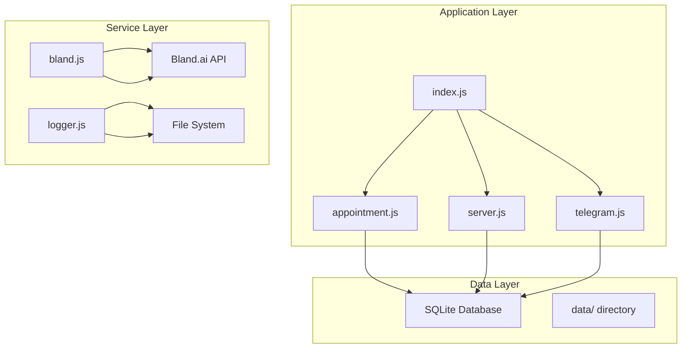
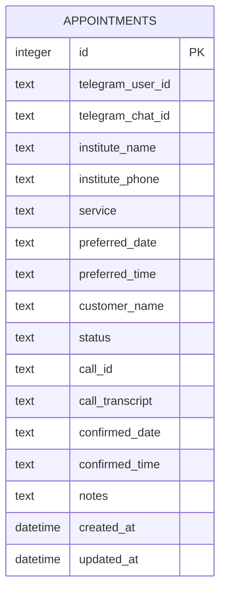
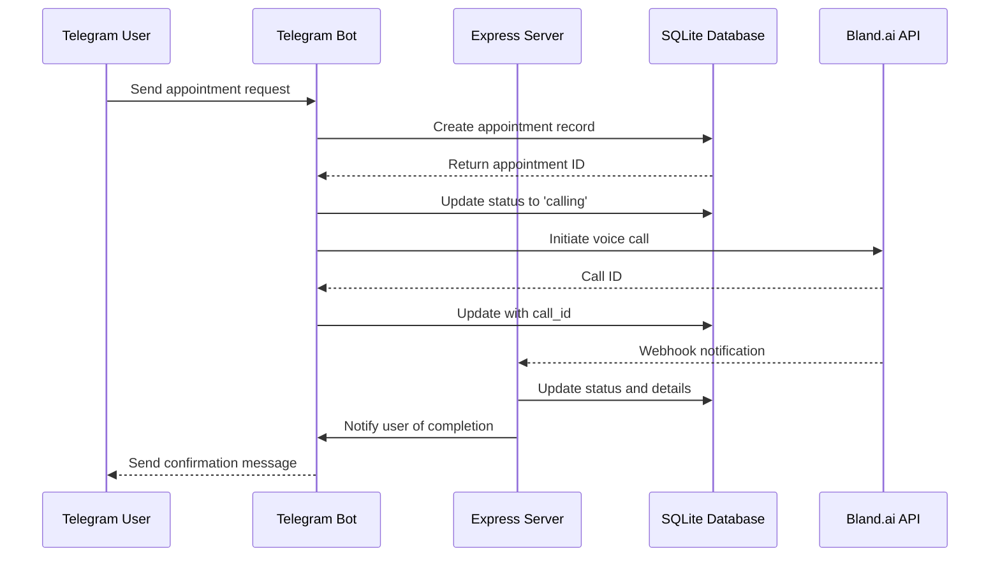
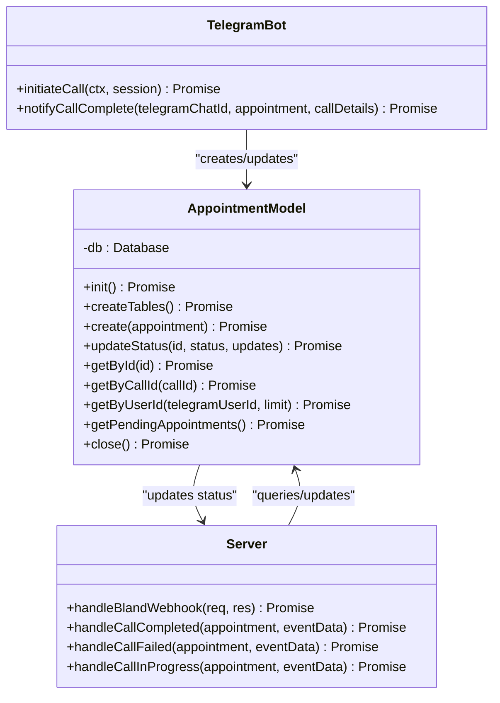
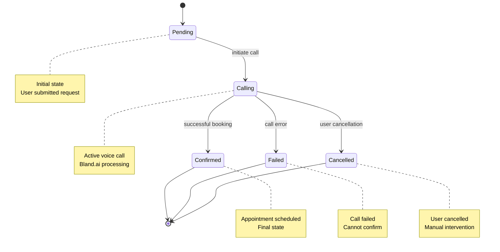
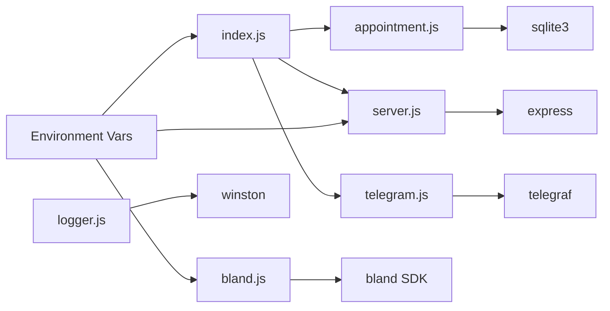

# Database Schema and Data Model

<cite>
**Referenced Files in This Document**
- [appointment.js](file://src/models/appointment.js)
- [index.js](file://src/index.js)
- [server.js](file://src/server.js)
- [telegram.js](file://src/bot/telegram.js)
- [bland.js](file://src/voice/bland.js)
- [logger.js](file://src/utils/logger.js)
- [package.json](file://package.json)
- [README.md](file://README.md)
</cite>

## Table of Contents
1. [Introduction](#introduction)
2. [Project Structure](#project-structure)
3. [Core Components](#core-components)
4. [Architecture Overview](#architecture-overview)
5. [Detailed Component Analysis](#detailed-component-analysis)
6. [Dependency Analysis](#dependency-analysis)
7. [Performance Considerations](#performance-considerations)
8. [Troubleshooting Guide](#troubleshooting-guide)
9. [Conclusion](#conclusion)

## Introduction

The Appointment Voice Agent is an AI-powered system that automates appointment scheduling through natural language conversations with Telegram users and automated phone calls via Bland.ai voice services. The system maintains a SQLite database to track appointment lifecycle, call status, and user interactions.

This documentation provides comprehensive data model documentation covering the appointment table structure, data validation rules, business logic, query patterns, and operational considerations for managing appointment scheduling workflows.

## Project Structure

The application follows a modular architecture with clear separation of concerns:



**Diagram sources**
- [index.js:1-91](file://src/index.js#L1-L91)
- [server.js:1-266](file://src/server.js#L1-L266)
- [appointment.js:1-238](file://src/models/appointment.js#L1-L238)

**Section sources**
- [README.md:154-175](file://README.md#L154-L175)
- [package.json:1-35](file://package.json#L1-L35)

## Core Components

### Database Schema Definition

The system uses a single SQLite table for storing appointment data with comprehensive tracking capabilities:



**Diagram sources**
- [appointment.js:27-47](file://src/models/appointment.js#L27-L47)

### Table Structure Details

| Field Name | Data Type | Constraints | Description |
|------------|-----------|-------------|-------------|
| `id` | INTEGER | PRIMARY KEY, AUTOINCREMENT | Unique identifier for each appointment |
| `telegram_user_id` | TEXT | NOT NULL | Telegram user identifier for ownership |
| `telegram_chat_id` | TEXT | NOT NULL | Telegram chat identifier for notifications |
| `institute_name` | TEXT | NOT NULL | Name of the service provider/institute |
| `institute_phone` | TEXT | NOT NULL | Contact phone number for the institute |
| `service` | TEXT | NOT NULL | Type of service requested |
| `preferred_date` | TEXT | NULL | User's preferred appointment date |
| `preferred_time` | TEXT | NULL | User's preferred appointment time |
| `customer_name` | TEXT | NULL | Customer's name for the appointment |
| `status` | TEXT | DEFAULT 'pending' | Current appointment status |
| `call_id` | TEXT | NULL | Bland.ai call identifier |
| `call_transcript` | TEXT | NULL | Transcribed call conversation |
| `confirmed_date` | TEXT | NULL | Confirmed appointment date |
| `confirmed_time` | TEXT | NULL | Confirmed appointment time |
| `notes` | TEXT | NULL | Additional notes or comments |
| `created_at` | DATETIME | DEFAULT CURRENT_TIMESTAMP | Record creation timestamp |
| `updated_at` | DATETIME | DEFAULT CURRENT_TIMESTAMP | Last update timestamp |

**Section sources**
- [appointment.js:27-47](file://src/models/appointment.js#L27-L47)

## Architecture Overview

The system implements a three-tier architecture with clear data flow between components:



**Diagram sources**
- [telegram.js:373-405](file://src/bot/telegram.js#L373-L405)
- [server.js:77-123](file://src/server.js#L77-L123)
- [appointment.js:102-147](file://src/models/appointment.js#L102-L147)

## Detailed Component Analysis

### Appointment Model Implementation

The AppointmentModel class provides comprehensive CRUD operations and status management:



**Diagram sources**
- [appointment.js:7-238](file://src/models/appointment.js#L7-L238)
- [server.js:77-229](file://src/server.js#L77-L229)
- [telegram.js:373-405](file://src/bot/telegram.js#L373-L405)

### Status Management System

The system implements a finite state machine for appointment lifecycle management:



**Diagram sources**
- [appointment.js:102-106](file://src/models/appointment.js#L102-L106)
- [server.js:125-184](file://src/server.js#L125-L184)

### Data Validation Rules

The system implements comprehensive validation at multiple levels:

#### Business Rules
- **Ownership Validation**: Users can only cancel their own appointments
- **Status Transitions**: Only valid state changes are permitted
- **Required Fields**: Critical fields must be present for call initiation
- **Phone Number Format**: Automatic cleaning and validation

#### Data Integrity Constraints
- **Primary Key**: Auto-incremented integer identifier
- **Foreign Key Pattern**: Telegram identifiers maintain referential integrity
- **Default Values**: Timestamps and status defaults ensure completeness
- **Unique Constraints**: No explicit uniqueness constraints (by design)

**Section sources**
- [telegram.js:140-148](file://src/bot/telegram.js#L140-L148)
- [appointment.js:102-106](file://src/models/appointment.js#L102-L106)

### Query Patterns and Access Methods

The system provides optimized query patterns for different use cases:

#### Common Query Operations

| Operation | Method | Purpose | Performance Notes |
|-----------|--------|---------|-------------------|
| Single Record | `getById(id)` | Retrieve specific appointment | Index on primary key |
| By Call ID | `getByCallId(callId)` | Track call status | No index on call_id |
| User History | `getByUserId(userId, limit)` | Show recent appointments | Orders by created_at DESC |
| Pending Queue | `getPendingAppointments()` | Process upcoming calls | Orders by created_at ASC |

#### Query Optimization Strategies

```mermaid
flowchart TD
A[Query Request] --> B{Filter Type}
B --> |Single ID| C[Direct Lookup]
B --> |User ID| D[Range Scan]
B --> |Status Filter| E[Full Table Scan]
C --> F[Use PRIMARY KEY index]
D --> G[Order by created_at DESC]
E --> H[Consider adding status index]
G --> I[LIMIT clause for pagination]
H --> J[Add composite index: (status, created_at)]
```

**Diagram sources**
- [appointment.js:149-216](file://src/models/appointment.js#L149-L216)

**Section sources**
- [appointment.js:149-216](file://src/models/appointment.js#L149-L216)

### Data Lifecycle Management

The system manages data through distinct lifecycle stages:

#### Creation Phase
- User submits appointment request via Telegram
- Basic validation occurs during natural language processing
- Initial record created with status 'pending'

#### Processing Phase
- Call initiated through Bland.ai
- Status transitions to 'calling'
- Real-time updates via webhook processing

#### Completion Phase
- Final status determined (confirmed/failed/cancelled)
- User notified via Telegram
- Data retention maintained for audit/tracking

#### Retention Policies
- **Active Data**: Maintained indefinitely for user access
- **Archival**: No automatic cleanup implemented
- **Audit Trail**: Full transaction history preserved

**Section sources**
- [telegram.js:373-405](file://src/bot/telegram.js#L373-L405)
- [server.js:125-184](file://src/server.js#L125-L184)

## Dependency Analysis

The system exhibits clear dependency relationships between components:



**Diagram sources**
- [index.js:1-91](file://src/index.js#L1-L91)
- [appointment.js:1-6](file://src/models/appointment.js#L1-L6)
- [server.js:1-6](file://src/server.js#L1-L6)

### External Dependencies

| Dependency | Version | Purpose | Security Considerations |
|------------|---------|---------|------------------------|
| sqlite3 | ^5.1.6 | Local database storage | File system permissions |
| express | ^4.18.2 | HTTP server framework | Regular security updates |
| telegraf | ^4.15.0 | Telegram bot framework | API token protection |
| bland | ^2.0.0 | Voice call service | API key management |
| dotenv | ^16.3.1 | Environment configuration | .env file security |

**Section sources**
- [package.json:20-35](file://package.json#L20-L35)

## Performance Considerations

### Database Performance Optimization

#### Index Strategy Recommendations
- **Current State**: Primary key index on `id` only
- **Recommended Additions**:
  - `CREATE INDEX idx_appointments_user_created ON appointments(telegram_user_id, created_at DESC)`
  - `CREATE INDEX idx_appointments_status_created ON appointments(status, created_at ASC)`
  - `CREATE INDEX idx_appointments_call_id ON appointments(call_id)`

#### Query Performance Guidelines
- Use `LIMIT` clauses for user history queries
- Prefer exact matches over LIKE patterns
- Consider partitioning by date for large datasets
- Implement connection pooling for high concurrency

### Memory and Resource Management

#### Connection Handling
- Single database connection per process
- Proper connection cleanup during shutdown
- Graceful handling of database errors

#### Logging Impact
- Structured logging with JSON format
- Separate log files for error tracking
- Configurable log levels for production

**Section sources**
- [appointment.js:218-234](file://src/models/appointment.js#L218-L234)
- [logger.js:1-28](file://src/utils/logger.js#L1-L28)

## Troubleshooting Guide

### Common Issues and Solutions

#### Database Connection Problems
- **Symptoms**: Application fails to start
- **Causes**: Missing database file, permission issues
- **Solutions**: Verify DATABASE_PATH environment variable, check file permissions

#### Call Processing Failures
- **Symptoms**: Calls not progressing beyond 'calling' status
- **Causes**: Bland.ai API issues, webhook configuration problems
- **Solutions**: Verify WEBHOOK_URL accessibility, check API key validity

#### Telegram Integration Issues
- **Symptoms**: Bot not responding to commands
- **Causes**: Invalid TELEGRAM_BOT_TOKEN, network connectivity
- **Solutions**: Validate bot token, ensure server accessibility

### Monitoring and Debugging

#### Logging Configuration
- **Error Level**: Dedicated error.log file
- **Info Level**: Combined.log for all activities
- **Development**: Console output with colorized formatting

#### Health Check Endpoint
- **URL**: GET `/health`
- **Response**: JSON with service status and timestamp
- **Purpose**: Monitor application health and uptime

**Section sources**
- [logger.js:1-28](file://src/utils/logger.js#L1-L28)
- [server.js:34-41](file://src/server.js#L34-L41)

## Conclusion

The Appointment Voice Agent database schema provides a robust foundation for managing appointment scheduling workflows through automated voice interactions. The design emphasizes simplicity, reliability, and extensibility while maintaining comprehensive tracking of appointment lifecycle events.

Key strengths of the current implementation include:
- Clear separation of concerns between components
- Comprehensive status tracking and audit capabilities
- Flexible query patterns supporting various use cases
- Robust error handling and logging infrastructure

Areas for potential enhancement include:
- Adding database indexes for improved query performance
- Implementing data retention policies for long-term sustainability
- Enhancing validation rules for data quality assurance
- Adding support for concurrent call processing

The modular architecture ensures that future enhancements can be implemented with minimal disruption to existing functionality, supporting continued evolution of the appointment scheduling ecosystem.