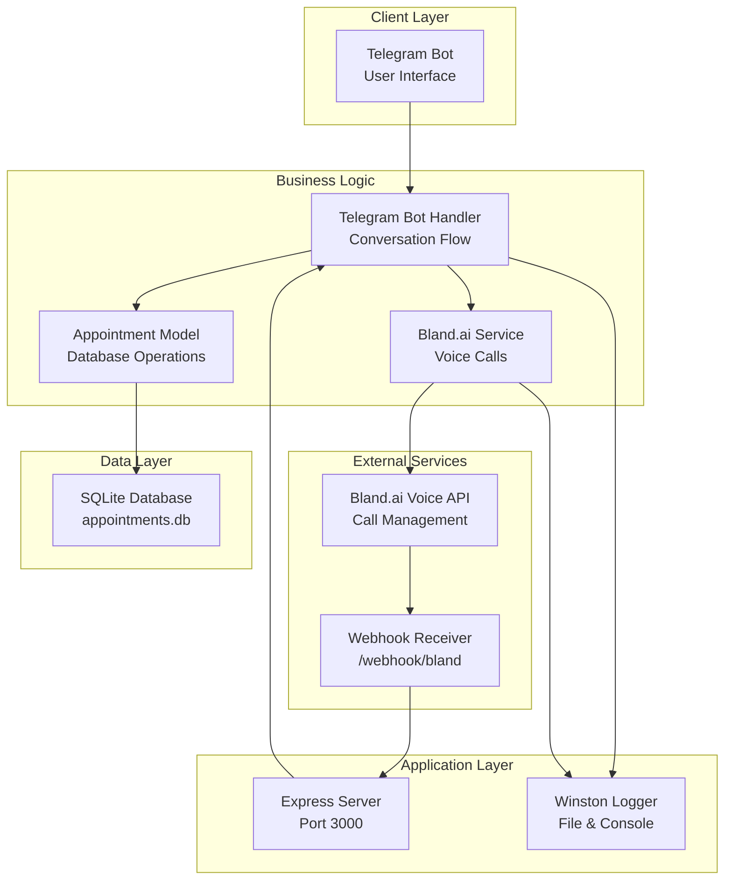

# Getting Started

<cite>
**Referenced Files in This Document**
- [README.md](file://README.md)
- [package.json](file://package.json)
- [src/index.js](file://src/index.js)
- [src/server.js](file://src/server.js)
- [src/bot/telegram.js](file://src/bot/telegram.js)
- [src/voice/bland.js](file://src/voice/bland.js)
- [src/models/appointment.js](file://src/models/appointment.js)
- [src/utils/logger.js](file://src/utils/logger.js)
- [.gitignore](file://.gitignore)
</cite>

## Update Summary
**Changes Made**
- Enhanced environment configuration section with complete variable documentation
- Added comprehensive dependency installation instructions
- Expanded troubleshooting section with specific error scenarios
- Updated architecture overview with actual implementation details
- Added practical examples for both development and production modes
- Included database initialization and webhook setup procedures

## Table of Contents
1. [Introduction](#introduction)
2. [Prerequisites](#prerequisites)
3. [Installation](#installation)
4. [Environment Configuration](#environment-configuration)
5. [Database Setup](#database-setup)
6. [Running the Application](#running-the-application)
7. [Architecture Overview](#architecture-overview)
8. [Troubleshooting Guide](#troubleshooting-guide)
9. [Conclusion](#conclusion)

## Introduction
This guide helps you set up and run the Appointment Voice Agent, an AI-powered system that schedules appointments via Telegram and makes voice calls through Bland.ai. The system integrates Telegram bot communication, natural language processing, automated phone calls, and real-time appointment management with a SQLite database.

## Prerequisites
Before installing, ensure you have:
- **Node.js 18 or newer** (verified in package.json engines)
- **A Telegram Bot token** from [@BotFather](https://t.me/botfather)
- **A Bland.ai API key** from [app.bland.ai](https://app.bland.ai)
- **ngrok** for exposing a public URL for webhooks during local development

**Section sources**
- [README.md:27-32](file://README.md#L27-L32)
- [package.json:31-33](file://package.json#L31-L33)

## Installation
Follow these steps to clone, install dependencies, and prepare your environment:

1. **Clone the repository**
   ```bash
   git clone <repository-url>
   cd appointment-voice-agent
   ```

2. **Install dependencies using npm**
   ```bash
   npm install
   ```

3. **Create environment configuration file**
   ```bash
   cp .env.example .env
   ```

4. **Verify project structure**
   ```
   appointment-voice-agent/
   ├── src/
   │   ├── bot/
   │   ├── models/
   │   ├── voice/
   │   ├── utils/
   │   ├── server.js
   │   └── index.js
   ├── data/                    # SQLite database (auto-created)
   ├── logs/                    # Log files (auto-created)
   ├── .env                     # Environment variables
   ├── .env.example             # Example environment file
   ├── package.json
   └── README.md
   ```

**Section sources**
- [README.md:36-58](file://README.md#L36-L58)
- [package.json:6-10](file://package.json#L6-L10)
- [.gitignore:14-21](file://.gitignore#L14-L21)

## Environment Configuration
Configure your environment variables by editing the `.env` file. The minimal required variables are:

### Required Variables
- `TELEGRAM_BOT_TOKEN` - Your Telegram bot token from [@BotFather](https://t.me/botfather)
- `BLAND_API_KEY` - Your Bland.ai API key from [app.bland.ai](https://app.bland.ai)
- `WEBHOOK_URL` - Public URL for Bland.ai webhooks (use ngrok for local development)

### Optional Variables
- `PORT` - Server port (default: 3000)
- `NODE_ENV` - Environment (development/production)
- `DATABASE_PATH` - Custom SQLite database path
- `LOG_LEVEL` - Logging level (info/debug/error)

### Complete .env Configuration Example
```env
# Required
TELEGRAM_BOT_TOKEN=your_telegram_bot_token_here
BLAND_API_KEY=your_bland_api_key_here
WEBHOOK_URL=https://your-ngrok-url.ngrok.io/webhook/bland

# Optional
PORT=3000
NODE_ENV=development
DATABASE_PATH=data/appointments.db
LOG_LEVEL=info
```

### Setting Up Webhooks for Local Development
1. **Start ngrok on port 3000**
   ```bash
   # Install ngrok globally
   npm install -g ngrok
   
   # Start ngrok in a separate terminal
   ngrok http 3000
   ```

2. **Copy the HTTPS URL** and append `/webhook/bland` to form your `WEBHOOK_URL`
   ```
   WEBHOOK_URL=https://abc123.ngrok.io/webhook/bland
   ```

**Section sources**
- [README.md:44-58](file://README.md#L44-L58)
- [README.md:72-88](file://README.md#L72-L88)
- [README.md:184-194](file://README.md#L184-L194)
- [src/index.js:12-20](file://src/index.js#L12-L20)

## Database Setup
The application uses SQLite for data persistence. The database is automatically initialized and managed:

### Automatic Database Initialization
- **Location**: `data/appointments.db` (default)
- **Auto-created**: Database file and tables are created automatically on first run
- **Structure**: Single `appointments` table with comprehensive fields

### Database Schema
The `appointments` table includes:
- Primary identifiers (telegram_user_id, telegram_chat_id)
- Institute information (name, phone)
- Service details (service, preferred_date, preferred_time)
- Call tracking (call_id, call_transcript)
- Status management (status, confirmed_date, confirmed_time)
- Metadata (created_at, updated_at)

### Manual Database Operations
You can query the database manually using:
```bash
# Connect to database
sqlite3 data/appointments.db

# View table structure
.schema appointments

# View all appointments
SELECT * FROM appointments;
```

**Section sources**
- [src/models/appointment.js:12-60](file://src/models/appointment.js#L12-L60)
- [src/models/appointment.js:26-47](file://src/models/appointment.js#L26-L47)
- [.gitignore:14-17](file://.gitignore#L14-L17)

## Running the Application
Start the application in either development or production mode:

### Development Mode (with auto-reload)
```bash
npm run dev
```

### Production Mode
```bash
npm start
```

### Application Startup Sequence
When launched, the application performs the following steps:
1. **Environment Validation**: Checks for required environment variables
2. **Database Initialization**: Creates tables if they don't exist
3. **Server Startup**: Starts Express server on configured port
4. **Telegram Bot**: Initializes and starts the Telegram bot
5. **Logging**: Configures Winston logging with console and file outputs

### Graceful Shutdown Handling
The application handles graceful shutdown for:
- SIGTERM and SIGINT signals
- Uncaught exceptions
- Unhandled promise rejections

**Section sources**
- [README.md:90-98](file://README.md#L90-L98)
- [src/index.js:8-45](file://src/index.js#L8-L45)
- [src/index.js:47-87](file://src/index.js#L47-L87)
- [src/server.js:242-262](file://src/server.js#L242-L262)

## Architecture Overview
The system integrates Telegram, a Node.js backend, Bland.ai voice services, and a local SQLite database. The architecture follows a modular design with clear separation of concerns.



**Diagram sources**
- [src/server.js:43-44](file://src/server.js#L43-L44)
- [src/server.js:77-123](file://src/server.js#L77-L123)
- [src/bot/telegram.js:6-11](file://src/bot/telegram.js#L6-L11)
- [src/voice/bland.js:3-8](file://src/voice/bland.js#L3-L8)
- [src/models/appointment.js:7-10](file://src/models/appointment.js#L7-L10)

**Section sources**
- [README.md:13-25](file://README.md#L13-L25)
- [src/server.js:7-14](file://src/server.js#L7-L14)

## Troubleshooting Guide
Common setup issues and their solutions:

### Environment Configuration Issues

**Missing Required Environment Variables**
- **Symptom**: Application exits immediately with error message
- **Solution**: Ensure all required variables are set in `.env`
- **Check**: `TELEGRAM_BOT_TOKEN`, `BLAND_API_KEY`, `WEBHOOK_URL`

**Invalid Telegram Bot Token**
- **Symptom**: Telegram bot not responding, logs show authentication errors
- **Solution**: Verify token from [@BotFather](https://t.me/botfather)
- **Test**: Try `/start` command in Telegram chat

**Invalid Bland.ai API Key**
- **Symptom**: Call initiation fails with API error
- **Solution**: Generate new API key from [app.bland.ai](https://app.bland.ai)
- **Test**: Verify key works with manual API call

### Webhook and Network Issues

**Webhook URL Not Reachable**
- **Symptom**: Bland.ai calls fail with webhook delivery errors
- **Solution**: Ensure ngrok is running and URL is accessible
- **Check**: `WEBHOOK_URL` ends with `/webhook/bland`

**Port Conflicts**
- **Symptom**: Server fails to start on port 3000
- **Solution**: Change `PORT` variable or stop conflicting processes
- **Check**: `netstat -tulpn | grep :3000`

### Database and File System Issues

**Database Connection Errors**
- **Symptom**: Application crashes with database errors
- **Solution**: Check write permissions for `data/` directory
- **Fix**: `chmod 755 data/` or recreate directory

**Log File Creation Failures**
- **Symptom**: Missing log files or permission errors
- **Solution**: Ensure `logs/` directory exists and is writable
- **Fix**: `mkdir logs/ && chmod 755 logs/`

### Application Runtime Issues

**Memory Leaks or High Memory Usage**
- **Symptom**: Application becomes slow or crashes
- **Solution**: Restart application and check for memory leaks
- **Monitor**: Use `pm2 monit` or system monitoring tools

**Graceful Shutdown Problems**
- **Symptom**: Application doesn't exit cleanly
- **Solution**: Check for open database connections or active calls
- **Force**: Use `kill -9` only as last resort

**Section sources**
- [README.md:212-227](file://README.md#L212-L227)
- [src/index.js:12-20](file://src/index.js#L12-L20)
- [src/server.js:231-240](file://src/server.js#L231-L240)

## Conclusion
You now have comprehensive setup instructions for the Appointment Voice Agent. The system requires proper environment configuration, database initialization, and webhook setup for full functionality. Use the troubleshooting section to resolve common issues, and refer to the README for advanced configuration options and API endpoints.

Key success factors:
- **Proper Environment Variables**: All required variables must be correctly configured
- **Webhook Accessibility**: ngrok must be running for local development
- **Database Permissions**: Application must have write access to data directory
- **Network Connectivity**: Server must be reachable from external services

For production deployment, consider:
- Using reverse proxy (nginx) for SSL termination
- Implementing process monitoring (PM2)
- Setting up proper logging rotation
- Configuring environment-specific settings