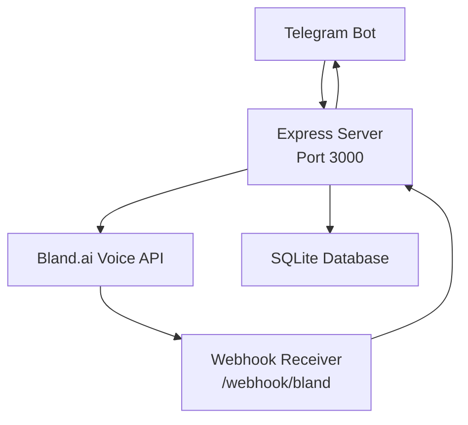

# Getting Started

<cite>
**Referenced Files in This Document**
- [README.md](file://README.md)
- [package.json](file://package.json)
- [src/index.js](file://src/index.js)
- [src/server.js](file://src/server.js)
- [src/bot/telegram.js](file://src/bot/telegram.js)
- [src/voice/bland.js](file://src/voice/bland.js)
- [src/models/appointment.js](file://src/models/appointment.js)
- [src/utils/logger.js](file://src/utils/logger.js)
</cite>

## Table of Contents
1. [Introduction](#introduction)
2. [Prerequisites](#prerequisites)
3. [Installation](#installation)
4. [Environment Configuration](#environment-configuration)
5. [Running the Application](#running-the-application)
6. [Architecture Overview](#architecture-overview)
7. [Troubleshooting Guide](#troubleshooting-guide)
8. [Conclusion](#conclusion)

## Introduction
This guide helps you set up and run the Appointment Voice Agent, an AI-powered system that schedules appointments via Telegram and makes voice calls through Bland.ai. It covers prerequisites, installation, environment configuration, running in development and production modes, and common troubleshooting steps.

## Prerequisites
Before installing, ensure you have:
- Node.js 18 or newer
- A Telegram Bot token from BotFather
- A Bland.ai API key from app.bland.ai
- ngrok for exposing a public URL for webhooks during local development

These requirements are documented in the project's README under the Prerequisites section.

**Section sources**
- [README.md:27-32](file://README.md#L27-L32)

## Installation
Follow these steps to clone, install dependencies, and prepare your environment:

1. Clone the repository and navigate into the project directory.
2. Install dependencies using npm install.
3. Copy the example environment file to .env and configure your credentials.

The README provides the exact commands for cloning, installing, and preparing the environment.

**Section sources**
- [README.md:36-58](file://README.md#L36-L58)

## Environment Configuration
Configure your environment variables by editing the .env file. The minimal required variables are:
- TELEGRAM_BOT_TOKEN
- BLAND_API_KEY
- WEBHOOK_URL

Optional variables include PORT, NODE_ENV, DATABASE_PATH, and LOG_LEVEL. The README documents all environment variables and their purpose.

To set up the webhook URL for local development:
- Start ngrok on port 3000.
- Copy the HTTPS URL and append /webhook/bland to form WEBHOOK_URL.

**Section sources**
- [README.md:44-58](file://README.md#L44-L58)
- [README.md:72-88](file://README.md#L72-L88)
- [README.md:184-194](file://README.md#L184-L194)

## Running the Application
Start the application in either development or production mode:

- Development mode with auto-reload: npm run dev
- Production mode: npm start

The application performs environment validation, initializes the database, starts the Express server, and launches the Telegram bot. Graceful shutdown handlers are configured to stop the bot, server, and database cleanly.

**Section sources**
- [README.md:90-98](file://README.md#L90-L98)
- [src/index.js:8-45](file://src/index.js#L8-L45)
- [src/index.js:47-87](file://src/index.js#L47-L87)

## Architecture Overview
The system integrates Telegram, a Node.js backend, Bland.ai voice services, and a local SQLite database. The README includes an architecture diagram showing the flow from Telegram to the backend, Bland.ai, and the phone call.

**Diagram sources**
- [README.md:13-25](file://README.md#L13-L25)
- [src/server.js:43-44](file://src/server.js#L43-L44)
- [src/server.js:77-123](file://src/server.js#L77-L123)
- [src/voice/bland.js:23-52](file://src/voice/bland.js#L23-L52)
- [src/models/appointment.js:12-24](file://src/models/appointment.js#L12-L24)

## Troubleshooting Guide
Common setup issues and resolutions:

- Bot not responding
  - Verify TELEGRAM_BOT_TOKEN is correct.
  - Ensure the application is started with npm run dev.
  - Check logs for errors.

- Calls not being made
  - Verify BLAND_API_KEY is valid.
  - Confirm WEBHOOK_URL is publicly accessible.
  - Ensure ngrok is running during local development.

- Webhooks not received
  - Verify the webhook URL in .env is correct.
  - Ensure the server is reachable from the internet.
  - Review server logs for incoming requests.

The README includes a dedicated Troubleshooting section with actionable steps.

**Section sources**
- [README.md:212-227](file://README.md#L212-L227)

## Conclusion
You now have the prerequisites, installation steps, environment configuration, and operational guidance to run the Appointment Voice Agent locally. Use the troubleshooting section to resolve typical setup issues, and consult the README for environment variables, endpoints, and usage examples.