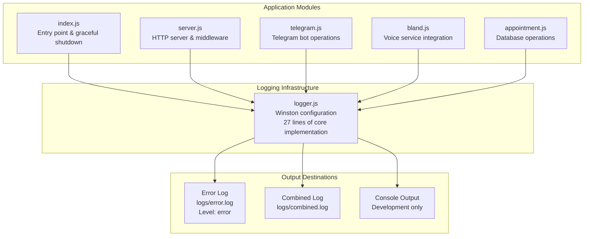
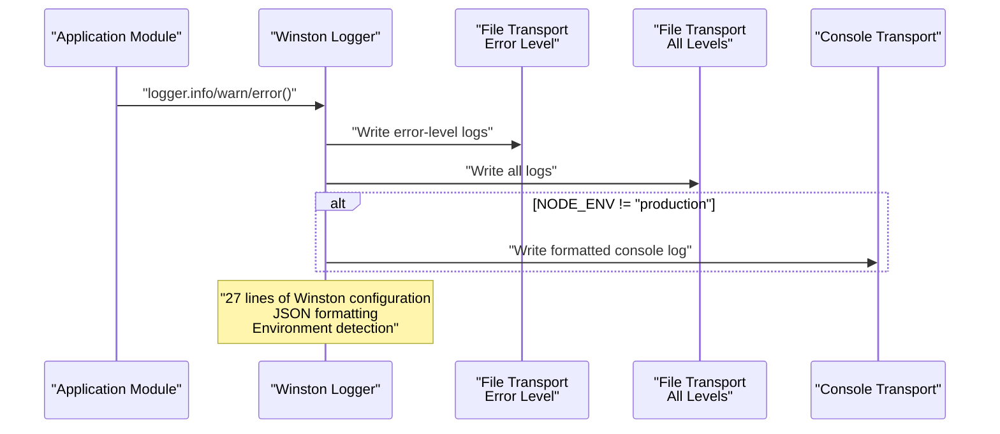
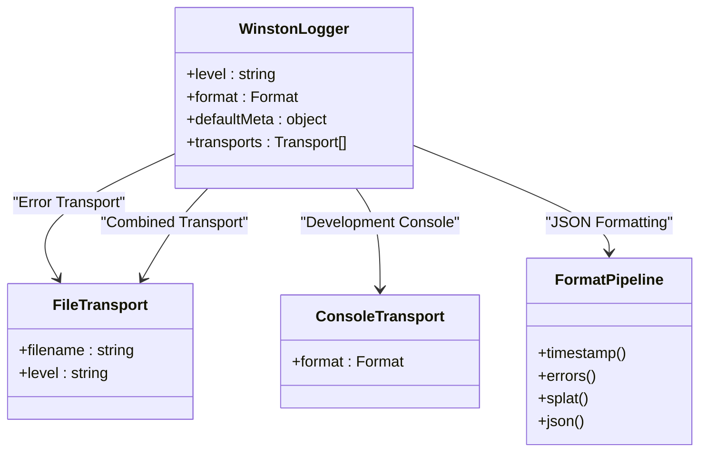
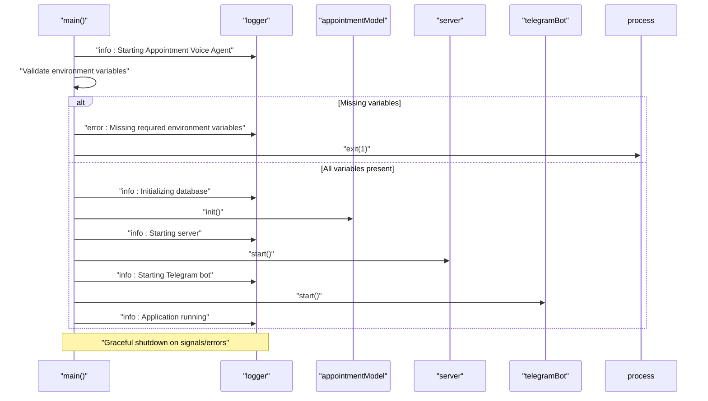
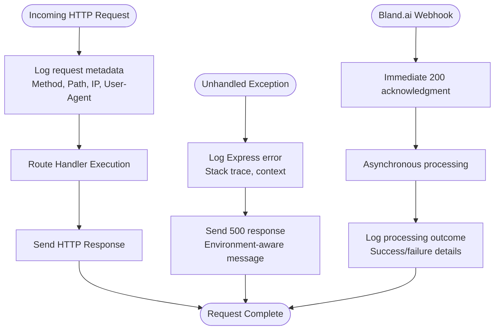
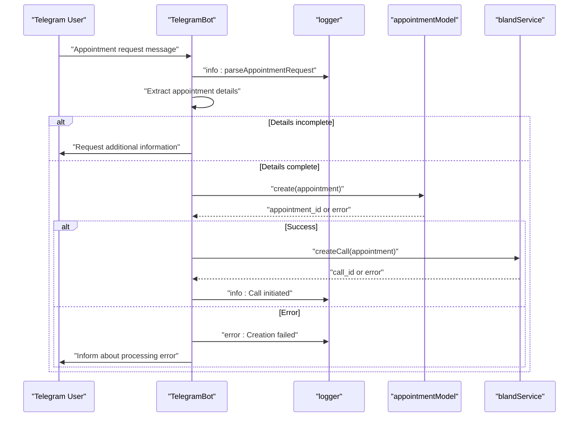
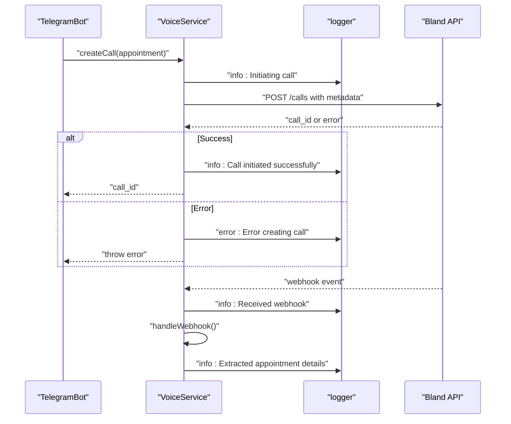
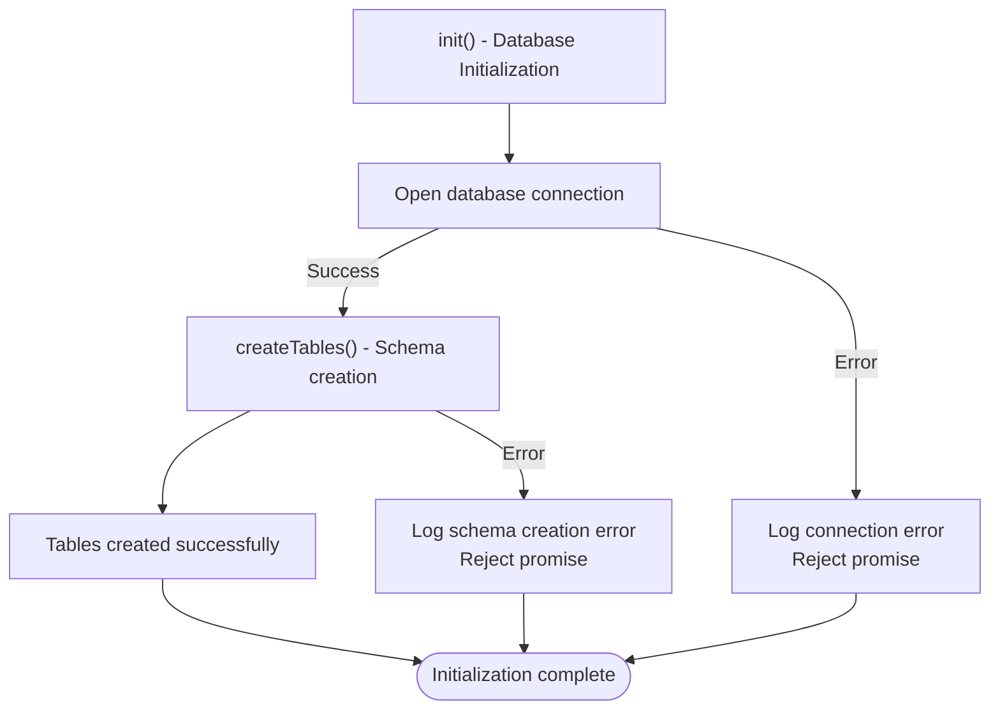
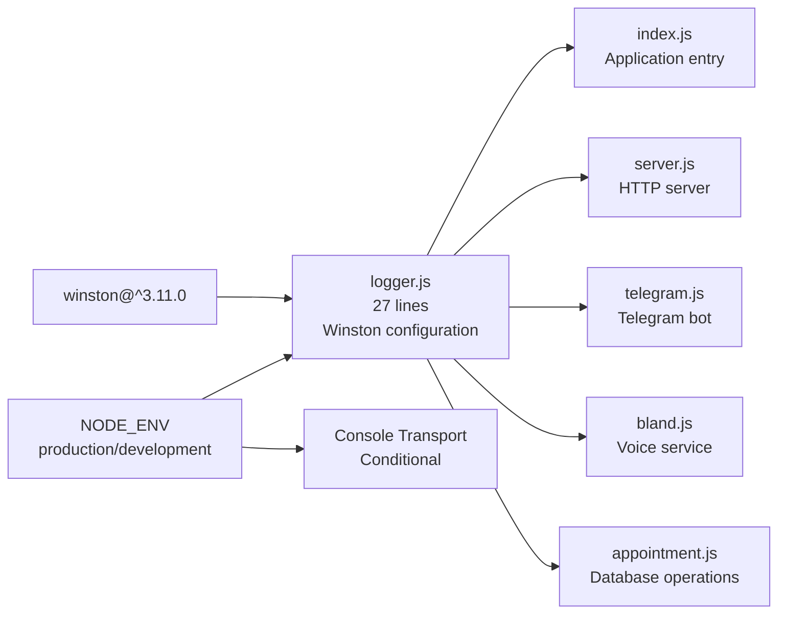

# Logging and Monitoring

<cite>
**Referenced Files in This Document**
- [logger.js](file://src/utils/logger.js)
- [index.js](file://src/index.js)
- [server.js](file://src/server.js)
- [appointment.js](file://src/models/appointment.js)
- [telegram.js](file://src/bot/telegram.js)
- [bland.js](file://src/voice/bland.js)
- [package.json](file://package.json)
- [README.md](file://README.md)
</cite>

## Update Summary
**Changes Made**
- Updated Winston logger configuration documentation to reflect the complete 27-line implementation
- Added detailed analysis of Winston transports, formats, and environment-specific behavior
- Enhanced error tracking and debugging sections with specific Winston features
- Updated monitoring approaches to leverage Winston's structured logging capabilities
- Expanded log rotation and retention recommendations based on Winston transport configuration

## Table of Contents
1. [Introduction](#introduction)
2. [Project Structure](#project-structure)
3. [Core Components](#core-components)
4. [Architecture Overview](#architecture-overview)
5. [Detailed Component Analysis](#detailed-component-analysis)
6. [Dependency Analysis](#dependency-analysis)
7. [Performance Considerations](#performance-considerations)
8. [Troubleshooting Guide](#troubleshooting-guide)
9. [Conclusion](#conclusion)
10. [Appendices](#appendices)

## Introduction
This document describes the logging and monitoring implementation in the Appointment Voice Agent. The system is built on a robust Winston-based logging infrastructure that provides structured JSON logging with separate error and combined file transports. The implementation includes environment-aware console output, comprehensive error tracking, and production-ready logging patterns. This documentation covers the Winston configuration, log levels, formats, output destinations, and practical guidance for error tracking, debugging techniques, and monitoring approaches in production environments.

## Project Structure
The logging system is centralized in a dedicated Winston logger module and consumed across all application components. The architecture ensures consistent logging patterns while supporting both development and production environments through environment variable configuration.

**Diagram sources**
- [logger.js:1-28](file://src/utils/logger.js#L1-L28)
- [index.js:1-91](file://src/index.js#L1-L91)
- [server.js:1-266](file://src/server.js#L1-L266)
- [telegram.js:1-461](file://src/bot/telegram.js#L1-L461)
- [bland.js:1-272](file://src/voice/bland.js#L1-L272)
- [appointment.js:1-238](file://src/models/appointment.js#L1-L238)

**Section sources**
- [logger.js:1-28](file://src/utils/logger.js#L1-L28)
- [index.js:1-91](file://src/index.js#L1-L91)
- [server.js:1-266](file://src/server.js#L1-L266)
- [telegram.js:1-461](file://src/bot/telegram.js#L1-L461)
- [bland.js:1-272](file://src/voice/bland.js#L1-L272)
- [appointment.js:1-238](file://src/models/appointment.js#L1-L238)

## Core Components

### Winston Logger Configuration
The Winston logger provides a comprehensive logging solution with the following key components:

- **Log Level Management**: Controlled by `LOG_LEVEL` environment variable with 'info' as default fallback
- **Structured JSON Formatting**: Includes ISO timestamps, error stack traces, string interpolation, and JSON serialization
- **Default Metadata**: Service identity ('appointment-voice-agent') automatically included in all log entries
- **Dual File Transport System**:
  - Error-level transport writing exclusively to `logs/error.log`
  - Combined transport writing all levels to `logs/combined.log`
- **Environment-Aware Console Output**: Console transport enabled only outside production environments

### Application-Wide Logging Integration
All application modules utilize the shared Winston logger instance for consistent logging patterns:

- **Entry Point**: Application lifecycle events, environment validation, and graceful shutdown
- **Express Server**: HTTP request logging, error handling, and webhook processing
- **Telegram Bot**: Command handling, user interactions, and error reporting
- **Voice Service**: Call initiation, webhook handling, and transcription processing
- **Database Operations**: Connection management, table creation, and CRUD operations

**Section sources**
- [logger.js:3-25](file://src/utils/logger.js#L3-L25)
- [index.js:8-44](file://src/index.js#L8-L44)
- [server.js:24-31](file://src/server.js#L24-L31)
- [server.js:233-240](file://src/server.js#L233-L240)
- [telegram.js:33-36](file://src/bot/telegram.js#L33-L36)
- [bland.js:23-52](file://src/voice/bland.js#L23-L52)
- [bland.js:107-116](file://src/voice/bland.js#L107-L116)
- [bland.js:123-149](file://src/voice/bland.js#L123-L149)
- [bland.js:222-231](file://src/voice/bland.js#L222-L231)
- [appointment.js:12-24](file://src/models/appointment.js#L12-L24)

## Architecture Overview
The logging architecture implements a centralized Winston configuration with layered transport management and environment-aware behavior.

**Diagram sources**
- [logger.js:3-25](file://src/utils/logger.js#L3-L25)

**Section sources**
- [logger.js:1-28](file://src/utils/logger.js#L1-L28)
- [index.js:76-86](file://src/index.js#L76-L86)

## Detailed Component Analysis

### Winston Logger Implementation
The Winston logger configuration represents a complete 27-line implementation providing robust logging capabilities:

#### Configuration Structure
- **Logger Instance Creation**: `winston.createLogger()` with centralized configuration
- **Format Pipeline**: Sequential formatting combining timestamp, error handling, interpolation, and JSON serialization
- **Transport Layer**: Dual-file transport system with level-specific routing
- **Environment Detection**: Conditional console transport based on `NODE_ENV`

#### Transport Configuration Details
- **Error Transport**: `new winston.transports.File({ filename: 'logs/error.log', level: 'error' })`
- **Combined Transport**: `new winston.transports.File({ filename: 'logs/combined.log' })`
- **Console Transport**: Conditional addition for non-production environments

#### Format Pipeline Components
- **Timestamp**: ISO format with custom time specification
- **Error Enhancement**: Stack trace inclusion for error objects
- **String Interpolation**: Support for `%s`, `%d`, `%j` placeholders
- **JSON Serialization**: Structured log output for machine parsing

**Diagram sources**
- [logger.js:3-25](file://src/utils/logger.js#L3-L25)

**Section sources**
- [logger.js:3-25](file://src/utils/logger.js#L3-L25)

### Entry Point Logging and Graceful Shutdown
The application entry point demonstrates comprehensive logging integration with graceful shutdown handling:

#### Startup Logging Sequence
- Application initialization with service identification
- Environment variable validation with detailed error reporting
- Database initialization progress tracking
- Server startup confirmation
- Telegram bot activation verification

#### Graceful Shutdown Protocol
- Signal handling for SIGTERM and SIGINT
- Uncaught exception and unhandled rejection monitoring
- Sequential shutdown of all subsystems
- Resource cleanup and connection closure
- Final shutdown confirmation

**Diagram sources**
- [index.js:8-44](file://src/index.js#L8-L44)
- [index.js:47-87](file://src/index.js#L47-L87)

**Section sources**
- [index.js:8-44](file://src/index.js#L8-L44)
- [index.js:47-87](file://src/index.js#L47-L87)

### Express Server Logging Implementation
The Express server implements comprehensive request logging and error handling:

#### Request Logging Middleware
- HTTP method and path tracking
- Client IP address capture
- User agent information collection
- Request metadata enrichment

#### Error Handling Strategy
- Global error middleware for unhandled exceptions
- Express-specific error categorization
- Environment-aware error message handling
- Structured error response formatting

#### Webhook Processing Logging
- Immediate acknowledgment to webhook sender
- Asynchronous processing with outcome logging
- Event data extraction and validation
- Status-specific handling with detailed logging

**Diagram sources**
- [server.js:24-31](file://src/server.js#L24-L31)
- [server.js:233-240](file://src/server.js#L233-L240)

**Section sources**
- [server.js:24-31](file://src/server.js#L24-L31)
- [server.js:77-123](file://src/server.js#L77-L123)
- [server.js:233-240](file://src/server.js#L233-L240)

### Telegram Bot Logging Strategy
The Telegram bot implements comprehensive logging for user interactions and error handling:

#### Command and Message Processing
- Natural language request parsing with detailed logging
- Session state management with user interaction tracking
- Confirmation flows with decision logging
- Error handling with user-friendly responses

#### Error Management
- Telegraf error catching with structured logging
- User notification for processing failures
- Context preservation in error scenarios
- Graceful degradation of functionality

**Diagram sources**
- [telegram.js:182-224](file://src/bot/telegram.js#L182-L224)
- [telegram.js:373-405](file://src/bot/telegram.js#L373-L405)
- [telegram.js:33-36](file://src/bot/telegram.js#L33-L36)

**Section sources**
- [telegram.js:33-36](file://src/bot/telegram.js#L33-L36)
- [telegram.js:182-224](file://src/bot/telegram.js#L182-L224)
- [telegram.js:373-405](file://src/bot/telegram.js#L373-L405)

### Voice Service Logging Implementation
The voice service provides comprehensive logging for call management and webhook processing:

#### Call Lifecycle Logging
- Call initiation with detailed parameter logging
- Call status monitoring and transition logging
- Transcript processing and decision extraction
- Call termination and cleanup logging

#### Webhook Processing
- Webhook receipt with payload logging
- Event data extraction and validation
- Status-specific processing with detailed logging
- Error handling with comprehensive error reporting

**Diagram sources**
- [bland.js:23-52](file://src/voice/bland.js#L23-L52)
- [bland.js:107-116](file://src/voice/bland.js#L107-L116)
- [bland.js:123-149](file://src/voice/bland.js#L123-L149)

**Section sources**
- [bland.js:23-52](file://src/voice/bland.js#L23-L52)
- [bland.js:107-116](file://src/voice/bland.js#L107-L116)
- [bland.js:123-149](file://src/voice/bland.js#L123-L149)

### Database Operations Logging
The database layer implements comprehensive logging for connection management and operation tracking:

#### Connection and Schema Management
- Database connection establishment with error logging
- Table creation with schema validation logging
- Connection lifecycle event logging
- Error handling with descriptive error messages

#### Operation Logging
- CRUD operation logging with success/failure tracking
- Query execution logging with parameter information
- Transaction boundary logging
- Resource cleanup and connection closing

**Diagram sources**
- [appointment.js:12-24](file://src/models/appointment.js#L12-L24)

**Section sources**
- [appointment.js:12-24](file://src/models/appointment.js#L12-L24)
- [appointment.js:62-100](file://src/models/appointment.js#L62-L100)
- [appointment.js:102-147](file://src/models/appointment.js#L102-L147)
- [appointment.js:149-177](file://src/models/appointment.js#L149-L177)
- [appointment.js:199-216](file://src/models/appointment.js#L199-L216)
- [appointment.js:218-234](file://src/models/appointment.js#L218-L234)

## Dependency Analysis
The logging system has minimal external dependencies with a focused integration strategy:

### Core Dependencies
- **Winston**: Primary logging framework dependency
- **Console Colors**: Optional colorized console output in development
- **Node.js Built-ins**: Path and filesystem operations for log file management

### Module Integration Pattern
All application modules import and use the shared Winston logger instance, ensuring consistent logging behavior across the entire application stack.

**Diagram sources**
- [package.json:20-26](file://package.json#L20-L26)
- [logger.js:1](file://src/utils/logger.js#L1)

**Section sources**
- [package.json:20-26](file://package.json#L20-L26)
- [logger.js:1](file://src/utils/logger.js#L1)

## Performance Considerations
The Winston-based logging implementation provides several performance optimization features:

### Structured Logging Benefits
- **JSON Parsing Efficiency**: Machine-readable logs enable fast parsing and indexing
- **Reduced Log Volume**: Separate error and combined files optimize storage usage
- **Environment Optimization**: Console transport disabled in production reduces overhead

### Transport Performance
- **Asynchronous File Writing**: Winston's default asynchronous file transport prevents blocking
- **Buffered Writes**: File transport buffering improves I/O performance
- **Level-Based Filtering**: Early filtering reduces unnecessary processing

### Memory and Resource Management
- **Minimal Memory Footprint**: Winston instances are lightweight
- **Efficient String Interpolation**: SPLAT formatting minimizes string concatenation overhead
- **Resource Cleanup**: Proper transport disposal in graceful shutdown

## Troubleshooting Guide

### Environment Configuration Issues
- **Missing Environment Variables**: Application validates required variables during startup and logs detailed error messages
- **Log Level Configuration**: Verify `LOG_LEVEL` environment variable affects logging verbosity
- **File Permissions**: Ensure write permissions for `logs/` directory in deployment environments

### Database Connectivity Problems
- **Connection Errors**: Database initialization errors are logged with stack traces
- **Schema Issues**: Table creation failures are logged with specific error details
- **Migration Problems**: Connection lifecycle events are logged for troubleshooting

### Server and API Integration Issues
- **Port Binding**: Server startup errors are logged with port and network information
- **Webhook Processing**: Webhook receipt and processing errors are logged with payload details
- **Bland API Integration**: Voice service errors are logged with API response information

### Common Debugging Scenarios
- **Application Startup Failures**: Check `logs/error.log` for initialization errors
- **Call Processing Issues**: Review voice service logs for API integration problems
- **Telegram Bot Problems**: Examine bot-specific logs for user interaction errors
- **Database Operation Failures**: Monitor database operation logs for SQL-related issues

**Section sources**
- [index.js:12-20](file://src/index.js#L12-L20)
- [index.js:41-44](file://src/index.js#L41-L44)
- [server.js:77-123](file://src/server.js#L77-L123)
- [telegram.js:33-36](file://src/bot/telegram.js#L33-L36)
- [bland.js:48-51](file://src/voice/bland.js#L48-L51)
- [appointment.js:14-23](file://src/models/appointment.js#L14-L23)

## Conclusion
The Winston-based logging infrastructure provides a comprehensive, production-ready logging solution for the Appointment Voice Agent. The 27-line implementation delivers structured JSON logging, environment-aware console output, and robust error tracking across all application components. The dual-file transport system enables efficient log management with separate error and combined logs, while the centralized configuration ensures consistent logging patterns throughout the application. For production deployments, the logging system supports scalable monitoring through structured log formats and provides excellent debugging capabilities through detailed error logging and stack traces.

## Appendices

### Log Levels and Transport Configuration
The logging system implements a hierarchical log level structure with environment-specific behavior:

#### Log Level Hierarchy
- **Environment Control**: `LOG_LEVEL` environment variable controls verbosity
- **Default Behavior**: Falls back to 'info' level when not specified
- **Production Optimization**: Higher log levels reduce I/O overhead

#### Transport Configuration
- **Error Transport**: Exclusive error-level logging to `logs/error.log`
- **Combined Transport**: All-level logging to `logs/combined.log`
- **Console Transport**: Conditional development-only output with colorization

**Section sources**
- [logger.js:3-25](file://src/utils/logger.js#L3-L25)
- [README.md:206-210](file://README.md#L206-L210)

### Log Analysis and Monitoring Integration
The structured JSON logging format enables sophisticated monitoring and analysis:

#### Log Parsing and Analysis
- **Machine Parsing**: JSON format enables automated log processing
- **Field Extraction**: Timestamps, levels, service identity, and metadata extraction
- **Filtering Strategies**: Level-based and service-based filtering for focused analysis

#### Monitoring Integration
- **Log Aggregation**: Compatible with ELK stack, Fluentd, and similar systems
- **Dashboard Creation**: Structured fields enable metric calculation and visualization
- **Alerting Setup**: Error-level logs provide natural alerting triggers

#### Recommended Metrics
- **Error Rate Calculation**: Error-level log frequency per service
- **Request Volume Tracking**: Combined log analysis for API usage metrics
- **Response Time Analysis**: HTTP request logs for performance monitoring
- **Call Success Rates**: Voice service logs for quality metrics

### Log Rotation and Retention Policies
Production environments require systematic log management:

#### Log Rotation Implementation
- **External Tools**: Use `logrotate`, `rotating-file-stream`, or similar tools
- **Size-Based Rotation**: Prevent disk space exhaustion with maximum file sizes
- **Time-Based Rotation**: Daily/weekly rotation for manageable log volumes

#### Retention and Compliance
- **Retention Periods**: Balance compliance requirements with storage costs
- **Compression Strategy**: Compress rotated logs to save space
- **Archival Process**: Long-term storage for compliance purposes

#### Security Considerations
- **PII Protection**: Redact personally identifiable information from logs
- **Access Control**: Restrict file system access to log directories
- **Transmission Security**: Secure log transmission and storage encryption

### Environment-Specific Configuration
The logging system adapts to different deployment environments:

#### Development Environment
- **Console Output**: Enabled with colorized formatting for developer experience
- **Debug Information**: More verbose logging for troubleshooting
- **Local Development**: File-based logging with local storage

#### Production Environment
- **Console Output Disabled**: Prevents performance impact and security risks
- **Structured Logging**: Optimized for machine parsing and log aggregation
- **Security Focus**: Minimal sensitive data exposure in logs

**Section sources**
- [logger.js:18-25](file://src/utils/logger.js#L18-L25)
- [index.js:76-86](file://src/index.js#L76-L86)