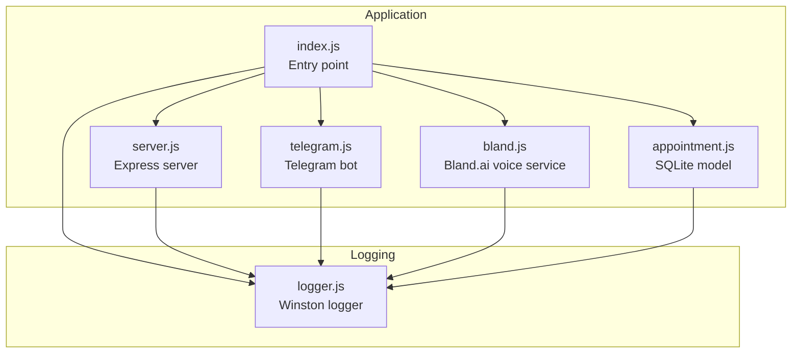
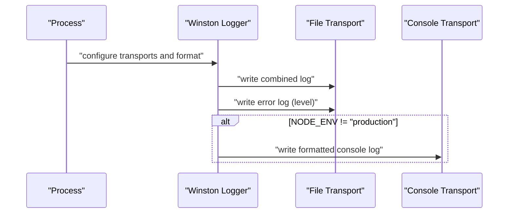
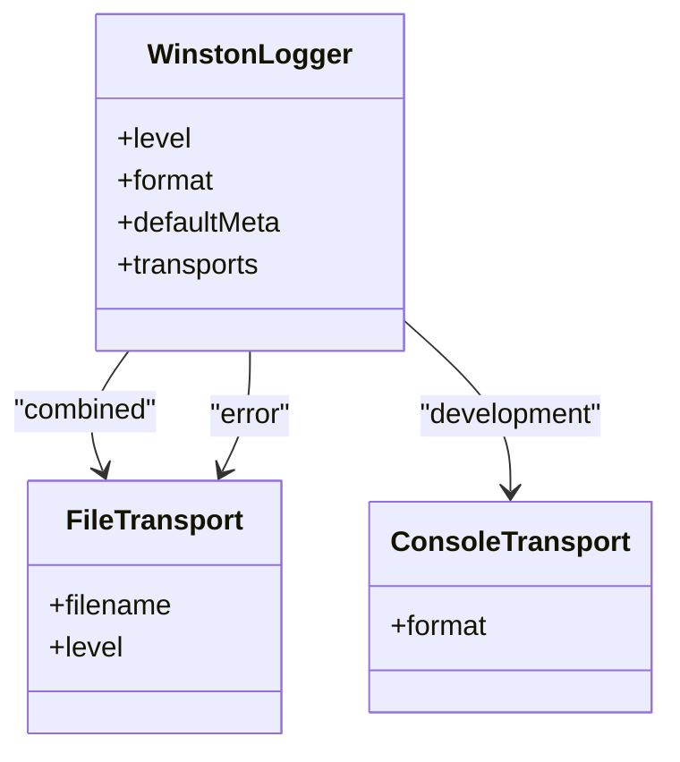
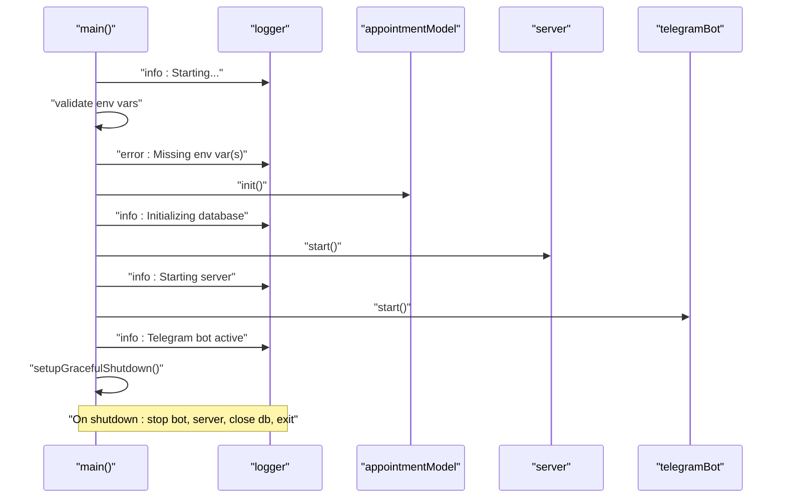
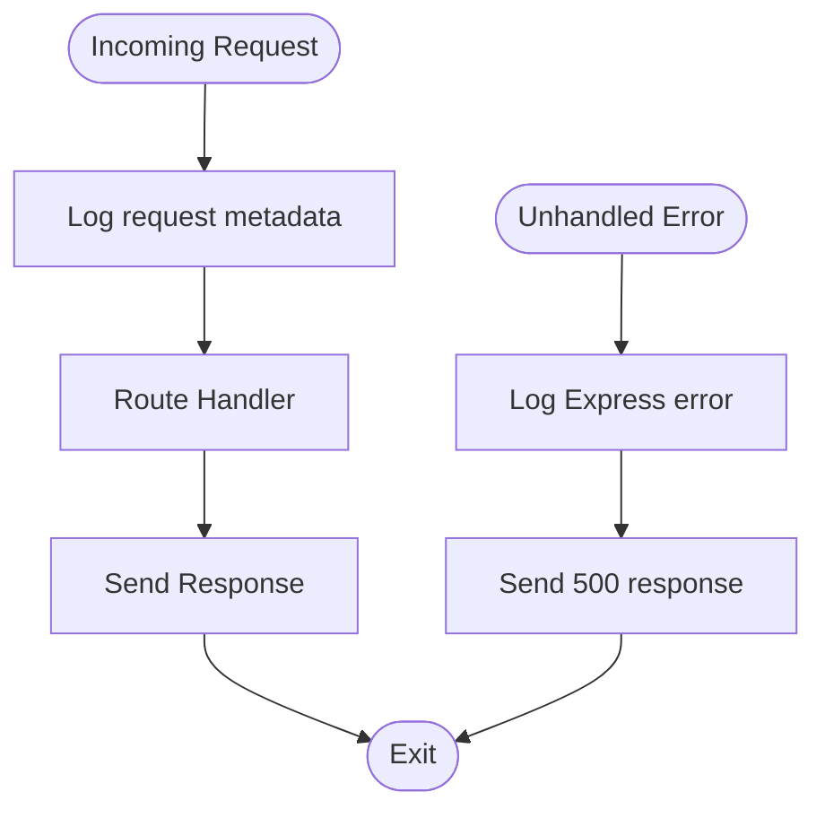
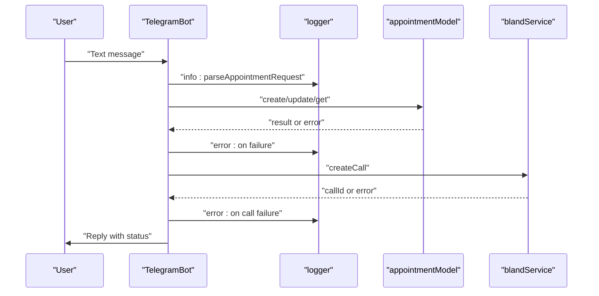
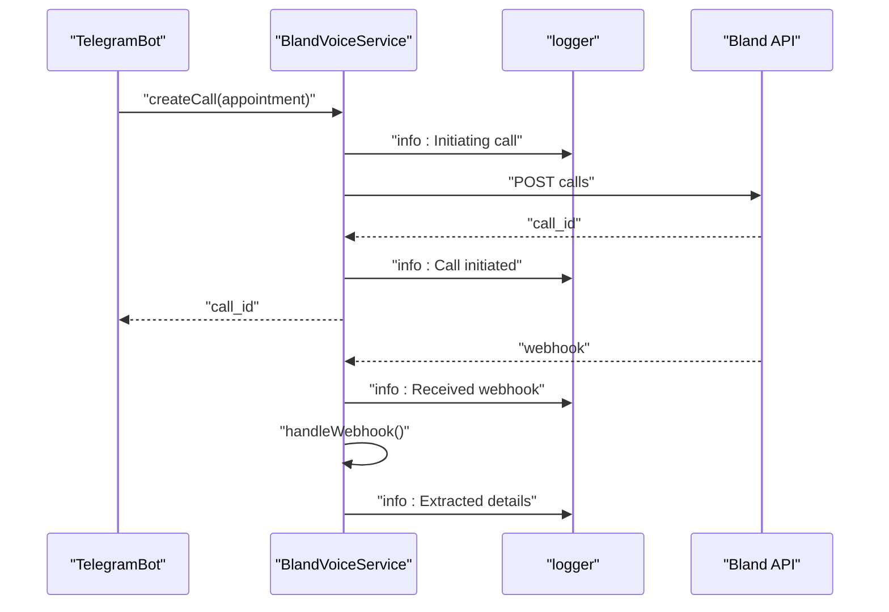
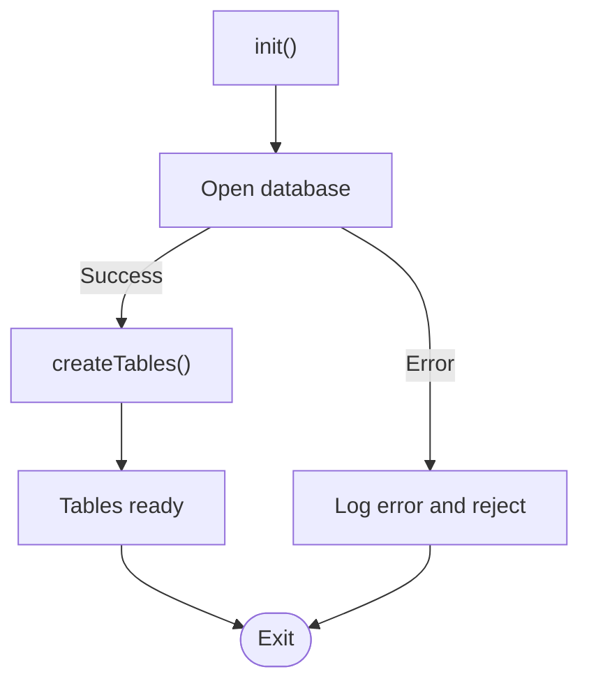
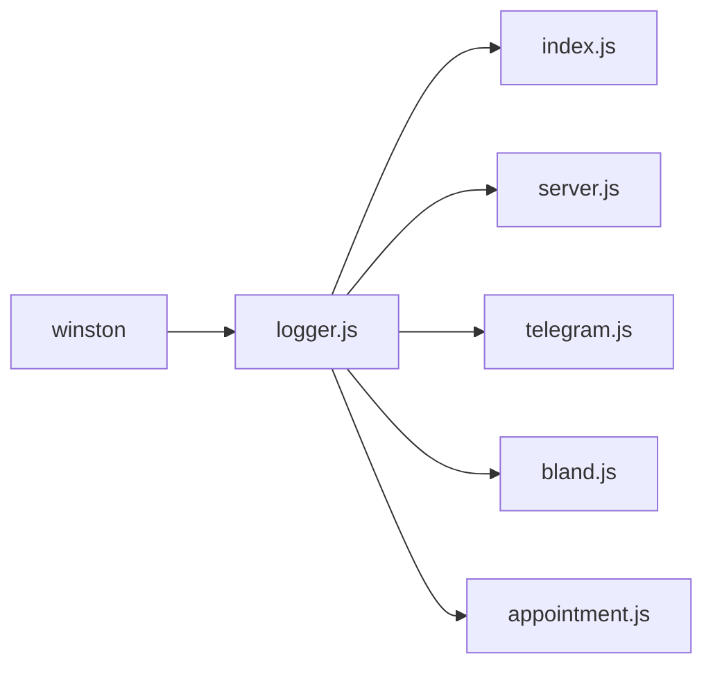

# Logging and Monitoring

<cite>
**Referenced Files in This Document**
- [logger.js](file://src/utils/logger.js)
- [index.js](file://src/index.js)
- [server.js](file://src/server.js)
- [appointment.js](file://src/models/appointment.js)
- [telegram.js](file://src/bot/telegram.js)
- [bland.js](file://src/voice/bland.js)
- [package.json](file://package.json)
- [README.md](file://README.md)
</cite>

## Table of Contents
1. [Introduction](#introduction)
2. [Project Structure](#project-structure)
3. [Core Components](#core-components)
4. [Architecture Overview](#architecture-overview)
5. [Detailed Component Analysis](#detailed-component-analysis)
6. [Dependency Analysis](#dependency-analysis)
7. [Performance Considerations](#performance-considerations)
8. [Troubleshooting Guide](#troubleshooting-guide)
9. [Conclusion](#conclusion)
10. [Appendices](#appendices)

## Introduction
This document describes the logging and monitoring implementation in the Appointment Voice Agent. It explains the Winston-based logging configuration, log levels, formats, and output destinations. It documents the logging structure with separate error and combined log files, and provides guidance on error tracking, debugging techniques, and monitoring approaches for production environments. It also covers log analysis, performance monitoring, troubleshooting workflows, log rotation and retention policies, and security considerations for log data. Finally, it includes examples of common debugging scenarios and suggestions for monitoring dashboard setup.

## Project Structure
The logging system is centralized in a dedicated utility module and consumed across the application. The main runtime entry initializes logging, starts subsystems, and registers graceful shutdown handlers. The Express server logs HTTP requests and errors. The Telegram bot and Bland voice service log operational events and errors. The SQLite model logs database lifecycle events.

**Diagram sources**
- [index.js:1-91](file://src/index.js#L1-L91)
- [server.js:1-266](file://src/server.js#L1-L266)
- [telegram.js:1-461](file://src/bot/telegram.js#L1-L461)
- [bland.js:1-235](file://src/voice/bland.js#L1-L235)
- [appointment.js:1-238](file://src/models/appointment.js#L1-L238)
- [logger.js:1-28](file://src/utils/logger.js#L1-L28)

**Section sources**
- [logger.js:1-28](file://src/utils/logger.js#L1-L28)
- [index.js:1-91](file://src/index.js#L1-L91)
- [server.js:1-266](file://src/server.js#L1-L266)
- [telegram.js:1-461](file://src/bot/telegram.js#L1-L461)
- [bland.js:1-235](file://src/voice/bland.js#L1-L235)
- [appointment.js:1-238](file://src/models/appointment.js#L1-L238)
- [README.md:154-175](file://README.md#L154-L175)

## Core Components
- Winston logger configuration:
  - Log level controlled by environment variable with a default fallback.
  - JSON format with timestamp, error stack, and interpolation support.
  - Default metadata including service identity.
  - File transports:
    - Separate error-level file transport.
    - Combined file transport for all levels.
  - Console transport in non-production environments for live debugging.

- Application-wide logging usage:
  - Entry point logs startup, environment validation, and graceful shutdown.
  - Express server logs HTTP requests and internal errors.
  - Telegram bot logs command handling, parsing, notifications, and errors.
  - Bland voice service logs call creation, details retrieval, webhook handling, and call termination.
  - SQLite model logs database initialization, table creation, and lifecycle events.

**Section sources**
- [logger.js:3-25](file://src/utils/logger.js#L3-L25)
- [index.js:8-44](file://src/index.js#L8-L44)
- [server.js:24-31](file://src/server.js#L24-L31)
- [server.js:233-240](file://src/server.js#L233-L240)
- [telegram.js:33-36](file://src/bot/telegram.js#L33-L36)
- [bland.js:23-52](file://src/voice/bland.js#L23-L52)
- [bland.js:107-116](file://src/voice/bland.js#L107-L116)
- [bland.js:123-149](file://src/voice/bland.js#L123-L149)
- [bland.js:222-231](file://src/voice/bland.js#L222-L231)
- [appointment.js:12-24](file://src/models/appointment.js#L12-L24)

## Architecture Overview
The logging architecture is a layered approach:
- Centralized Winston logger configured once and exported for reuse.
- All modules import and use the shared logger instance.
- Production vs development console output is controlled by environment.
- Error handling paths consistently log errors and propagate failures.

**Diagram sources**
- [logger.js:3-25](file://src/utils/logger.js#L3-L25)

**Section sources**
- [logger.js:1-28](file://src/utils/logger.js#L1-L28)
- [index.js:76-86](file://src/index.js#L76-L86)

## Detailed Component Analysis

### Winston Logger Configuration
- Log levels:
  - Controlled by environment variable with a sensible default.
  - Separate file transport configured for error-level logs.
  - Combined file transport for all levels.
- Formats:
  - ISO timestamp formatting.
  - Stack traces included for error objects.
  - String interpolation support.
  - JSON serialization for structured logs.
- Output destinations:
  - File transports write to logs directory.
  - Console transport writes to stdout/stderr in non-production environments.
- Default metadata:
  - Service identity included in every log entry.

**Diagram sources**
- [logger.js:3-25](file://src/utils/logger.js#L3-L25)

**Section sources**
- [logger.js:3-25](file://src/utils/logger.js#L3-L25)

### Entry Point Logging and Shutdown Hooks
- Logs application lifecycle events.
- Validates required environment variables and logs errors when missing.
- Initializes database and server, logging progress.
- Registers graceful shutdown handlers for SIGTERM, SIGINT, uncaught exceptions, and unhandled rejections.
- Logs shutdown steps and exits cleanly.

**Diagram sources**
- [index.js:8-44](file://src/index.js#L8-L44)
- [index.js:47-87](file://src/index.js#L47-L87)

**Section sources**
- [index.js:8-44](file://src/index.js#L8-L44)
- [index.js:47-87](file://src/index.js#L47-L87)

### Express Server Logging
- Middleware logs every HTTP request with method, path, client IP, and user agent.
- Global error handler logs Express errors and responds appropriately.
- Webhook endpoint logs receipt, acknowledges immediately, and processes asynchronously.

**Diagram sources**
- [server.js:24-31](file://src/server.js#L24-L31)
- [server.js:233-240](file://src/server.js#L233-L240)

**Section sources**
- [server.js:24-31](file://src/server.js#L24-L31)
- [server.js:77-123](file://src/server.js#L77-L123)
- [server.js:233-240](file://src/server.js#L233-L240)

### Telegram Bot Logging
- Logs command handling, help, and user appointment retrieval.
- Logs parsing errors and cancellation attempts.
- Logs notification attempts and call initiation errors.
- Centralized error handler logs Telegraf errors.

**Diagram sources**
- [telegram.js:182-224](file://src/bot/telegram.js#L182-L224)
- [telegram.js:373-405](file://src/bot/telegram.js#L373-L405)
- [telegram.js:33-36](file://src/bot/telegram.js#L33-L36)

**Section sources**
- [telegram.js:33-36](file://src/bot/telegram.js#L33-L36)
- [telegram.js:182-224](file://src/bot/telegram.js#L182-L224)
- [telegram.js:373-405](file://src/bot/telegram.js#L373-L405)

### Bland Voice Service Logging
- Logs call creation with prompt and metadata.
- Logs call details retrieval and webhook handling.
- Logs call termination attempts.
- Extracts appointment details from transcripts and logs decisions.

**Diagram sources**
- [bland.js:23-52](file://src/voice/bland.js#L23-L52)
- [bland.js:107-116](file://src/voice/bland.js#L107-L116)
- [bland.js:123-149](file://src/voice/bland.js#L123-L149)

**Section sources**
- [bland.js:23-52](file://src/voice/bland.js#L23-L52)
- [bland.js:107-116](file://src/voice/bland.js#L107-L116)
- [bland.js:123-149](file://src/voice/bland.js#L123-L149)

### SQLite Model Logging
- Logs database initialization, table creation, and lifecycle events.
- Logs CRUD operations with errors surfaced to callers.

**Diagram sources**
- [appointment.js:12-24](file://src/models/appointment.js#L12-L24)

**Section sources**
- [appointment.js:12-24](file://src/models/appointment.js#L12-L24)
- [appointment.js:62-100](file://src/models/appointment.js#L62-L100)
- [appointment.js:102-147](file://src/models/appointment.js#L102-L147)
- [appointment.js:149-177](file://src/models/appointment.js#L149-L177)
- [appointment.js:199-216](file://src/models/appointment.js#L199-L216)
- [appointment.js:218-234](file://src/models/appointment.js#L218-L234)

## Dependency Analysis
- Logger dependency:
  - All modules depend on the shared Winston logger instance.
- Runtime dependencies:
  - Winston is declared as a dependency.
  - Development dependency on nodemon for hot reload.
- Environment dependencies:
  - Environment variables control logging behavior and runtime configuration.

**Diagram sources**
- [package.json:20-26](file://package.json#L20-L26)
- [logger.js:1](file://src/utils/logger.js#L1)

**Section sources**
- [package.json:20-26](file://package.json#L20-L26)
- [logger.js:1](file://src/utils/logger.js#L1)

## Performance Considerations
- Structured JSON logs enable efficient parsing and indexing.
- Separate error and combined files reduce noise in error-only views.
- Console transport in development aids quick feedback; disable in production to avoid overhead.
- Asynchronous webhook processing prevents blocking the HTTP response while still logging outcomes.
- Consider rotating logs in production to manage disk usage and retention.

[No sources needed since this section provides general guidance]

## Troubleshooting Guide
- Environment validation failures:
  - Missing required environment variables cause early termination with error logs.
- Database connectivity:
  - Initialization errors are logged; verify database path and permissions.
- Server startup:
  - Port binding issues and middleware errors are logged; check port availability and middleware configuration.
- Telegram bot:
  - Command handling and parsing errors are logged; verify token and webhook URL.
- Bland.ai integration:
  - Call creation and webhook handling errors are logged; verify API key and webhook URL.
- Graceful shutdown:
  - Logs shutdown steps and handles uncaught exceptions and rejections.

Common debugging scenarios:
- Application fails to start due to missing environment variables:
  - Check logs for environment validation errors and ensure all required variables are set.
- Calls not being made:
  - Verify Bland API key validity and webhook URL accessibility; review voice service logs.
- Webhooks not received:
  - Confirm webhook URL correctness and server accessibility; inspect server logs for incoming requests.

**Section sources**
- [index.js:12-20](file://src/index.js#L12-L20)
- [index.js:41-44](file://src/index.js#L41-L44)
- [server.js:77-123](file://src/server.js#L77-L123)
- [telegram.js:33-36](file://src/bot/telegram.js#L33-L36)
- [bland.js:48-51](file://src/voice/bland.js#L48-L51)
- [appointment.js:14-23](file://src/models/appointment.js#L14-L23)

## Conclusion
The logging and monitoring setup in the Appointment Voice Agent centers on a robust Winston configuration with structured JSON logs, separate error and combined files, and environment-aware console output. The logger is integrated across all major modules, enabling comprehensive visibility into application lifecycle, HTTP traffic, Telegram bot operations, voice service interactions, and database operations. The graceful shutdown hooks and centralized error handling ensure consistent logging during lifecycle transitions and failures. For production deployments, consider adding log rotation and retention policies, and integrate with monitoring systems for alerting and dashboards.

[No sources needed since this section summarizes without analyzing specific files]

## Appendices

### Log Levels and Destinations
- Log levels:
  - Controlled by environment variable with a default fallback.
  - Error-level logs written to a dedicated file.
  - Combined logs written to a combined file.
- Destinations:
  - File transports write to logs directory.
  - Console transport enabled in non-production environments.

**Section sources**
- [logger.js:3-25](file://src/utils/logger.js#L3-L25)
- [README.md:206-210](file://README.md#L206-L210)

### Log Analysis and Monitoring
- Log analysis:
  - Use JSON parsing to extract timestamps, levels, and metadata.
  - Filter by service identity and error levels for focused investigations.
- Monitoring:
  - Integrate with log aggregation platforms to build dashboards.
  - Track error rates, request volumes, and latency metrics derived from logs.
- Dashboards:
  - Suggested metrics: error rate, request count, response time, call success rate.
  - Use service identity and metadata fields for grouping and filtering.

[No sources needed since this section provides general guidance]

### Log Rotation and Retention
- Log rotation:
  - Use external log rotation tools to manage file sizes and prevent disk exhaustion.
- Retention:
  - Define retention periods aligned with compliance and operational needs.
- Security:
  - Restrict access to logs containing sensitive data.
  - Consider redaction of personally identifiable information (PII) and API keys.

[No sources needed since this section provides general guidance]

### Security Considerations
- Avoid logging sensitive data such as API keys, tokens, and personal information.
- Restrict file system permissions for log directories.
- Use secure channels for log transmission and storage.

[No sources needed since this section provides general guidance]