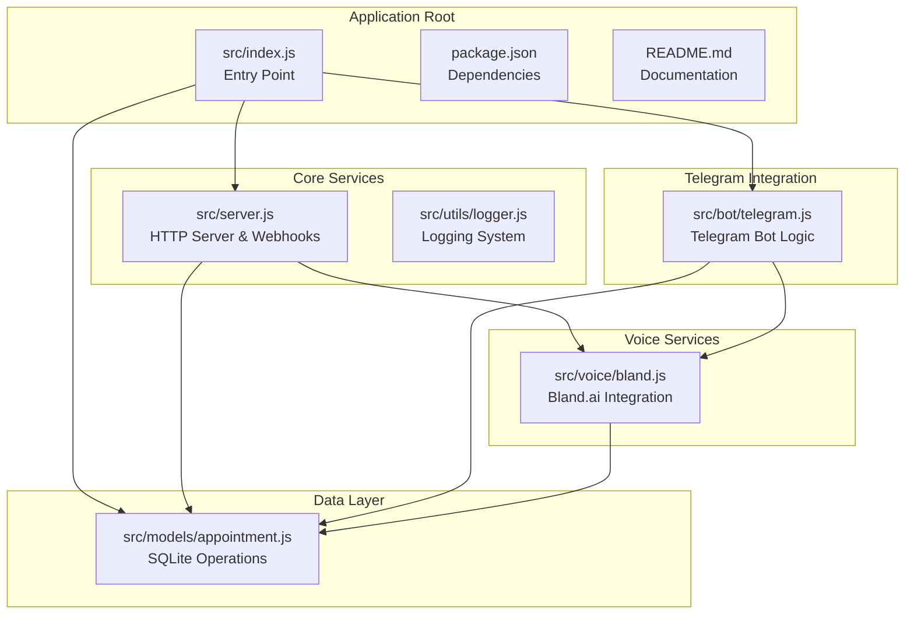
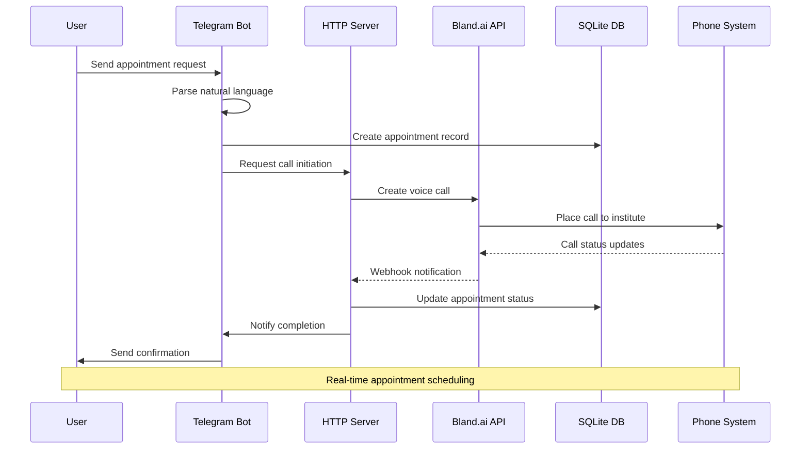
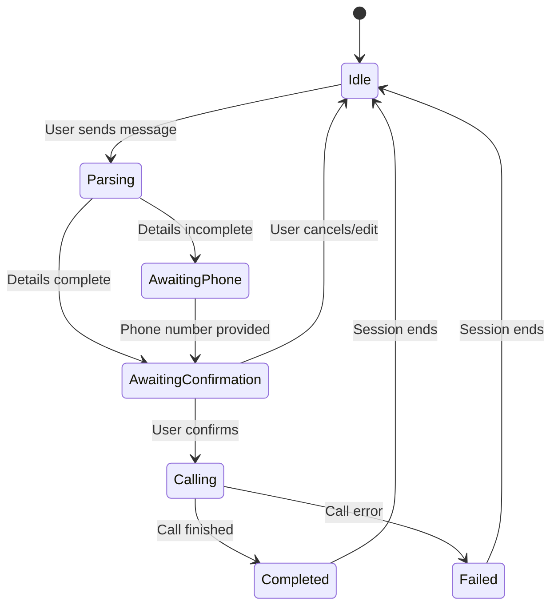
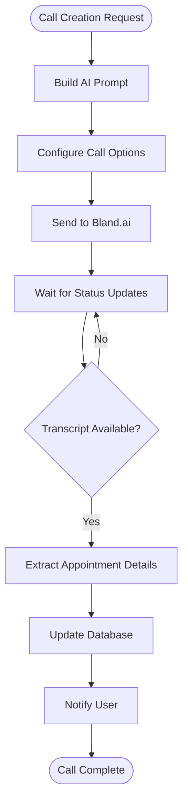
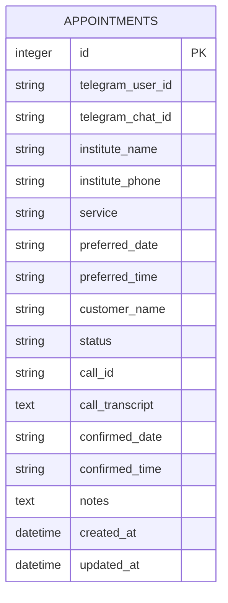
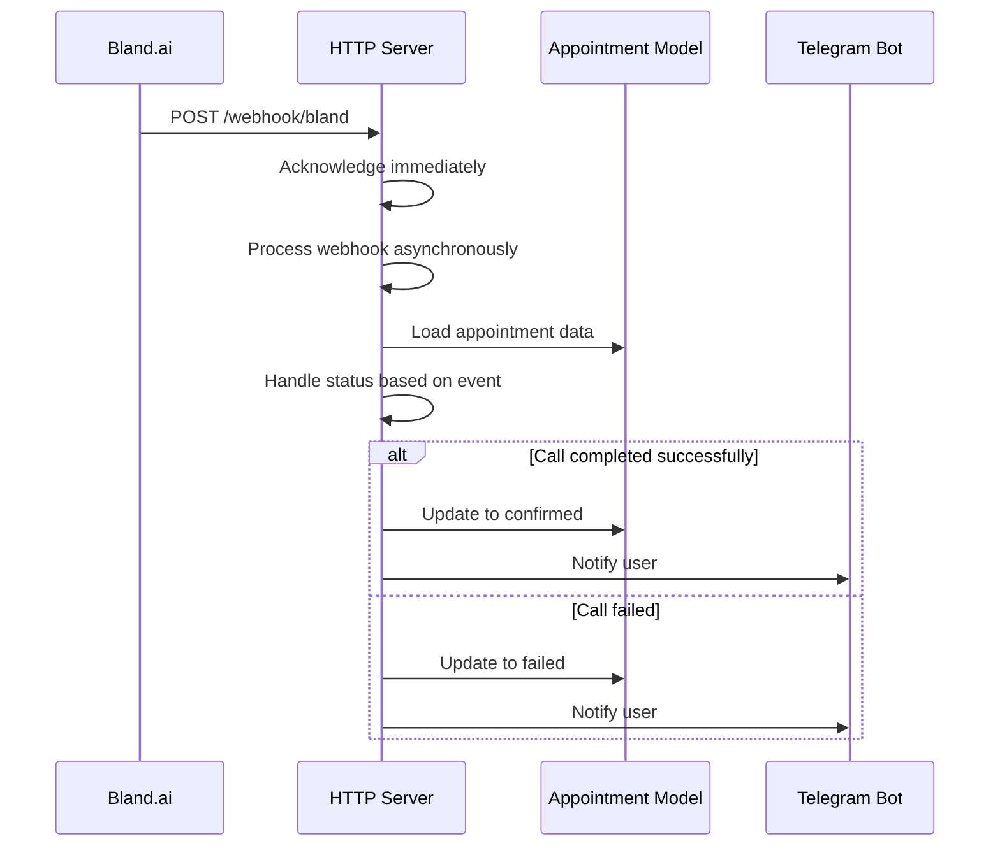
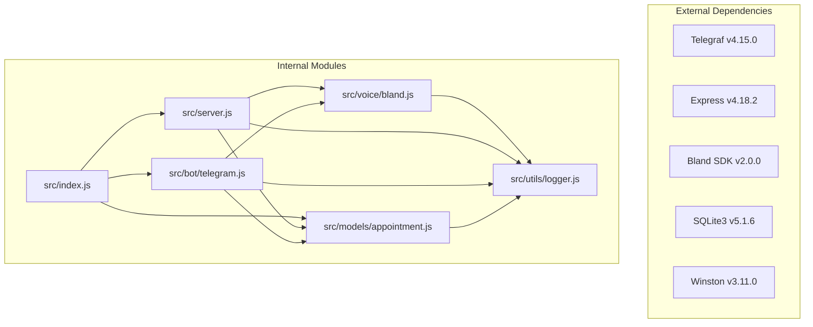

# Project Overview

<cite>
**Referenced Files in This Document**
- [README.md](file://README.md)
- [package.json](file://package.json)
- [src/index.js](file://src/index.js)
- [src/server.js](file://src/server.js)
- [src/bot/telegram.js](file://src/bot/telegram.js)
- [src/models/appointment.js](file://src/models/appointment.js)
- [src/voice/bland.js](file://src/voice/bland.js)
- [src/utils/logger.js](file://src/utils/logger.js)
</cite>

## Table of Contents
1. [Introduction](#introduction)
2. [Project Structure](#project-structure)
3. [Core Components](#core-components)
4. [Architecture Overview](#architecture-overview)
5. [Detailed Component Analysis](#detailed-component-analysis)
6. [Dependency Analysis](#dependency-analysis)
7. [Performance Considerations](#performance-considerations)
8. [Troubleshooting Guide](#troubleshooting-guide)
9. [Conclusion](#conclusion)

## Introduction

The Appointment Voice Agent is an AI-powered voice assistant designed to simplify the appointment booking process through two primary channels: Telegram messaging and automated phone calls. This innovative solution eliminates the need for users to manually call institutions, instead leveraging artificial intelligence to handle the entire scheduling conversation on their behalf.

### Core Value Proposition

The system provides exceptional value by combining the convenience of instant messaging with the personal touch of human-like voice interactions. Users can simply describe their appointment needs in natural language, and the system intelligently parses the request, manages the booking conversation, and delivers real-time updates throughout the process.

### Key Features

- **Natural Language Processing**: Intelligent parsing of user requests to extract appointment details
- **AI Voice Calls**: Human-like conversations conducted through Bland.ai voice technology
- **Smart Parsing**: Advanced pattern recognition for service types, dates, times, and contact information
- **Real-time Updates**: Live notifications about call progress and outcomes
- **Appointment Management**: Comprehensive tracking and cancellation capabilities
- **Multi-channel Integration**: Seamless coordination between Telegram and voice services

## Project Structure

The project follows a modular architecture with clear separation of concerns across four main functional areas:

**Diagram sources**
- [src/index.js:1-91](file://src/index.js#L1-L91)
- [src/server.js:1-266](file://src/server.js#L1-L266)
- [src/bot/telegram.js:1-461](file://src/bot/telegram.js#L1-L461)
- [src/models/appointment.js:1-238](file://src/models/appointment.js#L1-L238)
- [src/voice/bland.js:1-235](file://src/voice/bland.js#L1-L235)

**Section sources**
- [README.md:154-175](file://README.md#L154-L175)
- [package.json:1-35](file://package.json#L1-L35)

## Core Components

### Application Entry Point

The application starts through a centralized entry point that orchestrates the initialization of all major components. The startup sequence validates environment requirements, initializes the database, starts the HTTP server, and launches the Telegram bot.

### HTTP Server and Webhook Management

The Express-based server provides essential endpoints for health monitoring, webhook reception, and debugging APIs. It serves as the communication hub between external services and the internal application logic.

### Telegram Bot Integration

A sophisticated Telegram bot handles natural language processing, conversation state management, and user interaction flows. It supports multiple commands, inline keyboards, and real-time messaging capabilities.

### Voice Service Integration

The Bland.ai integration manages voice call creation, conversation orchestration, and webhook processing. It transforms structured appointment data into human-like voice interactions.

### Data Persistence Layer

An SQLite-based model provides comprehensive appointment management with support for CRUD operations, status tracking, and historical data maintenance.

**Section sources**
- [src/index.js:8-45](file://src/index.js#L8-L45)
- [src/server.js:7-14](file://src/server.js#L7-L14)
- [src/bot/telegram.js:6-11](file://src/bot/telegram.js#L6-L11)
- [src/voice/bland.js:4-10](file://src/voice/bland.js#L4-L10)
- [src/models/appointment.js:7-10](file://src/models/appointment.js#L7-L10)

## Architecture Overview

The system implements a distributed architecture that seamlessly integrates multiple services through well-defined interfaces:

**Diagram sources**
- [src/bot/telegram.js:373-405](file://src/bot/telegram.js#L373-L405)
- [src/server.js:77-123](file://src/server.js#L77-L123)
- [src/voice/bland.js:23-52](file://src/voice/bland.js#L23-L52)
- [src/models/appointment.js:62-100](file://src/models/appointment.js#L62-L100)

### System Integration Points

The architecture demonstrates clean separation of concerns with explicit integration points:

- **Telegram API**: Handles user interactions and message routing
- **Bland.ai API**: Manages voice call orchestration and transcription
- **Webhook System**: Provides asynchronous event-driven communication
- **Database Layer**: Maintains persistent state and historical records

### Data Flow Patterns

The system employs several key data flow patterns:

1. **Request Processing Flow**: From user input to appointment creation
2. **Call Management Flow**: From initiation to completion with status updates
3. **Notification Flow**: From webhook receipt to user communication
4. **State Synchronization Flow**: Between external services and local storage

**Section sources**
- [README.md:13-25](file://README.md#L13-L25)
- [src/server.js:33-75](file://src/server.js#L33-L75)

## Detailed Component Analysis

### Telegram Bot Implementation

The Telegram bot represents the primary user interface, implementing sophisticated conversation management and natural language processing capabilities.

#### Conversation State Management

The bot maintains user sessions using an in-memory Map structure to track conversation state across multiple interactions. This enables complex multi-step workflows including:

**Diagram sources**
- [src/bot/telegram.js:161-180](file://src/bot/telegram.js#L161-L180)
- [src/bot/telegram.js:349-371](file://src/bot/telegram.js#L349-L371)

#### Natural Language Processing

The bot implements comprehensive pattern matching for extracting appointment details:

| Pattern Category | Extraction Logic | Examples |
|------------------|------------------|----------|
| Service Types | Regex patterns for common services | haircut, dental cleaning, reservation |
| Institute Names | Text parsing after prepositions | "at Salon XYZ", "with Dental Care" |
| Phone Numbers | Numeric pattern cleaning | 555-123-4567, +15551234567 |
| Dates | Flexible date pattern matching | tomorrow, next Monday, 12/25/2024 |
| Times | Time format recognition | 3pm, 14:30, afternoon |

#### Command Processing

The bot supports multiple commands with specific functionality:

- `/start`: Welcome message and usage instructions
- `/help`: Comprehensive usage guide with examples
- `/myappointments`: View recent appointment history
- `/cancel <id>`: Cancel specific appointments

**Section sources**
- [src/bot/telegram.js:13-37](file://src/bot/telegram.js#L13-L37)
- [src/bot/telegram.js:182-224](file://src/bot/telegram.js#L182-L224)
- [src/bot/telegram.js:226-294](file://src/bot/telegram.js#L226-L294)

### Voice Service Integration

The Bland.ai integration provides the core voice automation capabilities through a well-structured service layer.

#### Call Orchestration

The voice service creates intelligent conversations with institutions:

**Diagram sources**
- [src/voice/bland.js:23-52](file://src/voice/bland.js#L23-L52)
- [src/voice/bland.js:123-149](file://src/voice/bland.js#L123-L149)

#### AI Conversation Management

The system generates sophisticated conversation prompts that guide AI assistants through complex scheduling scenarios:

- Professional introductions and explanations
- Flexible time negotiation strategies
- Comprehensive detail confirmation protocols
- Appropriate fallback procedures for unavailable numbers

#### Webhook Processing

The webhook system handles asynchronous call status updates with robust error handling and data extraction capabilities.

**Section sources**
- [src/voice/bland.js:123-149](file://src/voice/bland.js#L123-L149)
- [src/voice/bland.js:156-215](file://src/voice/bland.js#L156-L215)

### Database Management

The SQLite-based persistence layer provides comprehensive appointment lifecycle management.

#### Schema Design

The database schema supports complete appointment tracking with status management and audit trails:

**Diagram sources**
- [src/models/appointment.js:27-47](file://src/models/appointment.js#L27-L47)

#### Operation Patterns

The model implements standard CRUD operations with specialized methods for appointment management:

- **Creation**: Structured insertion with validation
- **Status Updates**: Atomic status transitions with metadata
- **Retrieval**: Multi-criteria queries for different use cases
- **History Tracking**: Comprehensive audit trail maintenance

**Section sources**
- [src/models/appointment.js:62-100](file://src/models/appointment.js#L62-L100)
- [src/models/appointment.js:102-147](file://src/models/appointment.js#L102-L147)

### HTTP Server and Webhook Handling

The Express-based server provides essential infrastructure for external integrations and debugging capabilities.

#### Endpoint Architecture

The server exposes multiple endpoints for different operational needs:

| Endpoint | Method | Purpose | Authentication |
|----------|--------|---------|----------------|
| `/health` | GET | Health check | None |
| `/webhook/bland` | POST | Bland.ai webhooks | None |
| `/api/appointments/:id` | GET | Debug appointment data | None |
| `/api/calls/:callId` | GET | Debug call details | None |

#### Webhook Processing Workflow

The webhook system implements a robust asynchronous processing pipeline:

**Diagram sources**
- [src/server.js:77-123](file://src/server.js#L77-L123)
- [src/server.js:125-184](file://src/server.js#L125-L184)

**Section sources**
- [src/server.js:33-75](file://src/server.js#L33-L75)
- [src/server.js:77-123](file://src/server.js#L77-L123)

## Dependency Analysis

The project demonstrates excellent modularity with clear dependency relationships and minimal coupling between components.

**Diagram sources**
- [package.json:20-27](file://package.json#L20-L27)
- [src/index.js:1-6](file://src/index.js#L1-L6)

### Dependency Management

The project maintains a focused dependency set optimized for its specific use case:

- **Runtime Dependencies**: Core functionality libraries with minimal overhead
- **Development Dependencies**: Tooling for development and testing
- **Version Constraints**: Specific versions for critical dependencies

### Module Coupling Analysis

The architecture demonstrates low coupling between modules:

- **Independent Modules**: Each module has a single responsibility
- **Clear Interfaces**: Well-defined function signatures and return types
- **Minimal Cross-Dependencies**: Only essential inter-module communication

**Section sources**
- [package.json:20-30](file://package.json#L20-L30)
- [src/index.js:1-6](file://src/index.js#L1-L6)

## Performance Considerations

The system is designed with performance and scalability in mind, implementing several optimization strategies:

### Asynchronous Processing

The application extensively uses asynchronous patterns to prevent blocking operations:

- **Non-blocking Webhook Processing**: Immediate acknowledgment followed by background processing
- **Database Operations**: Async/await patterns for all persistence operations
- **External API Calls**: Non-blocking HTTP requests to external services

### Resource Management

Efficient resource utilization through careful management:

- **Connection Pooling**: SQLite connections managed per operation
- **Memory Management**: Session cleanup and garbage collection
- **Logging Optimization**: Structured logging with appropriate levels

### Scalability Factors

The architecture supports horizontal scaling through:

- **Stateless Design**: Minimal server-side state requirements
- **Database Independence**: SQLite provides good performance for this scale
- **Asynchronous Workflows**: Non-blocking operation patterns

## Troubleshooting Guide

### Common Issues and Solutions

#### Telegram Bot Problems

**Symptoms**: Bot not responding to commands
**Causes**: 
- Invalid Telegram bot token
- Server not running
- Network connectivity issues

**Solutions**:
- Verify TELEGRAM_BOT_TOKEN in environment variables
- Check server logs for startup errors
- Ensure proper network connectivity

#### Voice Call Issues

**Symptoms**: Calls not being placed or failing
**Causes**:
- Invalid Bland.ai API key
- Incorrect webhook URL configuration
- Network accessibility problems

**Solutions**:
- Validate BLAND_API_KEY format and permissions
- Test webhook URL accessibility with curl
- Use ngrok for local development testing

#### Database Connectivity

**Symptoms**: Application crashes with database errors
**Causes**:
- SQLite file permission issues
- Database corruption
- Path configuration problems

**Solutions**:
- Verify database file permissions
- Check disk space availability
- Validate DATABASE_PATH environment variable

### Debugging Strategies

#### Logging Analysis

The system provides comprehensive logging for troubleshooting:

- **Error Logs**: Detailed error information in logs/error.log
- **Combined Logs**: Complete request/response traces
- **Console Output**: Development mode console logging

#### API Testing

Built-in debugging endpoints facilitate development:

- **Health Check**: Verify system status
- **Appointment Lookup**: Retrieve specific appointment data
- **Call Details**: Access Bland.ai call information

**Section sources**
- [README.md:212-228](file://README.md#L212-L228)
- [src/utils/logger.js:12-25](file://src/utils/logger.js#L12-L25)

## Conclusion

The Appointment Voice Agent represents a sophisticated integration of modern technologies to solve a common problem: simplifying the appointment booking process. Through its well-architected design, the system successfully combines natural language processing, AI voice automation, and real-time communication to deliver exceptional user experiences.

### Technical Achievements

The project demonstrates excellence in several technical areas:

- **Clean Architecture**: Clear separation of concerns with well-defined interfaces
- **Robust Error Handling**: Comprehensive error management and recovery mechanisms
- **Scalable Design**: Modular architecture supporting future enhancements
- **Production Ready**: Comprehensive logging, testing, and deployment considerations

### Future Enhancement Opportunities

The current implementation provides a solid foundation for future improvements:

- **Advanced NLP**: Enhanced natural language understanding capabilities
- **Multi-language Support**: Internationalization for broader market reach
- **Analytics Dashboard**: User behavior insights and system performance metrics
- **Advanced Voice Features**: Enhanced conversation capabilities and customization

The system successfully bridges the gap between traditional appointment scheduling and modern AI-powered automation, providing users with a seamless, efficient, and reliable solution for managing their appointment needs.