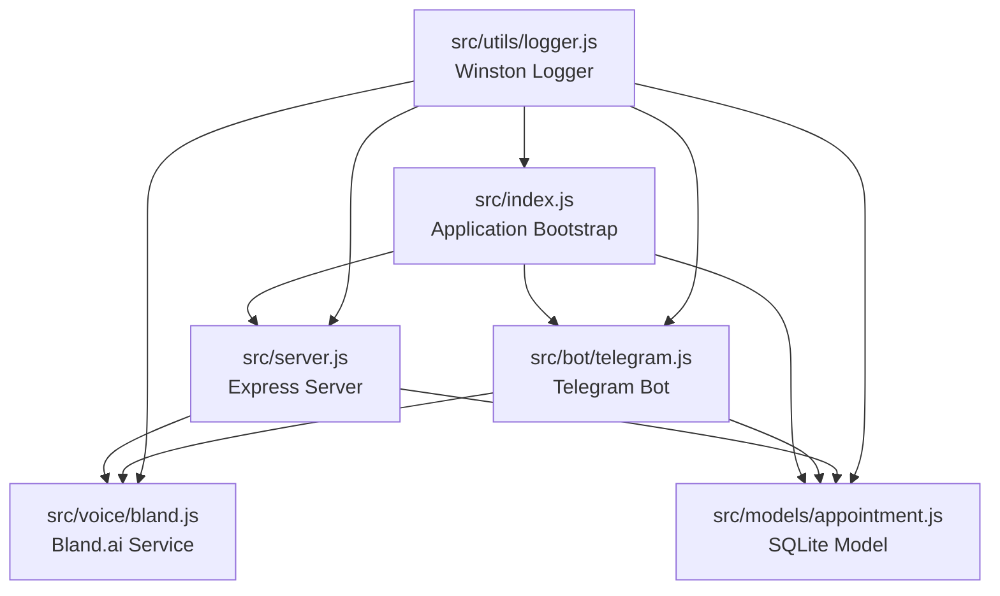
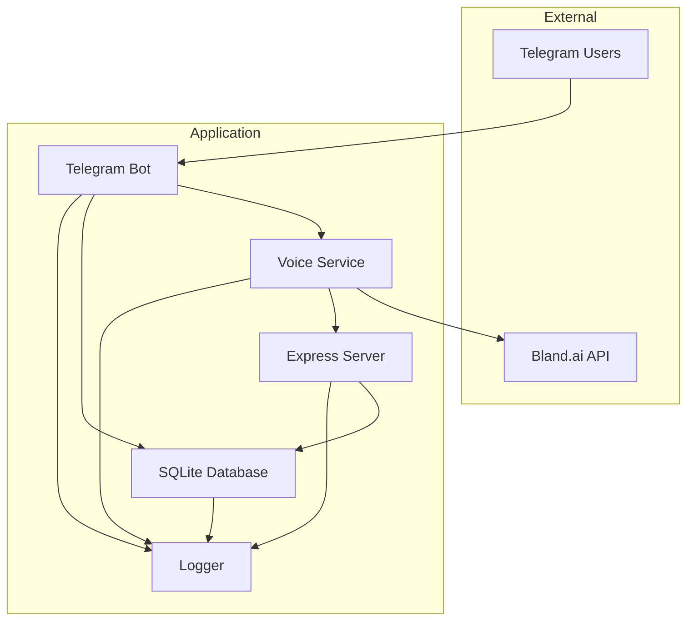
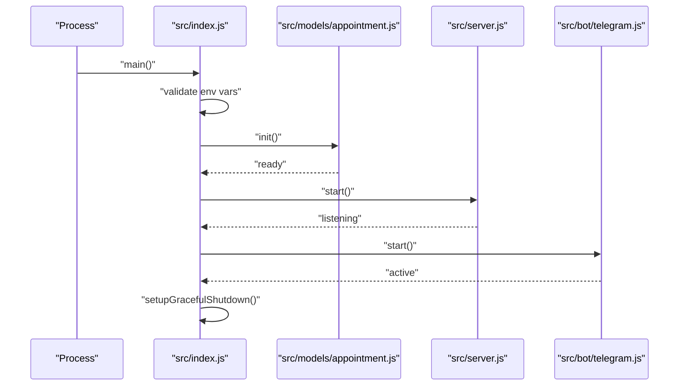
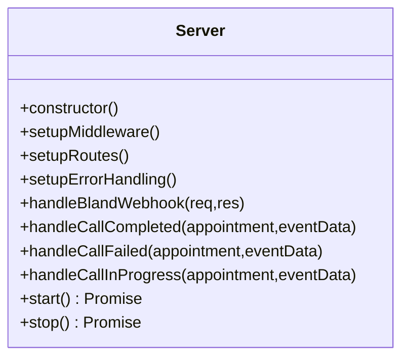
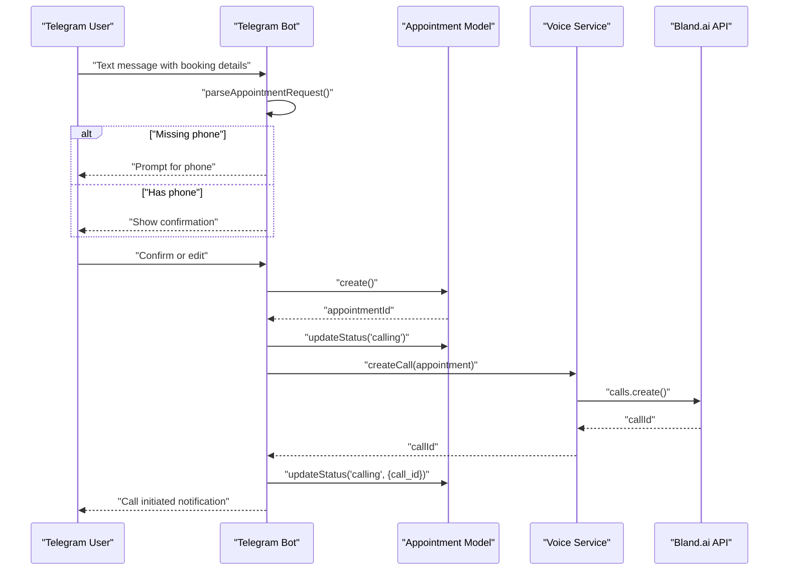
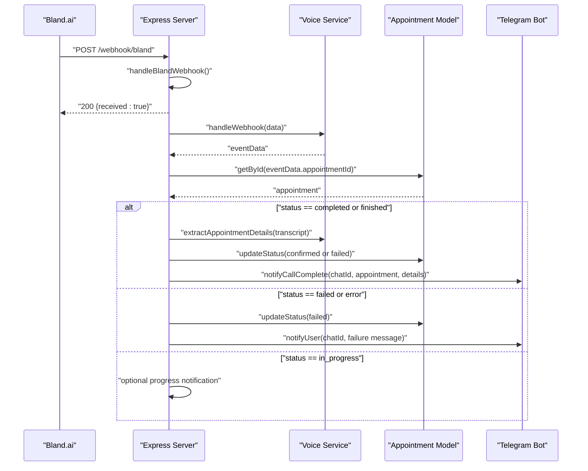
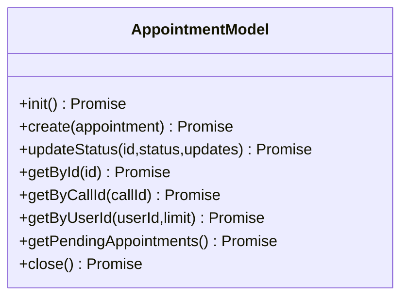
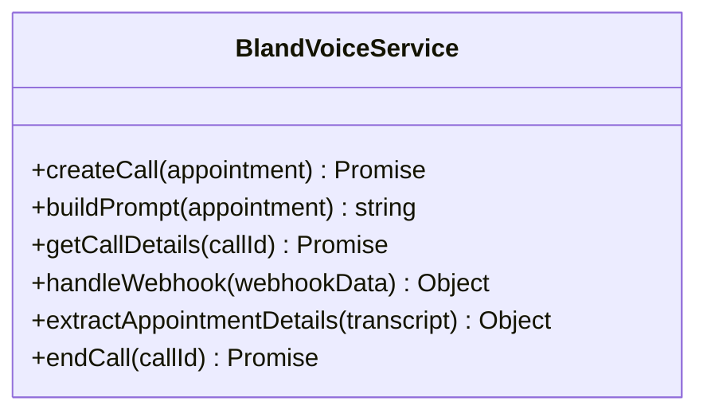
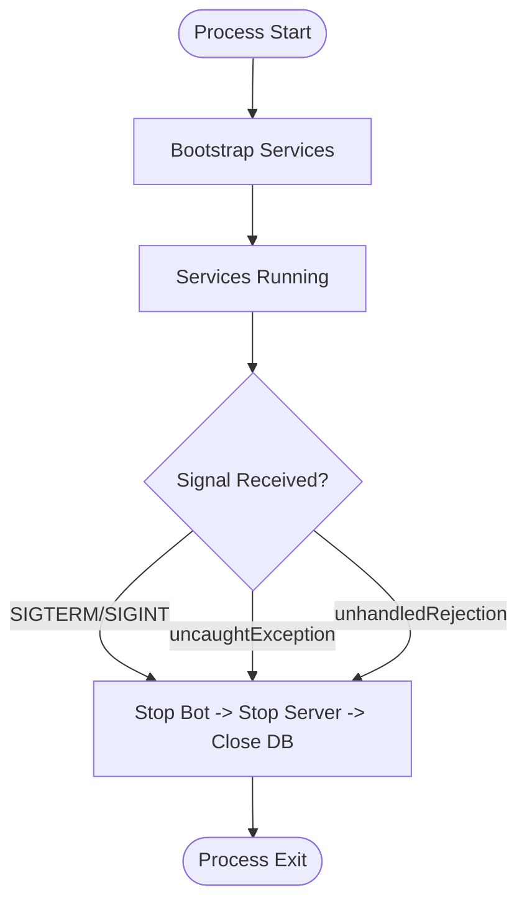
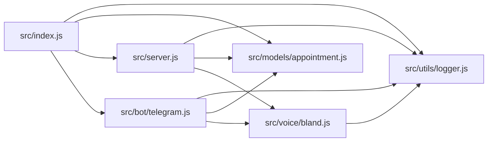

# Component Interactions

<cite>
**Referenced Files in This Document**
- [src/index.js](file://src/index.js)
- [src/server.js](file://src/server.js)
- [src/bot/telegram.js](file://src/bot/telegram.js)
- [src/models/appointment.js](file://src/models/appointment.js)
- [src/voice/bland.js](file://src/voice/bland.js)
- [src/utils/logger.js](file://src/utils/logger.js)
- [package.json](file://package.json)
- [README.md](file://README.md)
</cite>

## Table of Contents
1. [Introduction](#introduction)
2. [Project Structure](#project-structure)
3. [Core Components](#core-components)
4. [Architecture Overview](#architecture-overview)
5. [Detailed Component Analysis](#detailed-component-analysis)
6. [Dependency Analysis](#dependency-analysis)
7. [Performance Considerations](#performance-considerations)
8. [Troubleshooting Guide](#troubleshooting-guide)
9. [Conclusion](#conclusion)

## Introduction
This document explains how the Appointment Voice Agent system orchestrates components from startup to runtime, focusing on the Telegram bot, Express server, voice service integration, and database persistence. It documents the bootstrapping sequence, service initialization order, inter-component communication, error propagation, and graceful shutdown. Sequence diagrams illustrate typical user workflows from message submission to call completion, and the dependency injection pattern used for service composition is explained.

## Project Structure
The system follows a modular structure with clear separation of concerns:
- Application entry point initializes environment, database, server, and Telegram bot.
- Express server exposes health checks, webhooks, and debugging endpoints.
- Telegram bot handles user commands, parses natural language, and initiates voice calls.
- Voice service integrates with Bland.ai for call creation, status updates, and transcription extraction.
- SQLite model persists appointment lifecycle and state transitions.
- Logger utility centralizes structured logging across components.

**Diagram sources**
- [src/index.js:1-91](file://src/index.js#L1-L91)
- [src/server.js:1-266](file://src/server.js#L1-L266)
- [src/bot/telegram.js:1-461](file://src/bot/telegram.js#L1-L461)
- [src/models/appointment.js:1-238](file://src/models/appointment.js#L1-L238)
- [src/voice/bland.js:1-235](file://src/voice/bland.js#L1-L235)
- [src/utils/logger.js:1-28](file://src/utils/logger.js#L1-L28)

**Section sources**
- [README.md:154-175](file://README.md#L154-L175)
- [package.json:1-35](file://package.json#L1-L35)

## Core Components
- Application Bootstrap (src/index.js): Validates environment variables, initializes the database, starts the Express server, launches the Telegram bot, and registers graceful shutdown handlers.
- Express Server (src/server.js): Provides middleware, routes, and error handling; processes Bland.ai webhooks and exposes debugging endpoints.
- Telegram Bot (src/bot/telegram.js): Parses user messages, manages conversation sessions, creates appointments, triggers voice calls, and notifies users.
- Voice Service (src/voice/bland.js): Builds prompts, initiates calls via Bland.ai, handles webhooks, extracts call details, and ends calls.
- Appointment Model (src/models/appointment.js): Manages SQLite database operations for appointment lifecycle and status updates.
- Logger (src/utils/logger.js): Structured logging with file and console transports.

**Section sources**
- [src/index.js:8-45](file://src/index.js#L8-L45)
- [src/server.js:7-14](file://src/server.js#L7-L14)
- [src/bot/telegram.js:6-11](file://src/bot/telegram.js#L6-L11)
- [src/voice/bland.js:4-10](file://src/voice/bland.js#L4-L10)
- [src/models/appointment.js:7-24](file://src/models/appointment.js#L7-L24)
- [src/utils/logger.js:3-25](file://src/utils/logger.js#L3-L25)

## Architecture Overview
The system integrates four primary subsystems:
- Telegram Bot: User-facing interface for booking and managing appointments.
- Express Server: HTTP gateway for health checks, webhooks, and debugging.
- Voice Service: External API integration with Bland.ai for voice calls and status updates.
- Database: Persistent storage for appointment records and state transitions.

**Diagram sources**
- [src/index.js:22-32](file://src/index.js#L22-L32)
- [src/server.js:43-44](file://src/server.js#L43-L44)
- [src/bot/telegram.js:373-405](file://src/bot/telegram.js#L373-L405)
- [src/voice/bland.js:23-52](file://src/voice/bland.js#L23-L52)
- [src/models/appointment.js:12-24](file://src/models/appointment.js#L12-L24)
- [src/utils/logger.js:3-25](file://src/utils/logger.js#L3-L25)

## Detailed Component Analysis

### Application Bootstrap and Initialization
The bootstrap sequence ensures dependencies are initialized in the correct order:
- Environment validation: Checks required variables before proceeding.
- Database initialization: Creates tables if needed.
- Server start: Starts the HTTP server for webhooks and debugging.
- Telegram bot start: Launches the bot to listen for user messages.
- Graceful shutdown: Registers signal handlers and cleanup routines.

**Diagram sources**
- [src/index.js:8-45](file://src/index.js#L8-L45)
- [src/models/appointment.js:12-24](file://src/models/appointment.js#L12-L24)
- [src/server.js:242-249](file://src/server.js#L242-L249)
- [src/bot/telegram.js:449-452](file://src/bot/telegram.js#L449-L452)

**Section sources**
- [src/index.js:8-45](file://src/index.js#L8-L45)

### Express Server Orchestration
The Express server provides:
- Middleware: JSON/URL-encoded parsing and request logging.
- Routes: Health check, Bland.ai webhook, and debugging endpoints.
- Error handling: Centralized error handler for uncaught exceptions.
- Lifecycle: Start and stop methods for graceful shutdown.

**Diagram sources**
- [src/server.js:7-263](file://src/server.js#L7-L263)

**Section sources**
- [src/server.js:16-31](file://src/server.js#L16-L31)
- [src/server.js:33-75](file://src/server.js#L33-L75)
- [src/server.js:77-123](file://src/server.js#L77-L123)
- [src/server.js:231-240](file://src/server.js#L231-L240)
- [src/server.js:242-262](file://src/server.js#L242-L262)

### Telegram Bot Conversation Flow
The Telegram bot manages user sessions and call initiation:
- Command handlers: Start, help, my appointments, cancel.
- Text message parsing: Extracts service, institute, phone, date, and time.
- Session management: Tracks user state and prompts for missing details.
- Call initiation: Persists appointment, updates status, and triggers voice call.
- Notifications: Sends updates on call progress and completion.

**Diagram sources**
- [src/bot/telegram.js:161-180](file://src/bot/telegram.js#L161-L180)
- [src/bot/telegram.js:182-224](file://src/bot/telegram.js#L182-L224)
- [src/bot/telegram.js:373-405](file://src/bot/telegram.js#L373-L405)
- [src/models/appointment.js:62-100](file://src/models/appointment.js#L62-L100)
- [src/voice/bland.js:23-52](file://src/voice/bland.js#L23-L52)

**Section sources**
- [src/bot/telegram.js:13-37](file://src/bot/telegram.js#L13-L37)
- [src/bot/telegram.js:161-180](file://src/bot/telegram.js#L161-L180)
- [src/bot/telegram.js:182-224](file://src/bot/telegram.js#L182-L224)
- [src/bot/telegram.js:373-405](file://src/bot/telegram.js#L373-L405)

### Webhook Processing and Call Completion
The Express server receives Bland.ai webhooks and coordinates post-call actions:
- Immediate acknowledgment to Bland.ai.
- Asynchronous processing of webhook data.
- Lookup appointment by metadata.
- Status-specific handling: completed, failed, in_progress.
- Transcript parsing and status updates.
- User notifications via Telegram bot.

**Diagram sources**
- [src/server.js:77-123](file://src/server.js#L77-L123)
- [src/server.js:125-184](file://src/server.js#L125-L184)
- [src/server.js:186-218](file://src/server.js#L186-L218)
- [src/server.js:220-229](file://src/server.js#L220-L229)
- [src/voice/bland.js:123-149](file://src/voice/bland.js#L123-L149)
- [src/voice/bland.js:156-215](file://src/voice/bland.js#L156-L215)
- [src/models/appointment.js:149-162](file://src/models/appointment.js#L149-L162)
- [src/bot/telegram.js:426-447](file://src/bot/telegram.js#L426-L447)

**Section sources**
- [src/server.js:77-123](file://src/server.js#L77-L123)
- [src/server.js:125-184](file://src/server.js#L125-L184)
- [src/server.js:186-218](file://src/server.js#L186-L218)
- [src/server.js:220-229](file://src/server.js#L220-L229)

### Database Model Operations
The SQLite model encapsulates CRUD and status management:
- Initialization: Creates the appointments table if it does not exist.
- Persistence: Inserts new appointments and updates status with timestamps.
- Queries: Retrieves by ID, call ID, user ID, and pending appointments.
- Lifecycle: Graceful closure of database connections.

**Diagram sources**
- [src/models/appointment.js:7-235](file://src/models/appointment.js#L7-L235)

**Section sources**
- [src/models/appointment.js:12-60](file://src/models/appointment.js#L12-L60)
- [src/models/appointment.js:62-147](file://src/models/appointment.js#L62-L147)
- [src/models/appointment.js:149-216](file://src/models/appointment.js#L149-L216)
- [src/models/appointment.js:218-234](file://src/models/appointment.js#L218-L234)

### Voice Service Integration
The voice service integrates with Bland.ai:
- Call creation: Builds a prompt, sets call options, and sends metadata.
- Webhook handling: Parses incoming webhook payloads and extracts event data.
- Transcript parsing: Identifies confirmation and time/date details.
- Call details retrieval: Fetches call information by ID.
- Call termination: Ends active calls when needed.

**Diagram sources**
- [src/voice/bland.js:4-232](file://src/voice/bland.js#L4-L232)

**Section sources**
- [src/voice/bland.js:23-52](file://src/voice/bland.js#L23-L52)
- [src/voice/bland.js:107-116](file://src/voice/bland.js#L107-L116)
- [src/voice/bland.js:123-149](file://src/voice/bland.js#L123-L149)
- [src/voice/bland.js:156-215](file://src/voice/bland.js#L156-L215)
- [src/voice/bland.js:222-231](file://src/voice/bland.js#L222-L231)

### Dependency Injection Pattern
The system uses module-level exports and require-based composition:
- src/index.js composes services by importing modules and invoking their lifecycle methods.
- src/server.js depends on logger, appointment model, and voice service.
- src/bot/telegram.js depends on logger, appointment model, and voice service.
- src/voice/bland.js depends on logger and Bland client.
- src/models/appointment.js depends on logger and sqlite3.

This pattern avoids explicit DI containers and relies on Node.js module resolution and shared instances exported from modules.

**Section sources**
- [src/index.js:3-6](file://src/index.js#L3-L6)
- [src/server.js:1-6](file://src/server.js#L1-L6)
- [src/bot/telegram.js:1-5](file://src/bot/telegram.js#L1-L5)
- [src/voice/bland.js:1-3](file://src/voice/bland.js#L1-L3)
- [src/models/appointment.js:1-4](file://src/models/appointment.js#L1-L4)

### Graceful Shutdown Mechanism
The application registers signal handlers and cleanup routines:
- SIGTERM/SIGINT: Stops the Telegram bot, closes the Express server, and closes the database.
- Uncaught exceptions and unhandled rejections: Trigger shutdown with error logging.

**Diagram sources**
- [src/index.js:47-87](file://src/index.js#L47-L87)
- [src/server.js:251-262](file://src/server.js#L251-L262)
- [src/bot/telegram.js:454-457](file://src/bot/telegram.js#L454-L457)
- [src/models/appointment.js:218-234](file://src/models/appointment.js#L218-L234)

**Section sources**
- [src/index.js:47-87](file://src/index.js#L47-L87)

## Dependency Analysis
The following diagram shows import and usage relationships among modules:

**Diagram sources**
- [src/index.js:1-7](file://src/index.js#L1-L7)
- [src/server.js:1-6](file://src/server.js#L1-L6)
- [src/bot/telegram.js:1-5](file://src/bot/telegram.js#L1-L5)
- [src/voice/bland.js:1-3](file://src/voice/bland.js#L1-L3)
- [src/models/appointment.js:1-4](file://src/models/appointment.js#L1-L4)
- [src/utils/logger.js:1-28](file://src/utils/logger.js#L1-L28)

**Section sources**
- [src/index.js:1-7](file://src/index.js#L1-L7)
- [src/server.js:1-6](file://src/server.js#L1-L6)
- [src/bot/telegram.js:1-5](file://src/bot/telegram.js#L1-L5)
- [src/voice/bland.js:1-3](file://src/voice/bland.js#L1-L3)
- [src/models/appointment.js:1-4](file://src/models/appointment.js#L1-L4)
- [src/utils/logger.js:1-28](file://src/utils/logger.js#L1-L28)

## Performance Considerations
- Asynchronous webhook processing: The server acknowledges the webhook immediately and processes it asynchronously to avoid blocking the HTTP response.
- Minimal synchronous operations: Database and external API calls are awaited to prevent race conditions.
- Logging overhead: Structured logging is configured to minimize I/O impact; consider rotating logs in production.
- Concurrency: The Telegram bot maintains per-user sessions in memory; for scale, consider persistent session storage.

[No sources needed since this section provides general guidance]

## Troubleshooting Guide
Common issues and resolutions:
- Missing environment variables: The bootstrap validates TELEGRAM_BOT_TOKEN, BLAND_API_KEY, and WEBHOOK_URL; ensure they are set before starting.
- Database connectivity: The model initializes the SQLite database and creates tables; verify DATABASE_PATH and permissions.
- Webhook delivery: Confirm WEBHOOK_URL is publicly accessible and Bland.ai can reach the server.
- Call failures: Inspect Bland.ai API responses and logs; the voice service throws errors on failures.
- Graceful shutdown: Ensure SIGTERM/SIGINT handlers are triggered and resources are released.

**Section sources**
- [src/index.js:12-20](file://src/index.js#L12-L20)
- [src/models/appointment.js:12-24](file://src/models/appointment.js#L12-L24)
- [src/server.js:77-123](file://src/server.js#L77-L123)
- [src/voice/bland.js:48-51](file://src/voice/bland.js#L48-L51)
- [src/index.js:47-87](file://src/index.js#L47-L87)

## Conclusion
The Appointment Voice Agent system demonstrates a clean, modular architecture with clear component boundaries. The bootstrap sequence, dependency injection via module composition, robust error handling, and graceful shutdown ensure reliable operation. The Telegram bot, Express server, voice service, and database integrate seamlessly to support end-to-end appointment scheduling via voice calls, with structured logging and debugging endpoints for operational visibility.