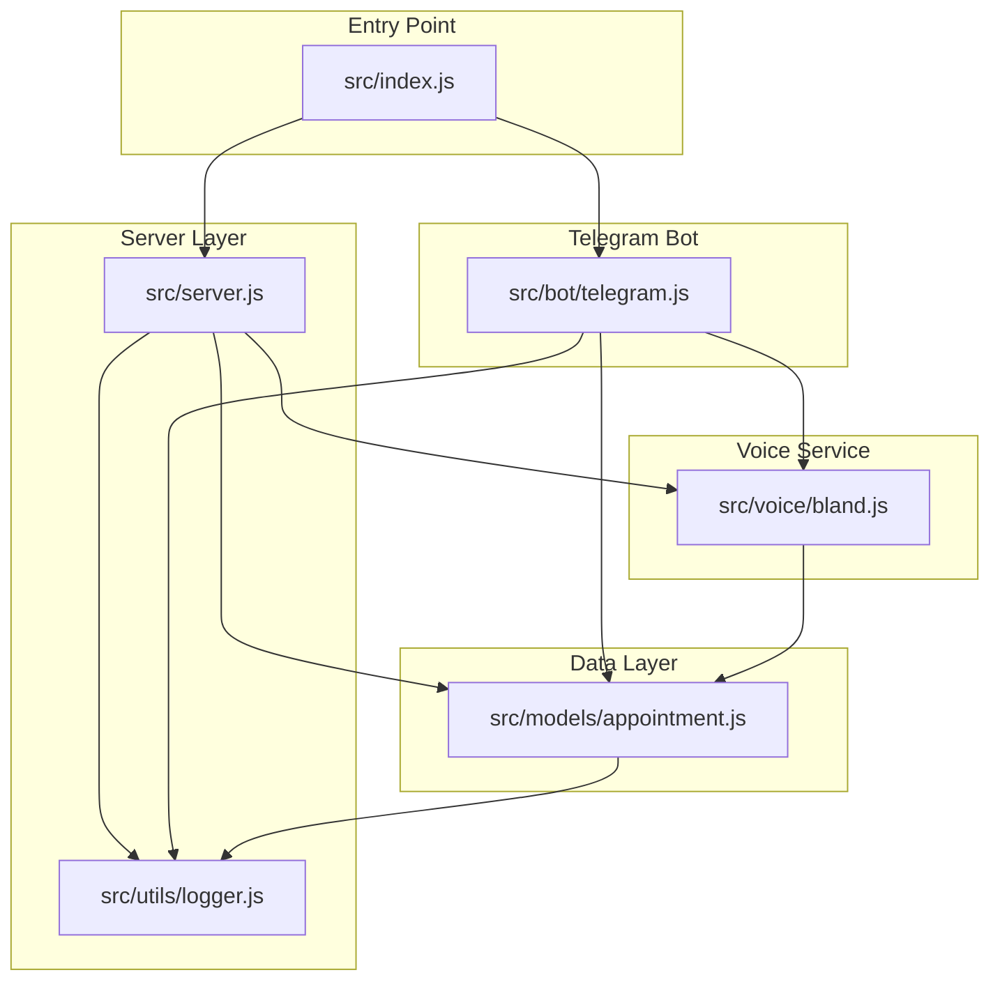
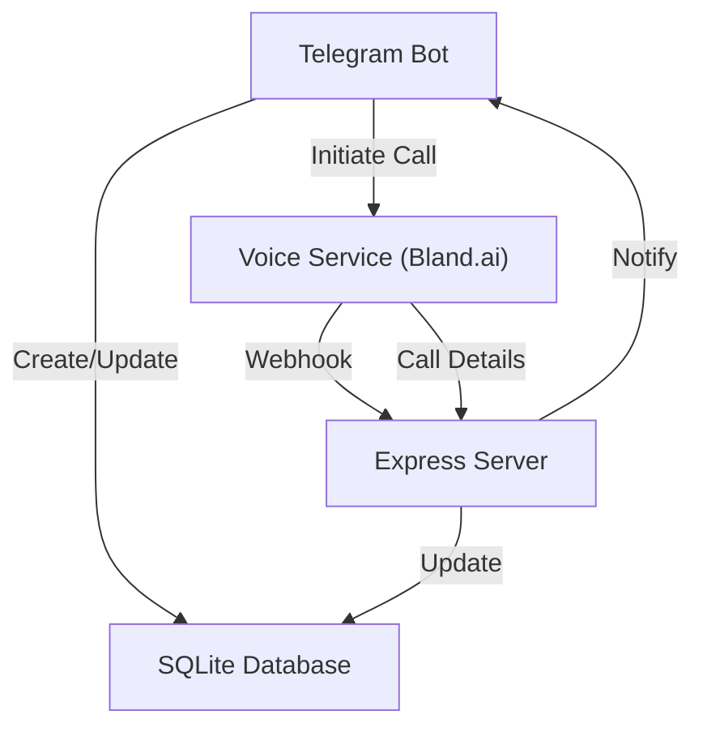
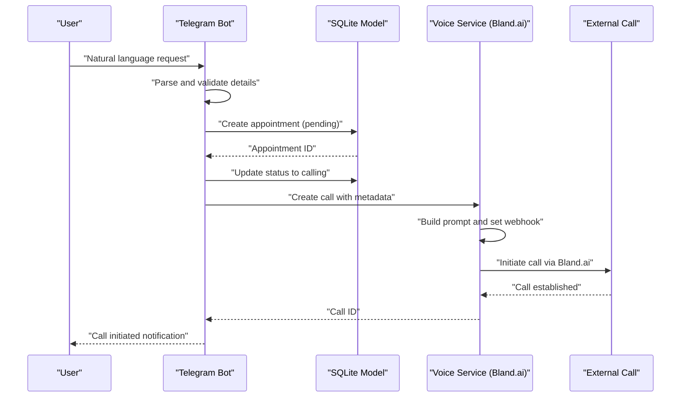
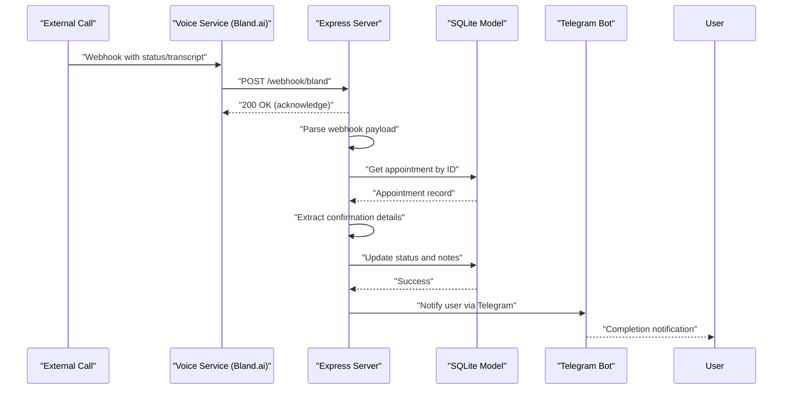
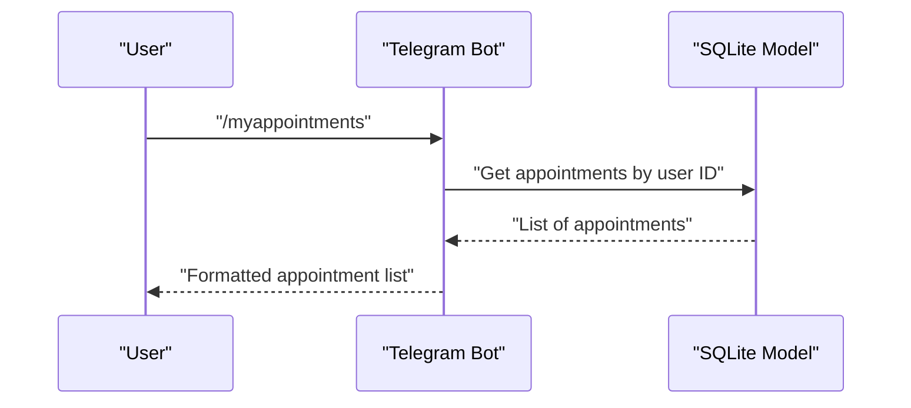
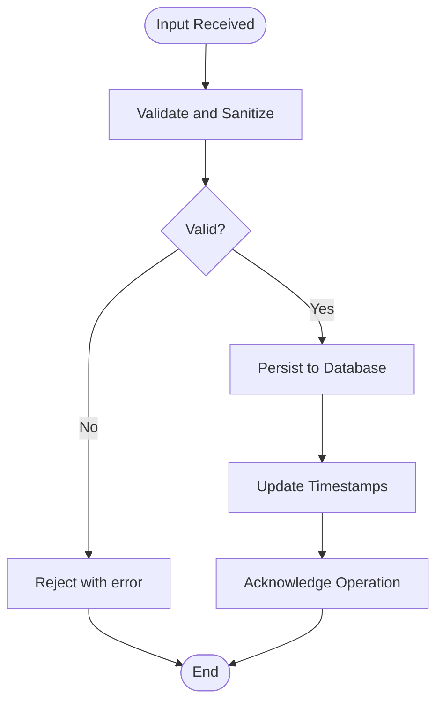
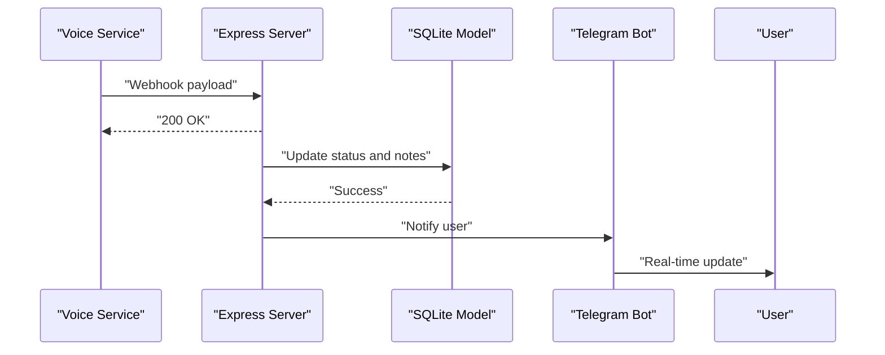
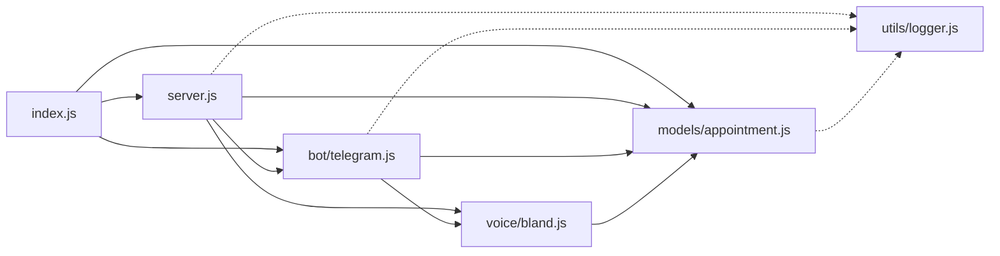

# Data Flow Architecture

<cite>
**Referenced Files in This Document**
- [src/index.js](file://src/index.js)
- [src/server.js](file://src/server.js)
- [src/bot/telegram.js](file://src/bot/telegram.js)
- [src/models/appointment.js](file://src/models/appointment.js)
- [src/voice/bland.js](file://src/voice/bland.js)
- [src/utils/logger.js](file://src/utils/logger.js)
- [README.md](file://README.md)
- [package.json](file://package.json)
</cite>

## Table of Contents
1. [Introduction](#introduction)
2. [Project Structure](#project-structure)
3. [Core Components](#core-components)
4. [Architecture Overview](#architecture-overview)
5. [Detailed Component Analysis](#detailed-component-analysis)
6. [Dependency Analysis](#dependency-analysis)
7. [Performance Considerations](#performance-considerations)
8. [Troubleshooting Guide](#troubleshooting-guide)
9. [Conclusion](#conclusion)

## Introduction
This document provides comprehensive data flow documentation for the Appointment Voice Agent system. It covers three primary data pathways:
- User input flow: Telegram → Bot → Database → Voice Service → External Call
- Webhook flow: External Call → Voice Service → Server → Database → Telegram Notification
- Query flow: Telegram → Database → Response

The document explains data validation, sanitization, and persistence patterns, details the real-time notification system, and addresses data consistency guarantees and transaction handling across component boundaries.

## Project Structure
The system is organized into focused modules:
- Entry point initializes environment, database, server, and Telegram bot
- Express server exposes webhook and debug endpoints
- Telegram bot handles user interactions and orchestrates voice calls
- Voice service integrates with Bland.ai for call orchestration
- SQLite model persists appointment records
- Logger provides structured logging across components

**Diagram sources**
- [src/index.js:1-91](file://src/index.js#L1-L91)
- [src/server.js:1-266](file://src/server.js#L1-L266)
- [src/bot/telegram.js:1-461](file://src/bot/telegram.js#L1-L461)
- [src/voice/bland.js:1-235](file://src/voice/bland.js#L1-L235)
- [src/models/appointment.js:1-238](file://src/models/appointment.js#L1-L238)
- [src/utils/logger.js:1-28](file://src/utils/logger.js#L1-L28)

**Section sources**
- [README.md:154-175](file://README.md#L154-L175)
- [package.json:1-35](file://package.json#L1-L35)

## Core Components
- Application entry point validates environment variables, initializes database, starts server and Telegram bot, and sets up graceful shutdown hooks.
- Express server provides health checks, webhook reception, and debug endpoints; it processes Bland.ai webhooks and triggers notifications.
- Telegram bot parses natural language requests, manages user sessions, creates appointments, initiates calls, and sends real-time updates.
- Voice service builds prompts, creates calls via Bland.ai, extracts call details, and handles webhook payloads.
- Appointment model encapsulates SQLite operations for CRUD and status updates with timestamps and validation.
- Logger centralizes structured logging across all components.

**Section sources**
- [src/index.js:8-45](file://src/index.js#L8-L45)
- [src/server.js:77-123](file://src/server.js#L77-L123)
- [src/bot/telegram.js:373-405](file://src/bot/telegram.js#L373-L405)
- [src/voice/bland.js:23-52](file://src/voice/bland.js#L23-L52)
- [src/models/appointment.js:102-147](file://src/models/appointment.js#L102-L147)
- [src/utils/logger.js:3-25](file://src/utils/logger.js#L3-L25)

## Architecture Overview
The system follows a modular architecture with clear separation of concerns:
- Telegram bot receives user input and coordinates call initiation
- Voice service interacts with external Bland.ai API
- Express server handles inbound webhooks and outbound notifications
- SQLite database persists appointment lifecycle data
- Logger ensures observability across asynchronous operations

**Diagram sources**
- [src/bot/telegram.js:373-405](file://src/bot/telegram.js#L373-L405)
- [src/voice/bland.js:23-52](file://src/voice/bland.js#L23-L52)
- [src/server.js:77-123](file://src/server.js#L77-L123)
- [src/models/appointment.js:102-147](file://src/models/appointment.js#L102-L147)

## Detailed Component Analysis

### User Input Flow: Telegram → Bot → Database → Voice Service → External Call
This flow transforms natural language into actionable voice calls:
1. User sends a message to the Telegram bot
2. Bot parses the message, validates required fields, and stores session data
3. Bot creates an appointment record in the database and transitions to "calling" status
4. Bot invokes the voice service to create a call with Bland.ai
5. Voice service constructs a prompt, sets metadata, and initiates the call
6. External call proceeds via Bland.ai

**Diagram sources**
- [src/bot/telegram.js:161-180](file://src/bot/telegram.js#L161-L180)
- [src/bot/telegram.js:373-405](file://src/bot/telegram.js#L373-L405)
- [src/models/appointment.js:62-100](file://src/models/appointment.js#L62-L100)
- [src/voice/bland.js:23-52](file://src/voice/bland.js#L23-L52)

**Section sources**
- [src/bot/telegram.js:182-224](file://src/bot/telegram.js#L182-L224)
- [src/bot/telegram.js:373-405](file://src/bot/telegram.js#L373-L405)
- [src/models/appointment.js:62-100](file://src/models/appointment.js#L62-L100)
- [src/voice/bland.js:23-52](file://src/voice/bland.js#L23-L52)

### Webhook Flow: External Call → Voice Service → Server → Database → Telegram Notification
This flow processes call outcomes and notifies users:
1. Bland.ai sends a webhook to the Express server with call status and transcript
2. Server acknowledges immediately and processes asynchronously
3. Server extracts metadata from webhook payload and retrieves appointment
4. Server updates database based on call outcome and extracts confirmation details
5. Server notifies the user via Telegram with completion details

**Diagram sources**
- [src/server.js:77-123](file://src/server.js#L77-L123)
- [src/server.js:125-184](file://src/server.js#L125-L184)
- [src/models/appointment.js:149-177](file://src/models/appointment.js#L149-L177)
- [src/bot/telegram.js:418-447](file://src/bot/telegram.js#L418-L447)

**Section sources**
- [src/server.js:77-123](file://src/server.js#L77-L123)
- [src/server.js:125-184](file://src/server.js#L125-L184)
- [src/bot/telegram.js:426-447](file://src/bot/telegram.js#L426-L447)

### Query Flow: Telegram → Database → Response
This flow serves user requests for appointment information:
1. User requests recent appointments via Telegram commands
2. Bot queries the database for user's appointments
3. Bot formats and returns appointment details to the user

**Diagram sources**
- [src/bot/telegram.js:92-121](file://src/bot/telegram.js#L92-L121)
- [src/models/appointment.js:179-197](file://src/models/appointment.js#L179-L197)

**Section sources**
- [src/bot/telegram.js:92-121](file://src/bot/telegram.js#L92-L121)
- [src/models/appointment.js:179-197](file://src/models/appointment.js#L179-L197)

### Data Validation, Sanitization, and Persistence Patterns
- Input validation and sanitization:
  - Telegram bot cleans and validates phone numbers before confirming appointments
  - Natural language parsing extracts structured fields while handling missing information gracefully
  - Status updates enforce allowed status values and update timestamps
- Persistence patterns:
  - SQLite table schema defines strict field types and defaults
  - Atomic updates with timestamp fields ensure auditability
  - Asynchronous webhook processing prevents blocking the main request path
- Error handling:
  - Structured logging captures errors and context across components
  - Graceful shutdown ensures resources are released cleanly

**Diagram sources**
- [src/bot/telegram.js:296-309](file://src/bot/telegram.js#L296-L309)
- [src/models/appointment.js:102-147](file://src/models/appointment.js#L102-L147)
- [src/utils/logger.js:3-25](file://src/utils/logger.js#L3-L25)

**Section sources**
- [src/bot/telegram.js:296-309](file://src/bot/telegram.js#L296-L309)
- [src/models/appointment.js:102-147](file://src/models/appointment.js#L102-L147)
- [src/utils/logger.js:3-25](file://src/utils/logger.js#L3-L25)

### Real-time Notification System and Status Propagation
- Immediate acknowledgment: The server responds with success to webhook requests to prevent retries
- Asynchronous processing: Webhook payloads are processed after acknowledging to avoid timeouts
- Status propagation: Database updates trigger notifications to users via Telegram
- Transcript and recording handling: Voice service extracts confirmation details and recording URLs for user notifications

**Diagram sources**
- [src/server.js:77-123](file://src/server.js#L77-L123)
- [src/server.js:125-184](file://src/server.js#L125-L184)
- [src/bot/telegram.js:418-447](file://src/bot/telegram.js#L418-L447)

**Section sources**
- [src/server.js:77-123](file://src/server.js#L77-L123)
- [src/server.js:125-184](file://src/server.js#L125-L184)
- [src/bot/telegram.js:418-447](file://src/bot/telegram.js#L418-L447)

### Data Consistency Guarantees and Transaction Handling
- Single-table updates: The SQLite model performs atomic UPDATE statements with timestamp fields
- No cross-table transactions: The system does not implement multi-table ACID transactions
- Eventual consistency: Webhook-driven updates ensure eventual consistency between external call states and internal records
- Idempotent webhook handling: Server checks for presence of appointment metadata and existing records before processing
- Graceful degradation: Asynchronous processing allows the system to continue operating even if external services are temporarily unavailable

**Section sources**
- [src/models/appointment.js:102-147](file://src/models/appointment.js#L102-L147)
- [src/server.js:77-123](file://src/server.js#L77-L123)

## Dependency Analysis
The system exhibits clear module boundaries with explicit dependencies:
- Entry point depends on server, bot, and model initialization
- Server depends on voice service and model for webhook processing
- Bot depends on model and voice service for orchestration
- Voice service depends on external API and model for metadata retrieval
- Logger is a shared dependency across all modules

**Diagram sources**
- [src/index.js:4-6](file://src/index.js#L4-L6)
- [src/server.js:3-5](file://src/server.js#L3-L5)
- [src/bot/telegram.js:3-4](file://src/bot/telegram.js#L3-L4)
- [src/voice/bland.js:2](file://src/voice/bland.js#L2)
- [src/models/appointment.js:3](file://src/models/appointment.js#L3)

**Section sources**
- [src/index.js:4-6](file://src/index.js#L4-L6)
- [src/server.js:3-5](file://src/server.js#L3-L5)
- [src/bot/telegram.js:3-4](file://src/bot/telegram.js#L3-L4)
- [src/voice/bland.js:2](file://src/voice/bland.js#L2)
- [src/models/appointment.js:3](file://src/models/appointment.js#L3)

## Performance Considerations
- Asynchronous webhook processing prevents request timeouts and improves throughput
- Immediate acknowledgment reduces retry storms and improves reliability
- SQLite operations are lightweight and suitable for small-scale deployments
- Consider adding rate limiting for Telegram bot commands and webhook endpoints
- For high-volume scenarios, consider migrating to a relational database with ACID transactions and horizontal scaling

## Troubleshooting Guide
Common issues and resolutions:
- Missing environment variables: The entry point validates required variables and exits with an error if any are missing
- Database connectivity: The model initializes SQLite and logs connection errors
- Webhook delivery failures: Verify the webhook URL is publicly accessible and the server is reachable
- Call initiation failures: Check Bland.ai API key validity and network connectivity
- Telegram bot not responding: Ensure the bot token is correct and the bot is launched

**Section sources**
- [src/index.js:12-20](file://src/index.js#L12-L20)
- [src/models/appointment.js:12-24](file://src/models/appointment.js#L12-L24)
- [README.md:212-228](file://README.md#L212-L228)

## Conclusion
The Appointment Voice Agent system demonstrates a clean, modular architecture that effectively manages three distinct data flows. The design emphasizes asynchronous processing, structured logging, and clear separation of concerns. While the current implementation relies on SQLite for persistence and does not implement cross-table transactions, it provides robust real-time notifications and reliable webhook handling. For production deployments, consider enhancing error handling, adding monitoring, and evaluating database scalability options.