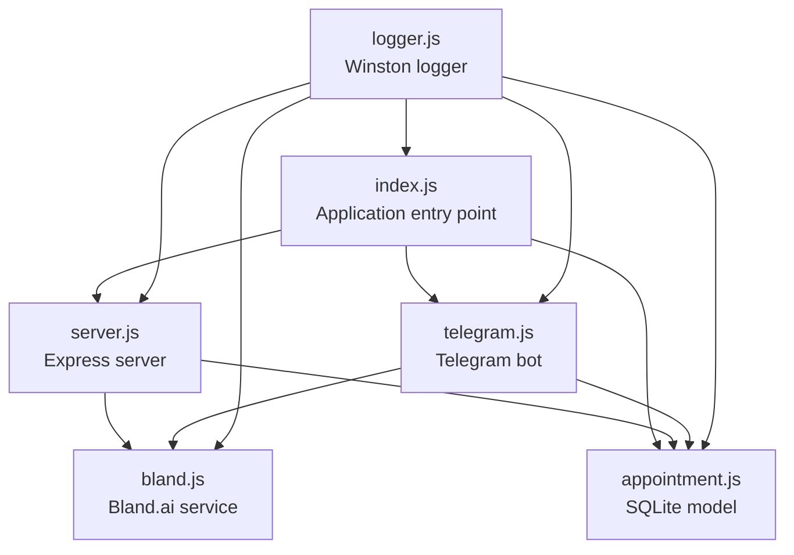
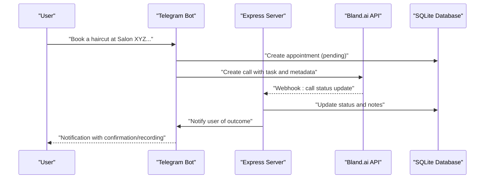
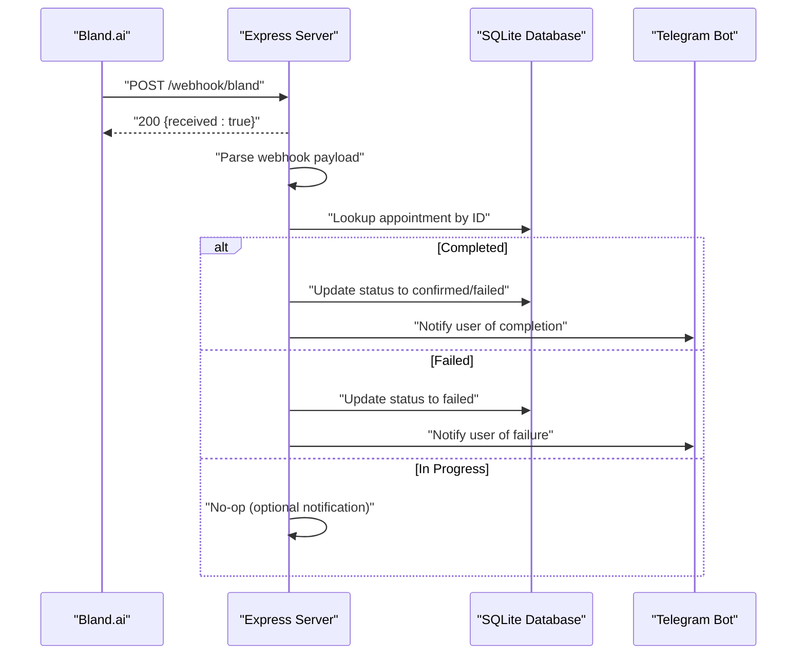
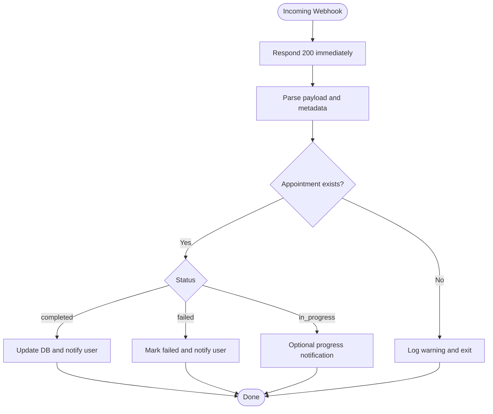
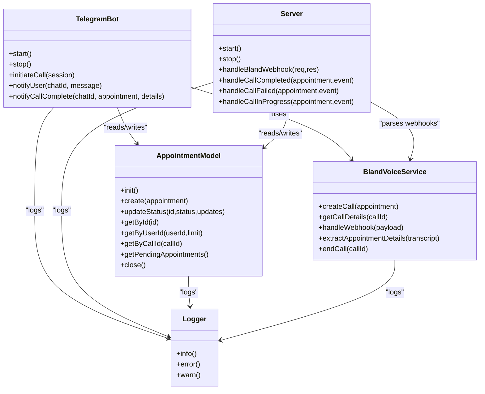
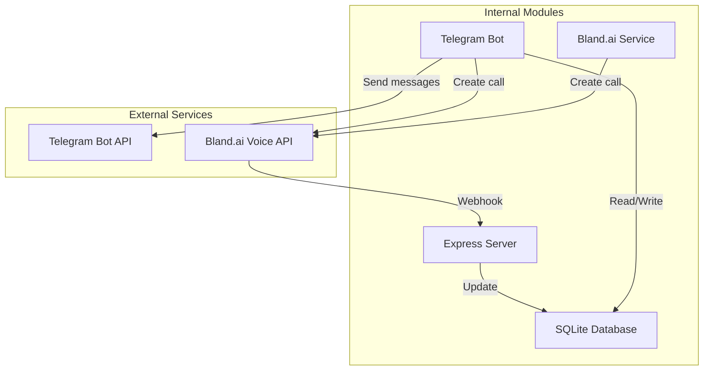
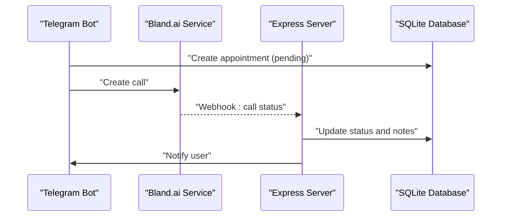
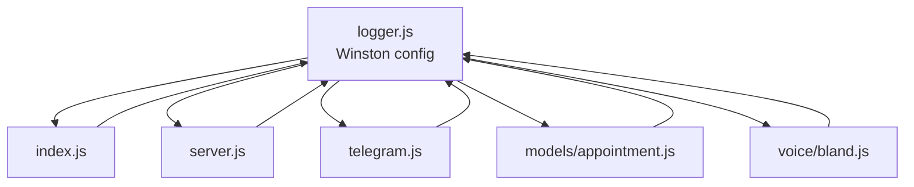
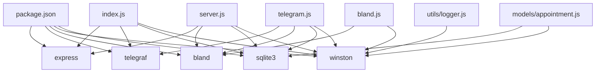

# Integration Patterns

<cite>
**Referenced Files in This Document**
- [index.js](file://src/index.js)
- [server.js](file://src/server.js)
- [telegram.js](file://src/bot/telegram.js)
- [bland.js](file://src/voice/bland.js)
- [logger.js](file://src/utils/logger.js)
- [appointment.js](file://src/models/appointment.js)
- [package.json](file://package.json)
- [README.md](file://README.md)
</cite>

## Table of Contents
1. [Introduction](#introduction)
2. [Project Structure](#project-structure)
3. [Core Components](#core-components)
4. [Architecture Overview](#architecture-overview)
5. [Detailed Component Analysis](#detailed-component-analysis)
6. [Dependency Analysis](#dependency-analysis)
7. [Performance Considerations](#performance-considerations)
8. [Troubleshooting Guide](#troubleshooting-guide)
9. [Conclusion](#conclusion)
10. [Appendices](#appendices)

## Introduction
This document explains the integration patterns used in the Appointment Voice Agent system. It covers:
- Webhook integration pattern for Bland.ai callbacks
- Event-driven architecture for real-time notifications
- Modular service composition pattern
- External API integrations (Telegram Bot API, Bland.ai Voice API)
- Internal component communication
- Error handling, retry mechanisms, and fallback strategies
- Logging integration using Winston across all components
- Security considerations and authentication patterns

## Project Structure
The system is organized into modular services:
- Entry point initializes environment, database, server, and Telegram bot
- Express server exposes health checks and webhook endpoints
- Telegram bot handles user commands and initiates voice calls
- Bland.ai service manages voice calls and webhook processing
- SQLite-backed appointment model persists state
- Winston-based logger is shared across all components

**Diagram sources**
- [index.js:1-91](file://src/index.js#L1-L91)
- [server.js:1-266](file://src/server.js#L1-L266)
- [telegram.js:1-461](file://src/bot/telegram.js#L1-L461)
- [bland.js:1-235](file://src/voice/bland.js#L1-L235)
- [appointment.js:1-238](file://src/models/appointment.js#L1-L238)
- [logger.js:1-28](file://src/utils/logger.js#L1-L28)

**Section sources**
- [index.js:1-91](file://src/index.js#L1-L91)
- [README.md:154-175](file://README.md#L154-L175)

## Core Components
- Application entry point validates environment variables, initializes the database, starts the server, and launches the Telegram bot. It also sets up graceful shutdown hooks for SIGTERM/SIGINT and uncaught exceptions/rejections.
- Express server provides:
  - Health check endpoint
  - Bland.ai webhook endpoint for call status updates
  - Debug endpoints to fetch appointment and call details
  - Centralized request logging middleware
  - Global error handling
- Telegram bot:
  - Handles commands and inline button interactions
  - Parses natural language requests into structured appointment data
  - Initiates Bland.ai calls and notifies users of outcomes
- Bland.ai service:
  - Creates voice calls with task prompts and metadata
  - Processes webhook events and extracts call outcomes
  - Ends calls programmatically when needed
- Appointment model:
  - Manages SQLite database operations for appointments
  - Supports CRUD operations and status transitions
- Logger:
  - Winston-based logger with file and console transports
  - Structured JSON logs with timestamps and stacks

**Section sources**
- [index.js:8-45](file://src/index.js#L8-L45)
- [server.js:16-75](file://src/server.js#L16-L75)
- [telegram.js:6-37](file://src/bot/telegram.js#L6-L37)
- [bland.js:4-11](file://src/voice/bland.js#L4-L11)
- [appointment.js:7-24](file://src/models/appointment.js#L7-L24)
- [logger.js:3-25](file://src/utils/logger.js#L3-L25)

## Architecture Overview
The system follows a modular, event-driven design:
- Telegram bot receives user requests and triggers voice calls via Bland.ai
- Bland.ai sends call status updates to the Express server webhook
- Server processes events asynchronously and updates the database
- Telegram bot notifies users of outcomes via Telegram Bot API

**Diagram sources**
- [telegram.js:373-405](file://src/bot/telegram.js#L373-L405)
- [server.js:77-123](file://src/server.js#L77-L123)
- [bland.js:23-52](file://src/voice/bland.js#L23-L52)
- [appointment.js:62-100](file://src/models/appointment.js#L62-L100)

## Detailed Component Analysis

### Webhook Integration Pattern (Bland.ai Callbacks)
- Endpoint: POST /webhook/bland
- Behavior:
  - Immediately acknowledges the webhook with a 200 response
  - Asynchronously processes the event and updates the database
  - Routes events by call status (completed, failed, in_progress)
  - Extracts appointment details from transcript and metadata
- Error handling:
  - Logs errors during webhook processing
  - Swallows errors after acknowledging to avoid webhook retries
- Security considerations:
  - No signature verification or authentication on the webhook endpoint
  - Ensure WEBHOOK_URL is served over HTTPS and kept secret

**Diagram sources**
- [server.js:43-123](file://src/server.js#L43-L123)
- [server.js:125-229](file://src/server.js#L125-L229)
- [bland.js:123-149](file://src/voice/bland.js#L123-L149)

**Section sources**
- [server.js:43-123](file://src/server.js#L43-L123)
- [server.js:125-229](file://src/server.js#L125-L229)
- [bland.js:123-149](file://src/voice/bland.js#L123-L149)

### Event-Driven Architecture for Real-Time Notifications
- Events originate from Bland.ai webhook payloads
- Server decouples processing from webhook acknowledgment
- Telegram bot is the consumer of outcomes, sending Markdown-formatted messages
- Optional in-progress notifications can be added without changing webhook flow

**Diagram sources**
- [server.js:77-123](file://src/server.js#L77-L123)
- [telegram.js:418-447](file://src/bot/telegram.js#L418-L447)

**Section sources**
- [server.js:77-123](file://src/server.js#L77-L123)
- [telegram.js:418-447](file://src/bot/telegram.js#L418-L447)

### Modular Service Composition Pattern
- Each module encapsulates a single responsibility:
  - Telegram bot: user interaction and call initiation
  - Bland.ai service: voice call lifecycle and webhook handling
  - Server: HTTP routing and event orchestration
  - Model: data persistence and status transitions
  - Logger: centralized logging across modules
- Inter-module communication:
  - Telegram bot calls Bland.ai service and updates the model
  - Server consumes Bland.ai webhooks, updates the model, and notifies the bot
  - All modules depend on the shared logger

**Diagram sources**
- [telegram.js:6-458](file://src/bot/telegram.js#L6-L458)
- [bland.js:4-234](file://src/voice/bland.js#L4-L234)
- [server.js:7-263](file://src/server.js#L7-L263)
- [appointment.js:7-237](file://src/models/appointment.js#L7-L237)
- [logger.js:3-25](file://src/utils/logger.js#L3-L25)

**Section sources**
- [telegram.js:6-458](file://src/bot/telegram.js#L6-L458)
- [bland.js:4-234](file://src/voice/bland.js#L4-L234)
- [server.js:7-263](file://src/server.js#L7-L263)
- [appointment.js:7-237](file://src/models/appointment.js#L7-L237)
- [logger.js:3-25](file://src/utils/logger.js#L3-L25)

### External API Integrations
- Telegram Bot API:
  - Used via Telegraf SDK for commands, inline keyboards, and message sending
  - Implemented in the Telegram bot module
- Bland.ai Voice API:
  - Used to create calls with task prompts, metadata, and webhooks
  - Implemented in the Bland.ai service module
- Authentication and secrets:
  - TELEGRAM_BOT_TOKEN and BLAND_API_KEY are loaded from environment variables
  - WEBHOOK_URL is used to configure Bland.ai callbacks

**Diagram sources**
- [telegram.js:1-461](file://src/bot/telegram.js#L1-L461)
- [bland.js:1-235](file://src/voice/bland.js#L1-L235)
- [server.js:1-266](file://src/server.js#L1-L266)
- [appointment.js:1-238](file://src/models/appointment.js#L1-L238)

**Section sources**
- [telegram.js:1-461](file://src/bot/telegram.js#L1-L461)
- [bland.js:1-235](file://src/voice/bland.js#L1-L235)
- [README.md:184-194](file://README.md#L184-L194)

### Internal Component Communication
- Telegram bot creates an appointment and updates status to calling, then calls Bland.ai to create a voice call
- Server receives Bland.ai webhook, parses event data, updates the database, and notifies the Telegram bot
- Telegram bot sends Markdown-formatted messages to users with call outcomes and recordings

**Diagram sources**
- [telegram.js:373-405](file://src/bot/telegram.js#L373-L405)
- [bland.js:23-52](file://src/voice/bland.js#L23-L52)
- [server.js:77-123](file://src/server.js#L77-L123)

**Section sources**
- [telegram.js:373-405](file://src/bot/telegram.js#L373-L405)
- [bland.js:23-52](file://src/voice/bland.js#L23-L52)
- [server.js:77-123](file://src/server.js#L77-L123)

### Error Handling, Retry Mechanisms, and Fallback Strategies
- Application startup:
  - Validates required environment variables and exits if missing
  - Graceful shutdown hooks for SIGTERM/SIGINT and uncaught exceptions/rejections
- Webhook processing:
  - Immediate 200 acknowledgment to prevent retries
  - Errors logged after acknowledgment
- Database operations:
  - All operations log errors and propagate failures
- Telegram bot:
  - Error handler catches Telegraf errors and replies with friendly messages
- Bland.ai service:
  - Errors logged and rethrown to callers
- Retry and fallback recommendations:
  - Implement webhook signature verification and idempotent processing
  - Add exponential backoff for Bland.ai API calls
  - Implement dead-letter queue for failed webhook deliveries
  - Add circuit breaker for external API calls

**Section sources**
- [index.js:12-44](file://src/index.js#L12-L44)
- [index.js:47-87](file://src/index.js#L47-L87)
- [server.js:77-123](file://src/server.js#L77-L123)
- [telegram.js:32-36](file://src/bot/telegram.js#L32-L36)
- [bland.js:48-51](file://src/voice/bland.js#L48-L51)
- [appointment.js:136-146](file://src/models/appointment.js#L136-L146)

### Logging Integration Pattern with Winston
- Winston configuration:
  - JSON format with timestamps and error stacks
  - File transports for combined and error logs
  - Console transport in non-production environments
  - Default meta includes service name
- Usage:
  - All modules import and use the shared logger
  - Structured logs enable correlation across components

**Diagram sources**
- [logger.js:3-25](file://src/utils/logger.js#L3-L25)
- [index.js:3](file://src/index.js#L3)
- [server.js:2](file://src/server.js#L2)
- [telegram.js:2](file://src/bot/telegram.js#L2)
- [appointment.js:3](file://src/models/appointment.js#L3)
- [bland.js:2](file://src/voice/bland.js#L2)

**Section sources**
- [logger.js:3-25](file://src/utils/logger.js#L3-L25)
- [index.js:3](file://src/index.js#L3)
- [server.js:2](file://src/server.js#L2)
- [telegram.js:2](file://src/bot/telegram.js#L2)
- [appointment.js:3](file://src/models/appointment.js#L3)
- [bland.js:2](file://src/voice/bland.js#L2)

### Security Considerations and Authentication Patterns
- Environment variables:
  - TELEGRAM_BOT_TOKEN, BLAND_API_KEY, WEBHOOK_URL are required
  - DATABASE_PATH, LOG_LEVEL, NODE_ENV are optional
- Webhook security:
  - No signature verification is implemented on the webhook endpoint
  - Recommendation: implement HMAC verification using a shared secret
- Transport security:
  - WEBHOOK_URL should use HTTPS
  - Consider rotating secrets and limiting exposure
- Least privilege:
  - Use separate API keys for different environments
  - Restrict webhook URL access to known IPs if possible

**Section sources**
- [README.md:184-194](file://README.md#L184-L194)
- [index.js:12-20](file://src/index.js#L12-L20)
- [server.js:77-123](file://src/server.js#L77-L123)

## Dependency Analysis
- External dependencies:
  - Express for HTTP server and middleware
  - Telegraf for Telegram integration
  - Bland SDK for voice API
  - Winston for logging
  - SQLite3 for data persistence
- Internal dependencies:
  - All modules depend on the shared logger
  - Telegram bot depends on Bland.ai service and appointment model
  - Server depends on Bland.ai service and appointment model

**Diagram sources**
- [package.json:20-30](file://package.json#L20-L30)
- [index.js:1](file://src/index.js#L1)
- [server.js:1](file://src/server.js#L1)
- [telegram.js:1](file://src/bot/telegram.js#L1)
- [bland.js:1](file://src/voice/bland.js#L1)
- [appointment.js:1](file://src/models/appointment.js#L1)
- [logger.js:1](file://src/utils/logger.js#L1)

**Section sources**
- [package.json:20-30](file://package.json#L20-L30)
- [index.js:1](file://src/index.js#L1)
- [server.js:1](file://src/server.js#L1)
- [telegram.js:1](file://src/bot/telegram.js#L1)
- [bland.js:1](file://src/voice/bland.js#L1)
- [appointment.js:1](file://src/models/appointment.js#L1)
- [logger.js:1](file://src/utils/logger.js#L1)

## Performance Considerations
- Asynchronous webhook processing prevents blocking the webhook acknowledgment
- SQLite is lightweight but may need scaling for high concurrency
- Consider adding:
  - Connection pooling for database
  - Rate limiting for Telegram API calls
  - Circuit breaker for external API calls
  - Caching for frequently accessed appointment data

## Troubleshooting Guide
- Application fails to start:
  - Check for missing environment variables
  - Verify database initialization
- Telegram bot not responding:
  - Confirm TELEGRAM_BOT_TOKEN validity
  - Ensure bot is launched and connected
- Calls not being made:
  - Validate BLAND_API_KEY
  - Confirm WEBHOOK_URL is reachable and HTTPS
  - Ensure ngrok is running for local development
- Webhooks not received:
  - Verify webhook URL in Bland.ai settings
  - Check server logs for incoming requests
  - Implement webhook signature verification

**Section sources**
- [index.js:12-20](file://src/index.js#L12-L20)
- [README.md:212-228](file://README.md#L212-L228)

## Conclusion
The Appointment Voice Agent employs a clean, modular architecture with clear integration boundaries:
- Webhook-driven event processing from Bland.ai
- Telegram-based user interaction and notifications
- Shared Winston logging across all components
- SQLite-backed state management
Security and reliability can be improved by adding webhook verification, retry/backoff logic, and circuit breaking for external services.

## Appendices
- API endpoints:
  - GET /health
  - POST /webhook/bland
  - GET /api/appointments/:id
  - GET /api/calls/:callId

**Section sources**
- [README.md:177-182](file://README.md#L177-L182)