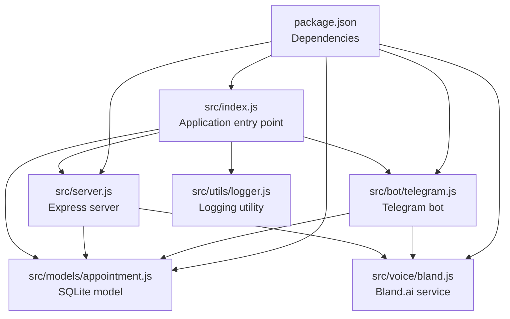
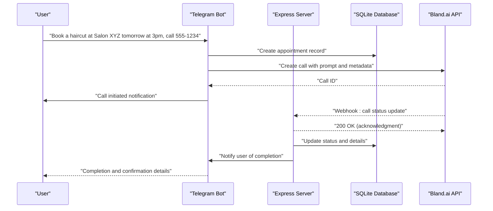
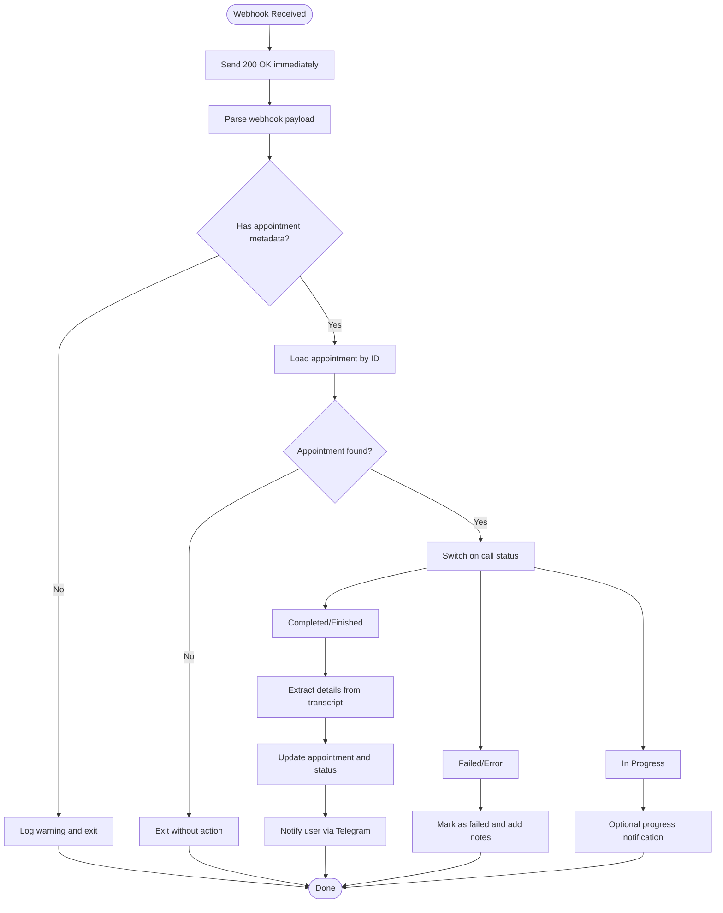
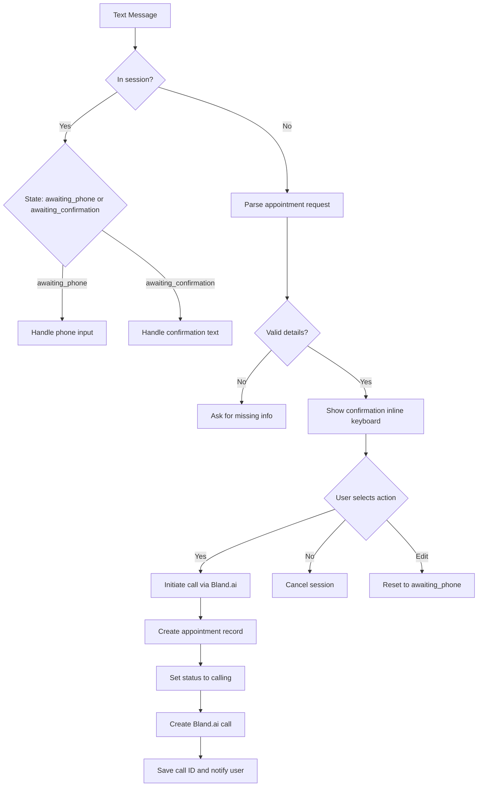
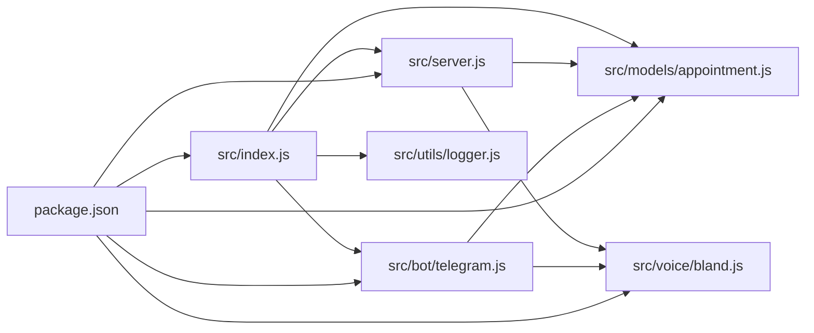

# System Architecture

<cite>
**Referenced Files in This Document**
- [src/index.js](file://src/index.js)
- [src/server.js](file://src/server.js)
- [src/bot/telegram.js](file://src/bot/telegram.js)
- [src/voice/bland.js](file://src/voice/bland.js)
- [src/models/appointment.js](file://src/models/appointment.js)
- [src/utils/logger.js](file://src/utils/logger.js)
- [package.json](file://package.json)
- [README.md](file://README.md)
</cite>

## Table of Contents
1. [Introduction](#introduction)
2. [Project Structure](#project-structure)
3. [Core Components](#core-components)
4. [Architecture Overview](#architecture-overview)
5. [Detailed Component Analysis](#detailed-component-analysis)
6. [Dependency Analysis](#dependency-analysis)
7. [Performance Considerations](#performance-considerations)
8. [Troubleshooting Guide](#troubleshooting-guide)
9. [Conclusion](#conclusion)

## Introduction
This document describes the architectural design of the Appointment Voice Agent system. The system integrates a Telegram Bot with an Express.js backend, a Bland.ai voice service, and an SQLite database. It implements an event-driven architecture with webhook processing to orchestrate real-time call completion notifications. The design emphasizes modularity, separation of concerns, and robust error handling.

## Project Structure
The system follows a modular structure organized by functional domains:
- Entry point initializes environment, database, server, and bot
- Express server handles HTTP routes and webhooks
- Telegram bot manages user interactions and initiates voice calls
- Bland.ai service encapsulates voice call creation and webhook handling
- SQLite model persists appointment records
- Logger utility centralizes structured logging

**Diagram sources**
- [src/index.js:1-91](file://src/index.js#L1-L91)
- [src/server.js:1-266](file://src/server.js#L1-L266)
- [src/bot/telegram.js:1-461](file://src/bot/telegram.js#L1-L461)
- [src/voice/bland.js:1-235](file://src/voice/bland.js#L1-L235)
- [src/models/appointment.js:1-238](file://src/models/appointment.js#L1-L238)
- [src/utils/logger.js:1-28](file://src/utils/logger.js#L1-L28)
- [package.json:1-35](file://package.json#L1-L35)

**Section sources**
- [README.md:154-175](file://README.md#L154-L175)
- [package.json:1-35](file://package.json#L1-L35)

## Core Components
- Application entry point orchestrates startup, environment validation, database initialization, server startup, and bot activation. It also sets up graceful shutdown hooks for clean termination.
- Express server provides health checks, a Bland.ai webhook endpoint, and debugging endpoints for appointments and call details. It processes webhook events asynchronously while acknowledging them immediately to satisfy Bland.ai requirements.
- Telegram bot manages user commands, natural language parsing, conversation sessions, and call initiation. It notifies users of call outcomes and supports appointment listing and cancellation.
- Bland.ai service encapsulates voice call creation, prompt building, webhook parsing, transcript analysis, and call termination. It attaches appointment metadata to calls for correlation.
- SQLite model defines the appointments table schema and CRUD operations for persistence, including status updates and retrieval by user or call ID.
- Logger utility provides structured logging with file and console transports, configurable log levels, and timestamps.

**Section sources**
- [src/index.js:8-45](file://src/index.js#L8-L45)
- [src/server.js:77-123](file://src/server.js#L77-L123)
- [src/bot/telegram.js:373-405](file://src/bot/telegram.js#L373-L405)
- [src/voice/bland.js:23-52](file://src/voice/bland.js#L23-L52)
- [src/models/appointment.js:26-60](file://src/models/appointment.js#L26-L60)
- [src/utils/logger.js:3-27](file://src/utils/logger.js#L3-L27)

## Architecture Overview
The system implements an event-driven architecture:
- User messages trigger Telegram bot handlers that parse requests, confirm details, and initiate voice calls.
- The Telegram bot creates an appointment record and invokes Bland.ai to place a call.
- Bland.ai calls the institute and posts call status updates to the Express webhook endpoint.
- The server acknowledges the webhook immediately, then asynchronously processes the event, updates the database, and notifies the user via Telegram.

**Diagram sources**
- [src/bot/telegram.js:373-405](file://src/bot/telegram.js#L373-L405)
- [src/server.js:77-123](file://src/server.js#L77-L123)
- [src/voice/bland.js:123-149](file://src/voice/bland.js#L123-L149)
- [src/models/appointment.js:102-147](file://src/models/appointment.js#L102-L147)

## Detailed Component Analysis

### Application Entry Point
Responsibilities:
- Validates required environment variables before startup.
- Initializes the SQLite database and starts the Express server and Telegram bot.
- Sets up graceful shutdown handling for SIGTERM, SIGINT, uncaught exceptions, and unhandled rejections.

Key behaviors:
- Environment validation prevents runtime failures due to missing secrets.
- Graceful shutdown ensures resources are released in the correct order.

**Section sources**
- [src/index.js:12-45](file://src/index.js#L12-L45)
- [src/index.js:47-87](file://src/index.js#L47-L87)

### Express Server
Responsibilities:
- Middleware: JSON and URL-encoded body parsing, request logging.
- Routes: Health check, Bland.ai webhook, appointment retrieval, and call details retrieval.
- Error handling: Centralized error middleware.
- Webhook processing: Asynchronous handling with immediate acknowledgment to prevent retries.

Processing logic:
- Webhook handler extracts event data, validates presence of appointment metadata, retrieves appointment details, and dispatches to status-specific handlers.
- Completion handler parses transcripts, updates appointment with confirmed details, and notifies users.
- Failure handler marks appointments as failed and informs users.

**Diagram sources**
- [src/server.js:77-123](file://src/server.js#L77-L123)
- [src/server.js:125-184](file://src/server.js#L125-L184)
- [src/server.js:186-218](file://src/server.js#L186-L218)
- [src/server.js:220-229](file://src/server.js#L220-L229)

**Section sources**
- [src/server.js:16-31](file://src/server.js#L16-L31)
- [src/server.js:33-75](file://src/server.js#L33-L75)
- [src/server.js:77-123](file://src/server.js#L77-L123)
- [src/server.js:125-229](file://src/server.js#L125-L229)

### Telegram Bot
Responsibilities:
- Command handlers for start, help, my appointments, and cancel.
- Text message parsing to extract appointment details using regex patterns.
- Conversation state management via an in-memory session map.
- Call initiation by creating an appointment record, transitioning status to calling, invoking Bland.ai, and updating with call ID.
- Real-time notifications to users upon call completion or failure.

Parsing logic:
- Extracts service, institute name, phone number, date, and time from natural language using multiple patterns.
- Handles missing phone numbers by prompting users and resuming confirmation flow.

**Diagram sources**
- [src/bot/telegram.js:161-180](file://src/bot/telegram.js#L161-L180)
- [src/bot/telegram.js:182-224](file://src/bot/telegram.js#L182-L224)
- [src/bot/telegram.js:296-309](file://src/bot/telegram.js#L296-L309)
- [src/bot/telegram.js:311-337](file://src/bot/telegram.js#L311-L337)
- [src/bot/telegram.js:349-371](file://src/bot/telegram.js#L349-L371)
- [src/bot/telegram.js:373-405](file://src/bot/telegram.js#L373-L405)

**Section sources**
- [src/bot/telegram.js:13-37](file://src/bot/telegram.js#L13-L37)
- [src/bot/telegram.js:161-224](file://src/bot/telegram.js#L161-L224)
- [src/bot/telegram.js:226-294](file://src/bot/telegram.js#L226-L294)
- [src/bot/telegram.js:349-405](file://src/bot/telegram.js#L349-L405)

### Bland.ai Voice Service
Responsibilities:
- Create voice calls with a tailored prompt and metadata.
- Retrieve call details and transcripts.
- Parse webhook payloads and extract appointment identifiers.
- Extract confirmation details from call transcripts.
- End active calls when needed.

Technical decisions:
- Metadata embedding enables correlation between calls and appointments without external lookup.
- Immediate webhook acknowledgment prevents Bland.ai retries and ensures idempotent processing.

**Section sources**
- [src/voice/bland.js:23-52](file://src/voice/bland.js#L23-L52)
- [src/voice/bland.js:59-100](file://src/voice/bland.js#L59-L100)
- [src/voice/bland.js:107-116](file://src/voice/bland.js#L107-L116)
- [src/voice/bland.js:123-149](file://src/voice/bland.js#L123-L149)
- [src/voice/bland.js:156-215](file://src/voice/bland.js#L156-L215)
- [src/voice/bland.js:222-231](file://src/voice/bland.js#L222-L231)

### SQLite Model
Responsibilities:
- Initialize database and create the appointments table.
- Insert new appointments and update statuses with timestamps.
- Retrieve appointments by ID, call ID, or user ID with ordering and limits.
- Close database connections gracefully.

Schema highlights:
- Stores Telegram user/chat IDs, institute details, service, preferred and confirmed dates/times, call identifiers, transcripts, notes, and timestamps.

**Section sources**
- [src/models/appointment.js:12-24](file://src/models/appointment.js#L12-L24)
- [src/models/appointment.js:26-60](file://src/models/appointment.js#L26-L60)
- [src/models/appointment.js:62-100](file://src/models/appointment.js#L62-L100)
- [src/models/appointment.js:102-147](file://src/models/appointment.js#L102-L147)
- [src/models/appointment.js:149-197](file://src/models/appointment.js#L149-L197)
- [src/models/appointment.js:218-234](file://src/models/appointment.js#L218-L234)

### Logging Utility
Responsibilities:
- Structured logging with Winston, configurable log levels, and transports to files and console.
- Timestamps and error stacks for diagnostics.

**Section sources**
- [src/utils/logger.js:3-27](file://src/utils/logger.js#L3-L27)

## Dependency Analysis
External dependencies and their roles:
- Express: HTTP server and routing for webhooks and debugging endpoints.
- Telegraf: Telegram bot framework for commands, callbacks, and messaging.
- Bland: Official SDK for voice call creation, status retrieval, and webhook handling.
- sqlite3: Lightweight embedded database for persistence.
- dotenv: Environment variable loading.
- winston: Structured logging.

**Diagram sources**
- [package.json:20-27](file://package.json#L20-L27)
- [src/index.js:1-9](file://src/index.js#L1-L9)
- [src/server.js:1-6](file://src/server.js#L1-L6)
- [src/bot/telegram.js:1-5](file://src/bot/telegram.js#L1-L5)
- [src/voice/bland.js:1-3](file://src/voice/bland.js#L1-L3)
- [src/models/appointment.js:1-4](file://src/models/appointment.js#L1-L4)
- [src/utils/logger.js:1](file://src/utils/logger.js#L1)

**Section sources**
- [package.json:20-27](file://package.json#L20-L27)

## Performance Considerations
- Asynchronous webhook processing: The server responds immediately to Bland.ai webhooks, offloading processing to avoid blocking and reduce latency.
- Minimal in-memory state: Sessions are stored in memory; for production scaling, consider Redis or another persistent store.
- Database operations: SQLite is suitable for small to medium loads; consider migration to a managed database for higher concurrency.
- Logging overhead: Structured logging is efficient; ensure log rotation and disk space management in production.
- Error handling: Centralized error handling and graceful shutdown minimize resource leaks and improve reliability.

## Troubleshooting Guide
Common issues and resolutions:
- Missing environment variables: Ensure TELEGRAM_BOT_TOKEN, BLAND_API_KEY, and WEBHOOK_URL are configured. The application validates these at startup.
- Webhooks not received: Verify WEBHOOK_URL is publicly accessible and Bland.ai can reach the server. Check server logs for incoming requests.
- Calls not initiated: Confirm BLAND_API_KEY validity and that the server is reachable. Review logs for errors during call creation.
- Bot not responding: Check TELEGRAM_BOT_TOKEN correctness and that the bot is launched. Inspect logs for initialization errors.
- Database connectivity: Ensure DATABASE_PATH is writable and the database file is accessible.

Operational endpoints:
- Health check: GET /health
- Debug appointment: GET /api/appointments/:id
- Debug call details: GET /api/calls/:callId

**Section sources**
- [src/index.js:12-20](file://src/index.js#L12-L20)
- [src/server.js:34-41](file://src/server.js#L34-L41)
- [src/server.js:46-69](file://src/server.js#L46-L69)
- [README.md:212-228](file://README.md#L212-L228)

## Conclusion
The Appointment Voice Agent system demonstrates a clean, modular architecture that separates concerns across Telegram bot logic, Express server/webhook handling, Bland.ai integration, and SQLite persistence. Its event-driven design with asynchronous webhook processing ensures responsive real-time notifications. The system balances simplicity and extensibility, with clear integration points and robust error handling. For production deployment, consider state persistence for sessions, database scaling, and enhanced transcript parsing capabilities.