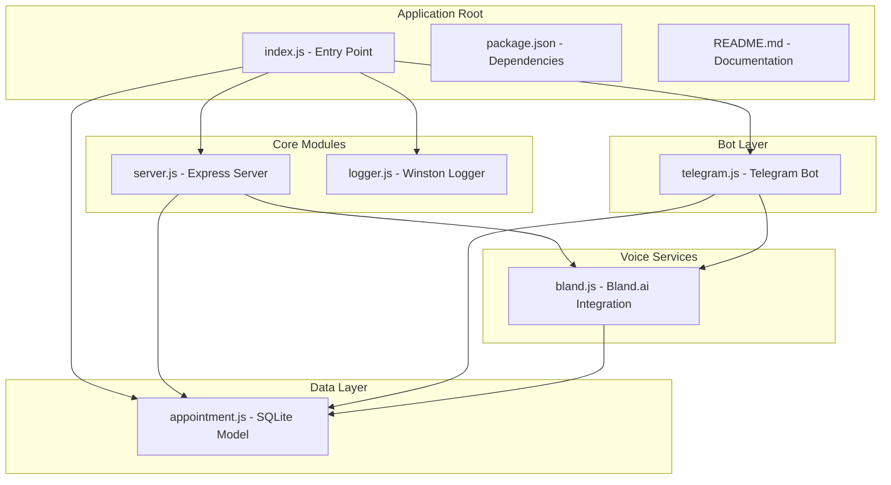
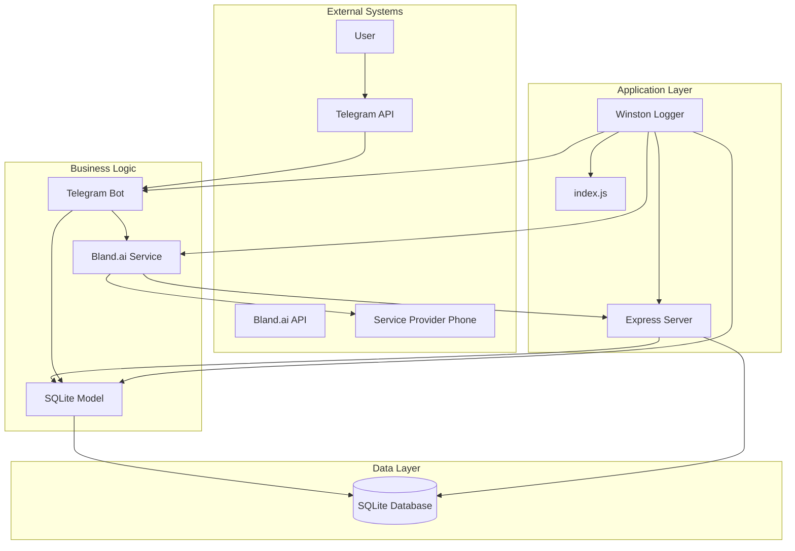
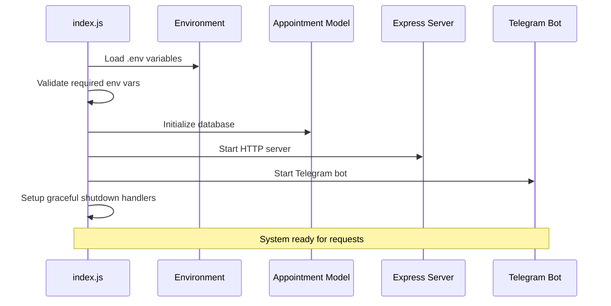
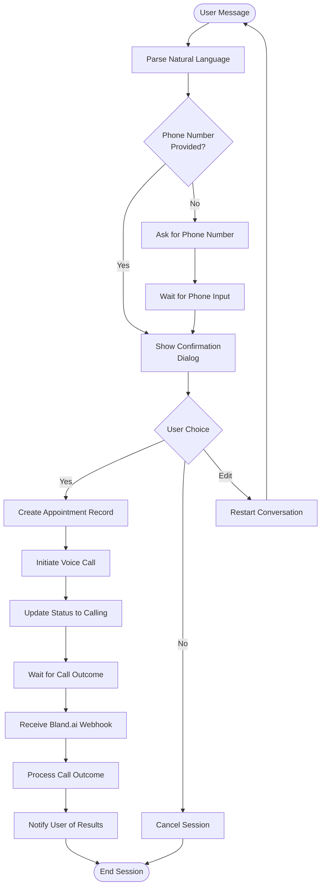
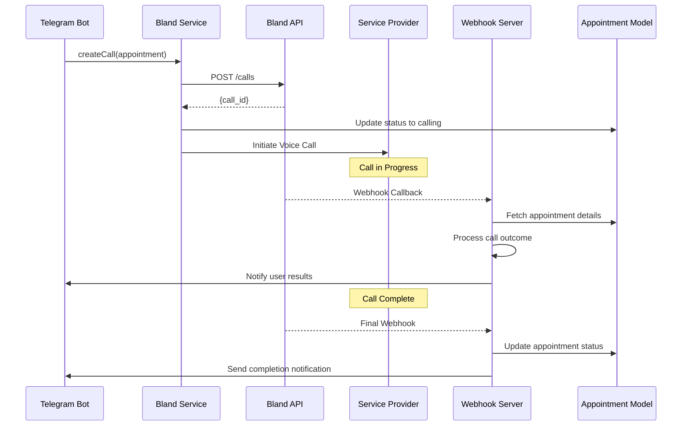
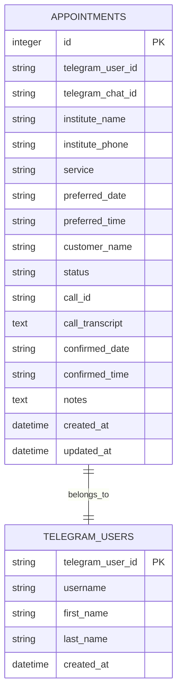
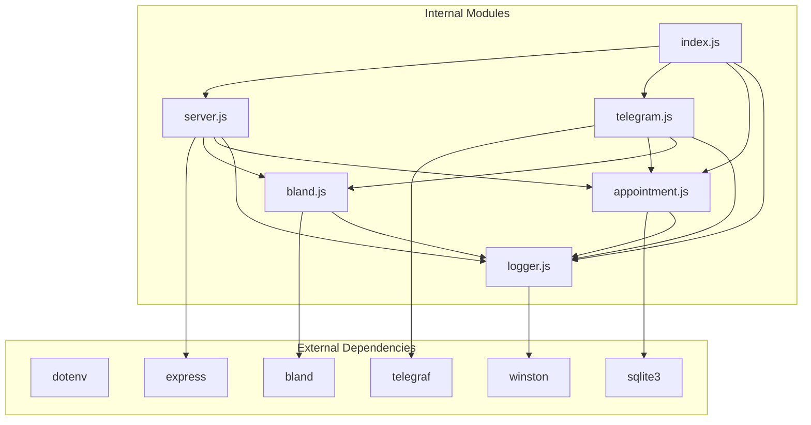

# System Overview

<cite>
**Referenced Files in This Document**
- [index.js](file://src/index.js)
- [server.js](file://src/server.js)
- [telegram.js](file://src/bot/telegram.js)
- [bland.js](file://src/voice/bland.js)
- [appointment.js](file://src/models/appointment.js)
- [logger.js](file://src/utils/logger.js)
- [package.json](file://package.json)
- [README.md](file://README.md)
</cite>

## Table of Contents
1. [Introduction](#introduction)
2. [Project Structure](#project-structure)
3. [Core Components](#core-components)
4. [Architecture Overview](#architecture-overview)
5. [Detailed Component Analysis](#detailed-component-analysis)
6. [Dependency Analysis](#dependency-analysis)
7. [Performance Considerations](#performance-considerations)
8. [Troubleshooting Guide](#troubleshooting-guide)
9. [Conclusion](#conclusion)

## Introduction

The Appointment Voice Agent is an AI-powered voice assistant designed to automate appointment scheduling through natural language conversations. The system integrates Telegram Bot interactions with AI voice call automation via Bland.ai, providing a seamless experience for users to book appointments without manual phone calls.

The system serves as an intelligent middleman between users and service providers, leveraging advanced natural language processing to extract appointment details from conversational text and Bland.ai's voice capabilities to handle the actual phone conversations. Users can simply message their Telegram bot with appointment requests, and the system will automatically call service providers to schedule appointments on their behalf.

## Project Structure

The application follows a modular architecture with clear separation of concerns across four main functional areas:

**Diagram sources**
- [index.js:1-91](file://src/index.js#L1-L91)
- [server.js:1-266](file://src/server.js#L1-L266)
- [telegram.js:1-461](file://src/bot/telegram.js#L1-L461)
- [bland.js:1-235](file://src/voice/bland.js#L1-L235)
- [appointment.js:1-238](file://src/models/appointment.js#L1-L238)

**Section sources**
- [package.json:1-35](file://package.json#L1-L35)
- [README.md:154-175](file://README.md#L154-L175)

## Core Components

The system consists of five primary components that work together to provide the complete appointment scheduling solution:

### Application Entry Point
The main orchestrator that initializes all system components and manages graceful shutdown procedures.

### Express Server
HTTP server that handles webhook processing from Bland.ai and provides debugging endpoints for development and monitoring.

### Telegram Bot
Natural language processing interface that accepts user appointment requests, manages conversation flows, and coordinates with voice services.

### Bland.ai Voice Service
AI-powered voice call automation that handles the actual phone conversations with service providers.

### SQLite Database Model
Persistent storage layer that maintains appointment records, user sessions, and system state.

**Section sources**
- [index.js:8-45](file://src/index.js#L8-L45)
- [server.js:7-14](file://src/server.js#L7-L14)
- [telegram.js:6-11](file://src/bot/telegram.js#L6-L11)
- [bland.js:4-10](file://src/voice/bland.js#L4-L10)
- [appointment.js:7-10](file://src/models/appointment.js#L7-L10)

## Architecture Overview

The system implements a distributed event-driven architecture with clear boundaries between components:

**Diagram sources**
- [index.js:1-91](file://src/index.js#L1-L91)
- [server.js:1-266](file://src/server.js#L1-L266)
- [telegram.js:1-461](file://src/bot/telegram.js#L1-L461)
- [bland.js:1-235](file://src/voice/bland.js#L1-L235)
- [appointment.js:1-238](file://src/models/appointment.js#L1-L238)

The architecture follows these key principles:

- **Event-Driven Processing**: Webhooks from Bland.ai trigger asynchronous processing of call outcomes
- **Separation of Concerns**: Each component has a specific responsibility and minimal coupling
- **Asynchronous Communication**: Real-time updates are handled through webhook callbacks
- **Persistent State Management**: All system state is maintained in SQLite for reliability

## Detailed Component Analysis

### Main Entry Point Orchestration

The application starts through a centralized initialization pattern that ensures all components are properly configured before accepting requests:

**Diagram sources**
- [index.js:8-45](file://src/index.js#L8-L45)
- [index.js:47-87](file://src/index.js#L47-L87)

The orchestration pattern ensures:
- Environment validation before startup
- Database initialization before accepting requests
- Graceful shutdown handling for clean resource cleanup
- Proper error handling and logging throughout the startup process

**Section sources**
- [index.js:1-91](file://src/index.js#L1-L91)

### Telegram Bot Conversation Flow

The Telegram bot implements a sophisticated conversation management system that handles natural language appointment requests:

**Diagram sources**
- [telegram.js:161-180](file://src/bot/telegram.js#L161-L180)
- [telegram.js:373-405](file://src/bot/telegram.js#L373-L405)
- [telegram.js:418-447](file://src/bot/telegram.js#L418-L447)

The conversation flow includes:
- Natural language parsing for service type, institute, phone number, date, and time
- Interactive confirmation dialogs with inline keyboard buttons
- Session state management for multi-step conversations
- Real-time status updates during call processing

**Section sources**
- [telegram.js:182-224](file://src/bot/telegram.js#L182-L224)
- [telegram.js:311-337](file://src/bot/telegram.js#L311-L337)

### Bland.ai Voice Call Automation

The voice service provides AI-powered call automation with comprehensive webhook processing:

**Diagram sources**
- [bland.js:23-52](file://src/voice/bland.js#L23-L52)
- [server.js:77-123](file://src/server.js#L77-L123)
- [server.js:125-184](file://src/server.js#L125-L184)

The voice call process includes:
- Dynamic prompt generation based on appointment details
- Real-time transcript processing and analysis
- Comprehensive webhook event handling
- Automatic status updates and user notifications

**Section sources**
- [bland.js:59-100](file://src/voice/bland.js#L59-L100)
- [bland.js:123-149](file://src/voice/bland.js#L123-L149)

### Database Model and Persistence

The SQLite-based persistence layer provides reliable data storage with comprehensive CRUD operations:

**Diagram sources**
- [appointment.js:27-47](file://src/models/appointment.js#L27-L47)

The database model supports:
- Complete appointment lifecycle tracking
- User session management
- Status transitions and audit trails
- Efficient querying for reports and analytics

**Section sources**
- [appointment.js:12-60](file://src/models/appointment.js#L12-L60)
- [appointment.js:102-147](file://src/models/appointment.js#L102-L147)

## Dependency Analysis

The system maintains clean dependency relationships with clear interfaces between components:

**Diagram sources**
- [package.json:20-27](file://package.json#L20-L27)
- [index.js:3-6](file://src/index.js#L3-L6)
- [server.js:1-5](file://src/server.js#L1-L5)

Key dependency characteristics:
- **Low Coupling**: Each module has a single responsibility and minimal external dependencies
- **Clear Interfaces**: All inter-module communication happens through well-defined APIs
- **Testable Design**: Modular structure enables isolated testing of individual components
- **Extensible Architecture**: New voice services or database backends can be integrated through interface changes

**Section sources**
- [package.json:1-35](file://package.json#L1-L35)

## Performance Considerations

The system is designed for optimal performance through several architectural decisions:

### Asynchronous Processing
- Webhook callbacks are processed asynchronously to prevent blocking the main request thread
- Database operations use non-blocking APIs to maintain responsiveness
- Voice call initiation is handled independently of user interactions

### Resource Management
- Graceful shutdown handlers ensure proper cleanup of database connections and server resources
- Memory usage is minimized through session-based conversation state management
- Database connections are properly closed during shutdown procedures

### Scalability Factors
- Stateless design allows for horizontal scaling across multiple instances
- Database operations are optimized with appropriate indexing strategies
- Logging is structured to minimize I/O overhead during high-volume periods

## Troubleshooting Guide

Common issues and their resolution strategies:

### Environment Configuration Issues
- **Missing Environment Variables**: The system validates required variables during startup and exits with clear error messages
- **Invalid API Keys**: Authentication failures with Bland.ai or Telegram will be logged with specific error details
- **Webhook URL Configuration**: Ensure the webhook URL is publicly accessible and properly configured in Bland.ai settings

### Database Connectivity Problems
- **SQLite File Permissions**: Verify write permissions to the database directory
- **Connection Pool Issues**: Monitor for database connection timeouts during high load
- **Schema Migration**: The system automatically creates tables on first run

### Real-time Communication Failures
- **Webhook Delivery**: Check webhook URL accessibility and ensure proper SSL certificates for production deployments
- **Telegram Bot Connectivity**: Verify bot token validity and network connectivity
- **Voice Call Quality**: Monitor Bland.ai API response times and retry mechanisms

**Section sources**
- [index.js:12-20](file://src/index.js#L12-L20)
- [server.js:77-123](file://src/server.js#L77-L123)
- [README.md:212-228](file://README.md#L212-L228)

## Conclusion

The Appointment Voice Agent represents a sophisticated integration of modern technologies to solve a common problem: automating the tedious process of appointment scheduling. The system successfully combines natural language processing, AI voice automation, and real-time communication to deliver a seamless user experience.

The modular architecture ensures maintainability and extensibility, while the event-driven design provides robust handling of asynchronous operations. The comprehensive logging and error handling infrastructure supports reliable operation in production environments.

Key strengths of the implementation include:
- **User-Friendly Interface**: Natural language conversations make the system accessible to all users
- **Reliable Infrastructure**: Robust error handling and graceful degradation ensure consistent service
- **Transparent Operations**: Real-time updates keep users informed throughout the appointment process
- **Scalable Design**: Modular architecture supports future enhancements and scaling requirements

The system serves as an excellent example of how AI technologies can be integrated to solve practical problems, demonstrating the potential for automation in customer service applications.