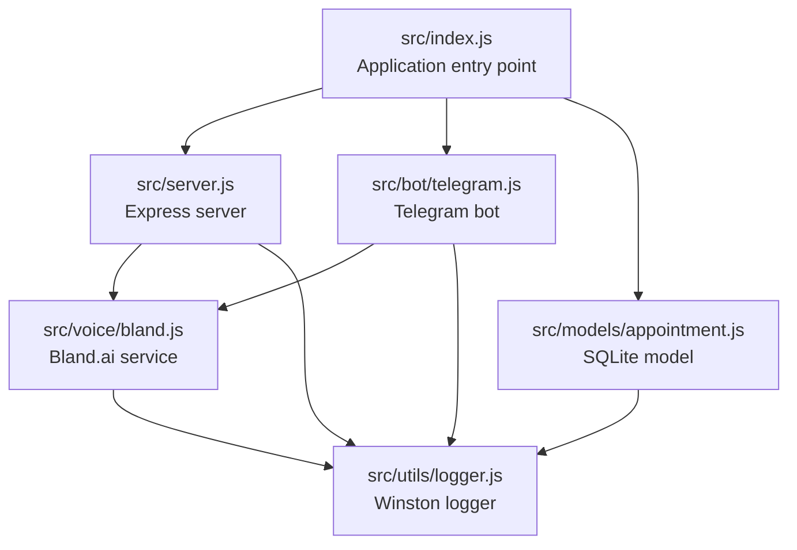
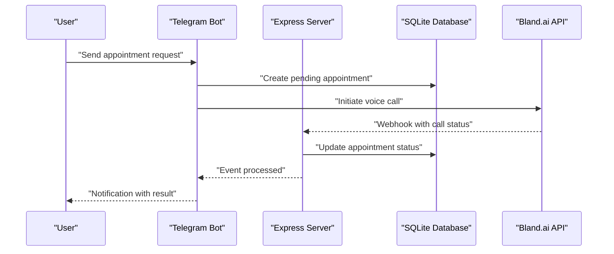
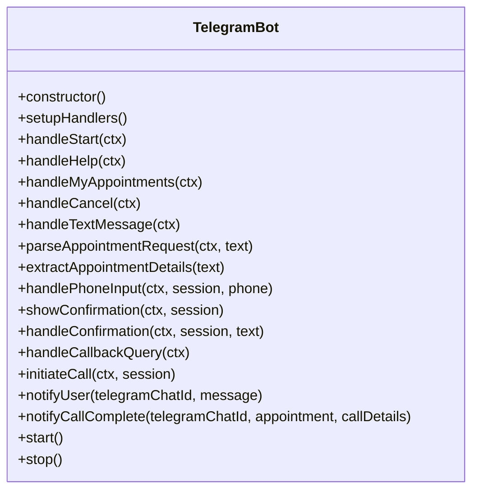
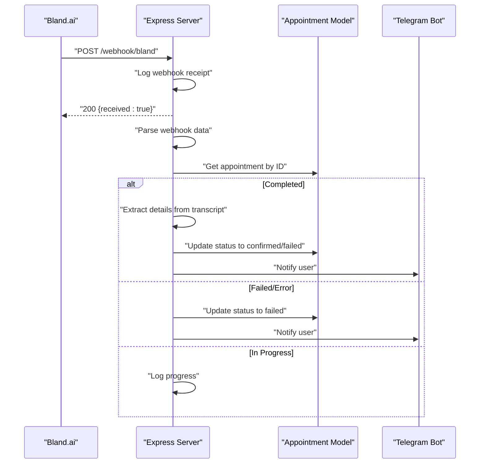
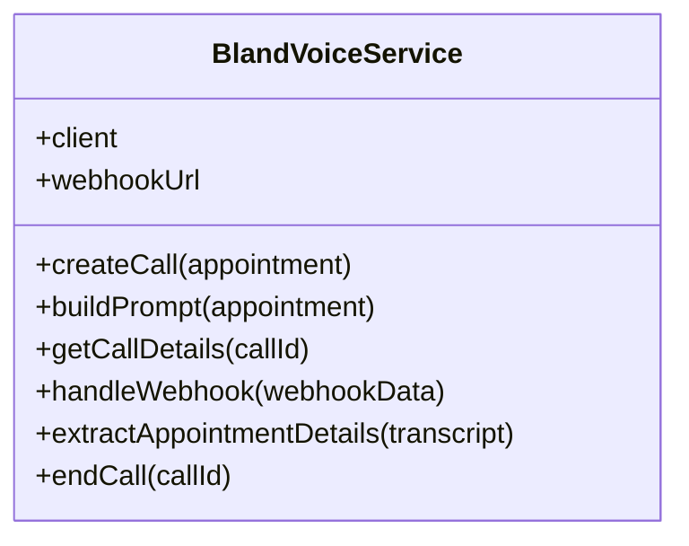
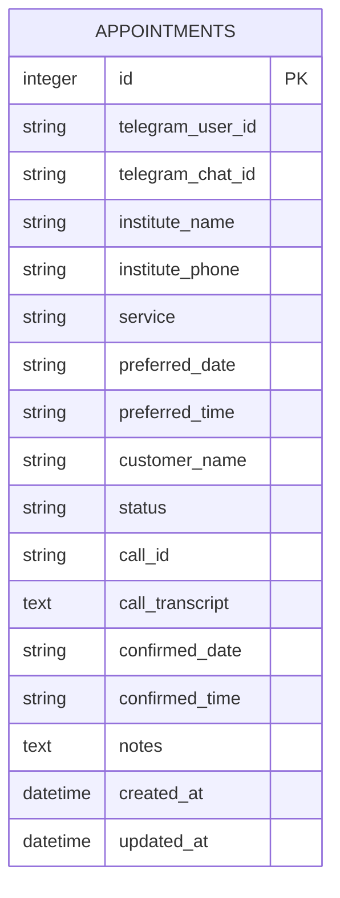
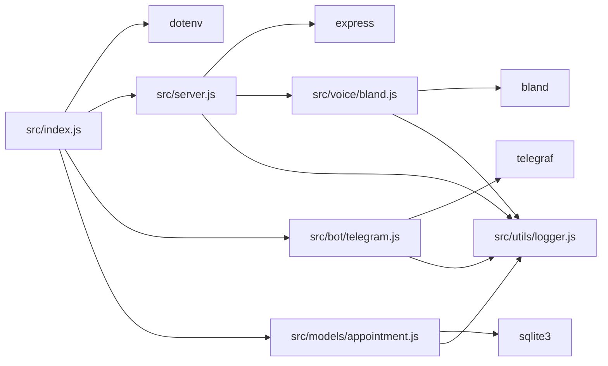

# Troubleshooting and FAQ

<cite>
**Referenced Files in This Document**
- [README.md](file://README.md)
- [package.json](file://package.json)
- [src/index.js](file://src/index.js)
- [src/server.js](file://src/server.js)
- [src/bot/telegram.js](file://src/bot/telegram.js)
- [src/voice/bland.js](file://src/voice/bland.js)
- [src/models/appointment.js](file://src/models/appointment.js)
- [src/utils/logger.js](file://src/utils/logger.js)
</cite>

## Table of Contents
1. [Introduction](#introduction)
2. [Project Structure](#project-structure)
3. [Core Components](#core-components)
4. [Architecture Overview](#architecture-overview)
5. [Detailed Component Analysis](#detailed-component-analysis)
6. [Dependency Analysis](#dependency-analysis)
7. [Performance Considerations](#performance-considerations)
8. [Troubleshooting Guide](#troubleshooting-guide)
9. [FAQ](#faq)
10. [Conclusion](#conclusion)

## Introduction
This document provides comprehensive troubleshooting guidance for the Appointment Voice Agent, a system that integrates Telegram messaging with AI-powered voice calls via Bland.ai to schedule appointments automatically. It covers systematic diagnostics for common issues including bot not responding, calls not being made, and webhook delivery problems, along with performance tuning, error handling, and operational FAQs.

## Project Structure
The system follows a modular architecture with clear separation of concerns:
- Entry point initializes environment validation, database, server, and Telegram bot
- Express server exposes health checks and webhook endpoints
- Telegram bot manages user conversations and initiates voice calls
- Bland.ai service handles voice call creation and webhook processing
- SQLite model persists appointment data
- Winston-based logger captures structured logs to files and console

**Diagram sources**
- [src/index.js:1-91](file://src/index.js#L1-L91)
- [src/server.js:1-266](file://src/server.js#L1-L266)
- [src/bot/telegram.js:1-461](file://src/bot/telegram.js#L1-L461)
- [src/voice/bland.js:1-235](file://src/voice/bland.js#L1-L235)
- [src/models/appointment.js:1-238](file://src/models/appointment.js#L1-L238)
- [src/utils/logger.js:1-28](file://src/utils/logger.js#L1-L28)

**Section sources**
- [README.md:154-175](file://README.md#L154-L175)
- [package.json:1-35](file://package.json#L1-L35)

## Core Components
- Environment validation ensures required variables are present before startup
- Express server provides health checks, webhook receiver, and debugging endpoints
- Telegram bot manages conversation flows, user sessions, and notifications
- Bland.ai service constructs prompts, initiates calls, and processes webhooks
- SQLite model handles CRUD operations and maintains appointment lifecycle
- Logger records structured events with timestamps and contextual metadata

Key integration points:
- Telegram bot triggers call initiation and updates user via notifications
- Bland.ai webhook delivers call status updates to the server
- Server updates appointment records and notifies users accordingly

**Section sources**
- [src/index.js:8-45](file://src/index.js#L8-L45)
- [src/server.js:34-75](file://src/server.js#L34-L75)
- [src/bot/telegram.js:6-37](file://src/bot/telegram.js#L6-L37)
- [src/voice/bland.js:4-10](file://src/voice/bland.js#L4-L10)
- [src/models/appointment.js:7-24](file://src/models/appointment.js#L7-L24)
- [src/utils/logger.js:3-16](file://src/utils/logger.js#L3-L16)

## Architecture Overview
The system operates as a three-tier pipeline: Telegram bot, backend server, and Bland.ai voice service, with persistent storage for appointment records.

**Diagram sources**
- [src/bot/telegram.js:373-405](file://src/bot/telegram.js#L373-L405)
- [src/server.js:77-123](file://src/server.js#L77-L123)
- [src/models/appointment.js:62-100](file://src/models/appointment.js#L62-L100)
- [src/voice/bland.js:23-52](file://src/voice/bland.js#L23-L52)

## Detailed Component Analysis

### Telegram Bot Component
The Telegram bot orchestrates user interactions, manages conversation state, and coordinates call initiation. It parses natural language requests, validates phone numbers, and presents confirmation dialogs.

**Diagram sources**
- [src/bot/telegram.js:6-461](file://src/bot/telegram.js#L6-L461)

**Section sources**
- [src/bot/telegram.js:13-37](file://src/bot/telegram.js#L13-L37)
- [src/bot/telegram.js:182-224](file://src/bot/telegram.js#L182-L224)
- [src/bot/telegram.js:373-405](file://src/bot/telegram.js#L373-L405)

### Server and Webhook Component
The Express server exposes health checks, a webhook endpoint for Bland.ai, and debugging routes. It processes incoming webhooks, validates appointment metadata, and updates statuses accordingly.

**Diagram sources**
- [src/server.js:77-123](file://src/server.js#L77-L123)
- [src/server.js:125-184](file://src/server.js#L125-L184)
- [src/server.js:186-218](file://src/server.js#L186-L218)
- [src/server.js:220-229](file://src/server.js#L220-L229)

**Section sources**
- [src/server.js:43-44](file://src/server.js#L43-L44)
- [src/server.js:77-123](file://src/server.js#L77-L123)
- [src/server.js:125-184](file://src/server.js#L125-L184)

### Bland.ai Service Component
The Bland.ai service encapsulates API interactions, prompt construction, and webhook parsing. It creates calls with metadata linking to Telegram chat contexts and extracts confirmation details from transcripts.

**Diagram sources**
- [src/voice/bland.js:4-235](file://src/voice/bland.js#L4-L235)

**Section sources**
- [src/voice/bland.js:23-52](file://src/voice/bland.js#L23-L52)
- [src/voice/bland.js:123-149](file://src/voice/bland.js#L123-L149)
- [src/voice/bland.js:156-215](file://src/voice/bland.js#L156-L215)

### Database Model Component
The SQLite model manages appointment persistence, including status transitions, retrieval by user or call ID, and cleanup on shutdown.

**Diagram sources**
- [src/models/appointment.js:27-47](file://src/models/appointment.js#L27-L47)

**Section sources**
- [src/models/appointment.js:12-60](file://src/models/appointment.js#L12-L60)
- [src/models/appointment.js:102-147](file://src/models/appointment.js#L102-L147)

## Dependency Analysis
External dependencies and their roles:
- telegraf: Telegram bot framework for message handling and callbacks
- express: HTTP server for webhooks and health checks
- bland: Bland.ai client for voice call management
- sqlite3: Local database for appointment records
- dotenv: Environment variable loading
- winston: Structured logging to files and console

**Diagram sources**
- [package.json:20-27](file://package.json#L20-L27)
- [src/index.js:1-7](file://src/index.js#L1-L7)

**Section sources**
- [package.json:20-34](file://package.json#L20-L34)

## Performance Considerations
- Asynchronous webhook processing: Webhooks are acknowledged immediately and processed asynchronously to prevent timeouts.
- Connection pooling: SQLite connections are managed centrally; ensure adequate disk I/O for concurrent operations.
- Logging overhead: Winston writes to files and console; consider log level adjustments in production.
- Network latency: Bland.ai API calls depend on external service performance; implement retry strategies where applicable.
- Memory usage: Conversation sessions are stored in memory; monitor for long-running deployments.

## Troubleshooting Guide

### Systematic Diagnostic Approaches

#### 1) Bot Not Responding
Common symptoms:
- User sends message but receives no reply
- Commands (/start, /help) fail silently

Diagnostic steps:
1. Verify environment variables are loaded
   - Check TELEGRAM_BOT_TOKEN presence
   - Confirm application startup logs
2. Validate Telegram bot launch
   - Look for "Telegram bot started" in logs
   - Ensure bot is not stuck in initialization
3. Test health endpoint
   - Access GET /health to confirm server responsiveness
4. Check for uncaught exceptions
   - Review error logs for crash-related entries
5. Inspect network connectivity
   - Verify outbound access to Telegram API
   - Confirm firewall allows traffic on required ports

Resolution procedures:
- Restart application after correcting .env values
- Update bot token if previously invalid
- Increase log level temporarily for detailed tracing
- Validate port accessibility and firewall rules

**Section sources**
- [src/index.js:12-20](file://src/index.js#L12-L20)
- [src/bot/telegram.js:449-457](file://src/bot/telegram.js#L449-L457)
- [src/server.js:34-41](file://src/server.js#L34-L41)
- [src/utils/logger.js:18-25](file://src/utils/logger.js#L18-L25)

#### 2) Calls Not Being Made
Common symptoms:
- User confirms appointment but no call initiates
- Telegram notification shows call initiation fails

Diagnostic steps:
1. Validate Bland.ai API key
   - Confirm BLAND_API_KEY is set and correct
   - Check for API rate limits or account issues
2. Verify webhook URL configuration
   - Ensure WEBHOOK_URL points to a reachable public endpoint
   - Confirm ngrok tunnel is active (local development)
3. Test call creation
   - Use debugging endpoint GET /api/calls/:callId
   - Check Bland.ai service logs for errors
4. Examine appointment creation
   - Verify appointment record created with status "pending"
   - Confirm phone number format is valid
5. Monitor outbound connectivity
   - Validate ability to reach Bland.ai API endpoints
   - Check for proxy or network restrictions

Resolution procedures:
- Regenerate Bland.ai API key if expired or revoked
- Update WEBHOOK_URL to current ngrok/public URL
- Correct phone number formatting (remove spaces/punctuation)
- Retry call creation after resolving configuration issues
- Contact Bland.ai support if API errors persist

**Section sources**
- [src/index.js:12-20](file://src/index.js#L12-L20)
- [src/bot/telegram.js:373-405](file://src/bot/telegram.js#L373-L405)
- [src/voice/bland.js:23-52](file://src/voice/bland.js#L23-L52)
- [src/server.js:60-69](file://src/server.js#L60-L69)

#### 3) Webhook Delivery Problems
Common symptoms:
- Calls complete but user does not receive notifications
- Server appears to receive webhooks but no updates occur

Diagnostic steps:
1. Verify webhook endpoint accessibility
   - Confirm POST /webhook/bland responds with 200
   - Check server logs for incoming requests
2. Validate webhook payload structure
   - Ensure metadata includes appointment_id
   - Confirm call_id and status fields are present
3. Check appointment existence
   - Verify appointment record exists for given ID
   - Confirm status transitions occur correctly
4. Inspect transcript parsing
   - Validate transcript contains confirmation indicators
   - Check extraction logic for date/time patterns
5. Test notification delivery
   - Confirm Telegram API access and permissions
   - Verify chat_id validity

Resolution procedures:
- Update webhook URL in Bland.ai dashboard
- Restart server to refresh route handlers
- Validate appointment metadata in webhook payload
- Adjust transcript extraction patterns if needed
- Reauthorize Telegram bot if permission issues arise

**Section sources**
- [src/server.js:43-44](file://src/server.js#L43-L44)
- [src/server.js:77-123](file://src/server.js#L77-L123)
- [src/server.js:125-184](file://src/server.js#L125-L184)
- [src/voice/bland.js:123-149](file://src/voice/bland.js#L123-L149)

### Error Messages and Likely Causes

#### Environment Configuration Errors
- "Missing required environment variables"
  - Cause: Missing TELEGRAM_BOT_TOKEN, BLAND_API_KEY, or WEBHOOK_URL
  - Resolution: Add missing variables to .env file

#### Database Initialization Failures
- "Error opening database"
  - Cause: Permission issues or invalid database path
  - Resolution: Check DATABASE_PATH permissions and existence

#### Telegram API Errors
- "Telegram bot error"
  - Cause: Invalid token, rate limiting, or network issues
  - Resolution: Regenerate token, reduce request frequency, check connectivity

#### Bland.ai API Errors
- "Error creating Bland.ai call"
  - Cause: Invalid API key, network connectivity, or malformed request
  - Resolution: Verify credentials, check network, validate phone number format

#### Webhook Processing Errors
- "Appointment not found"
  - Cause: Missing appointment record or invalid metadata
  - Resolution: Ensure appointment created before webhook processing

**Section sources**
- [src/index.js:16-20](file://src/index.js#L16-L20)
- [src/models/appointment.js:14-22](file://src/models/appointment.js#L14-L22)
- [src/bot/telegram.js:33-36](file://src/bot/telegram.js#L33-L36)
- [src/voice/bland.js:48-51](file://src/voice/bland.js#L48-L51)
- [src/server.js:95-98](file://src/server.js#L95-L98)

### Debugging Techniques

#### Log Analysis
- Location: logs/error.log and logs/combined.log
- Levels: error, warn, info, debug
- Key indicators: timestamps, service context, error stacks
- Commands: tail -f logs/combined.log

#### Environment Verification
- Check NODE_ENV and LOG_LEVEL variables
- Verify PORT accessibility and firewall rules
- Confirm DATABASE_PATH and file permissions

#### Network Connectivity Checks
- curl -I https://api.telegram.org
- curl -I https://api.bland.ai
- ngrok status (for local development)
- telnet <host> <port> (verify port accessibility)

#### Database Inspection
- Use SQLite browser to examine appointments table
- Check status transitions and metadata fields
- Verify call_id associations

#### API Testing
- GET /health for server status
- GET /api/appointments/:id for appointment details
- GET /api/calls/:callId for call information

**Section sources**
- [src/utils/logger.js:12-16](file://src/utils/logger.js#L12-L16)
- [src/server.js:34-41](file://src/server.js#L34-L41)
- [src/server.js:46-69](file://src/server.js#L46-L69)

### Performance Issues and Timeout Problems
- Webhook acknowledgment: Immediate 200 response prevents Bland.ai retries
- Asynchronous processing: Webhook events processed after response
- Graceful shutdown: Proper cleanup of Telegram, server, and database connections
- Uncaught exception handling: Automatic restart on critical failures

Resolution strategies:
- Monitor webhook processing duration
- Implement circuit breaker for external APIs
- Add retry logic for transient failures
- Scale horizontally if database becomes bottleneck

**Section sources**
- [src/server.js:81-82](file://src/server.js#L81-L82)
- [src/index.js:47-87](file://src/index.js#L47-L87)

### Integration Failures
- Telegram integration: Validate bot token and webhook configuration
- Bland.ai integration: Verify API key and webhook URL
- Database integration: Ensure SQLite availability and permissions
- External dependencies: Monitor telegraf, express, and bland library versions

**Section sources**
- [src/bot/telegram.js:8](file://src/bot/telegram.js#L8)
- [src/voice/bland.js:6-9](file://src/voice/bland.js#L6-L9)
- [src/models/appointment.js:5](file://src/models/appointment.js#L5)

## FAQ

### Setup and Configuration
Q: How do I configure environment variables?
A: Copy .env.example to .env and add TELEGRAM_BOT_TOKEN, BLAND_API_KEY, and WEBHOOK_URL. For local development, use ngrok to expose your server.

Q: What ports does the application use?
A: Default port is 3000, configurable via PORT environment variable.

Q: How do I verify the server is running?
A: Access GET /health endpoint to confirm service status.

### Operation and Usage
Q: How do I test if the bot responds?
A: Send /start command to the Telegram bot to verify it's active.

Q: Can I see my appointment history?
A: Use /myappointments command to view recent appointments.

Q: How do I cancel an appointment?
A: Use /cancel <appointment_id> command with a valid appointment ID.

### Webhook and Call Management
Q: Why am I not receiving call completion notifications?
A: Check that WEBHOOK_URL is correctly configured and publicly accessible.

Q: How can I debug call issues?
A: Use GET /api/calls/:callId endpoint to retrieve call details and transcript.

Q: What happens if a call fails?
A: The system updates appointment status to failed and notifies you with possible reasons.

### Troubleshooting Common Scenarios
Q: The bot starts but doesn't respond to messages.
A: Verify TELEGRAM_BOT_TOKEN is correct and check logs for initialization errors.

Q: Calls are initiated but never complete.
A: Ensure Bland.ai API key is valid and WEBHOOK_URL is reachable from the internet.

Q: Webhooks are received but nothing updates.
A: Check that appointment records exist and metadata contains appointment_id.

### Escalation Procedures
For complex issues requiring support:
1. Collect logs from logs/error.log and logs/combined.log
2. Provide environment details (Node.js version, OS)
3. Include relevant webhook payloads and error messages
4. Document steps taken during troubleshooting
5. Contact Telegram Bot support for bot-related issues
6. Contact Bland.ai support for voice service issues

Support resources:
- Telegram Bot documentation and support channels
- Bland.ai developer portal and API documentation
- GitHub issues for bug reports and feature requests

**Section sources**
- [README.md:212-228](file://README.md#L212-L228)
- [README.md:184-195](file://README.md#L184-L195)
- [README.md:177-183](file://README.md#L177-L183)

## Conclusion
The Appointment Voice Agent provides a robust foundation for automated appointment scheduling through integrated Telegram and voice services. By following the systematic diagnostic approaches outlined in this document—covering environment validation, network connectivity, webhook processing, and performance monitoring—you can effectively troubleshoot and resolve most operational issues. Regular log monitoring, proper environment configuration, and adherence to the troubleshooting procedures will ensure reliable operation of the system.